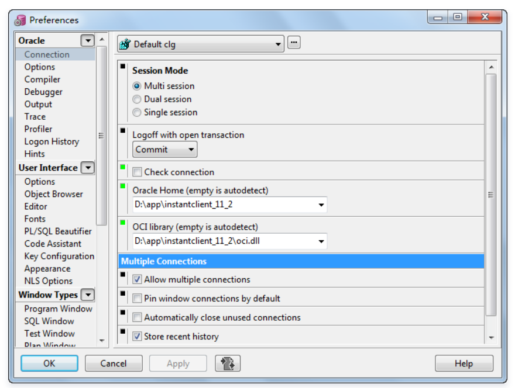

### 执行光标所在行SQL语句

英文版：tools->preferences->sql window->autoSelect Statement

这样光标放到某一行，点击F8就可执行该行，不要全选该行。

该语句必须以分号结尾，否则达不到效果。

### 登录

以非登录模式进入PL/SQL, 设置Oracle Home路径

### 保存用户

1 保存用户名

 tools -> Preferences -> User Interface - Options 

勾选 Autosave username 。 保存

 

2 保存密码

tools -> Preferences -> Oracle  -> logon History  -> definition 

勾选 store history  和 store with password

### 模板

将Custom文件放在 D:\PLSQL Developer 14\Template\Custom下

### AutoReplace

 tools -> Preferences -> User Interface - Editor-AutoReplace

