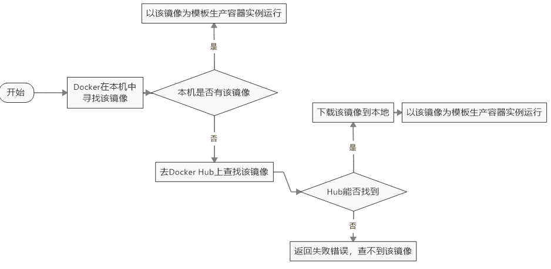
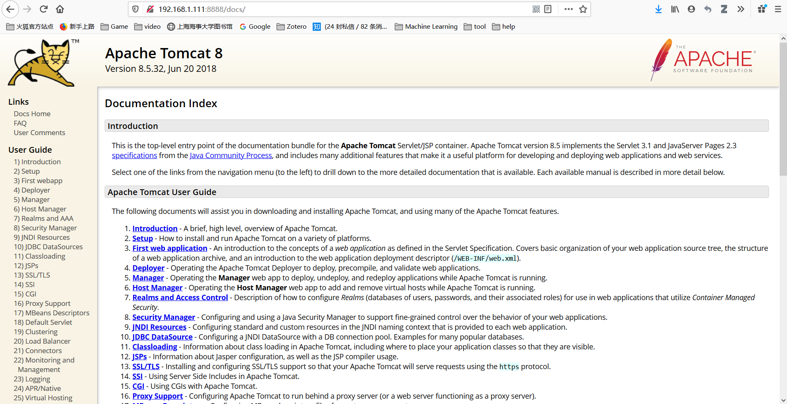
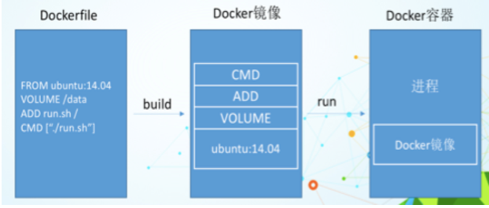
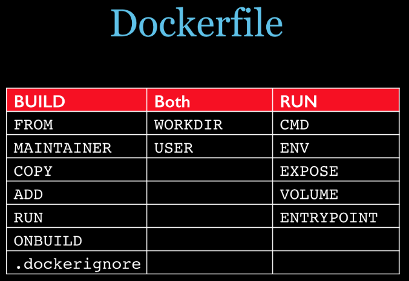
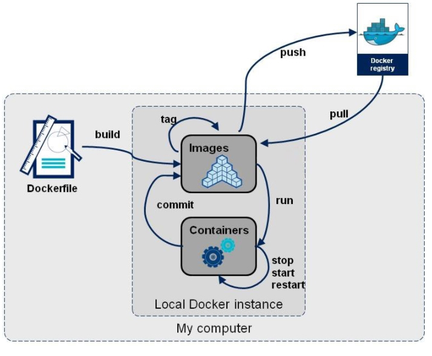

# Docker

## 1 简介

### 1.1 是什么

​		Docker安装的时候，把原始环境一模一样地复制过来。开发人员利用 Docker 可以消除协作编码时“在我的机器上可正常工作”的问题。


### 1.2 理念

Docker是基于Go语言实现的云开源项目。

​		Docker的主要目标是“Build，Ship and Run Any App,Anywhere”，也就是通过对应用组件的封装、分发、部署、运行等生命周期的管理，**使用户的APP（可以是一个WEB应用或数据库应用等等）及其运行环境能够做到“一次封装，到处运行**”。

​		Linux 容器技术的出现就解决了这样一个问题，而 Docker 就是在它的基础上发展过来的。将应用运行在 Docker 容器上面，而 Docker 容器在任何操作系统上都是一致的，这就实现了跨平台、跨服务器。**只需要一次配置好环境，换到别的机子上就可以一键部署好，大大简化了操作**

### 1.3 基本组成


- 镜像（image）
  - Docker 镜像（Image）就是一个**只读的模板**。镜像可以**用来创建 Docker 容器**，一个镜像可以创建很多容器。
  - 镜像 --- 容器， 类 --- 对象
- 容器（container）
  - Docker 利用容器（Container）独立运行的一个或一组应用，**容器是用镜像创建的运行实例**
  - 它可以被启动、开始、停止、删除。每个容器都是相互隔离的、保证安全的平台。
  - ***可以把容器看做是一个简易版的 Linux 环境\***（包括root用户权限、进程空间、用户空间和网络空间等）和运行在其中的应用程序。
  - 容器的定义和镜像几乎一模一样，也是一堆层的统一视角，唯一区别在于容器的最上面那一层是可读可写的。
- 仓库（repository）
  - 仓库（Repository）是集中**存放镜像文件的场所**。
  - 仓库(Repository)和仓库注册服务器（Registry）是有区别的。仓库注册服务器上往往存放着多个仓库，每个仓库中又包含了多个镜像，每个镜像有不同的标签（tag）。
  - 仓库分为**公开仓库（Public）**和**私有仓库（Private）**两种形式
  - 最大的公开仓库是 Docker Hub(https://hub.docker.com/)，存放了数量庞大的镜像供用户下载。国内的公开仓库包括阿里云 、网易云 等
- 小结：
  - Docker 本身是一个容器运行载体或称之为管理引擎。我们把应用程序和配置依赖打包好形成一个可交付的运行环境，这个打包好的运行环境就似乎 image镜像文件。只有通过这个镜像文件才能生成 Docker 容器。image 文件可以看作是容器的模板。Docker 根据 image 文件生成容器的实例。同一个 image 文件，可以生成多个同时运行的容器实例。
  - image 文件生成的容器实例，本身也是一个文件，称为镜像文件。
  -   一个容器运行一种服务，当我们需要的时候，就可以通过docker客户端创建一个对应的运行实例，也就是我们的容器
  - 至于仓储，就是放了一堆镜像的地方，我们可以把镜像发布到仓储中，需要的时候从仓储中拉下来就可以了。

## 2 安装

### 2.1 前提

Docker支持以下的CentOS版本：

Docker 运行在 CentOS 7 上，要求系统为64位、系统内核版本为 3.10 以上。

Docker 运行在 CentOS-6.5 或更高的版本的 CentOS 上，要求系统为64位、系统内核版本为 2.6.32-431 或者更高版本。

```
[root@localhost ~]# uname -r
3.10.0-1127.el7.x86_64
[root@localhost ~]# cat /etc/redhat-release
CentOS Linux release 7.8.2003 (Core)

```

### 2.2 安装

官方安装Docker文档：https://docs.docker.com/engine/install/centos/#install-using-the-repository

配置阿里云：https://dev.aliyun.com/search.html，登录后点击用户旁边的控制台，进入后点击容器镜像服务

```
sudo mkdir -p /etc/docker
sudo tee /etc/docker/daemon.json <<-'EOF'
{
  "registry-mirrors": ["https://b4u5yv7t.mirror.aliyuncs.com"]
}
EOF
sudo systemctl daemon-reload
sudo systemctl restart docker
```

安装成功后可以查看docker version

```
[root@localhost ~]# docker version
Client: Docker Engine - Community
 Version:           19.03.11
 API version:       1.40
 Go version:        go1.13.10
 Git commit:        42e35e61f3
 Built:             Mon Jun  1 09:13:48 2020
 OS/Arch:           linux/amd64
 Experimental:      false

Server: Docker Engine - Community
 Engine:
  Version:          19.03.11
  API version:      1.40 (minimum version 1.12)
  Go version:       go1.13.10
  Git commit:       42e35e61f3
  Built:            Mon Jun  1 09:12:26 2020
  OS/Arch:          linux/amd64
  Experimental:     false
 containerd:
  Version:          1.2.13
  GitCommit:        7ad184331fa3e55e52b890ea95e65ba581ae3429
 runc:
  Version:          1.0.0-rc10
  GitCommit:        dc9208a3303feef5b3839f4323d9beb36df0a9dd
 docker-init:
  Version:          0.18.0
  GitCommit:        fec3683
```

### 2.3 hello-world

```
[root@localhost ~]# systemctl start docker
[root@localhost ~]# docker run hello-world
Unable to find image 'hello-world:latest' locally


latest: Pulling from library/hello-world
0e03bdcc26d7: Pull complete 
Digest: sha256:6a65f928fb91fcfbc963f7aa6d57c8eeb426ad9a20c7ee045538ef34847f44f1
Status: Downloaded newer image for hello-world:latest

Hello from Docker!
This message shows that your installation appears to be working correctly.

To generate this message, Docker took the following steps:
 1. The Docker client contacted the Docker daemon.
 2. The Docker daemon pulled the "hello-world" image from the Docker Hub.
    (amd64)
 3. The Docker daemon created a new container from that image which runs the
    executable that produces the output you are currently reading.
 4. The Docker daemon streamed that output to the Docker client, which sent it
    to your terminal.

To try something more ambitious, you can run an Ubuntu container with:
 $ docker run -it ubuntu bash

Share images, automate workflows, and more with a free Docker ID:
 https://hub.docker.com/

For more examples and ideas, visit:
 https://docs.docker.com/get-started/
```



### 2.4 底层原理

怎么工作的？

- Docker是一个Client-Server结构的系统，Docker守护进程运行在主机上， 然后通过Socket连接从客户端访问，守护进程从客户端接受命令并管理运行在主机上的容器。 容器，是一个运行时环境，就是我们前面说到的集装箱。


## 3 常用命令

### 3.1 帮助命令

```
[root@localhost ~]# docker --help

Usage:	docker [OPTIONS] COMMAND

A self-sufficient runtime for containers

Options:
      --config string      Location of client config files (default "/root/.docker")
  -c, --context string     Name of the context to use to connect to the daemon (overrides DOCKER_HOST env var and
                           default context set with "docker context use")
  -D, --debug              Enable debug mode
  -H, --host list          Daemon socket(s) to connect to
  -l, --log-level string   Set the logging level ("debug"|"info"|"warn"|"error"|"fatal") (default "info")
      --tls                Use TLS; implied by --tlsverify
      --tlscacert string   Trust certs signed only by this CA (default "/root/.docker/ca.pem")
      --tlscert string     Path to TLS certificate file (default "/root/.docker/cert.pem")
      --tlskey string      Path to TLS key file (default "/root/.docker/key.pem")
      --tlsverify          Use TLS and verify the remote
  -v, --version            Print version information and quit

Management Commands:
  builder     Manage builds
  config      Manage Docker configs
  container   Manage containers
  context     Manage contexts
  engine      Manage the docker engine
  image       Manage images
  network     Manage networks
  node        Manage Swarm nodes
  plugin      Manage plugins
  secret      Manage Docker secrets
  service     Manage services
  stack       Manage Docker stacks
  swarm       Manage Swarm
  system      Manage Docker
  trust       Manage trust on Docker images
  volume      Manage volumes

Commands:
  attach      Attach local standard input, output, and error streams to a running container
  build       Build an image from a Dockerfile
  commit      Create a new image from a container's changes
  cp          Copy files/folders between a container and the local filesystem
  create      Create a new container
  diff        Inspect changes to files or directories on a container's filesystem
  events      Get real time events from the server
  exec        Run a command in a running container
  export      Export a container's filesystem as a tar archive
  history     Show the history of an image
  images      List images
  import      Import the contents from a tarball to create a filesystem image
  info        Display system-wide information
  inspect     Return low-level information on Docker objects
  kill        Kill one or more running containers
  load        Load an image from a tar archive or STDIN
  login       Log in to a Docker registry
  logout      Log out from a Docker registry
  logs        Fetch the logs of a container
  pause       Pause all processes within one or more containers
  port        List port mappings or a specific mapping for the container
  ps          List containers
  pull        Pull an image or a repository from a registry
  push        Push an image or a repository to a registry
  rename      Rename a container
  restart     Restart one or more containers
  rm          Remove one or more containers
  rmi         Remove one or more images
  run         Run a command in a new container
  save        Save one or more images to a tar archive (streamed to STDOUT by default)
  search      Search the Docker Hub for images
  start       Start one or more stopped containers
  stats       Display a live stream of container(s) resource usage statistics
  stop        Stop one or more running containers
  tag         Create a tag TARGET_IMAGE that refers to SOURCE_IMAGE
  top         Display the running processes of a container
  unpause     Unpause all processes within one or more containers
  update      Update configuration of one or more containers
  version     Show the Docker version information
  wait        Block until one or more containers stop, then print their exit codes

Run 'docker COMMAND --help' for more information on a command.
```

### 3.2 镜像命令

- docker images - 列出本地主机镜像

  - 同一仓库源可以有多个 TAG，代表这个仓库源的不同个版本，我们使用 REPOSITORY:TAG 来定义不同的镜像。

    如果你不指定一个镜像的版本标签，例如你只使用 ubuntu，docker 将默认使用 ubuntu:latest 镜像

```
[root@localhost ~]# docker images
REPOSITORY          TAG                 IMAGE ID            CREATED             SIZE
hello-world         latest              bf756fb1ae65        5 months ago        13.3kB

-a: 列出本地所有的镜像（含中间映像层）
-q: 只显示镜像ID。
--digests: 显示摘要信息
--no-trunc: 显示完整的镜像信息

REPOSITORY：表示镜像的仓库源
TAG：镜像的标签
IMAGE ID：镜像ID
CREATED：镜像创建时间
SIZE：镜像大小
```

- docker search <image_name>

- docker pull <image_name> [:TAG]

  ```
  [root@localhost ~]# docker pull tomcat:8.5.32
  ```

- docker rmi <image_id> 或<image_name> ----- 删除镜像
  - rmi 中的“i”代表 image
  - -f  强制删除正在运行的镜像
  - 删除单个 docker rmi -f  <image_id>
  - 删除多个 docker rmi -f  <image_name1> [:TAG]  <image_name2> [:TAG] 
  - 删除全部 docker rmi -f $(docker images -qa)
    - $ 引用

### 3.3 容器命令

- docker run [options]  IMAGE [COMMAND] ----------- **新建**并**启动**容器

  ```
  OPTIONS说明（常用）：有些是一个减号，有些是两个减号
  
  --name="容器新名字": 为容器指定一个名称；
  -d: 后台运行容器，并返回容器ID，也即启动守护式容器；
  -i：以交互模式运行容器，通常与 -t 同时使用；
  -t：为容器重新分配一个伪输入终端，通常与 -i 同时使用；
  -P: 随机端口映射；
  -p: 指定端口映射，有以下四种格式
        ip:hostPort:containerPort
        ip::containerPort
        hostPort:containerPort
        containerPort
  ```

  - docker run -it centos

  ```
  [root@localhost ~]# docker run -it centos
  [root@8f453389f34c /]# ls
  bin  dev  etc  home  lib  lib64  lost+found  media  mnt  opt  proc  root  run  sbin  srv  sys  tmp  usr  var
  ```

  - docker run -d centos

  ```
  [root@localhost ~]# docker run -d centos
  dade8556565c91ab9c40669e4d4f3f39ad35e1753ab8d76be3321e18b7d68926
  [root@localhost ~]# docker ps
  CONTAINER ID        IMAGE               COMMAND             CREATED             STATUS              PORTS               NAMES
  ```

  使用镜像centos:latest以后台模式启动一个容器
  docker run -d centos


  问题：然后docker ps -a 进行查看, 会发现容器已经退出

  很重要的要说明的一点: **Docker容器后台运行,就必须有一个前台进程**.
  容器运行的命令如果不是那些一直挂起的命令（比如运行top，tail），就是会自动退出的。
  这个是docker的机制问题,比如你的web容器,我们以nginx为例，正常情况下,我们配置启动服务只需要启动响应的service即可。例如  service nginx start。  但是,这样做,nginx为后台进程模式运行,就导致docker前台没有运行的应用， 这样的容器后台启动后,会立即自杀因为他觉得他没事可做了.  所以，最佳的解决方案是,将你要**运行的程序以前台进程的形式运行**

- docker ps [OPTIONS] -------- 列出当前所有正在运行的容器

  ```
  -a :列出当前所有正在运行的容器+历史上运行过的
  -l :显示最近创建的容器。
  -n：显示最近n个创建的容器。
  -q :静默模式，只显示容器编号。
  --no-trunc :不截断输出。
  ```

- docker ps -a  列出当前所有创建的容器

  ```
  root@localhost ~]# docker ps -a
  CONTAINER ID        IMAGE               COMMAND             CREATED             STATUS                   PORTS               NAMES
  8f453389f34c        centos              "/bin/bash"         23 minutes ago      Up 10 minutes                                sweet_golick
  13eff6e1888b        bf756fb1ae65        "/hello"            5 hours ago         Exited (0) 5 hours ago                       stupefied_pasca
  ```

- exit 

  - 容器停止退出

- ctrl + P + Q

  - 容器不停止退出

- docker start  ＜container id＞   或＜container name＞ ----------- **启动容器**

  ```
  [root@localhost ~]# docker ps -la
  CONTAINER ID        IMAGE               COMMAND             CREATED             STATUS                      PORTS               NAMES
  8f453389f34c        centos              "/bin/bash"         10 minutes ago      Exited (0) 52 seconds ago  
  
  [root@localhost ~]# docker start 8f453389f34c
  8f453389f34c
  
  [root@localhost ~]# docker ps
  CONTAINER ID        IMAGE               COMMAND             CREATED             STATUS              PORTS               NAMES
  8f453389f34c        centos              "/bin/bash"         15 minutes ago      Up 2 minutes                            sweet_golick
  
  ```

- docker restart ＜container id＞ 或＜container name＞

- docker stop ＜container id＞或＜container name＞ ----------- 停止容器（关机）

- docker kill ＜container id＞ 或＜container name＞ --------------- 强制停止容器（拔电源）

- docker rm ＜container id＞ --------------- 删除已停止的容器

  - 一次性删除多个容器
    - docker rm -f $(docker ps -a -q)
    - docker ps -a | xargs docker rm

- docker -f -t --tail 数字＜container id＞-------------------- 查看容器日志

  - -t 加入时间戳
  - -f 跟随最新的日志打印
  - --tail 数字 显示最后多少条

  ```
  [root@localhost ~]# docker run -d centos /bin/sh -c "while true;do echo hello milo;sleep 2; done"
  84856627a9c2147f6d9df89b81493094a1e8e51c749cc87368960355bf7a545a
  [root@localhost ~]# docker ps
  CONTAINER ID        IMAGE               COMMAND                  CREATED             STATUS              PORTS               NAMES
  84856627a9c2        centos              "/bin/sh -c 'while t…"   3 seconds ago       Up 2 seconds                            busy_mccarthy
  ```

  

- docker top ＜container id＞ -------------- 查看容器内运行的进程

  ```
  [root@localhost ~]# docker top 84856627a9c2
  UID                 PID                 PPID                C                   STIME               TTY                 TIME                CMD
  root                11729               11713               0                   08:27               ?                   00:00:00            /bin/sh -c while true;do echo hello milo;sleep 2; done
  root                11912               11729               0                   08:31               ?                   00:00:00            /usr/bin/coreutils --coreutils-prog-shebang=sleep /usr/bin/sleep 2
  
  ```

- docker inspect  ＜container id＞ ----------------- 查看容器内部细节

- docker attach ＜container id＞ ------------- 重新进入后台容器

  ```
  [root@localhost ~]# docker run -it centos
  [root@2da1b76fce0e /]# [root@localhost ~]#           #ctrl+P+Q
  [root@localhost ~]# docker ps
  CONTAINER ID        IMAGE               COMMAND             CREATED             STATUS              PORTS               NAMES
  2da1b76fce0e        centos              "/bin/bash"         18 seconds ago      Up 16 seconds                           heuristic_mcnulty
  [root@localhost ~]# docker attach 2da1b76fce0e
  [root@2da1b76fce0e /]# pwd
  /
  ```

- docker exec -it ＜container id＞  --------- 进入正在运行的容器并以命令交互

  ```
  [root@localhost ~]# docker exec -t 2da1b76fce0e pwd
  /
  
  [root@localhost ~]# docker exec -t 2da1b76fce0e /bin/bash
  [root@2da1b76fce0e /]# 
  
  ```

  - attach 直接进入容器启动命令的终端，不会启动新的进程

  - exec 是在容器中打开新的终端，并且可以启动新的进程

- docker cp  容器ID: 容器内路径   目的主机路径  -------------- 从容器中拷贝文件到目的主机

- docker cp  目的主机路径   容器ID: 容器内路径 -------------- 从目的主机拷贝文件到容器中

  ```
  [root@localhost ~]# docker cp /root/index.html fbbf6e18149f:/usr/local/tomcat/webapp
  ```


### 3.4 小结

删除全部镜像 docker rmi -f $(docker images -aq)

docker run [options]  IMAGE [COMMAND] ----------- **新建**并**启动**容器

docker stop ＜container id＞或＜container name＞ ----------- 停止容器（关机）

docker rm ＜container id＞ --------------- 删除已停止的容器

​		docker rm -f $(docker ps -aq)

docker start  ＜container id＞   或＜container name＞ ----------- **启动容器**

docker attach ＜container id＞ ------------- 重新进入后台容器

docker exec -it ＜container id＞  --------- 进入正在运行的容器并以命令交互


attach   Attach to a running container         # 当前 shell 下 attach 连接指定运行镜像

build   Build an image from a Dockerfile        # 通过 Dockerfile 定制镜像

commit   Create a new image from a container changes  # 提交当前容器为新的镜像

cp     Copy files/folders from the containers filesystem to the host path  #从容器中拷贝指定文件或者目录到宿主机中

create   Create a new container             # 创建一个新的容器，同 run，但不启动容器

diff    Inspect changes on a container's filesystem  # 查看 docker 容器变化

events   Get real time events from the server      # 从 docker 服务获取容器实时事件

exec    Run a command in an existing container     # 在已存在的容器上运行命令

export   Stream the contents of a container as a tar archive  # 导出容器的内容流作为一个 tar 归档文件[对应 import ]

history  Show the history of an image          # 展示一个镜像形成历史

images   List images                  # 列出系统当前镜像

import   Create a new filesystem image from the contents of a tarball # 从tar包中的内容创建一个新的文件系统映像[对应export]

info    Display system-wide information        # 显示系统相关信息

inspect  Return low-level information on a container  # 查看容器详细信息

kill    Kill a running container            # kill 指定 docker 容器

load    Load an image from a tar archive        # 从一个 tar 包中加载一个镜像[对应 save]

login   Register or Login to the docker registry server   # 注册或者登陆一个 docker 源服务器

logout   Log out from a Docker registry server      # 从当前 Docker registry 退出

logs    Fetch the logs of a container         # 输出当前容器日志信息

port    Lookup the public-facing port which is NAT-ed to PRIVATE_PORT   # 查看映射端口对应的容器内部源端口

pause   Pause all processes within a container     # 暂停容器

ps     List containers                # 列出容器列表

pull    Pull an image or a repository from the docker registry server  # 从docker镜像源服务器拉取指定镜像或者库镜像

push    Push an image or a repository to the docker registry server   # 推送指定镜像或者库镜像至docker源服务器

restart  Restart a running container          # 重启运行的容器

rm     Remove one or more containers         # 移除一个或者多个容器

rmi    Remove one or more images       # 移除一个或多个镜像[无容器使用该镜像才可删除，否则需删除相关容器才可继续或 -f 强制删除]

run    Run a command in a new container        # 创建一个新的容器并运行一个命令

save    Save an image to a tar archive         # 保存一个镜像为一个 tar 包[对应 load]

search   Search for an image on the Docker Hub     # 在 docker hub 中搜索镜像

start   Start a stopped containers           # 启动容器

stop    Stop a running containers           # 停止容器

tag    Tag an image into a repository         # 给源中镜像打标签

top    Lookup the running processes of a container  # 查看容器中运行的进程信息

unpause  Unpause a paused container           # 取消暂停容器

version  Show the docker version information      # 查看 docker 版本号

wait    Block until a container stops, then print its exit code  # 截取容器停止时的退出状态值

## 4 镜像

​		镜像是一种轻量级、可执行的独立软件包，用来**打包软件运行环境**和**基于运行环境开发的软件**，它包含运行某个软件所需的所有内容，包括代码、运行时、库、环境变量和配置文件。

### 4.1 UnionFS

​		UnionFS（联合文件系统）：Union文件系统（UnionFS）是一种分层、轻量级并且高性能的文件系统，它支持**对文件系统的修改作为一次提交来一层层的叠加**，同时可以将不同目录挂载到同一个虚拟文件系统下(unite several directories into a single virtual filesystem)。Union 文件系统是 Docker 镜像的基础。镜像可以通过分层来进行继承，基于基础镜像（没有父镜像），可以制作各种具体的应用镜像

​		特性：一次同时加载多个文件系统，但从外面看起来，只能看到一个文件系统，联合加载会把各层文件系统叠加起来，这样最终的文件系统会包含所有底层的文件和目录

### 4.2 Docker镜像原理

- docker的镜像实际上由一层一层的文件系统组成，这种层级的文件系统UnionFS。

- bootfs(boot file system，启动文件系统)**主要包含bootloader和kernel**, bootloader主要是引导加载kernel, Linux刚启动时会加载bootfs文件系统，在Docker镜像的最底层是bootfs。这一层与我们典型的Linux/Unix系统是一样的，包含boot加载器和内核。当boot加载完成之后整个内核就都在内存中了，此时内存的使用权已由bootfs转交给内核，此时系统也会卸载bootfs。

- rootfs (root file system，根文件系统， 能让操作系统正常运行的，文件夹和文件的大集合) ，在bootfs之上。包含的就是典型 Linux 系统中的 /dev, /proc, /bin, /etc 等标准目录和文件。rootfs就是各种不同的操作系统发行版，比如Ubuntu，Centos等等。 


平时我们安装进虚拟机的CentOS都是好几个G，为什么docker这里才200M？？

- 对于一个精简的OS，rootfs可以很小，只需要包括最基本的命令、工具和程序库就可以了，因为底层直接用Host的kernel，自己只需要提供 rootfs 就行了。由此可见对于不同的linux发行版, bootfs基本是一致的, rootfs会有差别, 因此不同的发行版可以公用bootfs。

### 4.3 为什么Docker 镜像要采用这种分层结构

最大的一个好处就是 - 共享资源

比如：有多个镜像都从相同的 base 镜像构建而来，那么宿主机只需在磁盘上保存一份base镜像，

同时内存中也只需加载一份 base 镜像，就可以为所有容器服务了。而且镜像的每一层都可以被共享。

### 4.4 特点

Docker 镜像都是只读的，当容器启动时，一个新的可写层被加载到镜像的顶部。这一层通常被称作“容器层”，“容器层”之下的都叫“镜像层”。

### 4.5 commit 

- docker commit -------------------- 在本地提交容器副本使之成为一个新的镜像，push上传到Hub 
  - ctrl + d 退出
  - ctrl + P + Q 老板键
- docker commit -m=“提交的描述信息” -a=“作者”  容器ID 要创建的目标镜像名:[标签名]

### 4.6 案例

1. 下载tomcat并在本地运行 

   docker run -it -p 8888:8080 tomcat

   - -p 主机端口: docker容器端口
   - -P 随机分配端口
   - -i 交互
   - -t 终端

2. 删除文档

   

   ```
   [root@localhost ~]# docker exec -it 4ea6ab13222db0866d93f016db5e8af765b823c3c58bb4429170dded5f919f47 /bin/bash
   root@4ea6ab13222d:/usr/local/tomcat# cd webapps
   root@4ea6ab13222d:/usr/local/tomcat/webapps# ls
   ROOT  docs  examples  host-manager  index.html	manager
   root@4ea6ab13222d:/usr/local/tomcat/webapps# rm -rf docs.bak/
   root@4ea6ab13222d:/usr/local/tomcat/webapps# ls
   ROOT  examples	host-manager  index  manager
   ```

   删除后 报404

3. 将当前容器（无doc文件）生成新的镜像文件

   ```
   [root@localhost ~]# docker commit -a="milo" -m="without docs" 4ea6ab13222d nodocs/mytomcat1.1
   sha256:ed0a603b70901aef8b4be5eaa1c92a5c7a58b8e601b9ce5165ca5e0ac3c65804
   [root@localhost ~]# docker images
   REPOSITORY           TAG                 IMAGE ID            CREATED             SIZE
   nodocs/mytomcat1.1   latest              ed0a603b7090        7 seconds ago       463MB
   ```

## 5 容器数据卷

### 5.1 简绍

先来看看Docker的理念：

- 将**运用与运行的环境打包形成容器**运行 ，运行可以伴随着容器，但是我们对数据的要求希望是持久化的

- 容器之间希望有可能共享数据

 

Docker容器产生的数据，如果不通过docker commit生成新的镜像，使得数据做为镜像的一部分保存下来，

那么当容器删除后，数据自然也就没有了。

为了**能保存数据在docker中我们使用卷（Volume）**。

作用

- 容器的持久化
- 容器间继承+数据共享

### 5.2 直接命令添加

-  docker run -it -v /宿主机绝对路径目录:/容器内目录   镜像名

  ```
  # 可以自行创建文件夹
  [root@localhost /]# docker run -it -v /myDataVolume:/dataVolumeContainer centos
  ```

- docker inspect   \<container id>  查看是否挂载成功  

  ```
  [root@localhost /]# docker inspect 1dc3fa167441
  
  ....
  "Binds": [
                  "/myDataVolume:/dataVolumeContainer"
              ],
  ....
  
  
  [root@localhost /]# cd myDataVolume/
  [root@localhost myDataVolume]# touch host.txt
  [root@localhost myDataVolume]# ls
  host.txt
  
  
  [root@1dc3fa167441 /]# ls
  bin  dataVolumeContainer  dev  etc  home  lib  lib64  lost+found  media  mnt  opt  proc  root  run  sbin  srv  sys  tmp  usr  var
  [root@1dc3fa167441 /]# cd dataVolumeContainer/
  [root@1dc3fa167441 dataVolumeContainer]# ls
  host.txt
  ```

- 容器停止退出后，主机修改后数据仍然同步

-  docker run -it -v /宿主机绝对路径目录:/容器内目录：ro   镜像名  

  ```
  [root@localhost myDataVolume]# docker run -it -v /myDataVolume:/dataVolumeContainer:ro centos
  ```

### 5.3 DockerFile添加

- JavaEE Hello.java ---->  Hello.class
- Docker images ----> DockerFile

```
[root@localhost /]# mkdir mydocker
[root@localhost /]# cd /mydocker/
[root@localhost mydocker]# pwd
/mydocker

[root@localhost mydocker]# vi Dockerfile
[root@localhost mydocker]# cat Dockerfile 
FROM centos
VOLUME ["/dataVolumeContainer1", "/dataVolumeContainer2"]
CMD echo "finished,--------success1"
CMD /bin/bash

[root@localhost mydocker]# docker build -f /mydocker/Dockerfile -t zzyy/centos .
Sending build context to Docker daemon  2.048kB
Step 1/4 : FROM centos
 ---> 470671670cac
Step 2/4 : VOLUME ["/dataVolumeContainer1", "/dataVolumeContainer2"]
 ---> Running in 956d18d25ff4
Removing intermediate container 956d18d25ff4
 ---> be95a7609c23
Step 3/4 : CMD echo "finished,--------success1"
 ---> Running in 4d0f0cfb6cab
Removing intermediate container 4d0f0cfb6cab
 ---> 49aa896e3f7d
Step 4/4 : CMD /bin/bash
 ---> Running in 1d509e14d786
Removing intermediate container 1d509e14d786
 ---> 8ae944d98f30
Successfully built 8ae944d98f30
Successfully tagged zzyy/centos:latest
[root@localhost mydocker]# docker images
REPOSITORY           TAG                 IMAGE ID            CREATED             SIZE
zzyy/centos          latest              8ae944d98f30        27 seconds ago      237MB
mysql                latest              be0dbf01a0f3        45 hours ago        541MB
nodocs/mytomcat1.1   latest              ed0a603b7090        5 days ago          463MB
mysql                <none>              30f937e841c8        2 weeks ago         541MB
tomcat               latest              1b6b1fe7261e        3 weeks ago         647MB
centos               latest              470671670cac        4 months ago        237MB
tomcat               8.5.32              5808f01b11bf        22 months ago       463MB


[root@localhost mydocker]# docker run -it zzyy/centos 
[root@c1049419eca8 /]# pwd
/
[root@c1049419eca8 /]# ls
bin		      dev   lib		media  proc  sbin  tmp
dataVolumeContainer1  etc   lib64	mnt    root  srv   usr
dataVolumeContainer2  home  lost+found	opt    run   sys   var
[root@c1049419eca8 /]# cd dataVolumeContainer1
[root@c1049419eca8 dataVolumeContainer1]# touch contain01.txt


[root@localhost ~]# docker ps
CONTAINER ID        IMAGE               COMMAND                  CREATED             STATUS              PORTS               NAMES
c1049419eca8        zzyy/centos         "/bin/sh -c /bin/bash"   4 minutes ago       Up 4 minutes                            lucid_napier
[root@localhost ~]# docker inspect c1049419eca8
​```
"Mounts": [
            {
                "Type": "volume",
                "Name": "f1cb06339a0411f1cb991ccab8ea853bd3f5aa56494acbe1682b35e66e8029fa",
                "Source": "/var/lib/docker/volumes/f1cb06339a0411f1cb991ccab8ea853bd3f5aa56494acbe1682b35e66e8029fa/_data",
                "Destination": "/dataVolumeContainer1",
                "Driver": "local",
                "Mode": "",
                "RW": true,
                "Propagation": ""
            },
​```
[root@localhost ~]# cd /var/lib/docker/volumes/f1cb06339a0411f1cb991ccab8ea853bd3f5aa56494acbe1682b35e66e8029fa/_data
[root@localhost _data]# ls
contain01.txt

```

- Docker挂载主机目录Docker访问出现cannot open directory .: Permission denied解决办法：在挂载目录后多加一个--privileged=true参数即可

### 5.4 数据卷容器

命名的容器挂载数据卷，其它容器通过挂载这个(父容器)实现数据共享，挂载数据卷的容器，称之为数据卷容器

**容器间传递共享**

```
[root@localhost _data]# docker ps
CONTAINER ID        IMAGE               COMMAND             CREATED             STATUS              PORTS               NAMES
[root@localhost _data]# docker run -it --name dc01 zzyy/centos
[root@037ee33a2174 /]# ls
bin		      dataVolumeContainer2  etc   lib	 lost+found  mnt  proc	run   srv  tmp	var
dataVolumeContainer1  dev		    home  lib64  media	     opt  root	sbin  sys  usr
[root@037ee33a2174 /]# cd dataVolumeContainer1
[root@037ee33a2174 dataVolumeContainer1]# touch dc01_add.txt
[root@037ee33a2174 dataVolumeContainer1]# ls
dc01_add.txt
[root@037ee33a2174 dataVolumeContainer1]# [root@localhost _data]# 


[root@localhost _data]# docker ps
CONTAINER ID        IMAGE               COMMAND                  CREATED              STATUS              PORTS               NAMES
037ee33a2174        zzyy/centos         "/bin/sh -c /bin/bash"   About a minute ago   Up About a minute                       dc01
[root@localhost _data]# docker run -it --name dc02 --volumes-from dc01  zzyy/centos
[root@6b05ad9f788f /]# ls
bin		      dataVolumeContainer2  etc   lib	 lost+found  mnt  proc	run   srv  tmp	var
dataVolumeContainer1  dev		    home  lib64  media	     opt  root	sbin  sys  usr
[root@6b05ad9f788f /]# cd dataVolumeContainer1
[root@6b05ad9f788f dataVolumeContainer1]# ls
dc01_add.txt
[root@6b05ad9f788f dataVolumeContainer1]# touch dc02_add.txt
[root@6b05ad9f788f dataVolumeContainer1]# ls
dc01_add.txt  dc02_add.txt
[root@6b05ad9f788f dataVolumeContainer1]# [root@localhost _data]# 


[root@localhost _data]# docker ps
CONTAINER ID        IMAGE               COMMAND                  CREATED              STATUS              PORTS               NAMES
6b05ad9f788f        zzyy/centos         "/bin/sh -c /bin/bash"   About a minute ago   Up About a minute                       dc02
037ee33a2174        zzyy/centos         "/bin/sh -c /bin/bash"   5 minutes ago        Up 5 minutes                            dc01
[root@localhost _data]# docker run -it --name dc03 --volumes-from dc01  zzyy/centos
[root@8122a9688a9e /]# ls
bin		      dataVolumeContainer2  etc   lib	 lost+found  mnt  proc	run   srv  tmp	var
dataVolumeContainer1  dev		    home  lib64  media	     opt  root	sbin  sys  usr
[root@8122a9688a9e /]# cd dataVolumeContainer1
[root@8122a9688a9e dataVolumeContainer1]# ls
dc01_add.txt  dc02_add.txt
[root@8122a9688a9e dataVolumeContainer1]# touch dc03_add.txt
[root@8122a9688a9e dataVolumeContainer1]# [root@localhost _data]# 


[root@localhost _data]# docker ps
CONTAINER ID        IMAGE               COMMAND                  CREATED             STATUS              PORTS               NAMES
8122a9688a9e        zzyy/centos         "/bin/sh -c /bin/bash"   15 minutes ago      Up 14 minutes                           dc03
6b05ad9f788f        zzyy/centos         "/bin/sh -c /bin/bash"   16 minutes ago      Up 16 minutes                           dc02
037ee33a2174        zzyy/centos         "/bin/sh -c /bin/bash"   20 minutes ago      Up 20 minutes                           dc01
[root@localhost _data]# docker attach dc01
[root@037ee33a2174 dataVolumeContainer1]# ls
dc01_add.txt  dc02_add.txt  dc03_add.txt


[root@localhost _data]# docker ps
CONTAINER ID        IMAGE               COMMAND                  CREATED             STATUS              PORTS               NAMES
8122a9688a9e        zzyy/centos         "/bin/sh -c /bin/bash"   17 minutes ago      Up 17 minutes                           dc03
6b05ad9f788f        zzyy/centos         "/bin/sh -c /bin/bash"   19 minutes ago      Up 19 minutes                           dc02
037ee33a2174        zzyy/centos         "/bin/sh -c /bin/bash"   22 minutes ago      Up 22 minutes                           dc01
[root@localhost _data]# docker rm -f dc01
dc01
[root@localhost _data]# docker ps
CONTAINER ID        IMAGE               COMMAND                  CREATED             STATUS              PORTS               NAMES
8122a9688a9e        zzyy/centos         "/bin/sh -c /bin/bash"   17 minutes ago      Up 17 minutes                           dc03
6b05ad9f788f        zzyy/centos         "/bin/sh -c /bin/bash"   19 minutes ago      Up 19 minutes                           dc02
[root@localhost _data]# docker attach dc02
[root@6b05ad9f788f dataVolumeContainer1]# ls
dc01_add.txt  dc02_add.txt  dc03_add.txt
[root@6b05ad9f788f dataVolumeContainer1]# touch dc02_update.txt
[root@6b05ad9f788f dataVolumeContainer1]# ls
dc01_add.txt  dc02_add.txt  dc02_update.txt  dc03_add.txt


[root@localhost _data]# docker attach dc03
[root@8122a9688a9e dataVolumeContainer1]# ls
dc01_add.txt  dc02_add.txt  dc02_update.txt  dc03_add.txt
```

- 结论：容器之间配置信息的传递，数据卷的生命周期一直持续到没有容器使用它为止

## 6 DockerFile解析

### 6.1 简绍

概念：**Dockerfile是用来构建Docker镜像的构建文件**，是由一系列命令和参数构成的脚本。

**构成过程：**编写Dockerfile文件，docker build , docker run

**centos 6.8 DockerFile**

```
FROM scratch  # 源镜像

# 作者  邮箱
MAINTAINER The CentOS Project <cloud-ops@centos.org>
ADD c68-docker.tar.xz /
LABEL name="CentOS Base Image" \
    vendor="CentOS" \
    license="GPLv2" \
    build-date="2016-06-02"

# Default command
CMD ["/bin/bash"]
```

### 6.2 DockerFile构建过程解析

#### 6.2.1 DockerFile内容基础知识

1. 每条保留字指令都必须为大写字母且后面要跟随至少一个参数
2. 指令按照从上到下，顺序执行
3. #表示注释
4. 每条指令都会创建一个新的镜像层，并对镜像进行提交

#### 6.2.2 Docker执行Dockerfile的大致流程

1. docker从基础镜像运行一个容器
2. 执行一条指令并对容器作出修改
3. 执行类似docker commit的操作提交一个新的镜像层
4. docker再基于刚提交的镜像运行一个新容器
5. 执行dockerfile中的下一条指令直到所有指令都执行完成

#### 6.2.3 总结

从应用软件的角度来看，Dockerfile、Docker镜像与Docker容器分别代表软件的三个不同阶段，

- Dockerfile是软件的原材料

- Docker镜像是软件的交付品

- Docker容器则可以认为是软件的运行态。

Dockerfile面向开发，Docker镜像成为交付标准，Docker容器则涉及部署与运维，三者缺一不可，合力充当Docker体系的基石。



1. Dockerfile，需要定义一个Dockerfile，Dockerfile定义了进程需要的一切东西。Dockerfile涉及的内容包括执行代码或者是文件、环境变量、依赖包、运行时环境、动态链接库、操作系统的发行版、服务进程和内核进程(当应用进程需要和系统服务和内核进程打交道，这时需要考虑如何设计namespace的权限控制)等等;
2.  Docker镜像，在用Dockerfile定义一个文件之后，docker build时会产生一个Docker镜像，当运行 Docker镜像时，会真正开始提供服务;
3. Docker容器，容器是直接提供服务的。

### 6.3 保留字指令

- FROM                           基础镜像，当前新镜像是基于哪个镜像的
- MAINTAINER               镜像维护者的姓名和邮箱地址
- RUN                              容器构建时需要运行的命令
- EXPOSE                        当前容器对外暴露出的端口
- WORKDIR                     指定在创建容器后，终端默认登陆的进来工作目录，一个落脚点
- ENV                                用来在构建镜像过程中设置环境变量
  - ENV MY_PATH /usr/mytest
  - 这个环境变量可以在后续的任何RUN指令中使用，这就如同在命令前面指定了环境变量前缀一样；
  - 也可以在其它指令中直接使用这些环境变量，
  - 比如：WORKDIR $MY_PATH
- ADD                                 将宿主机目录下的文件**拷贝**进镜像且ADD命令会**自动处理URL和解压tar压缩包**
- COPY                               类似ADD，拷贝文件和目录到镜像中。将从构建上下文目录中 <源路径> 的文件/目录复制到新的一层的镜像内的 <目标路径> 位置
  - COPY src dest
  - COPY ["src", "dest"]
- VOLUME                          容器数据卷，用于数据保存和持久化工作
- CMD                                 指定一个容器启动时要运行的命令; Dockerfile 中可以有多个 CMD 指令，但只有最后一个生效，CMD 会被 docker run 之后的参数替换
  - shell 格式： CMD <命令>
  - exec 格式： CMD ["可执行文件"， “参数1”， “参数2”]
  - 参数列表格式： CMD ["参数1"， “参数2”, ...]。在指定了ENTRPOINT 指令后，用CMD 指定具体的参数
- ENTRYPOINT                    指定一个容器启动时要运行的命令；ENTRYPOINT的目的和CMD一样，都是在指定容器启动程序及参数
- ONBUILD                         当构建一个被继承的Dockerfile时运行命令，父镜像在被子继承后，父镜像的onbuild被触发   



### 6.4 案例

#### 6.4.1 Base镜像（scratch）

Docker Hub 中的99%的镜像都是通过在base镜像中安装和配置需要的软件构建出来的

#### 6.4.2 自定义mycentos

精简版centos中没有vim和ifconfig，以centos为模板创建新的镜像mycentos，为其添加vim和ifconfig功能，并将起始目录设置为 /usr/local

1. 编写dockfile

   ```
   FROM centos
   MAINTAINER Milo <xiangyuye77@163.com>
   
   ENV MYPATH /usr/local
   WORKDIR $MYPATH	
   
   RUN yum -y install vim
   RUN yum -y install net-tools
   
   EXPOSE 80
   
   CMD echo $MYPATH
   CMD echo "success ---------------- ok"
   CMD /bin/bash
   ```

2. 构建自定义mycentos镜像

   ```
   [root@localhost mydocker]# docker build -f /mydocker/Dockerfile02 -t mycentos:1.3 .
   [root@localhost mydocker]# docker images
   REPOSITORY           TAG                 IMAGE ID            CREATED              SIZE
   mycentos             1.3                 5c13b7aacb19        About a minute ago   321MB
   ```

3. 列出镜像变革历史

   ```
   [root@localhost mydocker]# docker history 5c13b7aacb19
   IMAGE               CREATED             CREATED BY                                      SIZE                COMMENT
   5c13b7aacb19        10 minutes ago      /bin/sh -c #(nop)  CMD ["/bin/sh" "-c" "/bin…   0B                  
   d2dc1766f0d5        11 minutes ago      /bin/sh -c #(nop)  CMD ["/bin/sh" "-c" "echo…   0B                  
   30ef5ce0e533        11 minutes ago      /bin/sh -c #(nop)  CMD ["/bin/sh" "-c" "echo…   0B                  
   a83b8b73582e        11 minutes ago      /bin/sh -c #(nop)  EXPOSE 80                    0B                  
   3b23d2d657e2        11 minutes ago      /bin/sh -c yum -y install net-tools             24MB                
   8d447244d32e        11 minutes ago      /bin/sh -c yum -y install vim                   59.8MB              
   f6a0db99f90c        11 minutes ago      /bin/sh -c #(nop) WORKDIR /usr/local            0B                  
   a8ea48378d9b        11 minutes ago      /bin/sh -c #(nop)  ENV MYPATH=/usr/local        0B                  
   427dd4ffb7d1        11 minutes ago      /bin/sh -c #(nop)  MAINTAINER Milo <xiangyuy…   0B                  
   470671670cac        4 months ago        /bin/sh -c #(nop)  CMD ["/bin/bash"]            0B                  
   <missing>           4 months ago        /bin/sh -c #(nop)  LABEL org.label-schema.sc…   0B                  
   <missing>           4 months ago        /bin/sh -c #(nop) ADD file:aa54047c80ba30064…   237MB   
   ```

```
[root@localhost /]# docker run -it centos /bin/bash
[root@4a6122f390ca /]# vim abc.txt
bash: vim: command not found
[root@4a6122f390ca /]# ifconfig
bash: ifconfig: command not found

[root@localhost mydocker]# touch Dockerfile02
[root@localhost mydocker]# vi Dockerfile02 
[root@localhost mydocker]# cat Dockerfile02
FROM centos
MAINTAINER Milo <xiangyuye77@163.com>

ENV MYPATH /usr/local
WORKDIR $MYPATH	

RUN yum -y install vim
RUN yum -y install net-tools

EXPOSE 80

CMD echo $MYPATH
CMD echo "success ---------------- ok"
CMD /bin/bash
[root@localhost mydocker]# docker build -f /mydocker/Dockerfile02 -t mycentos:1.3 .
Sending build context to Docker daemon  3.072kB
Step 1/10 : FROM centos
 ---> 470671670cac
Step 2/10 : MAINTAINER Milo <xiangyuye77@163.com>
 ---> Running in cdfdf435142c
Removing intermediate container cdfdf435142c
 ---> 427dd4ffb7d1
Step 3/10 : ENV MYPATH /usr/local
 ---> Running in f78c643c6f07
Removing intermediate container f78c643c6f07
 ---> a8ea48378d9b
Step 4/10 : WORKDIR $MYPATH
 ---> Running in 9735a7e40856
Removing intermediate container 9735a7e40856
 ---> f6a0db99f90c
Step 5/10 : RUN yum -y install vim
 ---> Running in 7b3eb6915eb4
CentOS-8 - AppStream                            1.4 MB/s | 7.0 MB     00:04    
CentOS-8 - Base                                 1.2 MB/s | 2.2 MB     00:01    
CentOS-8 - Extras                               3.0 kB/s | 6.7 kB     00:02    
Dependencies resolved.
================================================================================
 Package             Arch        Version                   Repository      Size
================================================================================
Installing:
 vim-enhanced        x86_64      2:8.0.1763-13.el8         AppStream      1.4 M
Installing dependencies:
 gpm-libs            x86_64      1.20.7-15.el8             AppStream       39 k
 vim-common          x86_64      2:8.0.1763-13.el8         AppStream      6.3 M
 vim-filesystem      noarch      2:8.0.1763-13.el8         AppStream       48 k
 which               x86_64      2.21-10.el8               BaseOS          49 k

Transaction Summary
================================================================================
Install  5 Packages

Total download size: 7.8 M
Installed size: 31 M
Downloading Packages:
(1/5): gpm-libs-1.20.7-15.el8.x86_64.rpm        207 kB/s |  39 kB     00:00    
(2/5): vim-filesystem-8.0.1763-13.el8.noarch.rp 943 kB/s |  48 kB     00:00    
(3/5): vim-enhanced-8.0.1763-13.el8.x86_64.rpm  2.7 MB/s | 1.4 MB     00:00    
(4/5): which-2.21-10.el8.x86_64.rpm              83 kB/s |  49 kB     00:00    
(5/5): vim-common-8.0.1763-13.el8.x86_64.rpm    4.1 MB/s | 6.3 MB     00:01    
--------------------------------------------------------------------------------
Total                                           1.7 MB/s | 7.8 MB     00:04     
warning: /var/cache/dnf/AppStream-02e86d1c976ab532/packages/gpm-libs-1.20.7-15.el8.x86_64.rpm: Header V3 RSA/SHA256 Signature, key ID 8483c65d: NOKEY
CentOS-8 - AppStream                             46 kB/s | 1.6 kB     00:00    
Importing GPG key 0x8483C65D:
 Userid     : "CentOS (CentOS Official Signing Key) <security@centos.org>"
 Fingerprint: 99DB 70FA E1D7 CE22 7FB6 4882 05B5 55B3 8483 C65D
 From       : /etc/pki/rpm-gpg/RPM-GPG-KEY-centosofficial
Key imported successfully
Running transaction check
Transaction check succeeded.
Running transaction test
Transaction test succeeded.
Running transaction
  Preparing        :                                                        1/1 
  Installing       : which-2.21-10.el8.x86_64                               1/5 
  Installing       : vim-filesystem-2:8.0.1763-13.el8.noarch                2/5 
  Installing       : vim-common-2:8.0.1763-13.el8.x86_64                    3/5 
  Installing       : gpm-libs-1.20.7-15.el8.x86_64                          4/5 
  Running scriptlet: gpm-libs-1.20.7-15.el8.x86_64                          4/5 
  Installing       : vim-enhanced-2:8.0.1763-13.el8.x86_64                  5/5 
  Running scriptlet: vim-enhanced-2:8.0.1763-13.el8.x86_64                  5/5 
  Running scriptlet: vim-common-2:8.0.1763-13.el8.x86_64                    5/5 
  Verifying        : gpm-libs-1.20.7-15.el8.x86_64                          1/5 
  Verifying        : vim-common-2:8.0.1763-13.el8.x86_64                    2/5 
  Verifying        : vim-enhanced-2:8.0.1763-13.el8.x86_64                  3/5 
  Verifying        : vim-filesystem-2:8.0.1763-13.el8.noarch                4/5 
  Verifying        : which-2.21-10.el8.x86_64                               5/5 

Installed:
  vim-enhanced-2:8.0.1763-13.el8.x86_64 gpm-libs-1.20.7-15.el8.x86_64          
  vim-common-2:8.0.1763-13.el8.x86_64   vim-filesystem-2:8.0.1763-13.el8.noarch
  which-2.21-10.el8.x86_64             

Complete!
Removing intermediate container 7b3eb6915eb4
 ---> 8d447244d32e
Step 6/10 : RUN yum -y install net-tools
 ---> Running in a10d495b450e
Last metadata expiration check: 0:00:27 ago on Thu Jun 11 08:55:59 2020.
Dependencies resolved.
================================================================================
 Package         Architecture Version                        Repository    Size
================================================================================
Installing:
 net-tools       x86_64       2.0-0.51.20160912git.el8       BaseOS       323 k

Transaction Summary
================================================================================
Install  1 Package

Total download size: 323 k
Installed size: 1.0 M
Downloading Packages:
net-tools-2.0-0.51.20160912git.el8.x86_64.rpm   790 kB/s | 323 kB     00:00    
--------------------------------------------------------------------------------
Total                                           160 kB/s | 323 kB     00:02     
Running transaction check
Transaction check succeeded.
Running transaction test
Transaction test succeeded.
Running transaction
  Preparing        :                                                        1/1 
  Installing       : net-tools-2.0-0.51.20160912git.el8.x86_64              1/1 
  Running scriptlet: net-tools-2.0-0.51.20160912git.el8.x86_64              1/1 
  Verifying        : net-tools-2.0-0.51.20160912git.el8.x86_64              1/1 

Installed:
  net-tools-2.0-0.51.20160912git.el8.x86_64                                     

Complete!
Removing intermediate container a10d495b450e
 ---> 3b23d2d657e2
Step 7/10 : EXPOSE 80
 ---> Running in 24bebc579deb
Removing intermediate container 24bebc579deb
 ---> a83b8b73582e
Step 8/10 : CMD echo $MYPATH
 ---> Running in a8ba1fc0a0c9
Removing intermediate container a8ba1fc0a0c9
 ---> 30ef5ce0e533
Step 9/10 : CMD echo "success ---------------- ok"
 ---> Running in e6b9118b9dac
Removing intermediate container e6b9118b9dac
 ---> d2dc1766f0d5
Step 10/10 : CMD /bin/bash
 ---> Running in 0e920df0e3f5
Removing intermediate container 0e920df0e3f5
 ---> 5c13b7aacb19
Successfully built 5c13b7aacb19
Successfully tagged mycentos:1.3

[root@localhost mydocker]# docker images
REPOSITORY           TAG                 IMAGE ID            CREATED              SIZE
mycentos             1.3                 5c13b7aacb19        About a minute ago   321MB
zzyy/centos          latest              8ae944d98f30        5 hours ago          237MB
mysql                latest              be0dbf01a0f3        2 days ago           541MB
nodocs/mytomcat1.1   latest              ed0a603b7090        5 days ago           463MB
mysql                <none>              30f937e841c8        3 weeks ago          541MB
tomcat               latest              1b6b1fe7261e        3 weeks ago          647MB
centos               latest              470671670cac        4 months ago         237MB
tomcat               8.5.32              5808f01b11bf        22 months ago        463MB
[root@localhost mydocker]# docker run -it mycentos:1.3
[root@3ad681649b1e local]# pwd
/usr/local

[root@3ad681649b1e local]# vim test03.txt
[root@3ad681649b1e local]# ifconfig 
eth0: flags=4163<UP,BROADCAST,RUNNING,MULTICAST>  mtu 1500
        inet 172.17.0.2  netmask 255.255.0.0  broadcast 172.17.255.255
        ether 02:42:ac:11:00:02  txqueuelen 0  (Ethernet)
        RX packets 8  bytes 656 (656.0 B)
        RX errors 0  dropped 0  overruns 0  frame 0
        TX packets 0  bytes 0 (0.0 B)
        TX errors 0  dropped 0 overruns 0  carrier 0  collisions 0

lo: flags=73<UP,LOOPBACK,RUNNING>  mtu 65536
        inet 127.0.0.1  netmask 255.0.0.0
        loop  txqueuelen 1000  (Local Loopback)
        RX packets 0  bytes 0 (0.0 B)
        RX errors 0  dropped 0  overruns 0  frame 0
        TX packets 0  bytes 0 (0.0 B)
        TX errors 0  dropped 0 overruns 0  carrier 0  collisions 0

[root@3ad681649b1e local]# pwd[root@localhost mydocker]# 
[root@localhost mydocker]# docker images mycentos
REPOSITORY          TAG                 IMAGE ID            CREATED             SIZE
mycentos            1.3                 5c13b7aacb19        10 minutes ago      321MB
[root@localhost mydocker]# docker history 5c13b7aacb19
IMAGE               CREATED             CREATED BY                                      SIZE                COMMENT
5c13b7aacb19        10 minutes ago      /bin/sh -c #(nop)  CMD ["/bin/sh" "-c" "/bin…   0B                  
d2dc1766f0d5        11 minutes ago      /bin/sh -c #(nop)  CMD ["/bin/sh" "-c" "echo…   0B                  
30ef5ce0e533        11 minutes ago      /bin/sh -c #(nop)  CMD ["/bin/sh" "-c" "echo…   0B                  
a83b8b73582e        11 minutes ago      /bin/sh -c #(nop)  EXPOSE 80                    0B                  
3b23d2d657e2        11 minutes ago      /bin/sh -c yum -y install net-tools             24MB                
8d447244d32e        11 minutes ago      /bin/sh -c yum -y install vim                   59.8MB              
f6a0db99f90c        11 minutes ago      /bin/sh -c #(nop) WORKDIR /usr/local            0B                  
a8ea48378d9b        11 minutes ago      /bin/sh -c #(nop)  ENV MYPATH=/usr/local        0B                  
427dd4ffb7d1        11 minutes ago      /bin/sh -c #(nop)  MAINTAINER Milo <xiangyuy…   0B                  
470671670cac        4 months ago        /bin/sh -c #(nop)  CMD ["/bin/bash"]            0B                  
<missing>           4 months ago        /bin/sh -c #(nop)  LABEL org.label-schema.sc…   0B                  
<missing>           4 months ago        /bin/sh -c #(nop) ADD file:aa54047c80ba30064…   237MB   
```

#### 6.4.3 CMD/ENTRYPOINT镜像案例

**同：**CMD/ENTRYPOINT都是指定一个容器启动时要运行的命令

**异：**

- CMD

  - Dockerfile 中可以有多个 CMD 指令，但只有最后一个生效，CMD 会被 docker run 之后的参数替换

    ```
    tomcat dockerfile
    
    ...
    ENV CATALINA_HOME /usr/local/tomcat
    ...
    EXPOSE 8080
    CMD ["catalina.sh", "run"]
    ```

    运行tomcat,执行命令 CMD ["catalina.sh", "run"]，打印出日志文件

    ```
    [root@localhost mydocker]# docker run -it -p 7777:8080 tomcat 
    Using CATALINA_BASE:   /usr/local/tomcat
    Using CATALINA_HOME:   /usr/local/tomcat
    Using CATALINA_TMPDIR: /usr/local/tomcat/temp
    Using JRE_HOME:        /usr/local/openjdk-11
    Using CLASSPATH:       /usr/local/tomcat/bin/bootstrap.jar:/usr/local/tomcat/bin/tomcat-juli.jar
    NOTE: Picked up JDK_JAVA_OPTIONS:  --add-opens=java.base/java.lang=ALL-UNNAMED --add-opens=java.base/java.io=ALL-UNNAMED --add-opens=java.rmi/sun.rmi.transport=ALL-UNNAMED
    11-Jun-2020 11:01:18.076 INFO [main] org.apache.catalina.startup.VersionLoggerListener.log Server version name:   Apache Tomcat/9.0.35
    11-Jun-2020 11:01:18.105 INFO [main] org.apache.catalina.startup.VersionLoggerListener.log Server built:          May 5 2020 20:36:20 UTC
    ```
    

 使用docker run 替换 tomcat dockerfile 中的 CMD ["catalina.sh", "run"]，tomcat没有执行
    
```
    [root@localhost mydocker]# docker run -it -p 7777:8080 tomcat ls -l
    total 124
    -rw-r--r--. 1 root root 18982 May  5 20:40 BUILDING.txt
    -rw-r--r--. 1 root root  5409 May  5 20:40 CONTRIBUTING.md
    -rw-r--r--. 1 root root 57092 May  5 20:40 LICENSE
    -rw-r--r--. 1 root root  2333 May  5 20:40 NOTICE
    -rw-r--r--. 1 root root  3255 May  5 20:40 README.md
    -rw-r--r--. 1 root root  6898 May  5 20:40 RELEASE-NOTES
    -rw-r--r--. 1 root root 16262 May  5 20:40 RUNNING.txt
    drwxr-xr-x. 2 root root  4096 May 16 12:05 bin
    drwxr-xr-x. 2 root root   238 May  5 20:40 conf
    drwxr-xr-x. 2 root root  4096 May 16 12:05 lib
    drwxrwxrwx. 2 root root     6 May  5 20:36 logs
    drwxr-xr-x. 2 root root   134 May 16 12:05 native-jni-lib
    drwxrwxrwx. 2 root root    30 May 16 12:05 temp
    drwxr-xr-x. 2 root root     6 May 16 12:05 webapps
    drwxr-xr-x. 7 root root    81 May  5 20:37 webapps.dist
    drwxrwxrwx. 2 root root     6 May  5 20:36 work
    [root@localhost mydocker]# docker ps
    CONTAINER ID        IMAGE               COMMAND                  CREATED             STATUS              PORTS               NAMES
    
```

- ENTRYPOINT

  - docker run之后的参数会被 当做参数传递给ENTRYPOINT, 之后形成新的命令组合

#### 6.4.4 自定义Tomcat 9

```

搜索
便笺

 
FROM         centos
MAINTAINER    zzyy<zzyybs@126.com>
#把宿主机当前上下文的c.txt拷贝到容器/usr/local/路径下
COPY c.txt /usr/local/cincontainer.txt
#把java与tomcat添加到容器中
ADD jdk-8u171-linux-x64.tar.gz /usr/local/
ADD apache-tomcat-9.0.8.tar.gz /usr/local/
#安装vim编辑器
RUN yum -y install vim
#设置工作访问时候的WORKDIR路径，登录落脚点
ENV MYPATH /usr/local
WORKDIR $MYPATH
#配置java与tomcat环境变量
ENV JAVA_HOME /usr/local/jdk1.8.0_171
ENV CLASSPATH $JAVA_HOME/lib/dt.jar:$JAVA_HOME/lib/tools.jar
ENV CATALINA_HOME /usr/local/apache-tomcat-9.0.8
ENV CATALINA_BASE /usr/local/apache-tomcat-9.0.8
ENV PATH $PATH:$JAVA_HOME/bin:$CATALINA_HOME/lib:$CATALINA_HOME/bin
#容器运行时监听的端口
EXPOSE  8080
#启动时运行tomcat
# ENTRYPOINT ["/usr/local/apache-tomcat-9.0.8/bin/startup.sh" ]
# CMD ["/usr/local/apache-tomcat-9.0.8/bin/catalina.sh","run"]
CMD /usr/local/apache-tomcat-9.0.8/bin/startup.sh && tail -F /usr/local/apache-tomcat-9.0.8/bin/logs/catalina.out
```

直接将tomcat中webapps/test 与本机的/zzyyuse/mydockerfile/tomcat9/test文件夹相连，实现在本机（而不是在容器中）中直接发布页面

```
docker run -d -p 9080:8080 --name myt9 
-v /zzyyuse/mydockerfile/tomcat9/test:/usr/local/apache-tomcat-9.0.8/webapps/test 
-v /zzyyuse/mydockerfile/tomcat9/tomcat9logs/:/usr/local/apache-tomcat-9.0.8/logs --privileged=true zzyytomcat9
```

```
[root@localhost tomcat9]# docker exec -it 158d1878c547 java -version
java version "1.8.0_161"
Java(TM) SE Runtime Environment (build 1.8.0_161-b12)
Java HotSpot(TM) 64-Bit Server VM (build 25.161-b12, mixed mode)
```

### 6.5 总结



## 7 Docker 常用安装

### 7.1 安装mysql

```
[root@localhost tomcat9]# docker pull mysql:5.6
[root@localhost tomcat9]# docker run -p 12345:3306 --name mysql -v /milo/mysql/conf:/etc/mysql/conf.d -v /milo/mysql/logs:/logs -v /milo/mysql/data:/var/lib/mysql -e MYSQL_ROOT_PASSWORD=213213 -d mysql:5.6

[root@localhost ~]# docker exec -it 06c05500d1ee /bin/bash
root@06c05500d1ee:/# pwd
/
root@06c05500d1ee:/# mysql -uroot -p
Enter password: 
Welcome to the MySQL monitor.  Commands end with ; or \g.
Your MySQL connection id is 1
Server version: 5.6.48 MySQL Community Server (GPL)

Copyright (c) 2000, 2020, Oracle and/or its affiliates. All rights reserved.

Oracle is a registered trademark of Oracle Corporation and/or its
affiliates. Other names may be trademarks of their respective
owners.

Type 'help;' or '\h' for help. Type '\c' to clear the current input statement.

mysql> show databases;
+--------------------+
| Database           |
+--------------------+
| information_schema |
| mysql              |
| performance_schema |
+--------------------+
3 rows in set (0.07 sec)

mysql> create database db01;
Query OK, 1 row affected (0.00 sec)

mysql> use db01;
Database changed
mysql> create table t_book(id int not null primary key, bookName varchar(20));
Query OK, 0 rows affected (0.10 sec)

mysql> show tables
    -> ;
+----------------+
| Tables_in_db01 |
+----------------+
| t_book         |
+----------------+
1 row in set (0.00 sec)

mysql> insert into t_book values(1,'java');
Query OK, 1 row affected (0.28 sec)

mysql> select * from t_book;
+----+----------+
| id | bookName |
+----+----------+
|  1 | java     |
+----+----------+
1 row in set (0.00 sec)

[root@localhost ~]# docker ps 
CONTAINER ID        IMAGE               COMMAND                  CREATED             STATUS              PORTS                     NAMES
06c05500d1ee        mysql:5.6           "docker-entrypoint.s…"   12 minutes ago      Up 12 minutes       0.0.0.0:12345->3306/tcp   mysql

[root@localhost ~]# docker ps 
CONTAINER ID        IMAGE               COMMAND                  CREATED             STATUS              PORTS                     NAMES
06c05500d1ee        mysql:5.6           "docker-entrypoint.s…"   12 minutes ago      Up 12 minutes       0.0.0.0:12345->3306/tcp   mysql
[root@localhost ~]# ip addr
1: lo: <LOOPBACK,UP,LOWER_UP> mtu 65536 qdisc noqueue state UNKNOWN group default qlen 1000
    link/loopback 00:00:00:00:00:00 brd 00:00:00:00:00:00
    inet 127.0.0.1/8 scope host lo
       valid_lft forever preferred_lft forever
    inet6 ::1/128 scope host 
       valid_lft forever preferred_lft forever
2: ens33: <BROADCAST,MULTICAST,UP,LOWER_UP> mtu 1500 qdisc pfifo_fast state UP group default qlen 1000
    link/ether 00:0c:29:21:cb:33 brd ff:ff:ff:ff:ff:ff
    inet 192.168.1.111/24 brd 192.168.1.255 scope global noprefixroute ens33
       valid_lft forever preferred_lft forever
    inet6 fe80::baad:4fcd:3edc:9b1/64 scope link noprefixroute 
       valid_lft forever preferred_lft forever
3: docker0: <BROADCAST,MULTICAST,UP,LOWER_UP> mtu 1500 qdisc noqueue state UP group default 
    link/ether 02:42:f6:54:2d:bf brd ff:ff:ff:ff:ff:ff
    inet 172.17.0.1/16 brd 172.17.255.255 scope global docker0
       valid_lft forever preferred_lft forever
    inet6 fe80::42:f6ff:fe54:2dbf/64 scope link 
       valid_lft forever preferred_lft forever
83: veth9a23779@if82: <BROADCAST,MULTICAST,UP,LOWER_UP> mtu 1500 qdisc noqueue master docker0 state UP group default 
    link/ether 76:9c:d7:d0:1c:f3 brd ff:ff:ff:ff:ff:ff link-netnsid 0
    inet6 fe80::749c:d7ff:fed0:1cf3/64 scope link 
       valid_lft forever preferred_lft forever

```

数据备份

```
docker exec myql服务容器ID sh -c ' exec mysqldump --all-databases -uroot -p"123456" ' > /zzyyuse/all-databases.sql
```

docker是一个开源的应用容器引擎；是一个轻量级容器技术；
Docker支持将软件编译成一个镜像；然后在镜像中各种软件做好配置，将镜像发布出去，其他使用者可以直接使用这个镜像；
运行中的这个镜像称为容器，容器启动是非常快速的。 

docker主机(Host)：安装了Docker程序的机器（Docker直接安装在操作系统之上）；
docker客户端(Client)：连接docker主机进行操作；
docker仓库(Registry)：用来保存各种打包好的软件镜像；
docker镜像(Images)：软件打包好的镜像；放在docker仓库中；
docker容器(Container)：镜像启d动后的实例称为一个容器；容器是独立运行的一个或一组应用 

