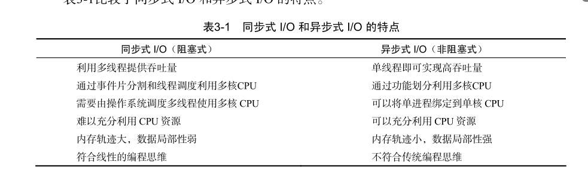

Node.js 有着强大而灵活的包管理器（node package manager，npm）  Node.js 是一个让 JavaScript 运行在服务端的开发平台  JavaScript 是由 ECMAScript、文档对象模型（DOM）和浏览器对象模型（BOM）组成的，而 Mozilla 则指出 JavaScript 由  Core JavaScript 和 Client JavaScript 组成  Node.js 中所谓的 JavaScript 只是 Core JavaScript，或者说是 ECMAScript 的一个实现，不包含 DOM、BOM 或者 Client JavaScript。  这是因为 Node.js 不运行在浏览器中，所以不需要使用浏览器中的许多特性    


```bash
node --help
$ node -e "console.log('Hello World');"
Hello World

```


REPL （Read-eval-print loop），即输入—求值—输出循环

运行无参数的 node 将会启动一个 JavaScript的交互式 shell：

```bash
$ node
Welcome to Node.js v20.10.0.
Type ".help" for more information.
> console.log('hel')
hel
undefined // undefined 就是 console.log 的返回值

```


热部署

npm install -g supervisor

supervisor app.js


线程在执行中如果遇到磁盘读写或网络通信（统称为 I/O 操作），
通常要耗费较长的时间，这时操作系统会剥夺这个线程的 CPU 控制权，使其暂停执行，同
时将资源让给其他的工作线程，这种线程调度方式称为 阻塞。当 I/O 操作完毕时，操作系统
将这个线程的阻塞状态解除，恢复其对CPU的控制权，令其继续执行。这种 I/O 模式就是通
常的同步式 I/O（Synchronous I/O）或阻塞式 I/O （Blocking I/O）

异步式 I/O （Asynchronous I/O）或非阻塞式 I/O （Non-blocking I/O）则针对
所有 I/O 操作不采用阻塞的策略。当线程遇到 I/O 操作时，不会以阻塞的方式等待 I/O 操作
的完成或数据的返回，而只是将 I/O 请求发送给操作系统，继续执行下一条语句。当操作
系统完成 I/O 操作时，以事件的形式通知执行 I/O 操作的线程，线程会在特定时候处理这个
事件。为了处理异步 I/O，线程必须有事件循环，不断地检查有没有未处理的事件，依次予
以处理。

Node.js 使用了单
线程、非阻塞的事件编程模式

创建一个线程的代价是十分昂贵的，
需要给它分配内存、列入调度，同时在线程切换的时候还要执行内存换页，CPU 的缓存被
清空，切换回来的时候还要重新从内存中读取信息，破坏了数据的局部性。




答案是 Node.js 程序由事件循环开始，到事件循
环结束，所有的逻辑都是事件的回调函数，所以 Node.js 始终在事件循环中，程序入口就是
事件循环第一个事件的回调函数。事件的回调函数在执行的过程中，可能会发出 I/O 请求或
直接发射（emit）事件，执行完毕后再返回事件循环，事件循环会检查事件队列中有没有未
处理的事件，直到程序结束

与其他语言不同的是，Node.js 没有显式的事件循环，类似 Ruby 的 EventMachine::run()
的函数在 Node.js 中是不存在的。Node.js 的事件循环对开发者不可见


模块（Module）和包（Package）是 Node.js 最重要的支柱

Node.js 提供了 require 函数来调用其他模快，exports 是模块公开的接口，require 用于从外部获取一个模块的接口，即所获取模块的 exports 对象


require 不会重复加载模块，也就是说无论调用多少次 require


文件和模块是一一对应的，一个Node.js 文件就是一个模块，这个文件可能是 JavaScript 代码、JSON 或者编译过的 C/C++ 扩展

包实现了某个功能模块的集合，Node.js 的包是一个目录，其中包含一个 JSON 格式的包说明文件 package.json


Node.js包管理器，即npm是 Node.js 官方提供的包管理工具

npm在默认情况下会从http://npmjs.org搜索或下载包，将包安装到当前目录的node_modules
子目录下

在使用 npm 安装包的时候，有两种模式：本地模式和全局模式。默认情况下我们使用 npm
install命令就是采用本地模式，即把包安装到当前目录的 node_modules 子目录下。Node.js
的 require 在加载模块时会尝试搜寻 node_modules 子目录，因此使用 npm 本地模式安装
的包可以直接被引用。

使用全局模式安装的包并不能直接在 JavaScript 文件中用 require 获
得，因为 require 不会搜索 /usr/local/lib/node_modules/

```shell
npm [install/i] [package_name] // 
npm [install/i] -g [package_name] //
```

| 模 式    | 可通过 require 使用 | 注册PATH |
| -------- | ------------------- | -------- |
| 本地模式 | 是                  | 否       |
| 全局模式 | 否                  | 是       |

 npm link，它的功能是在本地包和全局包之间创建符号链
接。我们说过使用全局模式安装的包不能直接通过 require 使用，但通过 npm link命令
可以打破这一限制


npm init 可以根据交互式问答产生一个符合标准的 package.json

在发布前，我们还需要获得一个账号用于今后维护自己的包，使用 npm adduser 根据
提示输入用户名、密码、邮箱，等待账号创建完成。完成后可以使用 npm whoami 测验是
否已经取得了账号。
接下来，在 package.json 所在目录下运行 npm publish，稍等片刻就可以完成发布了。
打开浏览器，访问 http://search.npmjs.org/ 就可以找到自己刚刚发布的包了。现在我们可以在
世界的任意一台计算机上使用 npm install byvoidmodule 命令来安装它。图3-6 是npmjs.
org上包的描述页面。
如果你的包将来有更新，只需要在 package.json 文件中修改 version 字段，然后重新
使用 npm publish 命令就行了。如果你对已发布的包不满意（比如我们发布的这个毫无意
义的包），可以使用 npm unpublish 命令来取消发布


全局对象（Global Object），它及其所有属性都可
以在程序的任何地方访问，即全局变量。在浏览器 JavaScript 中，通常 window 是全局对象，
而 Node.js 中的全局对象是 global，所有全局变量（除了 global 本身以外）都是 global
对象的属性,，如 console、process


process 是一个全局变量，即 global 对象的属性。它用于描述当前 Node.js 进程状态
的对象，

console 对象，用于向标准输出流（stdout）或标准错误流（stderr）输出字符

Node.js 适合 I/O 密集型的应用，而不是计算密集型的应用，
因为一个 Node.js 进程只有一个线程，因此在任何时刻都只有一个事件在执行。如果这个事
件占用大量的 CPU 时间，执行事件循环中的下一个事件就需要等待很久，因此 Node.js 的一
个编程原则就是尽量缩短每个事件的执行时间。


events 模块只提供了一个对象： events.EventEmitter。EventEmitter 的核心就
是事件发射与事件监听器功能的封装

EventEmitter 的每个事件由一个事件名和若干个参
数组成，事件名是一个字符串，通常表达一定的语义。对于每个事件，EventEmitter 支持
若干个事件监听器。当事件发射时，注册到这个事件的事件监听器被依次调用，事件参数作
为回调函数参数传递


EventEmitter.on(event, listener) 为指定事件注册一个监听器，接受一个字
符串 event 和一个回调函数 listener

EventEmitter.emit(event, [arg1], [arg2], [...]) 发射 event 事件，传
递若干可选参数到事件监听器的参数表

EventEmitter.once(event, listener) 为指定事件注册一个单次监听器，即
监听器最多只会触发一次，触发后立刻解除该监听器。

EventEmitter.removeListener(event, listener) 移除指定事件的某个监听
器，listener 必须是该事件已经注册过的监听器。

EventEmitter.removeAllListeners([event]) 移除所有事件的所有监听器，
如果指定 event，则移除指定事件的所有监听器。


最早实现动态网页的方法是使用Perl
①和 CGI。在 Perl 程序中输出 HTML 内容，由 HTTP
服务器调用 Perl 程序，将结果返回给客户端。这种方式在互联网刚刚兴起的 20 世纪 90 年代
非常流行，几乎所有的动态网页都是这么做的。但问题在于如果 HTML 内容比较多，维护
非常不方便。大概在 2000 年左右，以 ASP、PHP、JSP 的为代表的以模板为基础的语言出现
了，这种语言的使用方法与 CGI 相反，是在以 HTML 为主的模板中插入程序代码
②。这种方
式在2002年前后非常流行，但它的问题是页面和程序逻辑紧密耦合，任何一个网站规模变大
以后，都会遇到结构混乱，难以处理的问题。为了解决这种问题，以 MVC 架构为基础的平
台逐渐兴起，著名的 Ruby on Rails、Django、Zend Framework 都是基于 MVC 架构的。

MVC （Model-View-Controller，模型视图控制器）是一种软件的设计模式，它最早是
由 20 世纪 70 年代的 Smalltalk 语言提出的，即把一个复杂的软件工程分解为三个层面：模
型、视图和控制器。
 模型是对象及其数据结构的实现，通常包含数据库操作。
 视图表示用户界面，在网站中通常就是 HTML 的组织结构。
 控制器用于处理用户请求和数据流、复杂模型，将输出传递给视图


| 特 性        | 模板为中心架构                   | MVC 架构                         |
| ------------ | -------------------------------- | -------------------------------- |
| 页面产生方式 | 执行并替换标签中的语句           | 由模板引擎生成 HTML 页面         |
| 路径解析     | 对应到文件系统                   | 由控制器定义                     |
| 数据访问     | 通过 SQL 语句查询或访问文件系统  | 对象关系模型                     |
| 架构中心     | 脚本语言是静态 HTTP 服务器的扩展 | 静态 HTTP 服务器是脚本语言的补充 |
| 适用范围     | 小规模网站                       | 大规模网站                       |
| 学习难度     | 容易                             | 较难                             |

传统的架构中 HTTP 服务器的角色会由 Apache、Nginx、IIS 之类
的软件来担任，而 Node.js 不需要
②。Node.js 提供了 http 模块，它是由 C++ 实现的，性能
可靠，可以直接应用到生产环境。


可通过命令 npm config get prefix 查看 npm 安装路径（npm config set prefix 可设置 npm 安装路径）； 

### Web实战

express：一个轻量级的 Web 框架

```shell
npm install -g express
$ npm install express-generator -g


express --help
Usage: express [options] [path]

// 搭建基础框架
express -t ejs microblog 

```


无参数的 npm install 的功能就是检查当前目录下的 package.json，并自动安装所有指定的依赖


Express 支持 REST 风格的请求方式，REST 的
意思是 表征状态转移（Representational State Transfer）


模板引擎（Template Engine）是一个从页面模板根据一定的规则生成 HTML 的工具

建立一个 HTML 页面模板，插入可执行的代码，运行时动态生成 HTML

问题：

 页面功能逻辑与页面布局样式耦合，网站规模变大以后逐渐难以维护。
 语法复杂，对于非技术的网页设计者来说门槛较高，难以学习。
 功能过于全面，页面设计者可以在页面上编程，不利于功能划分，也使模板解析效
率降低。

模板引擎的功能是将页面模板和要显示的数据结合起来生成 HTML 页面。它既可以运
行在服务器端又可以运行在客户端，大多数时候它都在服务器端直接被解析为 HTML，解析
完成后再传输给客户端，因此客户端甚至无法判断页面是否是模板引擎生成的


在 MVC 架构中，模板引擎包含在服务器端。控制器得到用户请求后，从模型获取数据，
调用模板引擎。模板引擎以数据和页面模板为输入，生成 HTML 页面，然后返回给控制器，
由控制器交回客户端。


devDependencies 里面的依赖只用于开发环境，不用于生产环境。而 dependencies 依赖的包不仅开发环境能使用，生产环境也能使用 