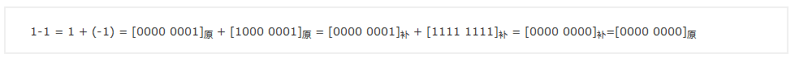

## 概述

byte，1字节，由8位二进制组成，带符号，[-128，127]

负数求反码时候的符号位不参与变换

计算机若用原码相加减，正数加正数不会出错，然而正数和负数原码相加就会出错。

正数的最高位是0

负数的最高位是1，负数的值是取反后加一，然后加个负号得到得值。


00000001。最高位是0 为正数 ，那么表示的就是 十进制的 1

10000001.最高位是1 为负数，取反得到 01111110 加1 得到 01111111 ，值为-128


所以，byte的最大正数就是 01111111（最高位必须是0），也就是 127


11111111，取反得：00000000，加1的 00000001。最后得到的值为 -1  最大的负数


最小的负数：10000000，取反01111111加1的到 -128


最大的数01111111（127）+1=最小的数10000000（-128）

```java
byte a = 127; 
a+=1; 
System.out.println(a); 
// -128

        System.out.println(3 << 1); // 3*2 = 6
        System.out.println(3 >> 1);  //floor(3/2)=1

        System.out.println(3 << 2); // 3*(2^2) = 12
        System.out.println(3 >> 2);  //floor(3/(2^2)=0
```

浮点型常量有两种表示形式：
 十进制数形式：如： 5.12 512.0f .512 (必须有小数点）
 科学计数法形式:如： 5.12e2 512E2 100E-2  

当把任何基本数据类型的值和字符串(String)进行连接运算时(+)， 基本数据类型的值将自动转化为字符串(String)类型  


```java
    System.out.println("str1" + false); // str1false
    System.out.println(3.14f+""); // 3.14
    System.out.println(3+4+"hello"); // 7hello
    System.out.println("hello"+3+4); // hello34
    System.out.println("a"+1+"hello"); //a1hello
    System.out.println("hello"+"a"+1); //helloa1

        short s = 5;
//        s = s - 2;// wrong，2 is int
        s = 5 - (short)(2);
		s-=2; //Convert int to short

        char c = 'a'; // a = 97
        int i = 5;
        float d = .314F;
        double result = c+i+d; // 向上转型
```
对于整数，有四种表示方式：

- 二进制(binary)： 0,1 ，满2进1.以0b或0B开头。
- 十进制(decimal)： 0-9 ，满10进1。
- 八进制(octal)： 0-7 ，满8进1. 以数字0开头表示。
- 十六进制(hex)： 0-9及A-F，满16进1. 以0x或0X开头表示。此处的A-F不区分大小写。
  如： 0x21AF +1= 0X21B0

计算机以二进制补码的形式保存所有的整数。


**原码**
　　原码就是机器数，是加了一位符号位的二进制，正数符号位为0，负数符号位为1，计算机中存储、处理、运算的数据通常是8位、16位、32位或64位的，这里以最简单的8位为例讲解。注意符号位是包含在8位中的其中1位，故可直观读出只有7位（只有后7位可以按权展开）。有心人可能注意到原码是有缺陷的，因此原码的表示范围成了-127到+127，其中包括+0，-0。一个8位的数原本能表示256个数字，而原码只能表示255个数字。这个问题需要神奇的补码来解决，因为在补码中10000000被用来表示-128.
**反码**
　　反码，英语里又叫one’s complement（对1求补），这里的1，本质上是一个有限位技术系统里所能标出的最大值，在8位二进制里就是11111111，在1位十进制里就是9，在3位十六进制里就是FFF。求反又被称为对一求补，用最大数减去一个数就能等到它的反，很容易看出在二进制里11111111减去任何数结构都是把这个数按位取反，0变1,1变0，所以才称之为反码。用原码求反码的方法是，**正数不变，负数保留符号位1不变，剩下位按位取反**。
**补码**
　　补码，英语里又叫two's complement（对2求补），这个2指的是计数系统的容量（模），就是计数系统所能表示的状态数。对1位二进制数来说只有0和1两种状态，所以模是10也就是十进制的2，对7位二进制数来说就是10000000，这个模是不可能取到的，因为位数多一位。用模减去一个数（无符号部分）就能得到这个数的补，比如10000000－1010010=0101110，事实上因为10000000=1111111+1，稍加改变就成了（1111111－1010010）+1，所以又可以表述为先求反再加1。总结求补码的方法就是**正数依旧不变，负数保留符号位不变，先求反码再加上1**。

小结

**正数的原码、反码和补码都相同。**

**负数原码和反码的相互转换：符号位不变，数值位按位取反。**

**负数原码和补码的相互转换：符号位不变，数值位按位取反,末位再加1。**


为什么要使用原码、反码、补码表示形式呢？
计算机辨别“符号位”显然会让计算机的基础电路设计变得十分复杂! 于是人们想出了将**符号位也参与运算**的方法. 我们知道, 根据运算法则减去一个正数等于加上一个负数, 即: 1-1 = 1 + (-1) = 0 , 所以机器可以只有加法而没有减法, 这样计算机运算的设计就更简单了



等比数列，1，2，4，（a1=1, q=2, Sn=2^n-1）