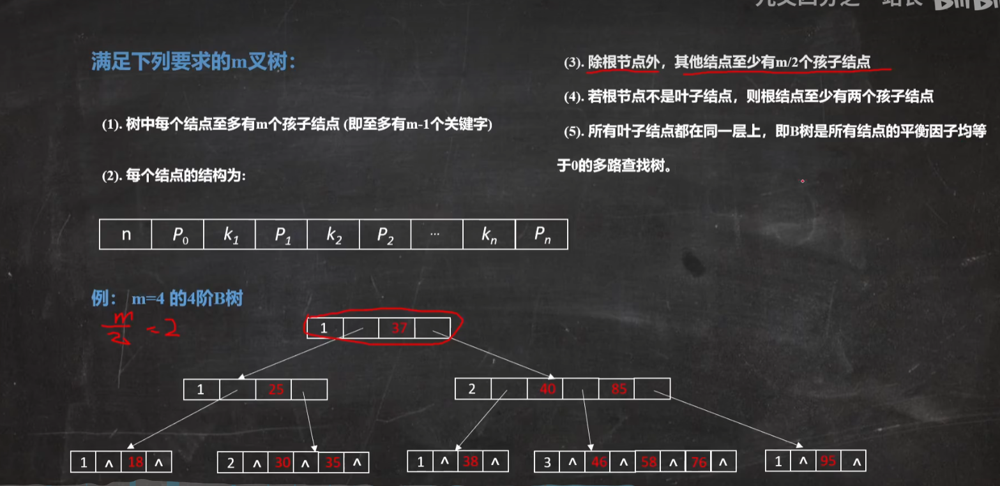
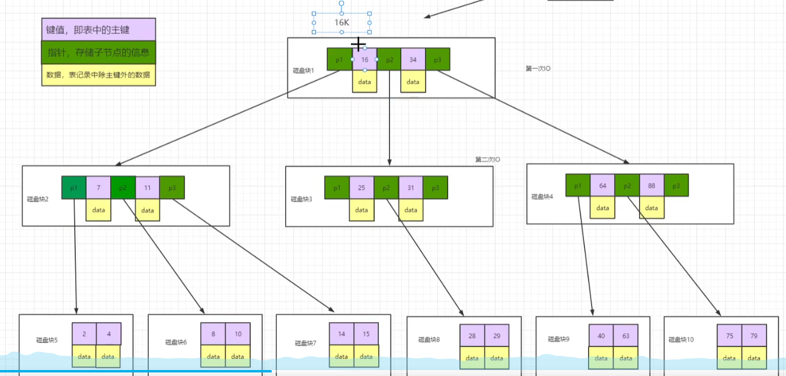
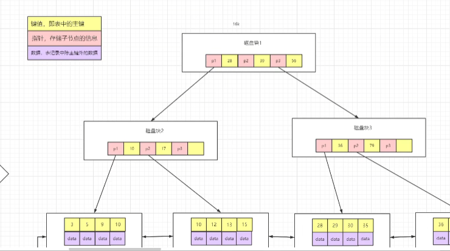

## 数据结构

可视化页面：https://www.cs.usfca.edu/~galles/visualization/Algorithms.html

数组的查询的时间复杂度为$O(1)$，但是插入删除时需要移动元素，所以其时间和空间复杂度都为$O(n)$

链表


### 数组

### 链表

### 树

二叉树 ---->  平衡二叉树（AVL） ----> 二叉搜索树（BST） ----> 红黑树

二叉树：只有两个分叉

平衡二叉树（AVL）：在极端情况下，二叉树会退化成链表，所以引入AVL, 其左右高度相差小等于1

二叉搜索树（BST）：左<根<右，中根遍历递增有序

红黑树：由于BST新增插入时会进行旋转，效率比较低，为了提高效率，引入了红黑树，最多旋转3次

B树

#### 红黑树

1. 节点只有红色或黑色
2. 根节点黑色
3. 每个叶子节点（NIL）是黑色。
4. 每个红色结点的两个子节点一定都是黑色。
5. **任意一结点到每个叶子结点的路径都包含数量相同的黑结点。**

####  B树

https://www.bilibili.com/video/BV1yB4y1v7Jy/?spm_id_from=333.788&vd_source=3bee43a5bbf34ebd0853d2ca1993105a

多分叉平衡搜索树，中根遍历递增有序， 平衡因子为0，所有叶子节点在同一层，每个节点都保存数据

结点数据结构：【键值，指针，数据】





#### B+树 

由于B树每个结点还存放数据，效率不高。为了进一步减少IO次数，增加每次从磁盘中读取的数据，所以引进了B+树。

1. 非叶子结点不保存关键字（记录的指针），只进行数据索引
2. 叶子结点包含了全部关键字
3. 有一个指针指向关键字最小的叶子结点，所有叶子结点链接成了一个双向链表 

> 叶子链表通常会被用来进行范围查询和排序操作。如果需要进行精确查找，可以直接通过B+树的内部节点进行定位，而无需遍历整个叶子链表。 



### 图


## 数据库

### 范式

- 1NF: 所有属性都是**不可分的基本数据项**
- 2NF: 每一个**非主属性完全函数依赖于码**。
  - 在1NF的基础上， 消除**部分依赖**
- 3NF: 每一个非主属性既**不部分依赖于码**也**不传递依赖于码**。
  - 在2NF的基础上， 消除**传递依赖**
- 反范式：**多表连接查询比较费时**，为了提高效率，允许数据冗余。

### 事务的特性

事务：逻辑上的一组操作，要么都执行，要么都不执行。

- 原子性（Atomicity）：事务是最小的执行单位，不可分割
- 一致性（consistency）：事务执行前后，要么全部成功执行，要么全部回滚，以保证数据的一致性。
- 隔离性（Isolation）：并发访问数据库时，一个用户的事务不被其他事务干扰
- 持久性（durability）：事务提交后，对数据库中的数据的改变是永久的

### 事务隔离级别

1. Read Uncommitted(读取未提交的内容) 可能脏读，不可重复读，幻读
2. Read Committed(读取提交内容) 可能不可重复读，幻读
   - Oracle的默认事务隔离级别
3. Repeatable Read(可重读) 可能幻读
   - MySQL的默认事务隔离级别
4. Serializable(可串行化)：每次读都需要获得表级共享锁，读写相互都会阻塞。

lost update（更新丢失）：当系统允许两个事务同时更新同一数据时，更新丢失

dirty read（脏读）：一个事务读取另个一个事务尚未提交的修改

nonrepeatable read（不可重复读）：同一查询在同一事务中多次进行，由于其他提交事务所做的修改或删除，每次返回不同的结果集，此时发生非重复读。

phantom read（幻读）：多个事务同时修改同一条记录，事务之间不知道彼此存在，当事务提交之后，后面的事务修改的数据将会覆盖前事务，前一个事务就像发生幻觉一样）

### Oracle 索引

1. B-tree索引：默认, 底层使用[B+树](#B+树)，范围查询和排序操作
2. 位图索引：适用于列范围只有几个固定的值，e.g.:性别（男，女）， 婚姻状况（已婚，未婚）
3. Hash索引：适用于等值查询

优点：数据保存在磁盘中，添加索引可以减少磁盘IO操作，提高数据查询速度。 

缺点：

1. 索引也保存在磁盘中，占用存储空间 
2. 数据修改影响性能：当数据表中的数据发生变化时，索引也需要进行相应的更新，这可能会影响数据的修改性能。
3. 增加查询时间：在某些情况下，索引并不一定能够提高数据查询效率，甚至可能会增加查询时间。比如，当查询结果较少，但需要遍历大量索引页时，索引的查询时间可能会比全表扫描更长。
4. 维护成本高：索引需要进行定期维护，包括创建、修改、删除等操作，这可能会增加数据库管理员的工作量和成本。

### MySQL简介

开源的关系型数据库，默认引擎是InnoDB，在5.7中，所有的存储引擎中只有InnoDB是事务性存储引擎

### InnoDB和MyISAM的区别

MyISAM是MySQL5.5之前的默认数据库，适用于读密集的情况下，5.5之后为InnoDB

- MyISAM：表级锁，强调性能，不支持事务，不支持崩溃修复和外键
- InnoDB：默认为行级锁，支持事务，崩溃修复和外键

### Jion

关系表R(A，...)，S(B，...)

- 内连接（innner jion）：可以使用像 = 或 <, >子类的比较符，还包括等值连接和自然连接
  - 等值连接：从R和S的笛卡尔积中选取A=B的元组，有重复列

  - 自然连接（nature jion）：在等值连接的基础上去除重复的属性列


- 外连接（outer jion）：先进行内连接生成T1，将悬浮元组添加到T1上，不存在的元组填NULL。

  > 悬浮元组：在连接运算中舍弃的元组

  - left join 或 left outer jion：只保留左边关系R中的悬浮元组，其他属性填NULL（即保留左表R中的所有元组，）
  - right jion 或 right outer jion
  - full jion 或 full outer jion

### 视图

虚表，修改视图会修改原始表，因为数据库中只存放视图的定义，不存放视图对应的数据。

## 网络

### OSI七层模型

- 应用层：HTTP，FTP，DNS,  DHCP，TELNET
- 表示层：加密解密，翻译，压缩
- 会话层：不同机器上的用户建立及管理回话
- 传输层：（端到端）负责报文交付，可靠传输，不可靠传输，流量控制，文件分段,，TCP，UDP，
  - 数据段 = 源端口+目标端口+数据
- 网络层：（不同网络）负责IP寻址，控制子网的运行，如逻辑编址，分组传输，路由选择，ARP，IP，ICMP，IGMP
  - 数据包/报 = 目标IP地址+源IP地址+数据段
  - 路由器 Router
  - ARP：IP地址与物理地址的映射
- 数据链路层：物理寻址，将比特流转为逻辑传输线路，封装成帧，透明传输，差错检测CRC ，CSMA/CD
  - 数据帧 = 目标MAC地址+源MAC地址+数据包
  - 交换机 Switch
- 物理层：定义接口标准
  - Bit流
  - 集线器 Hub

### 三次握手

A：我想和你建立链接（SYN=1, seq=1000）

B：我收到了(ACK=1, ack=1001)，我也想和你建立链接（SYN=1, seq= 2000）

A: 我收到了（ACK=1， seq=2001）

目的：建立可靠的通信信道，确认自己与对方的发送与接收是正常的

### 四次挥手

A: 我想断开链接（FIN=1， seq = 25368）

B：我收到了（ACK=1, ack=25369）

B：我也想和你断开链接（FIN=1，seq=10568）

A：我收到了（ACK=1， ack=10569）

### 交换机和路由器(?)

1. 路由器可以为局域网**自动分配IP和虚拟拨号**。交换机只是用来**分配网络数据**的。
2. **路由器在网络层，根据IP地址寻址**。路由器可以处理“TCP/IP”协议，交换机不行。**交换机在数据链路层，根据“MAC”地址寻址**。
   - 待定：**路由器可以把一个IP分给多个主机使用，对外IP相同**。**交换机可以把很多主机连接起来，对外的IP不同**。
3. **路由器可以提供防火墙**，交换机不能提供这个功能。**交换机是做扩大局域网接入点**的，可以让局域网连进更多的电脑。路**由器是用来做网间连接**，也就是用来连接不同网络的。

### TCP和UDP

同：都在传输层

异：

- TCP：面向连接，可靠交付，一对一，面向字节流，总体开销大
- UDP：无连接，最大努力交付，可以一对多，面向报文，不会出现拥塞控制，首部开销小，只有8个字节，而TCP有20个字节
  - DNS，SNMP(简单网络管理协议), TFTP(Trival FIle Transfer Protocal)

### TCP如何保证可靠传输(?)

1. 数据包校验
2. 对失序数据包重排序
3. 丢弃重复数据
4. 应答机制
5. 超时重发
6. 流量控制

### 停止等待协议

为了可靠传输，每发完一个分组就停止发送，等待对方确认。

### 上网过程(?)

用户在浏览器中键入URL，数据包到DNS，DNS将URL解析成IP地址返回给用户，浏览器将再通过IP地址访问服务器。建立TCP连接，发送HTTP请求，服务器接收到请求后，将网页分割成一个个数据帧。数据帧存储到网卡缓存，按顺序发送给用户。数据帧不能删除，当用户收到数据包后确认后无误后向服务器确认后，才可以删除

### forward 和 redirect

1. 从地址栏显示来说
   - forward是服务器请求资源,服务器直接访问目标地址的URL,把那个URL的响应内容读取过来,然后把这些内容再发给浏览器.浏览器根本不知道服务器发送的内容从哪里来的,所以它的**地址栏还是原来的地址.**
   - redirect是服务端根据逻辑, 发送一个状态码, 告诉浏览器重新去请求那个地址. 所以**地址栏显示的是新的URL**.

2. 从数据共享来说
   - forward: 转发页面和转发到的页面可以**共享request里面的数据**.
   - redirect: 不能共享数据.

3. 从运用地方来说
   - forward:一般用于**用户登陆**的时候, 根据角色转发到相应的模块.
   - redirect: 一般用于**用户注销登陆**时返回主页面和跳转到其它的网站等.

4. 从效率来说
   - forward: 高.
   - redirect: 低.

### SSL

SSL 安全套接字，https中的s

- 位于传输层之上，应用层之下
- 在发送方，SSL接受应用层的数据，对数据进行加密，然后把加了密的数据送往TCP套接字
- 在接受方，SSL从TCP套接字读取数据，解密后把数据交给应用层

SSL的功能

1. SSL服务器鉴别：允许用户证实服务器的身份。具有SSL功能的浏览器维持一个表，上面有一些可信赖的认证中心CA（Certificate Authority）和它们的公钥
2. 加密的SSL会话：客户和服务器交互的所有数据都在发送方加密，在接收方解密。
3. SSL客户鉴别：允许服务器证实客户的身份

### HTTP状态码

- 1XX 信息
  - 100 Continue:
- 2XX Success
  - 200 OK
- 3XX 重定向
  - 301 Moved Permanently：永久重定向
  - 302 Foud：临时重定向
- 4XX 客户端错误
  - 400 Bad Request
  - 401 Unauthorized
- 5XX 服务器错误

### HTTP和HTTPS

- 端口不同：80，443
- HTTP运行在TCP之上，明文传输，HTTPS在运行在SSL/TLS之上，SSL/TLS位于传输层之上，应用层之下，加密传输，需要到CA申请证书，要钱

### Cookie和Session

因为HTTP是一种无状态协议，为了跟踪用户状态状态，服务器向浏览器分配一个唯一ID，以Cookie的形式发送到浏览器，浏览器访问服务器时，会带上Cookie用以识别身份

异：

- Cookie一般用来保存用户信息及喜好，保存在客户端
- Session 通过服务端记录用户的状态，如购物车，保存在服务器端，更加安全

### GET和POST

同：都属于HTTP请求
异：

- 本质：**GET只是一次请求**，而**POST先发请求头再发请求体**，实际上是**两次请求**
- REST服务：GET是幂等的，即读取同一个资源总得到相同的数据。而POST会对服务器进行改变
- 请求参数：GET数据会附在URL上，即HTTP报文的请求头中，用？分割URL和传输数据，参数之间使用&相连。英文/数字原样发送，其他字符用BASE64加密；而POST会把提交的数据放在HTTP报文的请求体中。
- 安全性：POST更安全
- 请求大小：GET请求的长度受限于浏览器或服务器，而POST没有限制

### 数字签名

对文件使用单向散列函数获得摘要，摘要确保文件的完整性，再使用发送方的私钥对摘要形成数字签名

防止发送方不承认这是自己的私钥或被他人盗用私钥，从而需要第三方（证书颁发机构 CA）来发放证书（私钥和公钥（CA签名）

> 散列函数 单向函数
>
> 摘要保证了明文的完整性
>
> 私钥相当于自己签名，体现了抗抵赖性

### RESTful

看URL就知道要干什么，

method就知道干什么

看状态码就知道结果怎么样

## Java基础

### 字符型常量与字符串常量

1. 形式上：字符常量，‘  ’， 字符串常量，“ ”
2. 含以上：字符常量是一个整型值（ASCII值），可以参加表达式运算。字符串常量代表一个地址值（该字符串在内存中存放位置）
3. 内存上：字符常量占2个字节；字符串常量占若干个字节

### String, StringBuffer, StringBuilder

- 可变性：
  - String：`private final char value[]`，不可变
  - StringBuilder 与 StringBuffer都继承自 AbstractStringBuilder 类，使用 `char [] value`，没有使用final, 可变的
  
- 线程安全：
  - String不可变，线程安全，StringBuffer对方法加了同步锁，线程安全
  - StringBuilder没有添加同步锁，非线程安全
  
- 性能：
  - 每**次对String类型进行改变的时候，都会生成一个新的Sting对象，然后将指针指向新的String对象**。性能低
  - StringBuffer，有同步锁，性能低
  - StringBuilder，性能高
  
- **扩展：**

  **String str="i"与 String str=new String(“i”)一样吗？**

  不一样，因为内存的分配方式不一样。String str="i"的方式，Java 虚拟机会将其分配到常量池中；而 String str=new String(“i”) 则会被分到堆内存中。


###  Math. round(-1. 5)

```java
等于 -1，Math. round 四舍五入大于 0. 5 向上取整的。
```

### Java 中 IO 流分为几种？

**按功能来分：**输入流（input）、输出流（output）。

**按类型来分：**字节流和字符流。

**字节流和字符流的区别是：**字节流按 8 位传输以字节为单位输入输出数据，字符流按 16 位传输以字符为单位输入输出数据。

### BIO、NIO、AIO 有什么区别？

 **BIO：**Block IO 同步阻塞式 IO，就是我们平常使用的传统 IO，它的特点是模式简单使用方便，并发处理能力低。
 **NIO：**New IO 同步非阻塞 IO，是传统 IO 的升级，客户端和服务器端通过 Channel（通道）通讯，实现了多路复用。
 **AIO：**Asynchronous IO 是 NIO 的升级，也叫 NIO2，实现了异步非堵塞 IO ，异步 IO 的操作基于事件和回调机制。


### Overload和Override

- Overload表示同一个类中可以有多个名称相同的方法，但这些方法的**参数列表各不相同**（即**参数个数，类型，顺序不同**）。

  - 参数列表相同，返回值不同。Error, 二义性，即JVM不知道调用哪个函数。
  - 对于继承来说，如果某一方法在父类中是访问权限是priavte，那么就不能在子类对其进行重载，如果定义的话，也只是定义了一个新方法，而不会达到重载的效果。

  ```java
      // Error:(21, 19) java: 已在类 test.ShortTest中定义了方法 say(java.lang.String)
  //    static void say(String name){
  //        System.out.println("hello"+name);
  //    }
  
      static String say(String name){
          return name;
      }
  ```

- 重写Override表示子类中的方法可以与父类中的某个方法的**名称和参数完全相同**，**覆盖**

  - 覆盖的方法的**返回值**必须和被覆盖的方法的返回**一致**；
  - 覆盖的方法所**抛出的异常**必须和被覆盖方法的所抛出的异常**一致**，**或者是其子类**；
  - **被覆盖的方法不能为private**，否则在其子类中只是新定义了一个方法，并没有对其进行覆盖。

### static关键字

《Java编程思想》 P86：

static方法就是没有this的方法。在static方法内部不能调用非静态方法，反过来是可以的。而且可以==在没有创建任何对象的前提下，仅仅通过类本身来调用static方法==。这实际上正是static方法的主要用途。

一句话来概括：方便在没有创建对象的情况下来进行调用。

被static关键字修饰的变量或者方法不需要依赖于对象来进行访问，只要类被成功加载，就可以通过类名去进行访问。

static可以用来修饰类的成员变量（属性）、类的成员方法，另外可以编写static代码块来优化程序性能。

- static修饰成员变量（属性）
- static修饰方法
- static修饰代码块

注：

- 独立于类
- 在类加载的时候执行，只执行一次
- 修饰的方法只在调用时执行


（1）static修饰方法

static修饰的方法一般称作静态方法，由于静态方法不依赖于任何对象就可以进行访问，因此对于静态方法来说，是没有this的。并且由于这个特性，在静态方法中不能访问非静态成员变量和非静态成员方法，因为非静态成员变量和非静态成员方法都必须依赖于具体的对象才能够被调用。

（注：非静态成员方法中可以访问静态成员方法和变量）

​	

```java
class MyObject{
    private static String str1 = "staticProperty";
    private String str2 = "property";
    
    public MyObject(){
        
    }
    
    public void print1(){
        System.out.println(str1);
        System.out.println(str2);
        print2();
    }
    
    public static void print2(){
        System.out.println(str1);
        //System.out.println(str2); 非法
        //print1(); 非法
    }
}
```

同理，为什么main方法必须是static的，因为程序在执行main方法的时候没有创建任何对象，因此只能通过类名来访问。


（2）static修饰成员变量

static修饰的变量也称作静态变量，静态变量和非静态变量的区别是：

静态变量被所有的对象所共享，在内存中只有一个副本，它当且仅当类在初次加载时会被初始化。

非静态变量是对象所拥有的，在创建对象的时候被初始化，存在多个副本，各个对象拥有的副本互不影响。


static成员变量的初始化顺序按照定义的顺序进行初始化。


（3）static修饰代码块

jdbc中通过静态代码快来加载资源。

static代码块可以置于类中的任何地方，类中可以由多个static代码块。在类初次被加载的时候，会按照static块的顺序来执行每个static块，每个都只会执行一次。


**static误区：**

1.static关键字会改变类中成员的访问权限吗？

不会，和C++中的static关键字不一样


2.能通过this访问静态成员变量吗？

虽然说静态方法没有this，但是可以通过this访问静态变量。

```java
public class Main{
    static int value = 33;
    
    public static void main(String[] args) throws Expection{
        new Main().printValue();
    }
    
    private void printValue(){
        int value = 3;
        System.out.println(this.value);
    }
}

//out 33
//this代表当前对象，通过new Main()来调用printValue，当前对象就是通过new Main()生成的对象，而static变量是被对象所享有的，故输出为33。
//在printValue()方法内部的value是局部变量，不可能与this关联
//记住：静态变量虽然独立于对象，但是不代表不可以通过对象去访问，所有的静态变量和静态方法都可以通过对象去访问（在访问权限足够的情况下）。
```


3.static能作用于局部变量吗？

在C/C++中static是可以作用域局部变量的，但是在Java中切记：static是不允许用来修饰局部变量，这是Java语法的规定。


```java
public  class  Test  extends  Base{
 
     static {
         System.out.println( "test static" );
     }
     
     public  Test(){
         System.out.println( "test constructor" );
     }
     
     public  static  void  main(String[] args) {
         new  Test();
     }
}
 
class  Base{
     
     static {
         System.out.println( "base static" );
     }
     
     public  Base(){
         System.out.println( "base constructor" );
     }
}

//输出
//base static
//test static
//base constructor
//test constructor
    
//执行过程
//在执行开始，先要寻找到main方法，因为main方法是程序的入口，但是在执行main方法之前，必须先加载Test类，而在加载Test类的时候发现Test类继承自Base类，因此会转去先加载Base类，在加载Base类的时候，发现有static块，便执行了static块。在Base类加载完成之后，便继续加载Test类，然后发现Test类中也有static块，便执行static块。在加载完所需的类之后，便开始执行main方法。在main方法中执行new Test()的时候会先调用父类的构造器，然后再调用自身的构造器。因此，便出现了上面的输出结果。
```


```java
public  class  Test {
     Person person =  new  Person( "Test" );
     static {
         System.out.println( "test static" );
     }
     
     public  Test() {
         System.out.println( "test constructor" );
     }
     
     public  static  void  main(String[] args) {
         new  MyClass();
     }
}
 
class  Person{
     static {
         System.out.println( "person static" );
     }
     public  Person(String str) {
         System.out.println( "person " +str);
     }
}
 
 
class  MyClass  extends  Test {
     Person person =  new  Person( "MyClass" );
     static {
         System.out.println( "myclass static" );
     }
     
     public  MyClass() {
         System.out.println( "myclass constructor" );
     }
}

//输出
//test static
//myclass static
//person static
//test constructor
//person MyClass
//myclass constructor

//执行过程
//首先加载Test类，因此会执行Test类中的static块。接着执行new MyClass()，而MyClass类还没有被加载，因此需要加载MyClass类。在加载MyClass类的时候，发现MyClass类继承自Test类，但是由于Test类已经被加载了，所以只需要加载MyClass类，那么就会执行MyClass类的中的static块。在加载完之后，就通过构造器来生成对象。而在生成对象的时候，必须先初始化父类的成员变量，因此会执行Test中的Person person = new Person()，而Person类还没有被加载过，因此会先加载Person类并执行Person类中的static块，接着执行父类的构造器，完成了父类的初始化，然后就来初始化自身了，因此会接着执行MyClass中的Person person = new Person()，最后执行MyClass的构造器。
```

 

```java
public  class  Test {
     
     static {
         System.out.println( "test static 1" );
     }
     public  static  void  main(String[] args) {
         
     }
     
     static {
         System.out.println( "test static 2" );
     }
}

//输出
//test static 1
//test static 2

//执行过程
// 1.加载类：通过jvm调用ClassLoader类中的loaderClass方法加载我们要执行的类
//2.执行static修饰的内容（从上往下执行）
//3.调用构造器
//4.成员变量初始化
//5.执行构造方法，对象创建完毕
```

注：

  1.static修饰的属性和方法，使用类名.xx的形式访问。

  2.使用的位置：那些不需要通过创建对象就可以访问方法的情况。


### hashcode和equals

1. 如果两个对象相等，则 hashcode ⼀定也是相同的
2. 两个对象相等, 对两个对象分别调⽤ equals ⽅法都返回 true
3. 两个对象有相同的 hashcode 值，它们也不⼀定是相等的，因为hashCode是通过一个具体的算法得到的值
4. 因此， equals ⽅法被覆盖过，则 hashCode ⽅法也必须被覆盖
5. hashCode() 的默认⾏为是对堆上的对象产⽣独特值。如果没有重写 hashCode()，则该 class的两个对象⽆论如何都不会相等（即使这两个对象指向相同的数据）  

总结：两个对象相等，则hashcode值相同，且equals返回true。

### 为什么要有hashcode() 

hashcode() 为了提高查询的效率，但是hashcode不一定可靠，有时不同的对象生成的hashcode会一样。

### equals()

- Object中，equals()方法使用==来比较两个对象是否相等，即比较两个对象的内存地址是否相同。

- equals() 相等的两个对象他们的hashCode() 一定相等，但hashCode()相等的两个对象他们的equals()不一定相等。

所以只要重写equals,就必须重写hashCode; 因为Set存储的是不重复对象，所以Set一定要重写这两个方法，如果使用自定义对象作为Map的key，则必须重写hashCode和equals。String 重写了hashCode和equals 方法。

当使用hash时重写hashCode, e.g.: HashTable, HashMap, HashSet

引用数据类型：数组，类，接口，在Java虚拟机栈中存储对象的引用，在堆中存储对象的实例

基本数据类型：8个，byte,short,int,long, float,double,char,boolean。直接存储在Java虚拟机栈中

### == 与 equals()

==：判断两个对象的地址是否相等，即是否是同一个对象

- 基本类型只能使用\==，不能使用equals(), 包装类使用equals(), 不能使用==

equals()：在object类中，等价于==

- 类没有覆盖equals()方法，等价于==
- 类覆盖equals()方法后，判断两个对象内容是否相等，String类中的equals()方法被重写过。

```java
String x = “string”;
String y = “string”;
String z = new String(“string”);
System.out.println(x == y); // true
System.out.println(x == z); // false
System.out.println(x.equals(y)); // true
System.out.println(x.equals(z)); // true

class Cat {
	public Cat(String name) {
 		this.name = name;
	}

	private String name;

	public String getName() {

  		return name;
	}

	public void setName(String name) {

  		this.name = name;
	}
}

Cat c1 = new Cat(“王磊”);
Cat c2 = new Cat(“王磊”);

System.out.println(c1.equals(c2)); // false
```

### 动态语言or静态语言

**动态类型语言**是指**在运行期间才去做数据类型检查的语言**，也就是说，在用动态类型的语言编程时，永远也不用给任何变量指定数据类型，该语言会在你第一次赋值给变量时，在内部将数据类型记录下来。**静态类型语言**与动态类型语言刚好相反，它的数据类型是**在编译期间检查的**，也就是说在写程序时要声明所有变量的数据类型，C/C++是静态类型语言的典型代表，其他的静态类型语言还有C#、JAVA等。

### intern()

- str.intern(): 判断字符串常量池中是否存在str值，

  - 如果**常量池中有**，则不会放入常量池，**返回已有的常量池中的对象的地址**
  - 如果**没有**，把对象的**引用地址复制**一份，放入常量池中，**返回常量池中的引用地址**  

  - ("a"+"b"+"c").intern() == "abc" // true


- str.toString() ---> 约等于 new String();  

  - 存储在堆中

  

s1 + s2 的执行细节：
\1. StringBuilder s = new StringBuilder();
\2. s.append(a);
\3. s.append(b);  


- new String("ab")会创造几个对象
  - 两个对象
  - new 关键字在堆空间创建的
  - 字符串常量池中的对象  

```java
 @org.junit.Test
    public void test(){
         // s: 堆， s2:堆, "ab":堆
        String s = new String("a") + new String("b");
        String s2 = s.intern(); // s2保存s的地址
        System.out.println(s == s2); // true
        System.out.println(s2 == "ab"); // true
        System.out.println(s == "ab"); // true

    }
    
        // x: 常量池，s：堆，s2：常量池， "ab": 常量池
        String x = "ab";
        String s = new String("a") + new String("b");
        String s2 = s.intern(); // s2保存x的地址
        System.out.println(s == x); // false
        System.out.println(s2 == x); // true
        System.out.println(s == "ab"); // false
        System.out.println(x == "ab"); // true


        // s1：堆，s2: 常量池
        String s1 = new String("ab"); 
        s1.intern(); // 常量池中已经存在"ab"
        String s2 = "ab"; // s2 直接指向常量池中的“ab”
        System.out.println(s1 == s2); // false;

        // s1：堆， s2:堆
        String s1 = new String("a") + new String("b");
        s1.intern(); // 常量池中不存在"ab",将"ab" 的引用放入常量池中，堆中的地址
        String s2 = "ab"; // s2 保存常量池中的"ab"的引用地址，即s1
        System.out.println(s1 == s2); // true;
```

### 对象实例化的过程

```java
Person person = new Person()
```

1. 加载类元信息 `Person person `

  2. 为对象分配内存  `new `
  3. 属性的默认初始化（零值初始化） `Person()`
  5. 设置对象头的信息
  6. 属性的显式初始化，代码块中初始化，构造器中初始化  

### 反射

反射指的是在运行时能够分析类的能力的程序。
反射机制可以用来：

1. 在运行时分析类的能力--检查类的结构--所用到的就是java.lang.reflect包中的Field、Method、Constructor，分别用于描述类的与、方法和构造器。A中的Class类在java.lang中。

2. 在运行时查看对象。

3. 实现通用的数组操作代码。

   

   反射机制的功能：
   在运行时判断任意一个对象所属的类；在运行时构造任意一个类的对象；在运行时判断任意一个类所具有的成员变量和方法；在运行时调用任意一个对象的方法；生成动态代理。
   反射机制常见作用：
   动态加载类、动态获取类的信息（属性、方法、构造器）；动态构造对象；动态调用类和对象的任意方法、构造器；动态调用和处理属性；获取泛型信息（新增类型：ParameterizedType,GenericArrayType等）；处理注解（反射API:getAnnotationsdeng等）。
   反射机制性能问题：
   反射会降低效率。
   void setAccessible(boolean flag):是否启用访问安全检查的开关，true屏蔽Java语言的访问检查，使得对象的私有属性也可以被查询和设置。禁止安全检查，可以提高反射的运行速度。
   可以考虑使用：cglib/javaassist操作。

### 在javabean中要求提供一个public的空参构造器。

1. 便于通过反射，创建运行时类的对象
2. 便于子类继承此运行时类时，默认调用super()时，保证父类有此构造器

### super this

1. 便于通过反射，创建运行时类的对象
2. 便于子类继承此运行时类时，默认调用super()时，保证父类有此构造器

### ++

```java
public void test() {
    int a = 10;
    System.out.println(a++ + a--); //21
}
```

### 基本数据类型

默认值     取值范围 示例

字节型 ：0 -2^7—-2^7-1 byte b=10;
字符型 ：‘ u0000′ 0—-2^16-1  char c=’c’ ;
short : 0 -2^15—-2^15-1 short s=10;
int : 0 -2^31—-2^31-1 int i=10;
long : 0 -2^63—-2^63-1   long o=10L;
float : 0.0f -2^31—-2^31-1 float f=10.0F
double : 0.0d -2^63—-2^63-1 double d=10.0;
boolean: false truefalse boolean flag=true;

### short

```java
        short s1 = 1;
//      s1 = s1+1;  // Error:(6, 16) java: 不兼容的类型: 从int转换到short可能会有损失
        s1 += 1; // 编译器（javac）优化，short var2 = (short)(var1 + 1);
```

### final

final关键字可以用来修饰类， 方法，变量，参数

1. 修饰类
   - 该类不能被继承
   - 类中的方法不会被覆盖，默认都是final
   
2. 修饰方法
   - 该**方法可以被继承**，**但是不能被覆盖override**
     - static修饰的方法同上
   - 好处：
     - 可以防止继承它的子类修改该方法的意义和实现，更为高效，编译器在遇到调用final方法转入内嵌机制，提高执行效率。
     - ps：父类中的private成员方法不能被子类覆盖，因此private方法默认是final型的
   
3. 修饰变量

   - **引用不变**

   1. 用final修饰后变为常量，包括静态变量，实例变量和局部变量三种
   2. 特点：可以先声明，不给初值，这种叫做**final空白**。但是**使用前必须被初始化。一旦被赋值，将不能再改变**。

4. 修饰参数

   1. 用final修饰参数时，可以读取该参数，但是不能对其作出下修改

```java
//        final关键字修饰一个变量时，是指其引用不能变
        final  StringBuffer a = new StringBuffer("immutable");
//        a = new StringBuffer(""); // Error:(11, 9) java: 无法为最终变量a分配值
        a.append(" broken");
        System.out.println(a); 
		// immutable broken
```

### sout

```java
System.out.println()
//system是java.lang中的一个类，out是System内的一个成员变量，这个变量是一个java.io.PrintStream类的对象，println就是一个方法了。
```

### 泛型

泛型仅仅是java的一颗语法糖，它不会影响java虚拟机生成的汇编代码，在编译阶段，虚拟机就会把泛型的类型擦除，还原成没有泛型的代码，顶多编译速度稍微慢一些，执行速度是完全没有什么区别的

### String可变吗？

**对象不变**

```java
        // String对象不变，只是s指向了"hello world"
        String s = "hello";
        s += " world";
        System.out.println(s); // hello world
```

### for的遍历顺序

```java
static boolean foo(char c){
    System.out.print(c);
    return true;
}

public static void main(String[] args){
    int i = 0;
    for(foo('A'); foo('B') && (i<2); foo('C')){
        i++;
        foo('D');
    }
}

// ABDCBDCB
```

### Super和this

`this()`函数指向的构造函数默认有super()方法

- super ，**只调用直接父类的构造器，必须写在子类构造方法的第一行，否则编译不通过**
- this，只能在类中的非静态方法中使用，静态方法和静态的代码块(static 修饰)中绝对不能出现this. 
  - static 修饰的方法或代码块在类加载过程中的Initialization被执行 
  - 在类中调用构造器 A(x)    `this(x)`

### 包

1、把功能相似或相关的类或接口组织在同一个包中，方便类的查找和使用。
2、如同文件夹一样，包也采用了树形目录的存储方式。同一个包中的类名字是不同的，不同的包中的类的名字是可以相同的，当同时调用两个不同包中相同类名的类时，应该加上包名加以区别。因此，包可以避免名字冲突。
3、包也限定了访问权限，拥有包访问权限的类才能访问某个包中的类。
Java使用包（package）这种机制是为了防止命名冲突，访问控制，提供搜索和定位类（class）、接口、枚举（enumerations）和注释（annotation）等。

### Java创建对象的几种方式

1. `new Person`
2. 通过反射手段，调用`java.lang.Class`或`java.reflect.Constructor`的`newInstance()`方法
3. 调用对象的`clone()`方法
4. 运用反序列化手段，调用`java.io.ObjectInputStream`对象的`readObject()`方法
5. 静态工厂

### 构造函数

- 构造函数可以被过载，但不可以被重写
- 子类不继承父类的构造方法，而是必须调用其父类的构造方法
- 构造方法没有返回值，普通的类方法有返回值，可以和类名同名。
- 构造方法不能被对象调用，只会创建对象，使用new关键字

### abstract的method是否可同时是static,是否可同时是native，是否可同时是synchronized?

 abstract的method不可以是static的，因为抽象的方法是要被子类实现的，而static与子类扯不上关系！

​    native方法表示该方法要用另外一种依赖平台的编程语言实现的，不存在着被子类实现的问题，所以，它也不能是抽象的，不能与abstract混用。例如，FileOutputSteam类要硬件打交道，底层的实现用的是操作系统相关的api实现；例如，在windows用c语言实现的，所以，查看jdk的源代码，可以发现FileOutputStream的open方法的定义如下：

*private native void open(Stringname) throwsFileNotFoundException;*

​    如果我们要用java调用别人写的c语言函数，我们是无法直接调用的，我们需要按照java的要求写一个c语言的函数，又我们的这个c语言函数去调用别人的c语言函数。由于我们的c语言函数是按java的要求来写的，我们这个c语言函数就可以与java对接上，java那边的对接方式就是定义出与我们这个c函数相对应的方法，java中对应的方法不需要写具体的代码，但需要在前面声明native。

​    关于synchronized与abstract合用的问题，我觉得也不行，因为在我几年的学习和开发中，从来没见到过这种情况，并且我觉得synchronized应该是作用在一个具体的方法上才有意义。而且，方法上的synchronized同步所使用的同步锁对象是this，而抽象方法上无法确定this是什么。

### 返回方式

1. return
2. 异常抛出

### 访问修饰符

- public：可以访问任何一个在classpath下的类，接口，异常等。往往用于对外的情况，也就是对象或类对外的一种接口的形式。
- protected：用来保护子类，它的含义在于子类可以用它修饰的成员，其他的不可以，它相当于传递给子类的一种继承的东西。
- default：有时也称为friendly, 它是针对本包访问而设计的，任何处于本包下的类，接口，异常等，都可以相互访问，即使是父类没有用protected修饰的成员也可以
- private: 访问权限仅限于类的内部，是一部封装的体现，例如：大多数成员变量都是修饰符为private，不希望被其他任何外部的类访问

(1)对于外部类而言，它也可以使用访问控制符修饰，但外部类只能有两种访问控制级别：public和默认。因为外部类没有处于任何类的内部，也就没有其所在类的内部、所在类的子类两个范围，因此 private 和 protected 访问控制符对外部类没有意义。
(2)内部类的上一级程序单元是外部类，它具有 4 个作用域：同一个类（ private ）、同一个包（ protected ）和任何位置（ public ）。
(3)因为局部成员的作用域是所在方法，其他程序单元永远不可能访问另一个方法中的局部变量，所以所有的局部成员都不能使用访问控制修饰符修饰。

| 修饰符    | 类内部 | 同一个包 | 不同包的子类 | 同一个工程 |
| --------- | ------ | -------- | ------------ | ---------- |
| private   | Yes    |          |              |            |
| (缺省)    | Yes    | Yes      |              |            |
| protected | Yes    | Yes      | Yes          |            |
| public    | Yes    | Yes      | Yes          | Yes        |

### 拷贝

浅拷⻉（引用拷贝）：对基本数据类型进⾏值传递，对引⽤数据类型进⾏引⽤传递般的拷⻉，此为浅拷⻉。
深拷⻉（对象拷贝）：对基本数据类型进⾏值传递，对引⽤数据类型，创建⼀个新的对象，并复制其内容，此为深拷⻉  

### int与Integer的区别

- int 是一个基本数据类型，保存在Java虚拟机栈中，时间和性能都优于Integer，并不是一个对象，默认值为0, 使用==来比较
- Integer是包装类型,是一个Java对象，默认值为None，使用equals()比较，拥有一个内部缓存，在-128到127可以使用==比较，在POJO中最好使用Integer, 在序列化过程中可以告诉明确对方有没有这个值

### 复制构造函数被调用的三种情况

1.定义一个对象时，以本类另一个对象作为初始值，发生复制构造；

2.如果函数的形参是类的对象，调用函数时，将使用实参对象初始化形参对象，发生复制构造；

3.如果函数的返回值是类的对象，函数执行完成返回主调函数时，将使用return语句中的对象初始化一个临时无名对象，传递给主调函数，此时发生复制构造

### 引用

1、强引用：一个对象赋给一个引用就是强引用，比如new一个对象，一个对象被赋值一个对象。
2、软引用：用SoftReference类实现，一般不会轻易回收，只有内存不够才会回收。
3、弱引用：用WeekReference类实现，一旦垃圾回收已启动，就会回收。
4、虚引用：不能单独存在，必须和引用队列联合使用。主要作用是跟踪对象被回收的状态。

### try

try-catch
try-finally
try-catch-finally
但catch和finally语句不能同时省略！

### Comparator和Comparable

- 定制排序：Java.util.Comparator, 将Comparator传递给sort方法，重写camparae方法
- 自然排序：Java.lang.Comparable，重写campareTo方法

## Java集合

### Java 容器都有哪些？

Java 容器分为 Collection 和 Map 两大类，其下又有很多子类，如下所示：

**Collection**
**List**
ArrayList
LinkedList
Vector
Stack

**Set**
HashSet
LinkedHashSet
TreeSet

**Map**
HashMap
LinkedHashMap
TreeMap
ConcurrentHashMap
Hashtable

### List，Set，Map

- List：可重复，有序，继承了List接口
- Set：不可重复，无序，继承了List接口
- Map：key-value，key是Set，value是collection，

### Collection 和 Collections 有什么区别？

Collection 是一个集合接口，它提供了对集合对象进行基本操作的通用接口方法，所有集合都是它的子类，比如 List、Set 等。
Collections 是一个包装类，包含了很多静态方法，不能被实例化，就像一个工具类，比如提供的排序方法： Collections. sort(list)。

### ArrayList和LinkedList

同：都是线程不安全的

异：

- ArrayList，底层使用**object[]** ，实现了RandomAccess接口，可以支持高效的随机访问
- LinkedList，底层使用**双向链表**，适用于频繁的插入，删除操作，

**补充：**

数据结构实现：ArrayList 是动态数组的数据结构实现，而 LinkedList 是双向链表的数据结构实现。
随机访问效率：ArrayList 比 LinkedList 在随机访问的时候效率要高，因为 LinkedList 是线性的数据存储方式，所以需要移动指针从前往后依次查找。
增加和删除效率：在非首尾的增加和删除操作，LinkedList 要比 ArrayList 效率要高，因为 ArrayList 增删操作要影响数组内的其他数据的下标。
综合来说，在需要频繁读取集合中的元素时，更推荐使用 ArrayList，而在插入和删除操作较多时，更推荐使用 LinkedList。

### Vector 和 ArrayList

- 同：
  - 都实现了List接口，有序，可重复的集合
  - 底层都使用`Object[], Capacity=10`, 
- 异：
  - Vector 线程安全，效率低。ArrayList 线程不安全，效率高
  - 即Vector增长原来的一倍，ArrayList增加原来的0.5倍。

**补充：**

线程安全：Vector 使用了 Synchronized 来实现线程同步，是线程安全的，而 ArrayList 是非线程安全的。

性能：ArrayList 在性能方面要优于 Vector。

扩容：ArrayList 和 Vector 都会根据实际的需要动态的调整容量，只不过在 Vector 扩容每次会增加 1 倍，而 ArrayList 只会增加 50%。

### Array 和 ArrayList 有何区别？

 Array 可以存储基本数据类型和对象，ArrayList 只能存储对象。

 Array 是指定固定大小的，而 ArrayList 大小是自动扩展的。

 Array 内置方法没有 ArrayList 多，比如 addAll、removeAll、iteration 等方法只有 ArrayList 有。

补充：对于基本类型的数据，集合可以通过自动装箱来减少编码量，但是如果是处理固定大小的基本数据类型，速度会相对较慢。


自动装箱是Java编译器在基本数据类型和对应的对象包装类型之间做的一个转化。比如：把int转化成Integer，double转化成Double，等等。反之就是自动拆箱。

### 在 Queue 中 poll()和 remove()有什么区别？

相同点：都是返回第一个元素，并在队列中删除返回的对象。

不同点：如果没有元素 poll()会返回 null，而 remove()会直接抛出 NoSuchElementException 异常。

代码示例：

```java
Queue queue = new LinkedList();
queue.offer(“string”); // add
System.out.println(queue.poll());
System.out.println(queue.remove());
System.out.println(queue.size());
```

### 如何实现数组和 List 之间的转换？

数组转 List：使用 Arrays. asList(array) 进行转换。

List 转数组：使用 List 自带的 toArray() 方法。

代码示例：

```java
// list to array
List list = new ArrayList();
list. add(“王磊”);
list. add(“的博客”);
list. toArray();
// array to list
String[] array = new String[]{“王磊”,“的博客”};
Arrays.asList(array);
```

### 说一下 HashMap 的实现原理？

HashMap 基于 Hash 算法实现的，我们通过 put(key,value)存储，get(key)来获取。当传入 key 时，HashMap 会根据 key. hashCode() 计算出 hash 值，根据 hash 值将 value 保存在 bucket 里。当计算出的 hash 值相同时，我们称之为 hash 冲突，HashMap 的做法是用链表和红黑树存储相同 hash 值的 value。当 hash 冲突的个数比较少时，使用链表否则使用红黑树。

### 说一下 HashSet 的实现原理？

HashSet 是基于 HashMap 实现的，HashSet 底层使用 HashMap 来保存所有元素，因此 HashSet 的实现比较简单，相关 HashSet 的操作，基本上都是直接调用底层 HashMap 的相关方法来完成，HashSet 不允许重复的值。

### HashMap和Hashtable

- 同：
  - 都实现了Map接口，无序，key:value，
- 异：
  - HashMap 线程不安全，Hashtable 线程安全

  - Hashtable是基于陈旧的Dictionary类的

  - HashMap允许将null作为entry的key或者value，而Hashtable不允许。

  - HashMap底层使用数组+链表+红黑树（当链表长度>8时，链表O(n)转化为红黑树O(log(N))，减少搜索时间），七上八下。HashTable没有这样的机制

推荐使用：可以看到，Hashtable 是保留类不建议使用，推荐在单线程环境下使用 HashMap 替代，如果需要多线程使用则用 ConcurrentHashMap 替代。

### HashMap和HashSet

HashSet 底层就是基于 HashMap 实现的 ，底层采用HashMap保存元素

### HashSet如何检查重复

当你把对象加⼊ HashSet 时， HashSet会先计算对象的 hashcode 值来判断对象加⼊的位置，同时也会与其他加⼊的对象的hashcode值作⽐较，如果没有相符的hashcode， HashSet会假设对象没有重复出现。但是如果发现有相同hashcode值的对象，这时会调⽤ equals（） ⽅法来检查hashcode相等的对象是否真的相同。如果两者相同， HashSet就不会让加⼊操作成功。  

### TreeSet

有序，不重复，使用红黑树

### TreeMap

红黑树

### ConcurrentHashMap 和HashTable

底层数据结构：  

- JDK1.7的 ConcurrentHashMap 底层采⽤ 分段的数组+链表 实现， 
- JDK1.8  的ConcurrentHashMap 和1.8的HashTable相同，数组+链表+红黑树（当链表长度>8时，链表转化为红黑树）
- HashTable则采用数组+链表

实现线程安全的⽅式（重要）  ：

- 在JDK1.7的时候， ConcurrentHashMap（分段锁） 对整个桶
  数组进⾏了分割分段(Segment)，每⼀把锁只锁容器其中⼀部分数据，  
- JDK1.8 的时候已经摒弃了Segment的概念，⽽是直接⽤ Node 数组+链表+红⿊树的数据结构来实现，并发控制使⽤ synchronized 和CAS 来操作。  
- Hashtable(同⼀把锁) :使⽤ synchronized 来保证线程安全，效率⾮常低下。当⼀个线程访问同步⽅法时，其他线程也访问同步⽅法，可能会进⼊阻塞或轮询状态，如使⽤ put 添加元素，另⼀个线程不能使⽤ put 添加元素，也不能使⽤ get，竞争会越来越激烈效率越低。  

### 如何决定使用 HashMap 还是 TreeMap？

对于在 Map 中插入、删除、定位一个元素这类操作，HashMap 是最好的选择，因为相对而言 HashMap 的插入会更快，但如果你要对一个 key 集合进行有序的遍历，那 TreeMap 是更好的选择。

### Iterator

Iterator 接口提供遍历任何 Collection 的接口。我们可以从一个 Collection 中使用迭代器方法来获取迭代器实例。迭代器取代了 Java 集合框架中的 Enumeration，迭代器允许调用者在迭代过程中移除元素。

```java
List list = new ArrayList<>();
Iterator it = list. iterator();
while(it. hasNext()){
	String obj = it. next();
	System. out. println(obj);
}
```

Iterator 的特点是更加安全，因为它可以确保，在当前遍历的集合元素被更改的时候，就会抛出 ConcurrentModificationException 异常。

### Iterator 和 ListIterator 有什么区别？

Iterator 可以遍历 Set 和 List 集合，而 ListIterator 只能遍历 List。

Iterator 只能单向遍历，而 ListIterator 可以双向遍历（向前/后遍历）。

ListIterator 从 Iterator 接口继承，然后添加了一些额外的功能，比如添加一个元素、替换一个元素、获取前面或后面元素的索引位置。

### 怎么确保一个集合不能被修改？

可以使用 Collections. unmodifiableCollection(Collection c) 方法来创建一个只读集合，这样改变集合的任何操作都会抛出 Java. lang. UnsupportedOperationException 异常。

示例代码如下：

```java
List list = new ArrayList<>();
list.add(“x”);
Collection clist = Collections.unmodifiableCollection(list);
clist.add(“y”); // 运行时此行报错
System.out.println(list.size());
```


## 并发

### 内存结构

```
线程1 CPU -- Cache -- |总线 | 
		  			 |	   |
线程2 CPU -- Cache -- |总线 |  ---- 主存（内存）
					 |	   |
线程3 CPU -- Cache -- |总线 | 
```

多线程当中，每个线程都拥有自己的Cache, 对变量进行读写操作时，都会先将该变量从内存中加载到Cache中，经过CPU处理后再将该变量放回Cache中，最后放入内存中。所以可能会导致缓存不一致问题。

为了解决缓存不一致性问题，通常来说有以下2种解决方法：

1. 通过在总线加LOCK锁的方式

   阻塞了其他CPU对其他部件访问（如内存），从而使得只能有一个CPU能使用这个变量的内存。

2. 通过缓存一致性协议（Intel 的MESI协议）

   当CPU写数据时，如果发现操作的变量是**共享变量**，即在其他CPU中也存在该变量的副本，会发出信号通知其他CPU将该变量的**缓存行置为无效状态**，因此当其他CPU需要读取这个变量时，发现自己缓存中缓存该变量的缓存行是无效的，那么它就会从内存重新读取。

### 守护进程

**Java中，守护线程的生命周期随着主线程的结束而结束，哪怕守护线程的任务没有完成也会结束。**

> Daemon，在Linux中，守护进程程序的名称通常以字母“d”结尾，将后台程序变成一种服务，比如说，用命令行输入启动程序，如果不是守护进程的话，一旦命令行窗口关闭，程序就终止了；而如果启动守护进程，则退出命令行窗口之后，服务一直处于运行状态。
>
> 
>
> 后台线程（守护线程）：指为其他线程提供服务的线程，也称为守护线程。JVM的垃圾回收线程就是一个后台线程。
> 前台线程：是指接受后台线程服务的线程，其实前台后台线程是联系在一起，就像傀儡和幕后操纵者一样的关系。傀儡是前台线程、幕后操纵者是后台线程。由前台线程创建的线程默认也是前台线程。可以通过isDaemon()和setDaemon()方法来判断和设置一个线程是否为后台线程。

### 程序，进程，线程

程序：静态的代码块

进程：程序的动态执行过程，是操作系统分配和管理资源的基本单位

线程：进程的细化，可执行实体，是CPU调度和分派的基本档位，不拥有系统资源，共享进程资源

### 线程的生命周期

- **新建**： 当一个Thread类或其子类的对象被声明并创建时，新生的线程对象处于新建状态
- **就绪**： 处于新建状态的线程被**start()**后，**将进入线程队列等待CPU时间片**，此时它已具备了运行的条件，只是**没分配到CPU资源**
- **运行**： 当就绪的线程被调度并获得CPU资源时,便进入运行状态， run()方法定义了线程的操作和功能
- **阻塞**： 在某种特殊情况下，被人为挂起或执行输入输出操作时，让出 CPU 并临时中止自己的执行，进入阻塞状态
- **死亡**： 线程完成了它的全部工作或线程被提前强制性地中止或出现异常导致结束  

**补充：**

Java中线程的状态：

NEW 尚未启动
RUNNABLE 正在执行中
BLOCKED 阻塞的（被同步锁或者IO锁阻塞）
WAITING 永久等待状态
TIMED_WAITING 等待指定的时间重新被唤醒的状态
TERMINATED 执行完成

### 并发与并行

并发：单处理器，同时执行多个任务；两个或多个任务在同一时间间隔内发生

并行：多处理器，同时执行多个任务；两个或多个任务在同一时刻发生

### 上下文切换

概括来说就是：当前任务在执⾏完 CPU 时间⽚切换到另⼀个任务之前会先保存⾃⼰的状态，以便下次再切换回这个任务时，可以再加载这个任务的状态。 **任务从保存到再加载的过程就是⼀次上下⽂切换**。  

### 死锁

不同的线程分别占用对方需要的同步资源不放弃，都在等待对方放弃自己需要的同步资源，就形成了线程的死锁, 

**出现死锁后，不会出现异常，不会出现提示，只是所有的线程都处于阻塞状态，无法继续**。要满足下面4个条件

1. 互斥条件：一个资源每次只能被一个进程使用
2. 请求与保持条件：一个进程因请求资源而阻塞时，对已获得的资源保持不放
3. 不剥夺条件：进程已获得的资源，在未使用完之前，不能强行剥夺
4. 循环等待：A 等 B, B 等 C, C等A

**补充：**

**什么是死锁？**

当线程 A 持有独占锁a，并尝试去获取独占锁 b 的同时，线程 B 持有独占锁 b，并尝试获取独占锁 a 的情况下，就会发生 AB 两个线程由于互相持有对方需要的锁，而发生的阻塞现象，我们称为死锁。

**怎么防止死锁？**

尽量使用 tryLock(long timeout, TimeUnit unit)的方法(ReentrantLock、ReentrantReadWriteLock)，设置超时时间，超时可以退出防止死锁。

尽量使用 Java. util. concurrent 并发类代替自己手写锁。

尽量降低锁的使用粒度，尽量不要几个功能用同一把锁。

尽量减少同步的代码块。

### sleep() 和 wait()

 * 相同点：一旦执行方法，都可以使得当前的**线程进入阻塞**状态。
 * 不同点：
    * Wait 通常被⽤于线程间交互/通信， sleep 通常被⽤于暂停执⾏。  
       * 类的不同：sleep() 来自 Thread，wait() 来自 Object。
       * **调用的要求**不同：sleep()可以在**任何场景**下调用。 wait()必须使用在**同步代码块**或**同步方法**中
       * sleep() 时间到会自动恢复；wait() 可以使用 notify()/notifyAll()直接唤醒。
       * 释放锁：sleep() 不释放锁；wait() 释放锁。

### 创建多线程有哪几种方式

1. 创建一个继承于Thread类的子类，重写run方法，调用start()

2. 创建一个实现了Runnable接口的类，重写run方法。将此对象作为参数传入Thread类中，调用Thread类对象的start()方法

3. 创建一个实现了Callable接口的类，重写call()方法

   ```java
   		NumThread numThread = new NumThread(); //  NumThread implements Callable
           FutureTask futureTask = new FutureTask(numThread);  //`FutureTask` 同时实现了`Runnable, Future`接口
           new Thread(futureTask).start();
   		// futureTask对象可以获取返回值，Object sum = futureTask.get();
   ```

   - 可以有返回值, 方法可以抛出异常, 支持泛型的返回值 `V call() throws Exception;`

4. 线程池

### Thread和Runnable的区别于联系

联系：`public class Thread implements Runnable`

相同点：两种方式都需要重写run(),将线程要执行的逻辑声明在run()中。

优先选择实现Runnable接口的方式

- 避免java单继承带来的局限性(Runnable接口,  class Thread)
- 更适合来处理多个线程有共享数据的情况
- 线程池只能放入实现Runable或Callable类线程，不能直接放入继承Thread的类

### Thread类中的常用方法

```java
/**
* 1. start():启动当前线程；调用当前线程的run()
 * 2. run(): 通常需要重写Thread类中的此方法，将创建的线程要执行的操作声明在此方法中
 * 3. currentThread():静态方法，返回当前执行代码的线程
 * 4. getName(): 获取当前线程的名字
 * 5. setName(): 设置当前线程的名字
 * 6. yield(): 释放当前cpu的执行权
 * 7. join(): 在线程a中调用线程b的join(),此时线程a就进入阻塞状态，直到线程b完全执行完以后，线程a才
 *           结束阻塞状态。
 * 8. stop():已过时。当执行此方法时，强制结束当前线程。
 * 9. sleep(long millitime):让当前线程“睡眠”指定的millitime毫秒。在指定的millitime毫秒时间内，当前
 *                          线程是阻塞状态。
 * 10. isAlive():判断当前线程是否存活
 
 * 线程的优先级：
 * 1.
 * MAX_PRIORITY：10
 * MIN _PRIORITY：1
 * NORM_PRIORITY：5  -->默认优先级
 * 2.如何获取和设置当前线程的优先级：
 *   getPriority():获取线程的优先级
 *   setPriority(int p):设置线程的优先级
 *
 * 说明：高优先级的线程要抢占低优先级线程cpu的执行权。但是只是从概率上讲，高优先级的线程高概率的情况下
 * 被执行。并不意味着只有当高优先级的线程执行完以后，低优先级的线程才执行。
 */
```

### 在 Java 程序中怎么保证多线程的运行安全？

方法一：使用安全类，比如 Java. util. concurrent 下的类。
方法二：使用自动锁 synchronized。
方法三：使用手动锁 Lock。
手动锁 Java 示例代码如下：

```java
Lock lock = new ReentrantLock();
lock. lock();

try {
	System. out. println(“获得锁”);
} catch (Exception e) {
 // TODO: handle exception
 } finally {
 	System. out. println(“释放锁”);
 	lock. unlock();
 }
```

### 代码级的锁有哪些

1. synchronized
2. ReentrantLock  `ReentrantLock implements Lock`
   - `this.sync = (ReentrantLock.Sync)(fair ? new ReentrantLock.FairSync() : new ReentrantLock.NonfairSync());` 
   - 线程 先到先服务。默认为false
   - 公平锁：新入线程不能直接获取锁，必须去排队（除非没有任何竞争发生）
   - 非公平锁：。新入的线程则可以先尝试获取锁，如果失败了再排队。
3. volatile

使用顺序：

- Lock ---> 同步代码块（已经进入了方法体，分配了相应资源） ----> 同步方法（在方法体之外）

```java
// 同步代码块
synchronized(同步监视器){
      //需要被同步的代码
}

//同步方法1
private static synchronized void show(){//同步监视器：类名.class
   
}
//同步方法2
private static synchronized void show(){//同步监视器：this
   
}

private ReentrantLock lock = new ReentrantLock();
lock.lock();
// 逻辑
lock.unlock();
```

- **同步监视器**，俗称：**锁**。任何一个类的对象，都可以充当锁
  - **多个线程必须要共用同一把锁**。
- 在实现**Runnable接口创建多线程**的方式中，我们可以考虑使用**this充当同步监视器**。
- 在**继承Thread类创建多线程**的方式中，慎用this充当同步监视器，考虑使用**当前类类名.class充当同步监视器**。

- 同步方法仍然涉及到同步监视器，只是**不需要我们显式的声明**。

	-  **非静态的同步方法**，同步监视器是：**this**
	-  **静态的同步方法**，同步监视器是：当前类本身,**类名.class**

### synchronized

snchronized 关键字加到 **static 静态⽅法**和 **synchronized(class)代码块**上都是是**给 Class类上锁**。 

synchronized 关键字加到**实例⽅法**上是给**对象实例上锁**。尽量不要使⽤
synchronized(String a) 因为JVM中，字符串常量池具有缓存功能！  

**补充：**

**多线程中 synchronized 锁升级的原理是什么？**

synchronized 锁升级原理：在锁对象的对象头里面有一个 threadid 字段，在第一次访问的时候 threadid 为空，jvm 让其持有偏向锁，并将 threadid 设置为其线程 id，再次进入的时候会先判断 threadid 是否与其线程 id 一致，如果一致则可以直接使用此对象，如果不一致，则升级偏向锁为轻量级锁，通过自旋循环一定次数来获取锁，执行一定次数之后，如果还没有正常获取到要使用的对象，此时就会把锁从轻量级升级为重量级锁，此过程就构成了 synchronized 锁的升级。

锁的升级的目的：锁升级是为了减低了锁带来的性能消耗。在 Java 6 之后优化 synchronized 的实现方式，使用了偏向锁升级为轻量级锁再升级到重量级锁的方式，从而减低了锁带来的性能消耗。

###  synchronized 底层实现原理？

synchronized 是由一对 monitorenter/monitorexit 指令实现的，monitor 对象是同步的基本实现单元。在 Java 6 之前，monitor 的实现完全是依靠操作系统内部的互斥锁，因为需要进行用户态到内核态的切换，所以同步操作是一个无差别的重量级操作，性能也很低。但在 Java 6 的时候，Java 虚拟机 对此进行了大刀阔斧地改进，提供了三种不同的 monitor 实现，也就是常说的三种不同的锁：偏向锁（Biased Locking）、轻量级锁和重量级锁，大大改进了其性能。


### volatile

- volatile关键字用在多线程同步中，可保证读取的可见性, JVM保证从主内存加载到线程工作内存的值是最新的. 前文讲的缓存一致性，当发现修改的是共享变量时，会通知其他线程，将各自线程中的cache进行清空。

- volatile能禁止进行指令重排序,但不能保证线程安全

### synchronized和volatile

- 关键字volatile是线程同步的轻量级实现，所以volatile性能肯定比synchronized要好，并且只能修改变量，而synchronized可以修饰方法，以及代码块。
  多线程访问volatile不会发生阻塞，而synchronized会出现阻塞
- volatile能保证数据的可见性，但不能保证原子性；而synchronized可以保证原子性，也可以间接保证可见性，因为它会将私有内存和公共内存中的数据做同步
- 关键字volatile解决变量在多线程之间的可见性；而synchronized解决的是多线程之间资源同步问题

### Lock与synchronized

 *   相同：二者都可以解决线程安全问题
 *   不同：
      *   synchronized 不需要手动获取锁和释放锁，使用简单，发生异常会自动释放锁，不会造成死锁；而 lock 需要自己加锁和释放锁，如果使用不当没有 unLock()去释放锁就会造成死锁。
      *   synchronized 可以给类、方法、代码块加锁；而 lock 只能给代码块加锁。
      *   通过 Lock 可以知道有没有成功获取锁，而 synchronized 却无法办到。


### wait(), notify(), notifyAll()

 * `wait()`:一旦执行此方法，当前线程就进入**阻塞**状态，并**释放同步监视器**。

 * `notify()`:一旦执行此方法，就会**唤醒被wait的一个线程**。如果有多个线程被wait，就唤醒优先级高的那个，具体唤醒哪一个线程由虚拟机控制。

 * `notifyAll()`:一旦执行此方法，就会**唤醒所有被wait的线程**，会将全部线程由等待池移到锁池，然后参与锁的竞争，竞争成功则继续执行，如果不成功则留在锁池等待锁被释放后再次参与竞争。

 * 说明：

    * `wait()，notify()，notifyAll()`三个方法必须在**同步代码块**或**同步方法**中使用， 定义在`java.lang.Object`类中。
    * `wait()，notify()，notifyAll()`三个方法的**调用者**必须是同步代码块或同步方法中的**同步监视器**。否则，会出现`IllegalMonitorStateException`异常

### 并发编程的三个重要特性  

1. 原⼦性 : ⼀个的操作或者多次操作，要么所有的操作全部都得到执⾏并且不会收到任何因素的⼲扰⽽中断，要么所有的操作都执⾏，要么都不执⾏。 synchronized 可以保证代码⽚段的原⼦性。
2. 可⻅性 ：当⼀个变量**对共享变量进⾏了修改**，那么**另外的线程都是⽴即可以看到修改后的最新值**。 volatile 关键字可以保证共享变量的可⻅性。
3. 有序性 ：代码在执⾏的过程中的先后顺序， Java 在编译器以及运⾏期间的优化，**代码的执⾏顺序未必就是编写代码时候的顺序**。 volatile 关键字可以禁⽌指令进⾏重排序优化。  

### ThreadLocal 是什么？有哪些使用场景？

ThreadLocal 为每个使用该变量的线程提供独立的变量副本，所以每一个线程都可以独立地改变自己的副本，而不会影响其它线程所对应的副本。

ThreadLocal 的经典使用场景是数据库连接和 session 管理等。

### 说一下 atomic 的原理？

atomic 主要利用 CAS (Compare And Wwap) 和 volatile 和 native 方法来保证原子操作，从而避免 synchronized 的高开销，执行效率大为提升。


### 线程池参数以及原理

```java
public ThreadPoolExecutor(int corePoolSize,
                          int maximumPoolSize,
                          long keepAliveTime,
                          TimeUnit unit,
                          BlockingQueue<Runnable> workQueue,
                          ThreadFactory threadFactory,
                          RejectedExecutionHandler handler)
    
maximumPoolSize – the maximum number of threads to allow in the pool
keepAliveTime – when the number of threads is greater than the core, this is the maximum time that excess（过多的） idle（闲置的） threads will wait for new tasks before terminating.
unit – the time unit for the keepAliveTime argument
workQueue – the queue to use for holding tasks before they are executed. This queue will hold only the Runnable tasks submitted by the execute method.
threadFactory – the factory to use when the executor creates a new thread
handler – the handler to use when execution is blocked because the thread bounds and queue capacities are reached    
```

1. 当任务小于核心线程数时，线程池会创建对应数量的线程来执行任务
2. 当任务大于核心线程数时，这些任务会进入阻塞队列等待。
3. 当阻塞队列满时，线程池会创建n个救急线程（n = 最大线程数-核心线程数）来执行任务。任务完成后，救急线程会等待keepAliveTime时间后自动销毁。
4. 如果线程达到最大线程数时，并且阻塞队列满了，则会执行拒绝策略

拒绝策略：

1. ThreadPoolExecutor.AbortPolicy:丢弃任务并抛出RejectedExecutionException异常。 
2. ThreadPoolExecutor.DiscardPolicy：丢弃任务，但是不抛出异常。 
3. ThreadPoolExecutor.DiscardOldestPolicy：丢弃队列最前面的任务，然后重新提交被拒绝的任务 
4. ThreadPoolExecutor.CallerRunsPolicy：由调用线程（提交任务的线程）处理该任务

### 线程池都有哪些状态？

RUNNING：**接受新的任务**，处理等待队列中的任务。
SHUTDOWN：**不接受新的任务**提交，但是会**继续处理等待队列中的任务**。
STOP：**不接受新的任务提交**，**不再处理等待队列中的任务，中断正在执行任务的线程**。
TIDYING：所有的任务都销毁了，workCount 为 0，线程池的状态在转换为 TIDYING 状态时，会执行钩子方法terminated()。
TERMINATED：terminated()方法结束后，线程池的状态就会变成这个。

### 创建线程池有哪几种方式？

线程池创建有七种方式，最核心的是最后一种：

newSingleThreadExecutor()：它的特点在于工作线程数目被限制为 1，操作一个无界的工作队列，所以它保证了所有任务的都是被顺序执行，最多会有一个任务处于活动状态，并且不允许使用者改动线程池实例，因此可以避免其改变线程数目；

newCachedThreadPool()：它是一种用来处理大量短时间工作任务的线程池，具有几个鲜明特点：它会试图缓存线程并重用，当无缓存线程可用时，就会创建新的工作线程；如果线程闲置的时间超过 60 秒，则被终止并移出缓存；长时间闲置时，这种线程池，不会消耗什么资源。其内部使用 SynchronousQueue 作为工作队列；

newFixedThreadPool(int nThreads)：重用指定数目（nThreads）的线程，其背后使用的是无界的工作队列，任何时候最多有 nThreads 个工作线程是活动的。这意味着，如果任务数量超过了活动队列数目，将在工作队列中等待空闲线程出现；如果有工作线程退出，将会有新的工作线程被创建，以补足指定的数目 nThreads；

newSingleThreadScheduledExecutor()：创建单线程池，返回 ScheduledExecutorService，可以进行定时或周期性的工作调度；

newScheduledThreadPool(int corePoolSize)：和newSingleThreadScheduledExecutor()类似，创建的是个 ScheduledExecutorService，可以进行定时或周期性的工作调度，区别在于单一工作线程还是多个工作线程；

newWorkStealingPool(int parallelism)：这是一个经常被人忽略的线程池，Java 8 才加入这个创建方法，其内部会构建ForkJoinPool，利用Work-Stealing算法，并行地处理任务，不保证处理顺序；

ThreadPoolExecutor()：是最原始的线程池创建，上面1-3创建方式都是对ThreadPoolExecutor的封装。

## JVM

堆内存由存活和死亡的对象，空闲碎片组成，死亡的对象是应用不可访问尚且还没有被垃圾收集器回收掉的对象。

释放掉占据的内存空间是由gc完成，但是程序员无法明确强制其运行，该空间在不被引用的时候不一定会立即被释放，这取决于GC本身，无法由程序员通过代码控制

运行时数据区：

- 本地方法栈：C语言实现

- Java虚拟机栈：一个线程对应一个Java虚拟机栈，由一个个栈帧组成，一个栈帧对应一个方法，运行时的单位，i.e.: 程序如何执行。存放基本数据类型的局部变量，以及引用数据类型的对象的引用。每个栈存储着如下结构

  - 局部变量表--存储方法参数和定义在方法体内的局部变量，容量大小在编译期确定，基本单位为Slot, 如果当前帧是由非Static方法创建，this存放在slot的index为0处；

  - 操作数栈（Operand Stack / 表达式栈）
  - 动态连接--指向运行时常量池的方法引用，在Java源文件被**编译**到字节码文件时，**所有的变量和方法引用都作为符号引用**（SymbolicReference # 数字）保存在class文件的常量池中。  将符号引用转换为调用方法的直接引用。  
  - 方法返回地址：存储调用该方法的PC寄存器（调用该方法指令的下一条指令的地址）的值

- 堆（新生代（Eden, S0, S1），老年代）：存储的单位，存储大多数的对象。
  - 新生区，每个对象都拥有一个年龄计数器，每次YGC(当Eden区满时，触发YGC，S区满后不会触发)后，如果该对象依然存活，这年龄计数器+1，并且晋升到下一个区，Eden晋升到S0区，S0区满后，将S0中幸存的对象复制到S1区，S1区满后将幸存的对象复制到S0区，复制之后有交换，谁空谁是to  当年龄计数器增加到15时，将对象晋升（Promotion）为老年代（Tenured/old）  
    - Eden：大多数对象在Eden区被创建
    - S0(from区)
    - S1(to 区)
  - 老年代
  - GC about: 频繁在新生区收集，很少在养老区收集，几乎不在永久区/元空间收集  
  
- 程序计数器：每个线程都有一个程序计数器，用来存储下一条指令的地址

- 方法区/元空间/永久代（常量池，方法元信息，类元信息）：存储已被虚拟机加载的类型信息，常量(final)，静态变量(static)，即时编译后的代码缓存等  
  - jdk 7: 永久代，使用Java虚拟机内存，容易OOM
  - jdk8: 元空间，直接使用本地内存
  - **字符串常量池和运行时常量池从逻辑上属于方法区，但存储在堆中，**

- JIT：将字节码指令解释/编译为对应平台上的本地机器指令  

### 垃圾回收算法

Java垃圾回收算法包括以下几种：

1. 引用计数算法（Reference Counting Algorithm）：该算法为每个对象维护一个引用计数器，当有新的引用指向该对象时，计数器加1，引用失效时计数器减1。当计数器为0时，垃圾回收器将该对象回收。该算法无法解决循环引用的问题，且计数器操作会降低程序性能。
2. 标记-清除算法（Mark-and-Sweep Algorithm）：该算法分为两个阶段。第一阶段是标记阶段，在此阶段中，垃圾回收器标记出所有活动对象。第二阶段是清除阶段，在此阶段中，垃圾回收器清除所有未被标记的对象。该算法的缺点是容易产生内存碎片，影响程序性能。
3. 复制算法（Copying Algorithm）：该算法将堆分为两个区域，每次只使用其中一个区域，当这个区域用完时，将存活的对象复制到另一个区域，然后清除当前区域中的所有对象。该算法可以避免内存碎片的产生，但是需要更多的内存空间。
4. 标记-压缩（整理）算法（Mark-and-Compact Algorithm）：该算法类似于标记-清除算法，但在清除阶段时，垃圾回收器会将存活的对象移动到堆的一端，并将所有存活对象压缩在一起。该算法可以避免内存碎片的产生，但是需要额外的时间来移动对象。
5. 分代算法（Generational Algorithm）：该算法根据对象的存活时间将堆分为多个区域，一般分为新生代和老年代。**新生代中的对象生命周期较短，采用复制算法；老年代中的对象生命周期较长，采用标记-压缩算法。**该算法可以针对不同对象采用不同的垃圾回收算法，提高回收效率。


每个线程：独立包括Java虚拟机栈，本地方法栈，程序计数器

线程间共享：堆，堆外内存（方法区，代码缓存）


栈：不存在GC问题，但是肯定存在OOM

堆和方法区：GC和Error

### GC

- 部分收集：不是完整收集整个Java堆的垃圾收集
  - 新生代收集（Minor GC / Young GC）：只是新生代（Eden\ S0，S1）的垃圾收集
  - 老年代收集（Major GC / Old GC）:只是老年代的垃圾收集。
  - ps：很多时候Major GC会和Full GC混淆使用，需要具体分辨是老年代回收还是整堆回收
    混合收集（Mixed GC）：收集整个新生代以及部分老年代的垃圾收集
- 整堆收集（Full GC）：收集整个java堆和方法区的垃圾收集  


### 编译与解释

- 第一种是将源代码编译成字节码文件，然后**在运行时通过解释器将字节码文件转为机器码**执行
- 第二种是编译执行（**直接编译成机器码**）。使用JIT将方法编译成机器码后再执行  

HotSpot VM采用解释器与即时编译器并存的架构  

### java类加载器

A.引导类加载器（bootstrap class loader）：它用来加载 Java 的核心库，是用原生代码来实现的
B.扩展类加载器（extensions class loader）：它用来加载 Java 的扩展库。
C.系统类加载器（system class loader）：它根据 Java 应用的类路径（CLASSPATH）来加载 Java 类
D.tomcat为每个App创建一个Loader，里面保存着此WebApp的ClassLoader。需要加载WebApp下的类时，就取出ClassLoader来使用

## Servlet

### Java Web为什么需要Tomcat

tomcat是servlet容器，客户端访问服务端使用的是http协议，而底层使用的是socket。tomcat充当服务端的socket，我们写的程序无需再做socket的工作，因为tomcat已经帮我们做了，我们只需要把自己的业务处理放在servlet的service方法即可


### HttpServlet容器响应Web客户请求流程

HttpServlet容器响应Web客户请求流程如下：
1）Web客户向Servlet容器发出Http请求；
2）Servlet容器解析Web客户的Http请求；
3）Servlet容器创建一个HttpRequest对象，在这个对象中封装Http请求信息；
4）Servlet容器创建一个HttpResponse对象；
5）Servlet容器调用HttpServlet的service方法，这个方法中会根据request的Method来判断具体是执行doGet还是doPost，把HttpRequest和HttpResponse对象作为service方法的参数传给HttpServlet对象；
6）HttpServlet调用HttpRequest的有关方法，获取HTTP请求信息；
7）HttpServlet调用HttpResponse的有关方法，生成响应数据；
8）Servlet容器把HttpServlet的响应结果传给Web客户。
doGet() 或 doPost() 是创建HttpServlet时需要覆盖的方法.


## Spring


## Redis

Redis是由C语音开发的key-value键值对数据库，key永远都是String。我们通常说Redis的数据类型指的是其Value的数据类型。

### Redis为什么是单线程

因为 Redis 是基于内存的，CPU并不能限制其性能，所以使用单线程。如果加锁，则导致性能的消耗。

### 数据结构

1. String：进，`mset key1 value1 [key2, value2]`，取：`get key`
2. Hash：进，`hmset key feild value [feild value]`，取：`hgetall key`, `hget key feild`
3. List：进，`l[r]push key value [value...]`， 取：`lrange key 0 -1`
4. Set：进，`sadd key member [member]`，取：`smembers key`
5. ZSet(Sorted Set)：`zadd key score1 member1 [score2 member2]` 取：`zrange key start stop [WITHSCORES]`

### 场景应用

1. String：计数
2. Hash：购物车
3. List：消息队列，提醒功能，
4. Set：点赞点踩，标签
5. ZSet：排行榜

### String应用

https://blog.csdn.net/weixin_45393094/article/details/117265894

1. 缓存

2. 验证码：手机号作为key，验证码作为value， 同时设置过期时间

3. 计数器：点赞数，客户访问次数，先使用Redis记录，一段时间后同步到数据库

   > 帖子id作为key， 点赞数作为value，通过incr命令来增加点赞次数

4. 存储对象：产品id为key， 产品信息以json形式保存在value

5. 共享session：

6. 分布式锁

## RabbitMQ

幂等性问题：$f(f(x)) = f(x)$，在计算机中，多次请求和一次请求的结果相等

### 重复消费

先去数据库查询是否存在该id，如果存在，则过滤该数据

## Docker

Docker：Build，Ship and Run Any App,Anywhere. **将环境与app进行打包,从而做到一次封装，到处运行**

dockerfile ---build-->image--run-->container

> 根据镜像image创建容器container，同一个image可以创建多个container
>

持久化：

1. 通过DataVolume将container中的文件挂载到外部系统文件上，从而实现数据的共享
2. 将当前容器重新提交成为新的镜像，进而保存数据
