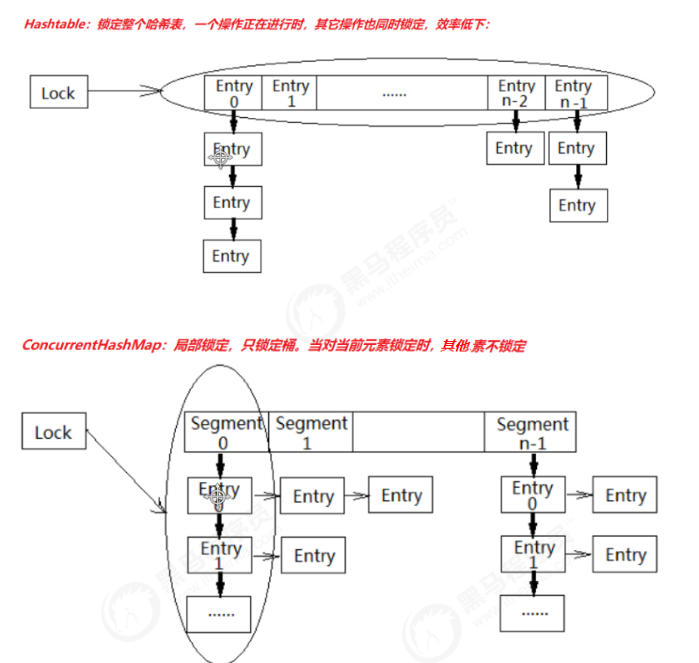
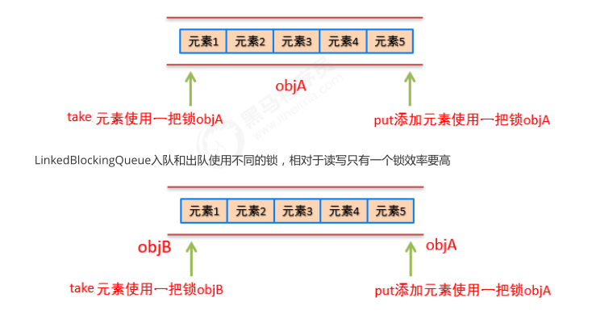

## 并发编程中的三个问题

### 可见性

可见性 Visibility：指一个线程对共享变量进行修改，另外的线程并没有立即看到修改后的最新值。

下列代码中，第一个线程并不会停止

```java
@Slf4j
public class Visibility {
    private static boolean flag = true;
    public static void main(String[] args) throws InterruptedException {

        new Thread(
                () -> {
                    log.debug("Thread 1 is running");
                    while (flag) {
                        // 不能有IO, 因为IO有同步代码块
                    }
                    log.debug("Thread 1 was stoped");
                }
        ).start();

        Thread.sleep(10);

        new Thread(
                () -> {
                    flag = !flag;
                    log.debug("Thread 2 modified the flag");
                }).start();
    }
}
```

### 原子性

原子性 Atomicity：当一个线程对共享变量操作到一半时，另外的线程也有可能来操作共享变量，干扰了前一个线程的操作。

**一条语句对应多个指令，并发时多线程可能交错进行**

```java
public class Atomicity {
    private static int number;
    public static void main(String[] args) throws InterruptedException {
        Runnable increment = () -> {
            for (int i = 0; i < 1000; i++) {
                number++;
            }
        };

        ArrayList<Thread> ts = new ArrayList<>();
        for (int i = 0; i < 5; i++) {
            Thread t = new Thread(increment);
            t.start();
            ts.add(t);
        }

        for (Thread t : ts) {
            t.join();
        }

        System.out.println("number = " + number);
        // 结果不一定是5000，可能小于5000
    }
}

number++ 的字节码指令如下

getstatic #12
iconst_1
iadd
putstatic #12
该指令在单线程中没有问题，但是在多线程中可能会发生重排序
```

### 有序性

有序性 Ordering：程序中代码的执行顺序，Java在编译时和运行时会对代码进行优化，会导致**程序最终的执行顺序不一定就是我们编写代码时的顺序**。

```java
@JCStressTest
@Outcome(id = {"1"， "4"}， expect = Expect.ACCEPTABLE， desc = "ok")
@Outcome(id = "0"， expect = Expect.ACCEPTABLE_INTERESTING， desc = "danger")
@State
public class Test03Orderliness {
    int num = 0;
    boolean ready = false;
    // 线程一执行的代码
    @Actor
    public void actor1(I_Result r) {
        if(ready) {
        	r.r1 = num + num;
        } else {
        	r.r1 = 1;
        }
    }
    // 线程2执行的代码
    @Actor
    public void actor2(I_Result r) {
        num = 2;
        ready = true;
    }
}
```

## Java内存模型(JMM)

### 计算机结构

Java内存模型是一套在多线程读写共享数据时，对共享数据的可见性、有序性、和原子性的规则和保障, 使**CPU缓存中的数据和内存中的数据保持一致**

缓存

CPU的运算速度和内存的访问速度相差比较大。这就导致CPU每次操作内存都要耗费很多等待时间。内存的读写速度成为了计算机运行的瓶颈。于是就有了在CPU和主内存之间增加缓存的设计。最靠近CPU的缓存称为L1，然后依次是 L2，L3和主内存

CPU Cache分成了三个级别: L1， L2， L3。级别越小越接近CPU，速度也更快，同时也代表着容量越小。
1. L1是最接近CPU的，它容量最小，例如32K，速度最快，每个核上都有一个L1 Cache。
2. L2 Cache 更大一些，例如256K，速度要慢一些，一般情况下每个核上都有一个独立的L2 Cache。
3. L3 Cache是三级缓存中最大的一级，例如12MB，同时也是缓存中最慢的一级，在同一个CPU插槽之间的核共享一个L3 Cache。


程序在运行的过程中，CPU接收到指令后，它会最先向CPU中的一级缓存（L1 Cache）去寻找相关的数据，如果命中缓存，CPU进行计算时就可以直接对CPU Cache中的数据进行读取和写人，当运算结束之后，再将CPUCache中的最新数据刷新到主内存当中，CPU通过直接访问Cache的方式替代直接访问主存的方式极大地提高了CPU 的吞吐能力。但是由于一级缓存（L1 Cache）容量较小，所以不可能每次都命中。这时CPU会继续向下一级的二级缓存（L2 Cache）寻找，同样的道理，当所需要的数据在二级缓存中也没有的话，会继续转向L3Cache、内存(主存)和硬盘。

### Java内存模型

Java Memory Molde (**Java内存模型**/JMM)，和**Java内存结构（堆栈）**不同

Java内存模型，是Java虚拟机规范中所定义的一种内存模型，Java内存模型是标准化的，屏蔽掉了底层不同计算机的区别。
Java内存模型是一套规范，描述了Java程序中各种变量(线程共享变量)的访问规，以及在JVM中将变量存储到内存和从内存中读取变量这样的底层细节，具体如下

- **主内存**
  主内存是所有线程都共享的，都能访问的。所有的共享变量都存储于主内存。
- **工作内存**
  每一个线程有自己的工作内存，工作内存只存储该线程对共享变量的副本。线程对变量的所有的操作(读，取)都必须在工作内存中完成，而不能直接读写主内存中的变量，不同线程之间也不能直接访问对方工作内存中的变量。

### Java内存模型与硬件内存

**Java内存模型是硬件内存的抽象**

> Java内存模型和硬件内存架构并不完全一致。对于硬件内存来说只有寄存器、缓存内存、主内存的概念，并没有工作内存和主内存之分，也就是说Java内存模型对内存的划分对硬件内存并没有任何影响，因为JMM只是一种抽象的概念，是一组规则，不管是工作内存的数据还是主内存的数据，对于计算机硬件来说都会存储在计算机主内存中，当然也有可能存储到CPU缓存或者寄存器中，因此总体上来说，Java内存模型和计算机硬件内存架构是一个相互交叉的关系，是一种抽象概念划分与真实物理硬件的交叉。

### Java内存模型数据交互

Java内存模型中定义了以下8种操作来完成，主内存与工作内存之间具体的交互协议，即一个变量如何从主内存拷贝到工作内存、如何从工作内存同步回主内存之类的实现细节，虚拟机实现时必须保证下面提及的每一种操作都是原子的、不可再分的。

```
线程A先lock 主内存中的变量 --> 线程A read 主内存 --> load --> use --> assign --> store --> write -- unlock
1. 如果对一个变量执行lock操作，将会清空工作内存中此变量的值
2. 对一个变量执行unlock操作之前，必须先把此变量同步到主内存
```

## synchronized保证三大特性

synchronized通过**锁**机制来**保证在同一时刻最多只有一个线程执行该段代码**，以达到保证并发安全(可见性, 原子性, 有序性)的效果

1. synchronized保证**只有一个线程拿到锁**，能够进入同步代码块。
2. 执行synchronized时，会对应**lock原子操作会刷新工作内存中共享变量的值**
3. 加synchronized后，依然会发生重排序，只不过，我们有同步代码块，可以保证只有一个线程执行同步代码中的代码。保证有序性

## synchronized特性

### 可重入特性

可重入：一个线程可以多次执行synchronized代码块,重复获取同一把锁。

```java
synchronized (Demo01.class) {
    System.out.println("我是run"); // 该方法内部也有synchronized
    test01();
}
```

原理：synchronized的锁对象中有一个计数器（recursions变量）会记录线程获得几次锁

优点：

1. 可以避免死锁
2. 可以让我们更好的来封装代码

小结：synchronized是可重入锁，内部锁对象中会有一个计数器记录线程获取几次锁啦，在执行完同步代码块时，计数器的数量会-1，直到计数器的数量为0，就释放这个锁。

### 不可中断性

synchronized是不可中断，处于阻塞状态的线程会一直等待锁, 即不可打断线程的阻塞或等待

不可中断：**一个线程获得锁后，另一个线程想要获得锁，该线程必须处于阻塞或等待状态，如果第一个线程不释放锁，第二个线程会一直阻塞或等待，不可被中断**。

```java
@Slf4j
public class Uninterruptible {
    private static Object obj = new Object();
    public static void main(String[] args) {
        // 1.定义一个Runnable
        Runnable run = () -> {
            // 2.在Runnable定义同步代码块
            synchronized (obj) {
                String name = Thread.currentThread().getName();
                log.debug(name+"进入同步代码块");
                // 保证不退出同步代码块
                try {
                    Thread.sleep(888888);
                } catch (InterruptedException e) {
                    e.printStackTrace();
                }
            }
        };

        // 3.先开启一个线程来执行同步代码块
        Thread t1 = new Thread(run);
        t1.start();

        try {
            Thread.sleep(1000);
        } catch (InterruptedException e) {
            e.printStackTrace();
        }

        // 4.开启一个线程来执行同步代码块(阻塞状态)
        Thread t2 = new Thread(run);
        t2.start();

        log.debug("t1: "+t1.getState()); // TIMED_WAITING
        log.debug("t2: "+t2.getState()); // BLOCKED
        
        // 5.停止第二个线程
//        t2.interrupt();
//        try {
//            Thread.sleep(1000);
//        } catch (InterruptedException e) {
//            e.printStackTrace();
//        }
//        log.debug("停止线程t2后");
//        log.debug("t1: "+t1.getState()); // TIMED_WAITING
//        log.debug("t2: "+t2.getState()); // BLOCKED


        t1.interrupt();
        log.debug("停止线程t1后");
        try {
            Thread.sleep(1000);
        } catch (InterruptedException e) {
            e.printStackTrace();
        }

        log.debug("t1: "+t1.getState()); // TERMINATED
        log.debug("t2: "+t2.getState()); // TIMED_WAITING
    }
}

```

ReentrantLock可中断

```java
package cn.itcast.test;

import lombok.extern.slf4j.Slf4j;

import java.util.concurrent.TimeUnit;
import java.util.concurrent.locks.Lock;
import java.util.concurrent.locks.ReentrantLock;

@Slf4j
public class Test {
	private static Lock lock = new ReentrantLock();
	public static void main(String[] args) throws InterruptedException {
		 test01();
//		test02();
	}
	// 演示Lock可中断
	public static void test02() throws InterruptedException {
		Runnable run = () -> {
			String name = Thread.currentThread().getName();
			boolean b = false;
			try {
				b = lock.tryLock(3, TimeUnit.SECONDS);
				if (b) {
					System.out.println(name + "获得锁,进入锁执行");
					Thread.sleep(88888);
				} else {
					System.out.println(name + "在指定时间没有得到锁做其他操作");
				}
			} catch (InterruptedException e) {
				e.printStackTrace();
			} finally {
				if (b) {
					lock.unlock();
					System.out.println(name + "释放锁");
				}
			}
		};
		Thread t1 = new Thread(run);
		t1.start();
		Thread.sleep(1000);
		Thread t2 = new Thread(run);
		t2.start();
		// Thread-0获得锁,进入锁执行
		// Thread-1在指定时间没有得到锁做其他操作
	}

	// 演示Lock不可中断
	public static void test01() throws InterruptedException {
		Runnable run = () -> {
			String name = Thread.currentThread().getName();
			try {
				lock.lock();
				System.out.println(name + "获得锁,进入锁执行");
				Thread.sleep(88888);
			} catch (InterruptedException e) {
				e.printStackTrace();
			} finally {
				lock.unlock();
				System.out.println(name + "释放锁");
			}
		};
		Thread t1 = new Thread(run);
		t1.start();
		Thread.sleep(1000);
		Thread t2 = new Thread(run);
		t2.start();
		Thread.sleep(1000);
		System.out.println("t2"+t2.getState());
		System.out.println("停止t2线程前");
		t2.interrupt();
		System.out.println("停止t2线程后");
		Thread.sleep(1000);
		System.out.println(t1.getState());
		System.out.println(t2.getState());
		/*
			t2WAITING
			停止t2线程前
			停止t2线程后
			TIMED_WAITING
			WAITING
		 */
	}
}

```

小结

不可中断是指，当一个线程获得锁后，另一个线程一直处于阻塞或等待状态，前一个线程不释放锁，后一个线程会一直阻塞或等待，不可被中断。
**synchronized属于不可被中断**
**Lock的lock方法是不可中断的**
**Lock的tryLock方法是可中断的**

## synchronized原理

```java
public class Demo01 {
    private static Object obj = new Object();
    public static void main(String[] args) {
        synchronized (obj) {
            System.out.println("1");
        }
    }
    
    public synchronized void test() {
        System.out.println("a");
    }
}
```

反编译得`javap -p -v -c xxx.class`

```java
public static void main(java.lang.String[]);
    descriptor: ([Ljava/lang/String;)V
    flags: ACC_PUBLIC, ACC_STATIC
    Code:
    	stack=2, locals=4, args_size=1
            0: iconst_0
            1: istore_1
            2: getstatic #2 // Field obj:Ljava/lang/Object;
            5: dup
            6: astore_2
            7: monitorenter
            8: iinc 1, 1
            11: aload_2
            12: monitorexit
            13: goto 21
            16: astore_3
            17: aload_2
            18: monitorexit
            19: aload_3
            20: athrow
            21: return
          Exception table:
            from  to target type
                8 13 16 any
               16 19 16 any
          LineNumberTable:
            line 8: 0
            line 9: 2
            line 10: 8
            line 11: 11
            line 12: 21
          LocalVariableTable:
            Start Length Slot Name Signature
                0 22 0 args [Ljava/lang/String;
                2 20 1 number I
          StackMapTable: number_of_entries = 2
            frame_type = 255 /* full_frame */
            offset_delta = 16
            locals = [ class "[Ljava/lang/String;", int, class java/lang/Object ]
            stack = [ class java/lang/Throwable ]
            frame_type = 250 /* chop */
            offset_delta = 4
            
	public synchronized void test();
            descriptor: ()V
            flags: ACC_PUBLIC, ACC_SYNCHRONIZED
            Code:
                stack=2, locals=1, args_size=1
                0: getstatic #3 // Field
             java/lang/System.out:Ljava/io/PrintStream;
                3: ldc #4 // String a
                5: invokevirtual #5 // Method
             java/io/PrintStream.println:(Ljava/lang/String;)V
                8: return

            LineNumberTable:
            line 15: 0
            line 16: 8

            LocalVariableTable:
            Start Length Slot Name Signature
            0 9 0 this
            Lcom/itheima/demo04_synchronized_monitor/Demo01
```

```
synchronized 编译成字节码后

monitorenter

代码逻辑

monitorexit
```

### monitorenter

https://docs.oracle.com/javase/specs/jvms/se8/html/jvms-6.html#jvms-6.5.monitorenter
 每一个对象都会和一个监视器monitor关联。监视器被占用时会被锁住，其他线程无法来获取该monitor。 当JVM执行某个线程的某个方法内部的monitorenter时，它会尝试去获取当前对象对应的monitor的所有权。其过程如下：

1. 若monior的进入数为0，线程可以进入monitor，并将monitor的进入数置为1。当前线程成为monitor的owner（所有者）
2. 若线程已拥有monitor的所有权，允许它重入monitor，则进入monitor的进入数加1
3. 若其他线程已经占有monitor的所有权，那么当前尝试获取monitor的所有权的线程会被阻塞，直到monitor的进入数变为0，才能重新尝试获取monitor的所有权。


monitorenter小结:
**synchronized的锁对象会关联一个monitor, 这个monitor不是我们主动创建的,是JVM的线程执行到这个同步代码块,发现锁对象没有monitor就会创建monitor, monitor内部有两个重要的成员变量owner和recursions**

- owner: 拥有这把锁的线程
- recursions: 会记录线程拥有锁的次数,当一个线程拥有monitor后其他线程只能等待

### monitorexit

1. 能执行monitorexit指令的线程一定是拥有当前对象的monitor的所有权的线程。

2. 执行monitorexit 会释放锁。

   > 执行monitorexit时会将monitor的进入数减1。当monitor的进入数减为0时，当前线程退出monitor，不再拥有monitor的所有权，此时其他被这个monitor阻塞的线程可以尝试去获取这个monitor的所有权

3. monitorexit插入在方法结束处和异常处，JVM保证每个monitorenter必须有对应的monitorexit。

```java
    7: monitorenter
    8: iinc 1, 1
    11: aload_2
    12: monitorexit  // 释放锁
    13: goto 21
    16: astore_3
    17: aload_2
    18: monitorexit // 根据Exception table，当发生异常时会执行monitorexit释放锁
    19: aload_3
    20: athrow
    21: return
        
Exception table:
from to target type
8 13 16 any
```

面试题: synchroznied出现异常会释放锁吗?
会释放锁

### 同步方法

可以看到同步方法在反汇编后，会增加 ACC_SYNCHRONIZED 修饰。会隐式调用monitorenter和monitorexit。在执行同步方法前会调用monitorenter，在执行完同步方法后会调用monitorexit。

```java
public synchronized void test();
    descriptor: ()V
    flags: ACC_PUBLIC, ACC_SYNCHRONIZED
    Code:
        stack=2, locals=1, args_size=1
        0: getstatic #3 // Field
      java/lang/System.out:Ljava/io/PrintStream;
        3: ldc #4 // String a
        5: invokevirtual #5 // Method
      java/io/PrintStream.println:(Ljava/lang/String;)V
        8: return
LineNumberTable:
    line 15: 0
    line 16: 8
LocalVariableTable:
    Start Length Slot Name Signature
    0 9 0 this
```

### synchronized与Lock的区别

1. synchronized是关键字，而Lock是一个接口。
2. synchronized会自动释放锁，而Lock必须手动释放锁。
3. synchronized是不可中断的，Lock可以中断也可以不中断。
4. 通过Lock可以知道线程有没有拿到锁，而synchronized不能。
5. synchronized能锁住方法和代码块，而Lock只能锁住代码块。
6. Lock可以使用读锁提高多线程读效率。
7. synchronized是非公平锁，ReentrantLock可以控制是否是公平锁。

### 小结

通过javap反汇编我们看到synchronized使用编程了monitorentor和monitorexit两个指令.每个锁对象
都会关联一个monitor(监视器,它才是真正的锁对象),它内部有两个重要的成员变量owner会保存获得锁
的线程,recursions会保存线程获得锁的次数,当执行到monitorexit时,recursions会-1,当计数器减到0时
这个线程就会释放锁

## 源码分析

### 源码下载

http://openjdk.java.net/ --> Mercurial --> jdk8 --> hotspot --> zip

### monitor监视器锁

在HotSpot虚拟机中，monitor是由ObjectMonitor实现的。其源码是用C++来实现的，位于HotSpot虚拟机源码ObjectMonitor.hpp文件中(src/share/vm/runtime/objectMonitor.hpp)。ObjectMonitor主要数据结构如下：

```c++
ObjectMonitor() {
    _header = NULL;
    _count = 0;
    _waiters = 0，
    _recursions = 0; // 线程的重入次数
    _object = NULL;  // 存储该monitor的对象
    _owner = NULL;   // 标识拥有该monitor的线程
    _WaitSet = NULL; // 处于wait状态的线程，会被加入到_WaitSet
    _WaitSetLock = 0 ;
    _Responsible = NULL;
    _succ = NULL;
    _cxq = NULL;     // 多线程竞争锁时的单向列表
    FreeNext = NULL;
    _EntryList = NULL; // 处于block状态的线程，会被加入到该列表
    _SpinFreq = 0;
    _SpinClock = 0;
    OwnerIsThread = 0;
}
```

1. _owner：初始时为NULL。当有线程占有该monitor时，owner标记为该线程的唯一标识。当线程释放monitor时，owner又恢复为NULL。owner是一个临界资源，JVM是通过CAS操作来保证其线程安全的。
2. \_cxq：竞争队列，所有请求锁的线程首先会被放在这个队列中（单向链接）。\_cxq是一个临界资源，JVM通过CAS原子指令来修改\_cxq队列。修改前\_cxq的旧值填入了node的next字段，\_cxq指向新值（新线程）。因此_cxq是一个后进先出的stack（栈）。
3. \_EntryList：_cxq队列中有资格成为候选资源的线程会被移动到该队列中。
4. _WaitSet：因为调用wait方法而被阻塞的线程会被放在该队列中。


每一个Java对象都可以与一个监视器monitor关联，我们可以把它理解成为一把锁，当一个线程想要执行一段被synchronized圈起来的同步方法或者代码块时，该线程得先获取到synchronized修饰的对象对应的monitor。
我们的Java代码里不会显示地去创造这么一个monitor对象，我们也无需创建，事实上可以这么理解：monitor并不是随着对象创建而创建的。我们是通过synchronized修饰符告诉JVM需要为我们的某个对象创建关联的monitor对象。每个线程都存在两个ObjectMonitor对象列表，分别为free和used列表。
同时JVM中也维护着global locklist。当线程需要ObjectMonitor对象时，首先从线程自身的free表中申请，若存在则使用，若不存在则从global list中申请。
ObjectMonitor的数据结构中包含：\_owner、\_WaitSet和\_EntryList，它们之间的关系转换可以用下表示：

_owner: 竞争到锁的线程

_WaitSet：处于等待状态的线程

_EntryList：处于阻塞状态的线程

### monitor 锁竞争

 执行monitorenter时，会调用InterpreterRuntime.cpp

1. 通过CAS尝试把monitor的owner字段设置为当前线程。
2. 如果设置之前的owner指向当前线程，说明当前线程再次进入monitor，即重入锁，执行recursions ++ ，记录重入的次数。
3. 如果当前线程是第一次进入该monitor，设置recursions为1，_owner为当前线程，该线程成功获得锁并返回。
4. 如果获取锁失败，则等待锁的释放。

### monitor 锁等待

竞争失败等待调用的是ObjectMonitor对象的EnterI方法

1. 当前线程被封装成ObjectWaiter对象node，状态设置成ObjectWaiter::TS_CXQ。

2. 在for循环中，通过CAS把node节点push到_cxq列表中，同一时刻可能有多个线程把自己的node节点push到\_cxq列表中。
3. node节点push到_cxq列表之后，通过自旋尝试获取锁，如果还是没有获取到锁，则通过park将当前线程挂起，等待被唤醒。
4. 当该线程被唤醒时，会从挂起的点继续执行，通过 ObjectMonitor::TryLock 尝试获取锁。

### monitor释放

当某个持有锁的线程执行完同步代码块时，会进行锁的释放，给其它线程机会执行同步代码，在HotSpot中，通过退出monitor的方式实现锁的释放，并通知被阻塞的线程，具体实现位于ObjectMonitor的exit方法中

1. 退出同步代码块时会让_recursions减1，当_recursions的值减为0时，说明线程释放了锁。

2. 根据不同的策略（由QMode指定），从cxq或EntryList中获取头节点，通过ObjectMonitor::ExitEpilog 方法唤醒该节点封装的线程，唤醒操作最终由unpark完成
3. 被唤醒的线程会执行锁竞争

### monitor是重量级锁

可以看到ObjectMonitor的函数调用中会涉及到Atomic::cmpxchg_ptr，Atomic::inc_ptr等内核函数，
执行同步代码块，没有竞争到锁的对象会park()被挂起，竞争到锁的线程会unpark()唤醒。这个时候就
会存在**操作系统用户态**和**内核态**的转换，这种切换会消耗大量的系统资源。所以synchronized是Java语
言中是一个重量级(Heavyweight)的操作

内核：本质上可以理解为一种软件，控制计算机的硬件资源，并提供上层应用程序运行的环境。
用户空间：上层应用程序活动的空间。应用程序的执行必须依托于内核提供的资源，包括CPU资源、存
储资源、I/O资源等。
系统调用：为了使上层应用能够访问到这些资源，内核必须为上层应用提供访问的接口：即系统调用。

所有进程初始都运行于用户空间，此时即为用户运行状态（简称：用户态）；但是当它调用系统调用执
行某些操作时，例如 I/O调用，此时需要陷入内核中运行，我们就称进程处于内核运行态（或简称为内
核态）。 系统调用的过程可以简单理解为：

1. 用户态程序将一些数据值放在寄存器中， 或者使用参数创建一个堆栈， 以此表明需要操作系统提
    供的服务。
2. 用户态程序执行系统调用。
3. CPU切换到内核态，并跳到位于内存指定位置的指令。
4. 系统调用处理器(system call handler)会读取程序放入内存的数据参数，并执行程序请求的服务。
5. 系统调用完成后，操作系统会重置CPU为用户态并返回系统调用的结果。

由此可见用户态切换至内核态需要传递许多变量，同时内核还需要保护好用户态在切换时的一些寄存器值、变量等，以备内核态切换回用户态。这种切换就带来了大量的系统资源消耗，这就是在synchronized未优化之前，效率低的原因。


## JDK6 synchronized优化

### CAS

CAS:  Compare And Swap(比较相同再交换)

作用: CAS可以将比较和交换转换为原子操作，这个原子操作直接由CPU保证。CAS可以保证共享变量赋值时的原子操作。CAS操作依赖3个值：内存中的值V，旧的预估值X，要修改的新值B，如果旧的预估值X等于内存中的值V(该变量没有人在修改)，就将新的值B保存到内存中

#### CAS和volatile实现无锁并发

```java
public static void main(String[] args) throws InterruptedException {
    AtomicInteger atomicInteger = new AtomicInteger();
    Runnable mr = () -> {
        for (int i = 0; i < 1000; i++) {
            // 提供了读写的原子操作
            atomicInteger.incrementAndGet();
        }
    };
    ArrayList<Thread> ts = new ArrayList<>();
    for (int i = 0; i < 5; i++) {
    	Thread t = new Thread(mr);
        t.start();
        ts.add(t);
    }
    
    for (Thread t : ts) {
    	t.join();
    }
    
    System.out.println("number = " + atomicInteger.get());
}
```

#### 乐观锁和悲观锁

**悲观锁**从悲观的角度出发：
总是假设最坏的情况，每次去拿数据的时候都认为别人会修改，所以每次在拿数据的时候都会上锁，这样别人想拿这个数据就会阻塞。因此synchronized我们也将其称之为悲观锁。JDK中的ReentrantLock也是一种悲观锁。性能较差！

**乐观锁**从乐观的角度出发:

总是假设最好的情况，每次去拿数据的时候都认为别人不会修改，就算改了也没关系，再重试即可。所以不会上锁，但是在更新的时候会判断一下在此期间别人有没有去修改这个数据，如何没有人修改则更新，如果有人修改则重试。
CAS这种机制我们也可以将其称之为乐观锁。综合性能较好！

> CAS获取共享变量时，为了保证该变量的可见性，需要使用volatile修饰。结合CAS和volatile可以
> 实现无锁并发，适用于竞争不激烈、多核 CPU 的场景下。
>
> 1. 因为没有使用 synchronized，所以线程不会陷入阻塞，这是效率提升的因素之一。
> 2. 但如果竞争激烈，可以想到重试必然频繁发生，反而效率会受影响。

### synchronized锁升级过程

无锁--》偏向锁--》轻量级锁–》重量级锁

### Java对象的布局

在JVM中，对象在内存中的布局分为三块区域：对象头、实例数据和对齐填充

#### 对象头

当一个线程尝试访问synchronized修饰的代码块时，它首先要获得锁，那么这个锁到底存在哪里呢？是存在锁对象的对象头中的, 由oopDesc.hpp定义

```c++
class oopDesc {
friend class VMStructs;
    private:
    volatile markOop _mark;
    union _metadata {
        Klass* _klass;
        narrowKlass _compressed_klass;
    } _metadata;
    
    // Fast access to barrier set. Must be initialized.
    static BarrierSet* _bs;
    // 省略其他代码
};
```


在普通实例对象中，oopDesc的定义包含两个成员，分别是 _mark 和 _metadata

_mark 表示对象标记、属于markOop类型，也就是接下来要讲解的Mark World，它记录了对象和锁有关的信息
_metadata 表示类元信息，类元信息存储的是对象指向它的类元数据(Klass)的首地址，其中Klass表示普通指针、 _compressed_klass 表示压缩类指针。
对象头由两部分组成，一部分用于存储自身的运行时数据，称之为 Mark Word，另外一部分是类型指针，及对象指向它的类元数据的指针。

####  实例数据

就是类中定义的成员变量

#### 对齐填充

对齐填充并不是必然存在的，也没有什么特别的意义，他仅仅起着占位符的作用，由于HotSpot VM的
自动内存管理系统要求对象起始地址必须是8字节的整数倍，换句话说，就是对象的大小必须是8字节的
整数倍。而对象头正好是8字节的倍数，因此，当对象实例数据部分没有对齐时，就需要通过对齐填充
来补全。

### 偏向锁

在大多数情况下，锁不仅不存在多线程竞争，而且总是由同一线程多次获得，为了让线程获得锁的代价更低，引进了偏向锁

偏向锁的“偏”，就是偏心的“偏”、偏袒的“偏”，它的意思是这个锁会偏向于第一个获得它的线程，会在对象头存储锁偏向的线程ID，以后该线程进入和退出同步块时只需要检查是否为偏向锁、锁标志位以及ThreadID即可。

不过一旦出现多个线程竞争时必须撤销偏向锁，所以撤销偏向锁消耗的性能必须小于之前节省下来的CAS原子操作的性能消耗，不然就得不偿失了

## 平时写代码如何对synchronized优化

### 减少synchronized的范围

同步代码块中尽量短，减少同步代码块中代码的执行时间，减少锁的竞争。

```java
synchronized (Demo01.class) {
	System.out.println("aaa");
}
```

### 降低synchronized锁的粒度

将一个锁拆分为多个锁提高并发度

```java
Hashtable hs = new Hashtable();
hs.put("aa", "bb");
hs.put("xx", "yy");
```






### 读写分离

读取时不加锁，写入和删除时加锁

ConcurrentHashMap，CopyOnWriteArrayList和ConyOnWriteSet

## Reference

https://www.bilibili.com/video/BV1oy4y1E7TH?p=29