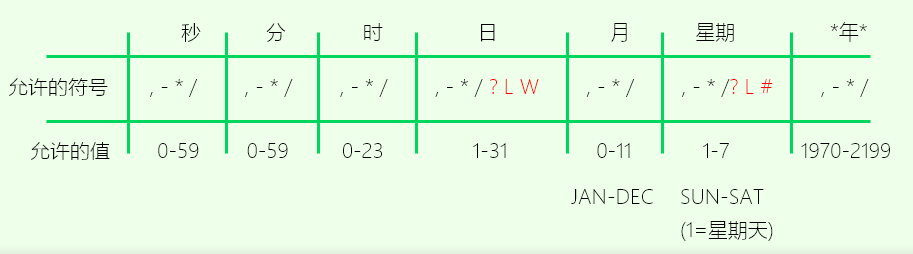

# Quartz

Quartz是OpenSymphony开源 的 作业调度 框架，实现了 作业 和 调度器 的 多对多 的关系。

核心概念：

1. Job （作业）- 该接口只有一个`execute 方法`
2. JobDetail  - 定义作业的实例 
3. Trigger（触发器）- 调度参数的配置
4. Scheduler （调度器），一个 Scheduler 可以注册多个 JobDeatil 和　Trigger

## CronExpression



```
'*' 任意值 分钟字段的 *，表示 每分钟
'?' 只有 日 和 星期 字段允许，因为每年3月2号是星期几不一定
'-' 指定范围，小时字段中的 10-12 表示 10，11，12
',' 指定其他值， 星期字段中的 'MON, WED, FRI' 表示 星期一，星期三，星期五
'/' 指定增量，秒字段中的 1/40 表示 1秒，41秒
'L' 只有 月 和 星期 允许使用，Last的简写，
    月字段 L 表示月的最后一天，非闰年的1月31日， 2月28日
    星期字段 L 表示 SAT(周六，7)
'W' 在 日 字段使用， 指定最接近给定日期的工作日， 15W 表示离月15号最近的工作日
    LW 表示最后一个工作日
'#' 只在 星期 字段使用，用于指定 第n个XXX天
    6 # 3 该月的第三个星期五 

    * * * * * ? *   每秒 执行任务
    0 0/2 * * * ?    表示每2分钟 执行任务
    0 0 2 1 * ?   表示在每月的1日的凌晨2点调整任务
    0 15 10 ? * MON-FRI   表示周一到周五每天上午10:15执行作业
    0 15 10 ? 6L 2002-2006   表示2002-2006年的每个月的最后一个星期五上午10:15执行作
    0 0 10,14,16 * * ?   每天上午10点，下午2点，4点 
    0 0/30 9-17 * * ?   朝九晚五工作时间内每半小时 
    0 0 12 ? * WED    表示每个星期三中午12点 
    0 0 12 * * ?   每天中午12点触发 
    0 15 10 ? * *    每天上午10:15触发 
    0 15 10 * * ?     每天上午10:15触发 
    0 15 10 * * ?    每天上午10:15触发 
    0 15 10 * * ? 2005    2005年的每天上午10:15触发 
    0 * 14 * * ?     在每天下午2点到下午2:59期间的每1分钟触发 
    0 0/5 14 * * ?    在每天下午2点到下午2:55期间的每5分钟触发 
    0 0/5 14,18 * * ?     在每天下午2点到2:55期间和下午6点到6:55期间的每5分钟触发 
    0 0-5 14 * * ?    在每天下午2点到下午2:05期间的每1分钟触发 
    0 10,44 14 ? 3 WED    每年三月的星期三的下午2:10和2:44触发 
    0 15 10 ? * MON-FRI    周一至周五的上午10:15触发 
    0 15 10 15 * ?    每月15日上午10:15触发 
    0 15 10 L * ?    每月最后一日的上午10:15触发 
    0 15 10 ? * 6L    每月的最后一个星期五上午10:15触发 
    0 15 10 ? * 6L 2002-2005   2002年至2005年的每月的最后一个星期五上午10:15触发 
    0 15 10 ? * 6#3   每月的第三个星期五上午10:15触发
```

## Reference

https://www.w3cschool.cn/quartz_doc/