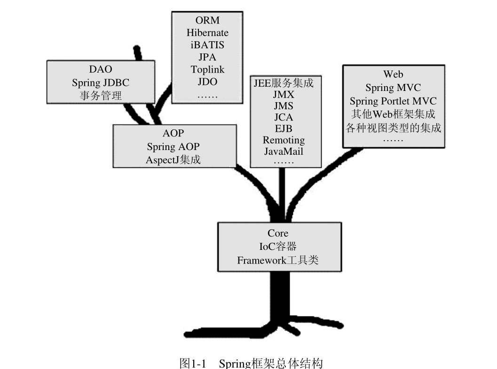

##  Spring




Spring

Spring是什么?

Spring是一个轻量级的IoC和AOP容器框架，目的是用于简化企业应用程序的开发，它使得开发者只需要关心业务需求。

常见的配置方式有三种：基于XML的配置、基于注解的配置、基于Java的配置。

主要由以下八个模块组成：

1. Data Access/Integration

2. Web

3. AOP
4. Aspects
5. Instrument
6. Messaging
7. Core Container
8. Test

每个「绿框」，对应一个模块，总共8个模块；「黑色包」，表示要实现这个模块的 jar 包


上层模块依赖下层模块，同层模块相互独立


优点：

（1）spring属于低侵入式设计，代码的污染极低；

（2）spring的DI机制将对象之间的依赖关系交由框架处理，减低组件的耦合性；

（3）Spring提供了AOP技术，支持将一些通用任务，如安全、事务、日志、权限等进行集中式管理，从而提供更好的复用。

（4）spring对于主流的应用框架提供了集成支持。


## IoC

Inversion of Control

### 概述

Spring 提供了IOC容器实现，帮助我们以依赖注入的方式管理对象之间的依赖关系。解耦各业务对象间依赖关系的对象绑定方式

IOC就是控制反转，是指创建对象的控制权的转移，以前创建对象的主动权和时机是由自己把控的，而现在这种权力转移到Spring容器中，并由容器根据配置文件去创建实例和管理各个实例之间的依赖关系，对象与对象之间松散耦合，也利于功能的复用。


**Spring Bean（简称 Bean）**：在 Spring 中每一个**需要管理的对象实例**

**IOC：**控制反转， Spring容器**创建**和**管理**SpringBean。i.e.:管理Bean的生命周期，以及bean的依赖注入。


### IOC原理

IOC原理：xml 解析、工厂模式、反射

1. 容器启动阶段

   - 加载配置
   - 分析配置信息
   - 装备到BeanDefinition，注册到相应的BeanDefinitionRegistry
   - 其他处理
   - BeanFactoryPostProcessor会修改BeanDefinition中的信息

2. Bean实例化阶段

   第一次调用getBean()后会进入实例化阶段

3. 

### **依赖注入方式**

1. 构造器注入
   - 优点：对象构造完成后即可使用
   - 缺点：
     - 当依赖对象较多时，构造方法的参数列表会比较长。
     - 构造方法无法被继承，无法设置默认值
2. setter注入：最提倡，可被继承，允许设置默认值
3. 接口注入：要求被注入的对象实现不必要的接口，带有侵入性
3. 注解注入

如何管理对象间的依赖关系：

1. 直接编码
2. 配置文件方式
3. 元数据方式, 如注解


### IOC 容器

Spring IOC 容器的实现的两种方式（接口）

1. BeanFactory：默认lazy-load，是Spring里面最底层的接口，包含了各种Bean的定义，读取bean配置文档，管理bean的加载、实例化，控制bean的生命周期，维护bean之间的依赖关系
2. ApplicationContext： ApplicationContext接口作为BeanFactory的派生，除了提供BeanFactory所具有的功能外，还提供了更完整的框架功能。启动后会实例化所有的bean定义
   - 统一资源加载策略
   - 国际化信息支持
   - 容器内事件发布
   - 多配置模块加载简化
   - 提供在监听器中注册bean的事件
   

ApplicationContext的子类有：

- ClassPathXmlApplicationContext： 从 class path 中加载配置文件，更常用
- FileSystemXmlApplicationContext：从本地文件中加载配置文件，不常用，如果再到 Linux 环境中，还要改路径

**两种容器的优缺点**

BeanFactory：lazy-load， 启动快，不能及时发现Spring的配置问题，因为只有在第一次调用getBean时才抛出异常。

ApplicationContext：启动较慢，占用内存空间，

BeanFactory通常以编程的方式被创建，ApplicationContext还能以声明的方式创建，如使用ContextLoader。

BeanFactory和ApplicationContext都支持BeanPostProcessor、BeanFactoryPostProcessor的使用，但两者之间的区别是：BeanFactory需要手动注册，而ApplicationContext则是自动注册。

### 常用注解

@Configuration： Java 配置文件，替代 xml 配置文件， Spring 的容器会根据它来生成 IoC 容器去装配 Bean；也是容器中的一个**组件**（包含@Component）

@ComponentScan(basePackages = {"com.demo"})则是标明采用何种策略去扫描装配 Bean。默认扫描当前包及其子级包下的所有文件 

@Component 标明哪个类被扫描进入 Spring IoC 容器

@Repository

@Service

@Controller

> @Repository，@Service，@Controller和@Component 主要在语义上不同，都会被component-scan扫描到并注入到容器中，其默认名称为将类名首字母小写

@Autowired, **byType**：会根据类型找到对应的 Bean，如果对应类型的 Bean 不是唯一的，那么它会根据其属性名称和 Bean 的名称进行匹配。如果匹配得上，就会使用该 Bean；如果还无法匹配，就会抛出异常。默认要求依赖对象必须存在，如果要允许null值，则设置它的required属性为false。`@Autowired(required=false)`

当使用@Autowired 时，存在多个Bean时，可以通过@Primary 和@Quelifier  消除歧视

- @Primary  优先使用该Bean
- @Quelifier  通过类型和名称一起找到 Bean  


@Resource，**byName**

@PostConstruct 和@PreDestroy不是服务于依赖注入的，它们主要用于标注对象生命周期管理相关方法。

与Spring的InitializingBean和DisposableBean接口，以及配置项中的init-method和destroy-method起到类似的作用

> @Resource， @PostConstruct，@PreDestroy， JSR250 标注依赖注入关系

@Value：注入普通类型属性

> @Value(value = "Jack")
> private String name;


**Autowired自动绑定匹配规则：**

1. no，default
2. byName，实例名称和beanName相同
3. byType
4. constructor， 根据byType
5. autodetect


自动绑定

手动绑定

### @Component 和 @Bean

区别：

1. 作⽤对象不同: @Component 注解作⽤于类，⽽ @Bean 注解作⽤于⽅法。
2. @Component 通常是通过**类路径扫描来⾃动侦测以及⾃动装配到Spring容器**中（我们可以使⽤@ComponentScan 注解定义要扫描的路径从中找出标识了需要装配的类⾃动装配到 Spring 的bean 容器中）。 @Bean 将一个方法的返回值注册为一个bean。这个方法通常在一个被`@Configuration`注解的类中定义，默认使用方法名作为bean的名称 
3. @Bean 注解⽐ Component 注解的⾃定义性更强，⽽且很多地⽅我们只能通过 @Bean 注解来注册bean。⽐如**当我们引⽤第三⽅库中的类需要装配到 Spring 容器时，则只能通过@Bean 来实现**。  

```java
@Configuration
public class AppConfig {
 
    @Bean
    public UserService userService() {
        return new UserServiceImpl();
    }
 
}

```


### **FactoryBean与BeanFactory**

FactoryBean：还是个Bean，同样会注册到容器中，只不过该类型的Bean本身就是**生产对象的工厂**

BeanFactory：容器本身，


### **BeanPostProcessor与BeanFactoryPostProcessor**

BeanPostProcessor：对象实例化阶段

BeanFactoryPostProcessor：容器启动阶段


### **Spring Bean的生命周期**

 首先说一下Servlet的生命周期：实例化，初始init，接收请求service，销毁destroy；


 Spring上下文中的Bean生命周期也类似，如下：

1. 将 Bean 的定义发布到 IoC 容器 :只是将定义发布到 IoC 容器而不做实例化和依赖注入，当我们取出来的时候才做初始化和依赖注入等操作 

   - Spring 通过我们的配置，如@ComponentScan 定义的扫描路径去找到带有@Component 的类，这个过程就是一个资源定位的过程。
   - 一旦找到了资源，那么它就开始解析，并且将定义的信息保存起来。注意，此时还没有初始化 Bean，也就没有 Bean 的实例，它有的仅仅是 Bean 的定义。
   - 然后就会把 Bean 定义发布到 Spring IoC 容器中。此时， IoC 容器也只有 Bean 的定义，还是没有 Bean 的实例生成。

1. 实例化Bean：
   - 对于BeanFactory容器，当客户向容器请求一个尚未初始化的bean时，或初始化bean的时候需要注入另一个尚未初始化的依赖时，容器就会调用createBean进行实例化。
   - 对于ApplicationContext容器，当容器启动结束后，通过获取BeanDefinition对象中的信息，实例化所有的bean。

2. 设置对象属性（依赖注入）：

   实例化后的对象被封装在BeanWrapper对象中，紧接着，Spring根据BeanDefinition中的信息 以及 通过BeanWrapper提供的设置属性的接口完成依赖注入。

3. 处理Aware接口：

   接着，Spring会检测该对象是否实现了xxxAware接口，并将相关的xxxAware实例注入给Bean：

   - 如果这个Bean已经实现了BeanNameAware接口，会调用它实现的setBeanName(String beanId)方法，此处传递的就是Spring配置文件中Bean的id值；
   - 如果这个Bean已经实现了BeanFactoryAware接口，会调用它实现的setBeanFactory()方法，传递的是Spring工厂自身。
   - 如果这个Bean已经实现了ApplicationContextAware接口，会调用setApplicationContext(ApplicationContext)方法，传入Spring上下文；

4. BeanPostProcessor：

   如果想对Bean进行一些自定义的处理，那么可以让Bean实现了BeanPostProcessor接口，那将会调用postProcessBeforeInitialization(Object obj, String s)初始化之前执行的方法或postProcessAfterInitialization()初始化之后调用的方法。

5. InitializingBean 与 init-method：

			如果Bean在Spring配置文件中配置了 init-method 属性，则会自动调用其配置的初始化方法。

6. 如果这个Bean实现了BeanPostProcessor接口，将会调用postProcessAfterInitialization(Object obj, String s)方法；由于这个方法是在Bean初始化结束时调用的，所以可以被应用于内存或缓存技术；

			以上几个步骤完成后，Bean就已经被正确创建了，之后就可以使用这个Bean了。

7. DisposableBean：

			当Bean不再需要时，会经过清理阶段，如果Bean实现了DisposableBean这个接口，会调用其实现的destroy()方法；

8. destroy-method：

			最后，如果这个Bean的Spring配置中配置了destroy-method属性，会自动调用其配置的销毁方法。


### **bean的作用域scope**

（1）singleton：默认，每个容器中只有一个bean的实例，单例的模式由BeanFactory自身来维护, 与容器具有相同的生命周期。

（2）prototype：为每一个**bean请求**提供一个实例，当改对象实例返回给请求方后，其生命周期由请求方管理。

（3）request：为每一个**Http请求**创建一个实例，在请求完成以后，bean会失效并被垃圾回收器回收。

（4）session：与request范围类似，活的比request长，确保每个session中有一个bean的实例，在session过期后，bean会随之失效。

（5）global-session：全局作用域，global-session和Portlet应用相关。当你的应用部署在Portlet容器中工作时，它包含很多portlet。
如果你想要声明让所有的portlet共用全局的存储变量的话，那么这全局变量需要存储在global-session中。全局作用域与Servlet中的session作用域效果相同。


### **Spring框架中的单例Beans是线程安全的么**？

并不是线程安全的，但是实际上大部分的Spring bean 并没有可变的状态，所以某种程度上来说是线程安全的

> Spring框架并没有对单例bean进行任何多线程的封装处理。关于单例bean的线程安全和并发问题需要开发者自行去搞定。但实际上，大部分的Spring bean 并没有可变的状态(比如Serview类和DAO类)，所以在某种程度上说Spring的单例bean是线程安全的。如果你的bean有多种状态的话（比如 View Model 对象），就需要自行保证线程安全。最浅显的解决办法就是将多态bean的作用域由“singleton”变更为“prototype”。


### Spring如何处理线程并发问题

在一般情况下，只有无状态的Bean才可以在多线程环境下共享，在Spring中，绝大部分Bean都可以声明为singleton作用域，
因为Spring对一些Bean中非线程安全状态采用ThreadLocal进行处理，解决线程安全问题。
ThreadLocal和线程同步机制都是为了解决多线程中相同变量的访问冲突问题。
同步机制采用了“时间换空间”的方式，仅提供一份变量，不同的线程在访问前需要获取锁，没获得锁的线程则需要排队。
而ThreadLocal采用了“空间换时间”的方式。ThreadLocal会为每一个线程提供一个独立的变量副本，从而隔离了多个线程对数据的访问冲突。
因为每一个线程都拥有自己的变量副本，从而也就没有必要对该变量进行同步了。
ThreadLocal提供了线程安全的共享对象，在编写多线程代码时，可以把不安全的变量封装进 ThreadLocal。


## AOP

面向切面编程（Aspect Oriented Programming， AOP） 

AOL（Aspect-Oriented Language）

类比：

- Aspect -- AOP

- Class -- OOP

Spring AOP 是通过在运行时动态地为对象添加一些额外的行为，以实现切面的功能。这些额外的行为被称为“切面”，可以被理解为横切关注点（cross-cutting concern）。 


AOP主要是对OOP的补充，OOP负责业务相关代码的抽象，定义纵向的关系，不适用于定义横向的关系，导致了大量代码的重复

AOP，一般称为面向切面，作为面向对象的一种补充，用于将那些**与业务无关，但却对多个对象产生影响的公共行为和逻辑，抽取并封装为一个可重用的模块，这个模块被命名为“切面”（Aspect）**，减少系统中的重复代码，降低了模块间的耦合度，同时提高了系统的可维护性。可用于权限认证、日志、事务处理。

**AOP实现的关键在于 代理模式**，AOP代理主要分为**静态代理**和**动态代理**。

- **静态代理的代表为AspectJ**；AspectJ是静态代理的增强，所谓静态代理，就是AOP框架会在**编译阶段生成AOP代理类**，因此也称为编译时增强，他会在编译阶段将AspectJ(切面)织入到Java字节码中，运行的时候就是增强之后的AOP对象。
- **动态代理则以Spring AOP为代表**：Spring AOP使用的动态代理，所谓的动态代理就是说AOP框架不会去修改字节码，而是每次**运行时在内存中临时为方法生成一个AOP对象**，这个AOP对象包含了目标对象的全部方法，并且在特定的切点做了增强处理，并回调原对象的方法。

Spring AOP 中的动态代理主要有两种方式，

- JDK动态代理：

  JDK动态代理只提供接口的代理，不支持类的代理。核心InvocationHandler接口和Proxy类，InvocationHandler 通过invoke()方法反射来调用目标类中的代码，动态地将横切逻辑和业务编织在一起；接着，Proxy利用 InvocationHandler动态创建一个符合某一接口的的实例,  生成目标类的代理对象。

- CGLIB动态代理：

  如果代理类没有实现 InvocationHandler 接口，那么Spring AOP会选择使用CGLIB来动态代理目标类。CGLIB（Code Generation Library），是一个代码生成的类库，可以在运行时动态的生成指定类的一个子类对象，并覆盖其中特定方法并添加增强代码，从而实现AOP。CGLIB是通过继承的方式做的动态代理，因此如果某个类被标记为final，那么它是无法使用CGLIB做动态代理的。


静态代理与动态代理区别在于生成AOP代理对象的时机不同，相对来说AspectJ的静态代理方式具有更好的性能，但是AspectJ需要特定的编译器进行处理，而Spring AOP则无需特定的编译器处理。

InvocationHandler 的 invoke(Object  proxy,Method  method,Object[] args)：

- proxy是**最终生成的代理实例;**  
- method 是被代理目标实例的某个具体方法;  
- args 是被代理目标实例某个方法的具体入参, 在方法反射调用时使用。

 

Joinpoint：将AOP的功能织入到OOP系统的执行点

Joinpoint类型：

1. 方法调用（Method Call）：方法被调用时，在调用对象的执行点
2. 方法调用执行（Method Call execution）：被调用到的方法逻辑执行时
3. 构造方法调用（Constructor Call）：
4. 构造方法执行（Constructor  Call Execution）
5. 字段设置（Field Set）
6. 字段获取（Field Get）
7. 异常处理执行（Exception Handler Execution）
8. 类初始化（Class initialization）：静态初始块

Pointcut：Joinpoint的表述方式，Pointcut之间可以进行逻辑运算

Advice（通知）：相当于Class中的Method，在方法执行前或执行后要做的动作

- Before Advice：前置通知，在一个方法执行前被调用
- After Advice
  - After returning Advice：仅当方法成功完成后执行的通知。
  - After throwing Advice：在方法抛出异常退出时执行的通知。
  - After (Finally) Advice
- Around Advice：可以在Joinpoint之前和之后执行相应的逻辑

Introduction：

Aspect：AOP概念实体，可以包含多个


织入（Weaving）

织入器（Weaver），编译器ajc就是AspectJ的织入器

Spring AOP 属于第二代AOP， 采用动态代理机制和字节码生成技术实现，与最初的AspectJ采用编译器将横切逻辑织入目标对象不同，动态代理机制和字节码生成都是在运行期间为目标对象生成一个代理对象，而将横切逻辑织入到这个代理对象中，系统最终使用的是织入了横切逻辑的代理对象，而不是真正的目标对象。


Spring AOP 中常用的注解包括：

@Aspect：用于定义一个切面。
@Pointcut：用于定义一个切入点，表示在哪些方法或类中应用切面。
@Before：用于定义一个前置通知，表示在目标方法执行之前执行切面。
@After：用于定义一个后置通知，表示在目标方法执行之后执行切面。
@AfterReturning：用于定义一个返回通知，表示在目标方法返回结果之后执行切面。
@AfterThrowing：用于定义一个异常通知，表示在目标方法抛出异常之后执行切面。
Spring AOP 的应用场景包括：

**日志记录：**通过在切面中添加日志记录功能，可以方便地记录方法的调用信息和执行结果。

**安全控制：**通过在切面中添加安全控制功能，可以对访问方法进行权限控制和身份验证。

**性能监控：**通过在切面中添加性能监控功能，可以对方法的执行时间和资源消耗进行监控和统计。

**事务管理：**通过在切面中添加事务管理功能，可以对数据库事务进行管理和控制。

## MVC

View 层: 视图, 前端

Controller 层：控制器，在Spring MVC中，控制器的核心是DispatcherServlet。

Service 层：业务层，在该层书写业务逻辑

Model 层: 模型, 由一个实体Bean实现的，是数据的载体。

目标是将软件**用户界面和业务逻辑分离**


策略模式中的策略通常都很小很薄，不会包含太多的内容， Controller是一个策略， 自然不应该在里面放置过多的内容

模型层（Model）：指从现实世界中抽象出来的对象模型，是应用逻辑的反应；它封装了数据和对数据的操作，是实际进行数据处理的地方（模型层与数据库才有交互）

视图层（View）：是应用和用户之间的接口，它负责将应用显示给用户 和 显示模型的状态。

控制器（Controller）:控制器负责视图和模型之间的交互，控制对用户输入的响应、响应方式和流程；它主要负责两方面的动作，一是把用户的请求分发到相应的模型，二是吧模型的改变及时地反映到视图上。

## 名词

POJO（Plain Old Java Object, 简单Java对象）

IoC：Inversion of Control  控制反转 

DI：依赖注入（ Dependency Injection） ：passing in objects into your constructor without you having to explicitly create or pass them.

轻量级容器（ Lightweight Container) 

EJB是的Enterprise Java Beans

Bean：所有注册到容器中的业务对象称之为Bean

URL：Uniform Resource Locator（统一资源定位器）

OOP：Object-Oriented Software Development

POM：项目对象模型 (POM： Project Object Model)，一组标准集合，一个项目生命周期(Project Lifecycle)，一个依赖管理系统(Dependency Management System)，和用来运行定义在生命周期阶段(phase)中插件(plugin)目标(goal)的逻辑。 

DAO(Data Access Object) 数据访问对象是一个面向对象的数据库接口

crud是指在做计算处理时的增加(Create)、读取(Retrieve)、更新(Update)和删除(Delete)几个单词的首字母简写。crud主要被用在描述软件系统中数据库或者持久层的基本操作功能。

WebJars是将客户端（浏览器）资源（JavaScript，Css等）打成jar包文件，以对资源进行统一依赖管理

## Reference

https://spring.io/guides


