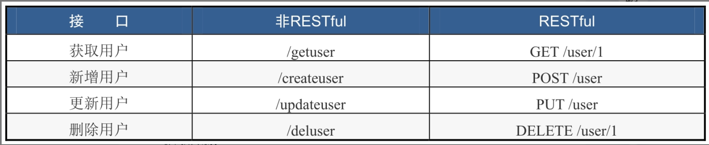

- [Spring Boot官网](https://spring.io/projects/spring-boot)
- [Spring Boot官方文档](https://docs.spring.io/spring-boot/docs/)


```
@RestController = @Controller + @ResponseBody 
@RequestMapping
@SpringBootApplication = @SpringBootConfiguration + @EnableAutoConfiguration + @ComponentScan()
	
        
    
```


```xml

<build>
	<plugins>
		<plugin>
			<groupId>org.springframework.boot</groupId>
			<artifactId>spring-boot-maven-plugin</artifactId>
		</plugin>
	</plugins>
</build>

    <!-- 声明了SpringBoot2.3.4版本中其他常用组件的版本号  -->
    <parent>
        <groupId>org.springframework.boot</groupId>
        <artifactId>spring-boot-starter-parent</artifactId>
        <version>2.3.4.RELEASE</version>
    </parent>
    
    <dependencies>
        <dependency>
            <groupId>org.springframework.boot</groupId>
            <artifactId>spring-boot-starter-web</artifactId>
        </dependency>
    <dependencies>        
```


spring-boot-starter-*：官方提供的starter

thirdpartyproject-spring-boot-starter：第三方提供的starter


Starters是一组方便的依赖描述。你可以将其添加到你的应用中，将会得到Spring及相关技术的一站式服务，使你不必再将那些样板代码进行反复的复制、粘贴操作。


在pom.xml文件中，右击鼠标点击diagrams 展示依赖树


Spring Boot 相比 Spring 做了以下改进：

🚀 简化配置：Spring Boot 通过自动配置、Starter 等方式，极大地简化了应用的配置工作，开箱即用，减少了开发人员的工作量。

🔌 内嵌服务器：Spring Boot 集成了 Tomcat、Jetty 等服务器，可以方便地开发和部署 Web 应用程序。

🧩 Starter 依赖：Spring Boot 提供了 Starter 依赖，可以轻松地集成常用的第三方库，减少了开发人员的工作量。

🔧 自动配置：Spring Boot 根据应用程序的依赖关系和配置文件，自动配置 Spring 环境，使得应用程序的搭建和部署更加方便和快速。

💻 Actuator：Spring Boot 提供了 Actuator，可以实现对应用程序的监控和管理，包括健康检查、监控指标、追踪等。

👨‍💼 生态系统：Spring Boot 生态系统非常丰富，包括 Spring Cloud、Spring Security 等，提供了更多的功能和支持。

Spring Boot 通过自动配置、Starter 依赖、内嵌服务器等方式，极大地简化了应用程序的开发和部署，提高了开发效率和运行效率。同时，Spring Boot 的生态系统也非常丰富，为应用程序的开发和部署提供了更多的功能和支持。


Spring Boot 是一个基于 Spring 框架的开源框架，它简化了 Spring应用程序的构建和部署过程。Spring Boot减少了大量配置，提供了**自动配置**和**约定优于配置**的原则

 自动配置：
 独立运行：Spring Boot应用程序可以独立运行，不需要外部容器支持。它内嵌了Tomcat、Jetty、Undertow等Web容器，可以通过运行一个可执行的JAR文件来启动应用程序，使得部署和运行变得非常简单。
 约定优于配置：Spring Boot采用约定优于配置的方式来配置应用程序，**即通过默认的配置和约定，来避免开发者手动配置所带来的繁琐和错误**。例如，Spring Boot默认会扫描应用程序的类路径，自动加载并配置所依赖的各种组件。
 组件化：Spring Boot将应用程序分解成若干个组件，每个组件都可以独立开发、测试和部署，具有良好的复用性和可维护性。组件化的设计也使得Spring Boot应用程序具有良好的可扩展性和可定制性。
 面向生产环境：Spring Boot设计之初就考虑了应用程序在生产环境下的部署和运行。它提供了丰富的健康检查、监控、日志记录等功能，可以帮助开发者快速定位和解决问题。

 综上所述，Spring Boot通过自动配置、独立运行、约定优于配置、组件化和面向生产环境等特性，大大简化了Spring应用程序的开发和部署，提高了开发效率和运行效率。


5. 说说 SpringBoot 的自动装配流程？
    Spring Boot 的自动装配流程：

🔎 1. Spring Boot 会根据类路径下的 META-INF/spring.factories 文件加载需要自动装配的配置类。

🧩 2. 自动配置类通常使用 @Conditional 注解，通过条件判断来决定是否需要装配。

💡 3. 自动配置类中包含了对应用程序的默认配置和 Bean 的定义。

🔄 4. 自动配置类会通过 @Import 注解导入其他需要的配置类。

🔧 5. 在装配时，Spring Boot 会根据应用程序的配置文件和属性文件，覆盖默认配置，实现个性化配置。


**SpringBoot** 

- 基于Spring框架搭建起来的应用，
- 内嵌Tomcat等服务器，不需要传统的war包进行部署；
- 通过Maven管理依赖starter，starter可以直接获取开发所需的相关包
- 默认配置了其他常用框架
- 基于注解开发


### YAML

相对于properties配置文件，YAML具有各个配置项之间的层级关系

基本规则

- 大小写敏感
- 使用空格缩进表示层级关系· 对缩进的空格数目没有要求，只要同级元素左侧对齐即可
- 使用＃注释，只有行注释，没有块注释· key与value用（英文冒号）加上空格来分割


基本组件YAML的基本组件主要有两种。

- 对象（映射/字典）
- 数组（列表）对象：


```yaml
# 对象
person:
	name: John
	age: 33
# 数组
- apple
- banana

# 数据类型
## 字符串
string: hello
## 数值（整数，浮点）
number: 123
## 布尔值
boolean: true
## null 值
null: ~
## 日期/时间
date: 2024-0203

```

### Spring MVC 常用注解

请求：请求方式, 请求路径，请求参数

响应：响应格式

Get请求：@RequestMapping

- 请求方式与请求路径：GetMapping

  > @GetMapping=@RequestMapping(method=RequestMethod.GET)

- 请求参数获取
  - 从请求中获取：@RequestParam
  - 从请求路径上获取： @PathVariable


Post请求：

- 请求方式与路径路由：@PostMapping

  > @PostMapping=@RequestMapping(method=RequestMethod.POST)

- 请求参数获取：@RequestBody


响应：

- 响应格式：@ResponseBody

  > @RestController=@Controller+@ResponseBody


@Controller：修饰类，是个

@RequestMapping：修饰类或方法，设置接口的访问路径。在修饰类时，一般用于设置该类下所有接口路径的前缀。

@RequestParam用来修饰参数，可以根据名字与参数进行绑定，相当于ServletRequest.getParameter()。

@RequestBody用来修饰参数，接收JSON格式的参数，经常应用于AJAX请求，前/后端分离的场景下。

@ResponseBody用来修饰类或方法。在修饰方法时，该方法以JSON格式返回数据；在修饰类时，该类下的所有方法默认都以JSON格式返回数据。

@PathVariable用来修饰参数，用于获取URL上的值。


handle: 标注了@RequestMapping的方法


 Spring MVC核心组件DispatcherServlet及处理请求的七步流程

 Spring MVC的3个核心对象：Handler、HandlerMapping和HandlerAdapter


REST Representational State Transfer

RESTful风格的API要满足以下要求：

· 用URI定位资源

· URI由名词组成

· 使用HTTP方法操作资源




JDBC（Java Database Connectivity） MyBatis（基于JDBC的轻量级持久层框架，前身是iBatis）


JPA（Java Persistence API）规范 Hibernate

Hibernate更关注实体，而MyBatis则更关注表。Hibernate对数据库的操作封装得极好，几乎完全屏蔽了不同数据库之间的差异，如果需要进行数据库迁移，也毫不费力。MyBatis则更加灵活多变，对于SQL优化更加友好


MyBatis Plus（简称MP）是一个MyBatis的增强工具


事务：

1. REQUIRES_NEW：新建事务，如果当前存在事务，就把当前事务挂起
2. REQUIRED：如果当前没有事务，新建一个事务；如果有，则加入当前事务
3. NESTED：保存点


Service层的单元测试不能依赖Dao层

@Mock

@InjectMocks

```
@SpringBootTest
class UserServiceImplTest {

    @InjectMocks
    UserServiceImpl userService;

    @Mock
    UserMapper userMapper;

    @Test
    @DisplayName("Test Service getById")
    void getById() {
        Mockito.when(userMapper.selectById(1)).thenReturn(new User().setName("刘水镜").setEmail("liushuijing@mail.com"));
        User user = userService.getById(1);
        Assertions.assertEquals("刘水镜", user.getName());
    }
}
```

```
<dependency>
    <groupId>org.springframework.boot</groupId>
    <artifactId>spring-boot-starter-test</artifactId>
    <scope>test</scope>
</dependency>
```

URI全小写

方法名驼峰

自动配置：Auto-Configuration

自动装配：Autowire


自动配置：通过Maven将Spring Boot Starter依赖引入来实现，Starter依赖包含了应用程序所需要的各种组件和配置信息。当应用程序引入spring-boot-starter-web依赖时，Spring Boot会自动配置Web应用程序所需的组件，包括Tomcat服务器、Spring MVC框架、Jackson JSON处理库等等


SpringBoot应用启动时通过@SpringBootApplication中的@EnableAutoConfiguration中的@Import({AutoConfigurationImportSelector.class})，AutoConfigurationImportSelector中的List<String> configurations = SpringFactoriesLoader.loadFactoryNames(this.getSpringFactoriesLoaderFactoryClass(), this.getBeanClassLoader());

SpringFactorisLoader中的找到jar包下的"META-INF/spring.factories"的配置


在jar包中的spring.factories中，@EnableConfigurationProperties({HttpProperties.class}) ，将配置注入到Ioc容器中，@ConfigurationProperties将配置文件Properties中的属性绑定到类中的成员变量上，@Bean 从配置文件Properties获取变量


配置文件-----@Bean获取对应的值----->@ConfigurationProperties将值绑定到类中变量 ----> @EnableConfigurationProperties将key-value注入到Ioc容器中

组件（对应的类）


- @SpringBootApplication: 

  -- Spring Boot应用标注在某个类上说明这个类是SpringBoot的主配置类，SpringBoot就应该运行这个类的main方法来启动SpringBoot应用； 

  - @SpringBootConfiguration:

    -- 标注在某个类上，表示这是一个Spring Boot的配置类； 

  - @EnableAutoConfiguration：

    -- 开启自动配置功能；以前我们需要配置的东西，Spring Boot帮我们自动配置；@EnableAutoConfiguration告诉SpringBoot开启自动配置功能；这样自动配置才能生效； 

    - @AutoConfigurationPackage：自动配置包 

    - @Import({AutoConfigurationImportSelector.class})

      -- EnableAutoConfigurationImportSelector：导入哪些组件的选择器；将所有需要导入的组件以全类名的方式返回；这些组件就会被添加到容器中；会给容器中导入非常多的自动配置类（xxxAutoConfiguration）；就是给容器中导入这个场景需要的所有组件，并配置好这些组件； 


- @ConfigurationProperties：告诉SpringBoot将本类中的所有属性和配置文件中相关的配置进行绑定；

  prefix = "person"：配置文件中哪个下面的所有属性进行一一映射

  @ConfigurationProperties(prefix = "person")默认从全局配置文件中获取值； 

- @Component 

  -- 只有这个组件是容器中的组件，才能容器提供的@ConfigurationProperties功能；

- @PropertySource(value = {"classpath:person.properties"}) ：加载指定的配置文件  同时需要

  @Component @ConfigurationProperties(prefix = "person") 

- @Bean //给容器中添加一个组件，这个组件的某些值需要从properties中获取 

- @Value 使用${......}这样的占位符读取配置在属性文件（src/main/resources/application.properties）的内容 

- 


### @Bean

```java
@Bean注解用于定义一个bean。通过@Bean注解，我们可以将一个方法返回的对象注册为一个Spring应用程序上下文中的bean。
    
@Configuration
public class AppConfig {

    @Bean
    public DataSource dataSource() {
        // create and configure a DataSource object
        return dataSource;
    }

}    

Spring应用程序上下文加载这个配置类时，它会调用这个方法并将其返回值注册为一个名为"dataSource"的bean。之后，我们就可以在应用程序中使用@Autowired注解将这个bean注入到其他的组件中。
    
@Bean注解默认情况下会使用方法名作为bean的名称。如果我们想要指定不同的名称，可以使用value属性或name属性
@Bean("myDataSource")
public DataSource dataSource() {
    // create and configure a DataSource object
    return dataSource;
}    
```

### @Import

@Import注解是一个用于引入其他配置类的注解。它允许我们将其他配置类加载到当前配置类中，从而实现对其他配置类的重用和组合。除了使用@Import注解引入其他的配置类外，还可以使用它来引入其他的普通Java类、XML配置文件等等

```java
@Configuration
@Import({DataSourceConfig.class, SecurityConfig.class})
public class AppConfig {
    // ...
}
```


