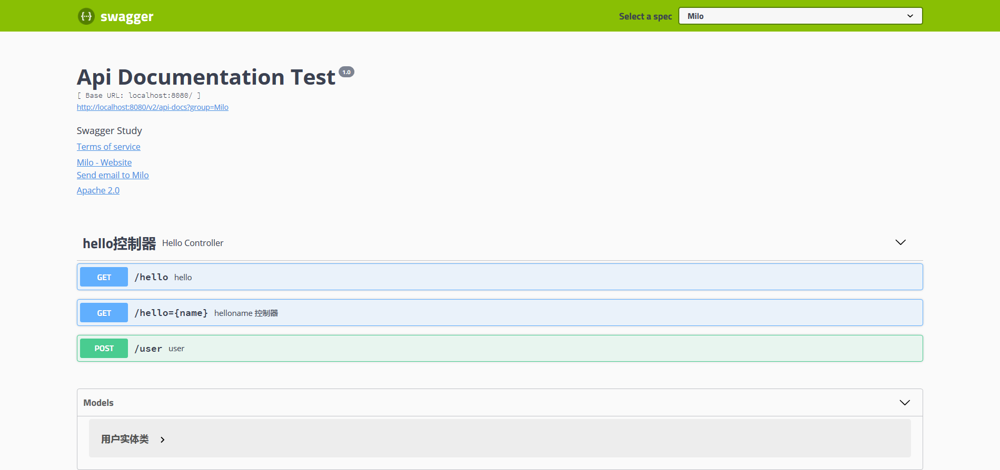

# Swagger

## 1 概述

​        使用Swagger，就是把相关的**信息存储在**它定义的**描述文件**里面（yml或json格式），再通过**维护这个描述文件可以去更新接口文档，以及生成各端代码**。而Springfox-swagger,则可以通过扫描代码去生成这个描述文件，连描述文件都不需要再去维护了。所有的信息，都在代码里面了。代码即接口文档，接口文档即代码

## 2  使用

### 2.1 依赖导入

```xml
        <dependency>
            <groupId>io.springfox</groupId>
            <artifactId>springfox-swagger2</artifactId>
            <version>2.9.2</version>
        </dependency>
        <dependency>
            <groupId>io.springfox</groupId>
            <artifactId>springfox-swagger-ui</artifactId>
            <version>2.9.2</version>
        </dependency>
```

### 2.2 配置基本信息

```java
package com.example.swaggerdemo.config;

import org.springframework.context.annotation.Bean;
import org.springframework.context.annotation.Configuration;
import springfox.documentation.RequestHandler;
import springfox.documentation.builders.PathSelectors;
import springfox.documentation.builders.RequestHandlerSelectors;
import springfox.documentation.service.ApiInfo;
import springfox.documentation.service.Contact;
import springfox.documentation.spi.DocumentationType;
import springfox.documentation.spring.web.plugins.Docket;
import springfox.documentation.swagger2.annotations.EnableSwagger2;

import java.util.ArrayList;

@Configuration
@EnableSwagger2 // 启动Swagger
public class SwaggerConfig {

//    配置多分组group
    @Bean
    public Docket docket1(){
        return new Docket(DocumentationType.SWAGGER_2).groupName("A");
    }

    @Bean
    public Docket docket2(){
        return new Docket(DocumentationType.SWAGGER_2).groupName("B");
    }

    @Bean
    public Docket docket3(){
        return new Docket(DocumentationType.SWAGGER_2).groupName("C");
    }


    // 配置了swagger的Docket的Bean实例
    @Bean
    public Docket docket(){
        return new Docket(DocumentationType.SWAGGER_2)
                .apiInfo(apiInfo()) // 配置ui页面信息
                .enable(true) // 是否开启swagger
                .groupName("Milo")
                .select()
                // RequestHandlerSelectors. 配置要扫描接口的方式
                    // basePackage: 指定扫描包
                    // any(): 扫描全部
                    // none(): 不扫描
                    // withClassAnnotation: 扫描类上的注解， 参数是一个注解的反射对象
                    // withMethodAnnotation: 扫描方法上的注解
                .apis(RequestHandlerSelectors.basePackage("com.example.swaggerdemo.controller"))
                 //  .paths(PathSelectors.ant("/"))  //过滤路径
                .build();
    }

    // 配置Swagger信息apiInfo
    private ApiInfo apiInfo(){

        Contact contact = new Contact("Milo", "localhost", "1111@qq.com");
        return new ApiInfo("Api Documentation Test",
                "Swagger Study",
                "1.0",
                "urn:tos",
                contact,
                "Apache 2.0",
                "http://www.apache.org/licenses/LICENSE-2.0",
                 new ArrayList());

    }
}
```

```java
@Api(tags="hello控制器")
@RestController
public class HelloController {
    @GetMapping("/hello")
    public String hello(){
        return "hello";
    }

    // 只要我们的接口中，返回值为 实体类，就会被扫描到swagger中
    @PostMapping("/user")
    public User user(){
        return new User();
    }

//    @ApiOperation()  在方法上进行注释
    @ApiOperation("helloname 控制器")
    @GetMapping("/hello={name}")
    //@ApiParam() 对参数进行注释
    public String hello(@PathVariable @ApiParam("用户名") String name){
        return "hello "+name;
    }
}
```

访问http://localhost:8080/swagger-ui.html



### 2.3 常用注解

@Api（）用于类：表示标识这个类是swagger的资源

@ApiOperation（）用于方法：表示一个http请求的操作

@ApiParam（）：用于方法，参数，字段说明：表示对参数的添加元数据（说明或是否必填等）

@ApiModel（）用于类：表示对类进行说明，用于参数用实体类接收

@ApiModelProperty（）用于方法，字段：表示对model属性的说明或者是数据操作更改

@ApiIgnore（）用于类，方法，方法参数：表示这个方法或者类被忽略

@ApiImplicitParam（）用于方法：表示单独的请求参数

@ApiImplicitParams（）用于方法，包含多个@ApiImplicitParam

## 3 常用配置

在application.properties中配置常用信息

```java
swagger.title=spring-boot-starter-swagger
swagger.description=Starter for swagger 2.x
swagger.version=1.9.0.RELEASE
swagger.license=Apache License, Version 2.0
swagger.licenseUrl=https://www.apache.org/licenses/LICENSE-2.0.html
swagger.termsOfServiceUrl=https://github.com/dyc87112/spring-boot-starter-swagger
swagger.contact.name=didi
swagger.contact.url=http://blog.didispace.com
swagger.contact.email=dyc87112@qq.com
swagger.base-package=com.didispace
swagger.base-path=/**
```

在SpringBoot启动类上添加注解@EnableSwagger2开启Swaggers

```java
@SpringBootApplication
@EnableSwagger2
public class SwaggerDemoApplication {

    public static void main(String[] args) {
        SpringApplication.run(SwaggerDemoApplication.class, args);
    }

}
```
