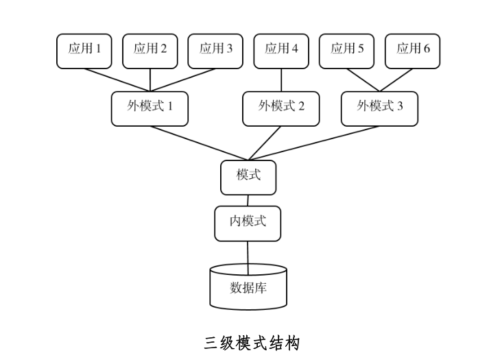

## 数据库基本概念

1. 数据库
2. 数据库管理系统
3. 数据库系统 = 计算机硬件+操作系统+数据库管理系统+数据库+应用程序+用户+数据库开发和管理人员

数据库技术的发展：

1. 人工管理阶段
2. 文件管理阶段
3. 数据库系统阶段

## 数据模型

数据模型要素：数据结构、数据操作、数据完整性约束

两类数据模型：

1. 概念模型：又称为信息模型，对现实世界的概念抽象
2. 逻辑模型和物理模型
   - 逻辑模型：包括网状、层次、关系模型等，概念模型到适应某种DBMS的逻辑模型的转变
   - 物理模型：描述数据的存储方式和方法

概念模型常用术语：

1. 实体
2. 属性
3. 域：属性的取值范围
4. 实体集：所有属性名完全相同的实体集合，如学生实体集
5. 实体型：如职工（职工号，姓名，年龄，部门）就是职工实体集的实体型
6. 码：唯一标识实体的属性集
7. 联系：

关系模型属于：

1. 关系（relation）：表
2. 元组（tuple）：表中的一行
3. 分量：元组中的一个属性值
4. 属性（attribute）：表中的一列
5. 域（domian）：一组具有相同数据类型的值的集合
6. 超码（key）：表中某个属性组，能唯一标识一个元组
7. 候选码：简称码，表中某个属性组，能唯一标识一个元组，且不含有多余的属性
8. 主码：一个关系中又多个候选码，则选取其中一个为主码。每个关系有且只有一个主码
9. 主属性：包含在任何一个候选码中的属性
10. 外码：


关系模式：对关系的描述

> 关系名（属性1， 属性2，... ， 属性n)

数据模型中都有一个 **型（type）**和**值（value）**

> 关系型：（学号，姓名，年龄）
>
> 关系值：（20220419， 小明，18）


**外键：**
$$
F为外键 \\
R(K, F, ...) --> R(K, ...) \\

参照关系 ---> 被参照关系 \\
n : 1
$$

## 三级模式



**模式**（schema) ：也称为逻辑模式，

- 数据库中全体**数据的逻辑结构和特征的描述**，不涉及具体的值，
- 是所有用户的公共视图。
- 一个数据库只有一个模式

**实例**（instance)：**模式的一个具体值**


**外模式：**模式的一个子集，一个模式可以有多个外模式，通常被称为子模式或者用户模式，也可以理解为视图

**内模式：**也称为**存储模式**，

- 定义了数据库中全部数据的物理结构，还定义了数据的存储方式等

- 一个数据库只有一个内模式

## 两级映射

1. 外模式/模式映射，保证了数据和应用程序之间的**逻辑独立性**
2. 模式/内模式映射：定义了全局逻辑结构和物理存储的对应关系，保证了数据和应用程序之间的**物理独立性**

## 关系的完整性

1. 实体完整性
2. 参照完整性：实质是不允许引用不存在的实体
3. 用户自定义的完整性

## 大数据

特征：（4V）

1. 数据量大（Volume）：首要特征
2. 数据类型多（Variety）：
3. 数据价值密度低（Value）
4. 数据处理速度快（Velocity）：

数据采集和预处理

1. ETL（Extract-Transform-Load）用来描述将数据从来源段经过抽取（extract）、转换（transform）、加载（load）至目的端的过程
2. 数据预处理：清洗，填补，平滑，合并，规格化，一致性校验等操作，旨在提高数据质量。主要包含是四部分：数据清洗、数据集成、数据转换、数据规约
   1. 数据清洗
   2. 数据集成
   3. 数据转换
   4. 数据规约

## 云计算

云计算（Cloud Computing）是一种按使用量付费的模式，这种模式提供可用的、便捷的、按需的网络访问，

服务形式有：

1. IaaS（Infrastructure-as-a-Service）基础设施即服务：为客户提供计算机基础设施，包括CPU，内存，网络等
   - 如硬件服务器租用
2. PaaS（Platform-as-a-Service）平台级服务：为客户提供软件开发的平台
   - 如软件的个性化定制开发
3. SaaS（Software-as-a-Service）软件级服务：为客户提供软件服务，用户无需购买软件
   - 如阳光云服务器

## JOIN

### 理论

笛卡尔积
$$
R \quad in \quad k_1 \times n,  \quad S \quad in \quad k_2\times m \\
R \times S \quad in \quad (k_1 \times k_2, n+m)
$$
笛卡尔积: 元组之间的组合, 组合数为各个关系元组数的乘积

连接运算：在笛卡尔积上选取属性间满足一定条件的元组 

- 等值连接：行角度，

- 自然连接：列角度，消除重复属性列，是一种特殊的等值连接

- 外连接：将悬浮元组也保存在结果关系中，而在其他属性上上填空值（NULL)

  > 悬浮元组：在连接运算中不满足条件而被舍弃的元组


象集（images set)
$$
给定关系R(X, Z) \\
Z_x = \{ t[Z]|t \in R, t[X] = x \} \\
Z_x 称为象集 \\
t表示元组，Z为属性组，\\
t[Z]表示一个元组在属性组Z上的属性值，称为分量 \\
它表示R中属性组X上值为x的诸元组在Z上分量的集合 \\
$$


除运算
$$

$$


相关子查询：子查询的查询条件依赖父查询

不相关子查询: 子查询的查询条件不依赖父查询


```sql
select * from table1;
# table1 为元组变量，代表表中的
```

## 实践

### 数据库

```sql
create table `class` (
	`cls_id` int (11),
	`cls_name` varchar (60)
); 
insert into `class` (`cls_id`, `cls_name`) values('1','1班');
insert into `class` (`cls_id`, `cls_name`) values('2','2班');
insert into `class` (`cls_id`, `cls_name`) values('3','3班');

create table `student` (
	`stu_id` int (11),
	`stu_name` varchar (60),
	`cls_id` int (11),
	`gender` varchar (3)
); 
insert into `student` (`stu_id`, `stu_name`, `cls_id`, `gender`) values('1','小明','1','1');
insert into `student` (`stu_id`, `stu_name`, `cls_id`, `gender`) values('2','小红','1','0');
insert into `student` (`stu_id`, `stu_name`, `cls_id`, `gender`) values('3','小兰','4','0');

```

### join

```sql
SELECT * FROM class;

cls_id  cls_name  
------  ----------
     1  1班      
     2  2班      
     3  3班    
          
select * from student;     

stu_id  stu_name  cls_id  gender  
------  --------  ------  --------
     1  小明             1  1       
     2  小红             1  0       
     3  小兰             4  0    
     
-- 笛卡尔积
SELECT * FROM class a, student b;

cls_id  cls_name  stu_id  stu_name  cls_id  gender  
------  --------  ------  --------  ------  --------
     1  1班             1  小明             1  1       
     2  2班             1  小明             1  1       
     3  3班             1  小明             1  1       
     1  1班             2  小红             1  0       
     2  2班             2  小红             1  0       
     3  3班             2  小红             1  0       
     1  1班             3  小兰             4  0       
     2  2班             3  小兰             4  0       
     3  3班             3  小兰             4  0       
     
-- 全外连接, oracle中使用full join
SELECT * FROM class a 
LEFT OUTER JOIN STUDENT b ON a.cls_id=b.cls_id
UNION
SELECT * FROM class a 
RIGHT OUTER JOIN STUDENT b ON a.cls_id=b.cls_id;

cls_id  cls_name  stu_id  stu_name  cls_id  gender  
------  --------  ------  --------  ------  --------
     1  1班             1  小明             1  1       
     1  1班             2  小红             1  0       
     2  2班        (NULL)  (NULL)    (NULL)  (NULL)  
     3  3班        (NULL)  (NULL)    (NULL)  (NULL)  
(NULL)  (NULL)         3  小兰             4  0       


-- 左外连接 left [outer] join
SELECT * FROM class a 
LEFT OUTER JOIN STUDENT b ON a.cls_id=b.cls_id;

cls_id  cls_name  stu_id  stu_name  cls_id  gender  
------  --------  ------  --------  ------  --------
     1  1班             1  小明             1  1       
     1  1班             2  小红             1  0       
     2  2班        (NULL)  (NULL)    (NULL)  (NULL)  
     3  3班        (NULL)  (NULL)    (NULL)  (NULL)  
     
-- 右外连接 left [outer] join
SELECT * FROM class a 
RIGHT OUTER JOIN STUDENT b ON a.cls_id=b.cls_id;     

cls_id  cls_name  stu_id  stu_name  cls_id  gender  
------  --------  ------  --------  ------  --------
     1  1班             1  小明             1  1       
     1  1班             2  小红             1  0       
(NULL)  (NULL)         3  小兰             4  0       


-- 内连接 [inner] join
SELECT * FROM class a
INNER JOIN STUDENT b ON a.cls_id=b.cls_id;

cls_id  cls_name  stu_id  stu_name  cls_id  gender  
------  --------  ------  --------  ------  --------
     1  1班             1  小明             1  1       
     1  1班             2  小红             1  0      
     

```

### join and

- where  在join生成临时表后帅选元组
- join and 在join生成临时表前帅选元组

> 当使用left join, and后 关于主表的帅选无效

```sql
SELECT * FROM class a
LEFT JOIN STUDENT b ON a.cls_id=b.cls_id
WHERE a.cls_id = 1;

cls_id  cls_name  stu_id  stu_name  cls_id  gender  
------  --------  ------  --------  ------  --------
     1  1班             1  小明             1  1       
     1  1班             2  小红             1  0       
     
     
-- 由于使用left join, and后 关于主表的帅选无效
SELECT * FROM class a
LEFT JOIN STUDENT b ON a.cls_id=b.cls_id
AND a.cls_id = 1;

cls_id  cls_name  stu_id  stu_name  cls_id  gender  
------  --------  ------  --------  ------  --------
     1  1班             1  小明             1  1       
     1  1班             2  小红             1  0       
     2  2班        (NULL)  (NULL)    (NULL)  (NULL)  
     3  3班        (NULL)  (NULL)    (NULL)  (NULL)  
     
-- 等价于
SELECT * FROM class a
LEFT JOIN STUDENT b ON a.cls_id=b.cls_id;
cls_id  cls_name  stu_id  stu_name  cls_id  gender  
------  --------  ------  --------  ------  --------
     1  1班             1  小明             1  1       
     1  1班             2  小红             1  0       
     2  2班        (NULL)  (NULL)    (NULL)  (NULL)  
     3  3班        (NULL)  (NULL)    (NULL)  (NULL)  


SELECT * FROM student a
LEFT JOIN class b ON a.cls_id=b.cls_id 
WHERE b.cls_id = 4;     

stu_id  stu_name  cls_id  gender  cls_id  cls_name  
------  --------  ------  ------  ------  ----------    


SELECT * FROM class a
LEFT JOIN STUDENT b ON a.cls_id=b.cls_id 
AND b.`cls_id`=4

cls_id  cls_name  stu_id  stu_name  cls_id  gender  
------  --------  ------  --------  ------  --------
     1  1班        (NULL)  (NULL)    (NULL)  (NULL)  
     2  2班        (NULL)  (NULL)    (NULL)  (NULL)  
     3  3班        (NULL)  (NULL)    (NULL)  (NULL)  
              
SELECT * FROM student a
LEFT JOIN class b ON a.cls_id=b.cls_id 
WHERE b.cls_id = 3;

stu_id  stu_name  cls_id  gender  cls_id  cls_name  
------  --------  ------  ------  ------  ----------
     4  小军             3  0            3  3班       
     
SELECT * FROM class a
LEFT JOIN STUDENT b ON a.cls_id=b.cls_id 
AND b.`cls_id`=3

cls_id  cls_name  stu_id  stu_name  cls_id  gender  
------  --------  ------  --------  ------  --------
     3  3班             4  小军             3  0       
     1  1班        (NULL)  (NULL)    (NULL)  (NULL)  
     2  2班        (NULL)  (NULL)    (NULL)  (NULL)  
```


### 自然连接

`natural join` 不需要指定连接条件, 消除重复属性列，是一种特殊的等值连接

```sql
-- 内连接 [inner] join
SELECT * FROM class a
INNER JOIN STUDENT b ON a.cls_id=b.cls_id;

cls_id  cls_name  stu_id  stu_name  cls_id  gender  
------  --------  ------  --------  ------  --------
     1  1班             1  小明             1  1       
     1  1班             2  小红             1  0      
     
     
-- 自然连接 natural join 不需要指定连接条件
SELECT * FROM class a
NATURAL  JOIN STUDENT b 

cls_id  cls_name  stu_id  stu_name  gender  
------  --------  ------  --------  --------
     1  1班             1  小明        1       
     1  1班             2  小红        0       


-- 左外连接 left [outer] join
SELECT * FROM class a 
LEFT OUTER JOIN STUDENT b ON a.cls_id=b.cls_id;

cls_id  cls_name  stu_id  stu_name  cls_id  gender  
------  --------  ------  --------  ------  --------
     1  1班             1  小明             1  1       
     1  1班             2  小红             1  0       
     2  2班        (NULL)  (NULL)    (NULL)  (NULL)  
     3  3班        (NULL)  (NULL)    (NULL)  (NULL)  

     
-- 左外自然连接 left [outer] join
SELECT * FROM class a 
NATURAL LEFT OUTER JOIN STUDENT b ;

cls_id  cls_name  stu_id  stu_name  gender  
------  --------  ------  --------  --------
     1  1班             1  小明        1       
     1  1班             2  小红        0       
     2  2班        (NULL)  (NULL)    (NULL)  
     3  3班        (NULL)  (NULL)    (NULL)  
```


https://blog.csdn.net/weixin_36979214/article/details/105993194