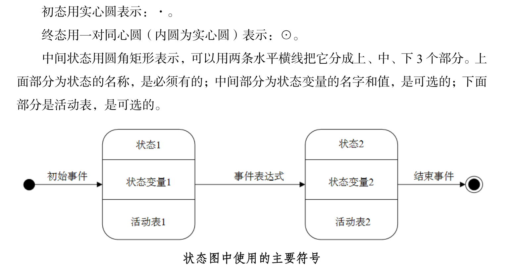

### 小结

软件生命周期 

1. 软件计划（定义）
   - 问题定义——做什么？：
   - 可行性分析——能不能做？：技术，经济，操作，社会可行性

2. 软件开发

   - 需求分析——系统必须做什么，确定系统功能

   - 软件设计
     - 概要设计，总体设计，系统的具体实现方案与软件架构

     - 详细设计：结构化设计

    - 编码

    - 测试：**测试目的**是在软件投入生产前尽可能**发现软件中的错误**

       - 测试步骤：模块测试（单元测试）——>子系统测试——>系统测试（集成测试，组装测试，联合测试）——>验收测试 （确认测试）——> 平行运行
       - 测试方法：黑盒，白盒

3. 软件运行（维护）：在生命周期中所占时间最长、工作量最大

### 软件工程方法学

传统方法学：生命周期学或结构化范型

面向对象方法学：将数据和行为看成是同等重要的

### 软件生命周期

软件生命周期指软件从提出到最终被淘汰的这个存在期，由软件定义，软件开发和软件维护（运行维护）3个时期组成

**软件生命周期 = 软件定义 + 软件开发 + 软件维护**

#### 软件定义

又称为系统分析，分为如下3个阶段

1. 问题定义：解决什么问题

2. 可行性研究：对于问题是由有行得通的解决办法

3. 需求分析：为了解决问题必须做什么，确定系统具备哪些功能

#### 软件开发

1. 总体设计（概要设计）：应该怎样实现目标系统
2. 详细设计
3. 程序设计：编码和单元测试
4. 综合测试

#### 软件维护

使系统持久地满足用户需求

### 软件过程

软件需求到软件产品的过程

过程模型（生命周期模型）

1. 瀑布模型：线型模型，不适应用户需求的变化
2. 快速原型模型：适合需求不明确
3. 增量模型：把软件产品作为一系列的增量构件来设计

### 可行性分析

可行性分析：做还是不做而非如何去做

1. **技术**可行性
2. **经济**可行性
3. **操作**可行性：运行方式、操作规程在用户组织内是否可以有效
4. **社会**可行性：系统是否得到社会认可

>系统流程图是描述物理系统的工具

>物理系统，就是一个具体实现的系统。一个系统可以包含人员、硬件、软件等多个子系统。

>程序流程图表示对信息进行加工处理的控制过程，而系统流程图表达的是信息在系统各部件之间流动情况。

### 需求分析

需求分析：系统必须做什么，**软件需求规格说明书**（Software Requirement Specification， SRS）是需求分析阶段的最终成果，其作用包括：

1. 便于用户，开发人员进行理解和交流
2. 反映出用户问题的结构，可以作为软件开发工作的基础和依据
3. 作为确认测试和验收的依据

**数据流图：**描绘信息流和数据从输入移动到输出的过程

**数据字典：**数据流图中所有元素的定义的集合

实体联系图，控制流图，用例图，类对象关系及其行为图

状态转换图：

- 状态：初始状态 、最终状态、中间状态

- 事件

- 符号

  

### 总体设计

设计过程：总体设计由两个主要的阶段组成

1. 系统设计阶段：确定系统的具体实现方案
2. 结构设计阶段：确定软件结构

设计原理

1. 模块化

2. 抽象

3. 逐步求精

4. 信息隐藏和局部化

5. 模块独立

   - 耦合：尽量使用数据耦合，少用控制耦合和特征耦合，限制公共环境耦合，完全不用内容耦合
     - 无直接耦合
     - 数据耦合：传递变量
     - 控制耦合：模块间传递控制信息
     - 特征耦合：传递冗余的数据
     - 公共环境耦合
     - 内容耦合：一个模块有多个入口

   - 内聚：
     - 逻辑内聚
     - 时间内聚
     - 过程内聚
     - 通信内聚
     - 顺序内聚
     - 功能内聚

面向数据流的设计方法：又称为结构化设计方法，把信息流映射成软件结构

信息流分类

- 变换流：具有明显的输入、变换和输出界面的数据流
- 事务流：有事务中心，由事务中心根据输入数据的类型选取一条活动通路

### 详细设计

又称为结构化设计，以数据流DFD为基础，自顶向下、逐步求精和模块化的过程

工具有

- 程序流程图
- 盒图（N-S）
- PAD图：问题分析图（Problem Analysis Diagram）

面向数据结构的设计方法工具有

- JACKSON图

### 实现

编码和测试统称为实现

测试方法：

- 黑盒测试：又称为功能测试，测试用列主要依据程序外部功能
- 白盒测试：又称为结构测试

测试步骤：

模块构成子系统，子系统构成系统

1. **模块测试**（**单元测试**）：往往发现编码和详细设计的错误
2. **子系统测试**：
3. **系统测试（集成测试，组装测试，联合测试）**：着重测试模块间的接口
   - 非渐增式测试方法：
   - 渐增式测试方法：把下一个要测试的模块同已经测试好的哪些模块结合起来测试
4. **验收测试（确认测试，UAT）**：用户参与
5. 平行运行（并行）：同时运行新开发的系统和将被它取代的旧系统

集成测试：子系统测试和系统测试，都皆有检测和组装两重含义，通常称为集成测试

软件测试版本：

1. alpha: 内测
2. Beta：外部测试
3. Full Version：正式发售的版本
4. Upgrade：升级版

### 维护

维护类型：

1. 改正性维护：修复bug
2. 适应性维护：适应信息技术变化和管理需求变化而进行的修改
3. 完善性维护：**增加**在系统分析和设计阶段**没有规定的功能**与性能特征
4. 预防性维护：适应未来的软硬件环境的变化
5. 软件维护的副作用：因修改软件而造成的错误
   - 编码副作用：修改代码产生的副作用
   - 数据副作用：修改数据的副作用
   - 文档副作用：