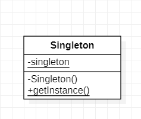

# 设计模式

UML：https://www.omg.org/uml/

箭头方向：知道对方的信息时才能指向对方，

子类继承，扩展了父类，子类指向父类


```java
// composition 组合 实心菱形 part of, 关系更强
// Engine的生命周期是与Car一致的
public class Engine{
    
}

public class Car{
    Engine e = new Engine();
}

// aggregation 聚合 空心菱形 has a 关系一般
// Address，它是在Person之外创建的，所以即使Person被回收了，Address也不一定马上也会回收
public class Address{
    
}
public class Person{
    private Address address;
    public Person(Address address){
		this.address = address;
    }
}
```


## Iterator--一个一个遍历

### 

### 角色

- Iterator(迭代器)：负责定义按顺序逐个遍历元素的接口（API）
- Concretelterator(迭代器的实现类)
- Aggregate(集合)
- ConcreateAggregate


## Adapter--代码复用

Adapter模式会对现有的类进行适配，生成新的类，也成为Wrapper模式

> 不修改已有的代码，扩展功能

Adapter模式有以下两种

- 类适配器模式（使用继承的适配器）
- 对象适配器模式（使用委托的适配器）

### 类适配器模式


PrintBanner 为适配器，使Banner能够适用于Print

```java
public class Banner {
    private String string;

    public Banner(String string){
        this.string = string;
    }

    public void showWithParen(){
        System.out.println("("+string+")");
    }

    public void showWithAster(){
        System.out.println("*"+string+"*");
    }
}

public interface Print {
    public abstract void printWeak();

    public abstract void printStrong();
}

    super(string);
    }

    @Override
    public void printWeak() {
        showWithParen();
    }

    @Override
    public void printStrong() {
        showWithAster();
    }
}


public class Main {
    public static void main(String[] args) {
        Print p = new PrintBanner("Hello");
        p.printWeak();
        p.printStrong();
        // (Hello)
		// *Hello*
    }
}
```

### 对象适配器模式

```java
```

### 角色

Target: 目标，所要实现的功能 Print

Clinet: 请求者 Main

Adaptee：被适配者 Banner

Adapter: 适配者


## Template--将具体处理交给子类

Template Method: 在父类中定义处理流程的框架，在子类中实现具体处理

### 角色

AbstractClass(抽象类)

ConcreateClass(具体类)

### 类的层次与抽象类

站在之类的角度

- 在之类中可以使用父类中定义的方法
- 可以通过在子类中增加方法以实现新的功能
- 在之类中重写父类的方法可以改变程序的行为

站在父类的角度，在父类中声明抽象方法

- 期待子类去实现抽象方法
- 要求之类去实现抽象方法

## Factory Method--将实例的生成交给子类

用Template Method来构建生成实例的工厂


### 生成实例

- 指定抽象方法

  ```java
  abstract class Factory{
  	public abstract Product createProduct(String name);
  }
  ```

- 为其实现默认处理

  ```java
  class Factory{
  	public  Product createProduct(String name){
          return new Product(name);
      }
  
  }
  ```

- 在其中抛出异常

  ```java
  class Factory{
  	public  Product createProduct(String name){
          throw new FactoryMethodRuntimeException();
      }
  }
  // 如果未在子类中实现该方法，程序报错
  ```

## Singleton--只有一个实例

Singleton类只会生成一个实例。



```java
public class Singleton {
    private static Singleton singleton = new Singleton();
    private Singleton(){
        System.out.println("生成了一个实例");
    }

    public static Singleton getSingleton() {
        return singleton;
    }
}

public class Main {
    public static void main(String[] args) {
        System.out.println("Begin");
        Singleton obj1 = Singleton.getSingleton();
        Singleton obj2 = Singleton.getSingleton();
        if(obj1 == obj2){
            System.out.println("obj1 == obj2");
        }else {
            System.out.println("obj1 <> obj2");
        }
        System.out.println("End.");
    }
}
```

1. 定义static修饰的成员变量singleton，并将其初始化为Singleton类的实例。初始化行为仅在类被加载的时候进行一次
2. Singleton类的构造函数为private，禁止从Singleton类外部调用构造函数


### Builder--组装复杂的实例

