# 设计模式

设计模式的作用就是帮助我们**编写可复用的类，减少代码的书写量**

不要只使用具体类来编程，**优先使用抽象类和接口来编程**，从而弱化类之间的耦合，进而使得类更加容易作为组件而被再次使用

通过**定义接口来表明我只使用接口中的方法**，但是可以通过强制类型转换来使用实现类中的方法

```java
List list = new ArrayList();

((ArrayList)list).MethodOnlyInArrayList
```

优先使用委托，增加耦合性，继承与委托，前者使用父类方法，后者将其他类进行聚合,

构造函数不能被继承，只能使用super()

UML：https://www.omg.org/uml/

## 1 Iterator -- 一个一个遍历

用于在数据集合中按照顺序遍历集合

1. **迭代器**需要迭代集合中的元素，所以**要聚合要迭代的集合**
2. 迭代器可以拥有多个（向前迭代等）
3. 不需要 deleteIterator

### 1.1 角色

- Iterator(迭代器)：负责定义按顺序逐个遍历元素的接口（API）
- Concretelterator(迭代器的实现类)
- Aggregate(集合)：表示拥有迭代器的集合
- ConcreateAggregate：具体的迭代器实现


### 1.2 相关设计模式

- Visitor：在元素遍历时进行处理
- Factory Method：在生成Iterator的实例时可能会使用Factory Method


## 2 Adapter -- 代码复用

Adapter模式会对现有的类进行适配，生成新的类，也成为Wrapper模式

1. 不修改已有的代码，扩展功能
2. 通过现有的方法（充分测试过的方法）构造自己的方法群，减少通过自己写新的方法而产生新的的Bug

Adapter模式有以下两种

- 类适配器模式（使用继承的适配器）

  ```java
   public Adatper extends Adaptee implements Target
  ```

- 对象适配器模式（使用委托的适配器）

  ```java
   public Adatper {
       private Adaptee adaptee
   }
  ```

  

### 2.1 角色

Target: 目标，所要实现的功能 Print

Clinet: 请求者 Main

Adaptee：被适配者 

Adapter: 适配者


### 2.2 Core Code

```java
// 继承
public class PrintBanner extends Banner implements Print{
    public PrintBanner(String string){
        super(string);
    }

    @Override
    public void printWeak() {
        showWithParen();
    }

    @Override
    public void printStrong() {
        showWithAster();
    }
}


// 委托
public class PrintBanner extends Print{
    private Banner banner;

    public PrintBanner(String string){
        this.banner = new Banner(string);
    }

    @Override
    public void printWeak() {
        banner.showWithParen();
    }

    @Override
    public void printStrong() {
        banner.showWithAster();
    }
}
```

### 2.3 相关设计模式

- Bridge: Adapter 用于连接接口（API）不同的类，而Bridge模式用于连接类的功能层次结构于实现层次结构
- Decorator: Adapter 用于填补不同接口API之间的缝隙，而Decorator则是在不改变接口API的前提下增加功能

## 3 Template Method -- 将具体处理交给子类

Template Method: 在**父类**中定义**处理流程**的框架（算法），在**子类中实现具体处理**

只能使用抽象类，不能使用接口，接口中无法实现方法

通过final修饰父类的流程方法，防止子类修改父类的处理流程

### 3.1 角色

- AbstractClass(抽象类):：负责实现模板方法，负责声明在模板方法中所使用到的抽象方法，这些抽象方法由子类ConcreateClass实现
- ConcreateClass(具体类)：负责实现父类AbstractClass中定义的抽象方法

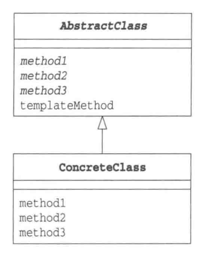

### 3.2 Core Code

```java
public abstract class AbstractDisplay {
    public abstract void open();
    public abstract void print();
    public abstract void close();
    public final void display(){
        open();
        for (int i=0; i<5; i++){
            print();
        }
        close();
    }
}
```

### 3.3 相关设计模式

- Factory Method：将Template Method模式用于生成实例
- Strategy：在Template Method中，可以使用继承改变程序的行为，而Strategy使用委托改变程序的行为，前者改变部分程序，而后者用于替换整个算法

### 3.4 类的层次与抽象类

站在子类的角度

- 在子类中可以使用父类中定义的方法
- 可以通过在子类中增加方法以实现新的功能
- 在子类中重写父类的方法可以改变程序的行为

站在父类的角度，在父类中声明抽象方法

- 期待子类去实现抽象方法
- 要求子类去实现抽象方法

## 4 Factory Method -- 将实例的生成交给子类

用Template Method来构建生成实例的工厂，父类决定实例的生成方式，子类负责生成实例

使框架与具体加工分离，即实例生成的流程顺序和具体的实例生成方法隔离

### 4.1 角色

- Product: 抽象类产品，定义了在 Factory Method中生成的那些实例所持有的接口，具体的实现由子类ConcreteProduct决定

- Creator: 创建者，Creator 对ConcreteCreator一无所知，只要调用Product 角色和生成实例的方法。

  不用new 关键字来生成实例，而是调用生成实例的专用方法来生成实例，防止父类与其他具体类耦合。

- ConcreteProduct: 具体的产品

- ConcreteCreator: 具体的创建者，负责生成具体的产品

  

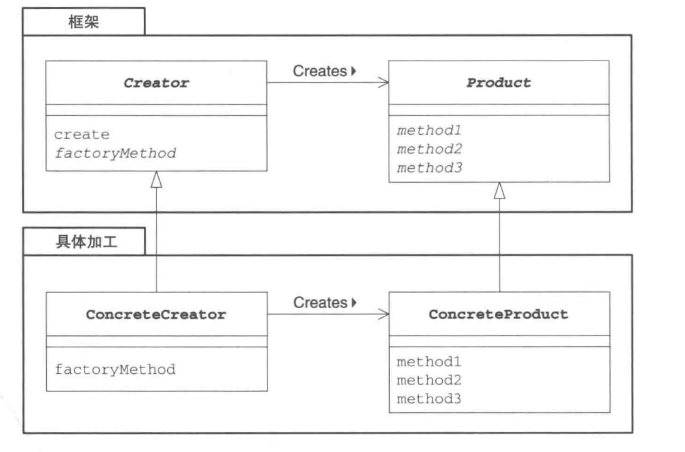

### 4.2 Core Code 

```java
package milo.Factory;

public abstract class Factory {
    public final Product create(String owner){
        Product p = createProduct(owner);
        registerProduct(p);
        return p;
    }
    // 通过使用抽象类Product使框架和加工隔离,即实例生成的流程顺序和具体的实例生成方法隔离
    protected abstract Product createProduct(String owner);
    protected abstract void registerProduct(Product product);
}

package milo.Factory;

public abstract class Product {
    ...
}
// --------------------------------------------------
package milo.idcard

public class IDCard extends Product {
    private String owner;
	// 只能在本包中使用，隐性强制使用Factory来生成实例
    IDCard(String owner){
        System.out.println("制作"+owner+"的ID卡");
        this.owner = owner;
    }
```

### 4.3 Creator 生成实例的方法

- 指定抽象方法

  ```java
  abstract class Factory{
  	public abstract Product createProduct(String name);
      ...
  }
  ```

- 为其实现默认处理，不推荐

  ```java
  class Factory{
  	public  Product createProduct(String name){
          return new Product(name);
      }
  
  }
  ```

- 在其中抛出异常

  如果未在子类总实现该方法，报错
  
  ```java
  class Factory{
  	public  Product createProduct(String name){
          throw new FactoryMethodRuntimeException();
      }
  }
  // 如果未在子类中实现该方法，程序报错
  ```

### 4.4 相关的设计模式

- Template Method：抽象工厂中生成实例的方法就是一个 Template Method
- Singleton 模式：可以将Singleton 模式用于扮演 Creator 或 ConcreteCreator，因为再程序中没必要存在多个Creator角色
- Composite模式：将 Composite 用于 Product 角色或（ConcreteProduct）

- Iterator 模式：生成 Interator 的实例时可以使用Factory Method

## 5 Singleton--只有一个实例

**Singleton类只会生成一个实例。** =  私有构造器 + 静态方法获取实例

1. 定义**static**修饰的成员变量singleton，并将其初始化为Singleton类的实例。初始化行为仅在**类被加载**的时候进行一次
2. Singleton类的构造函数为private，禁止从Singleton类外部调用构造函数


### 5.1 角色


### 5.2 Core Code 

```java
public class Singleton {
    private static Singleton singleton = new Singleton();
    private Singleton(){
        System.out.println("生成了一个实例");
    }

    public static Singleton getSingleton() {
        return singleton;
    }
}

public class Main {
    public static void main(String[] args) {
        System.out.println("Begin");
        Singleton obj1 = Singleton.getSingleton();
        Singleton obj2 = Singleton.getSingleton();
        if(obj1 == obj2){
            System.out.println("obj1 == obj2");
        }else {
            System.out.println("obj1 <> obj2");
        }
        System.out.println("End.");
    }
}
```

### 5.3 相关设计模式

多数情况下，以下模式只需要一个实例：

- AbstractFactroy
- Builder
- Facade
- Prototype


## 6 Prototype--通过复制生成实例

通常我们使用new关键字指定类名来生成实列，但是也有**不指定类名来生成实列**。如下述情况

1. **对象种类繁多，无法将它们整合到一个类中**

2. 难以根据类生成实列，**生成实列的过程太过复杂**

3. **解耦框架与生成的实例**，与Factory method相似

   > 想要让生成实例的框架不依赖于具体的类，先“注册”一个“原型”实例，然后通过复制该实例来生成新的实例。

### 6.1 角色

- Prototype 原型：负责定义复制实例的方法接口
- ConcretePrototype：实现Prototype 接口，编写具体的clone方法
- Client 使用者

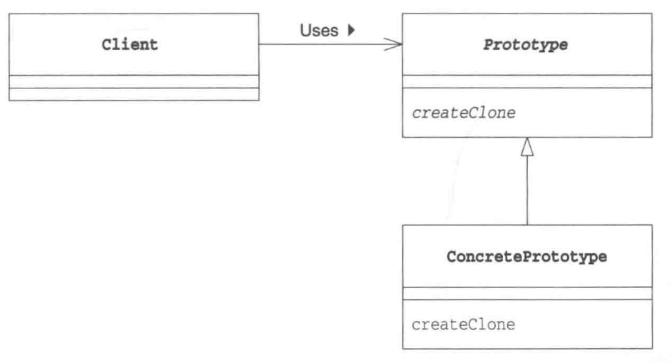

### 6.2 Core Code

- Product 和 Manager位于 framwork包下
- Product  定义了复制功能，Manager **依赖**于 Product 接口来实现复制实例

```java
package framwork;

public interface Product extends Cloneable{
    public abstract void use(String s);
    public abstract Product createClone();
}

package framwork;

public class Manager {
    // showcase定义为private，且该类没有访问该属性的方法
    private HashMap showcase = new HashMap();
    public void register(String name, Product product){
        showcase.put(name, product);
    }

    public Product create(String protoname){
        Product p = (Product) showcase.get(protoname);
        return p.createClone();
    }
}
// -----------------------------------------------------------
package prototype;

public class MessageBox implements Product {

    @Override     // 产品功能
    public void use(String s) {
		...
    }

    @Override  
    public Product createClone() {
        Product p = null;
        try {
            p = (Product)clone();
        }catch (CloneNotSupportedException e){
            e.printStackTrace();
        }
        return p;
    }
}

```

### 6.3 相关设计模式 

- Flyweight: Prototype 可以生成一个与当前实例完全相同的实例，而Flyweght模式可以再不同的地方使用同一个实例

  > Prototype 中的 HashMap 对外没有开放，而Flyweight对外开放

- Memento 模式可以保存当前实例的状态，以实现快照和撤销功能

- Composite 以及 Decorator: 在使用这两种模式时，需要动态地创建复制实例，可以使用Prototype

### 6.4 clone


```
clone方法定义在java.lang.Object中,浅复用，只能对字段进行复制，如果字段中保存的是对象或数组，则需要重写clone方法
Cloneable接口中没有声明任何方法，只是用来标记。称为标记接口
```

## 7 Builder -- 组装复杂的实例

组装复杂结构的实例

### 7.1 角色

- Client(使用者): 使用Builder
- Director(监工): 负责使用Builder来生成实例。它并不依赖于ConcreteBuilder, 只调用Builder角色中被定义的方法

- Builder(建造者)：负责定义用于生成实例的接口。Builder中准备了用于生成实例的方法
- ConcreteBuilder: Builder的实现类

**可替换性：一个类不知道知道调用的是哪个子类**。

>  Client只知道Director 但是不知道Builder；Director 知道Builder，但是不知道具体是哪一个Builder。这种不可见性实现模块之间的解耦，增加了模块的可复用性


### 7.2 Core Code

```java
public abstract class Builder {
    public abstract void makeTitle(String title);
    public abstract void makeString(String str);
    public abstract void makeItems(String[] items);
    public abstract void close();
}

public class Director {
    private Builder builder;
    public Director(Builder builder){
        this.builder = builder;
    }

    public void construct(){
        builder.makeTitle("Greeting");
        builder.makeString("从早上至下午");
        builder.makeItems(new String[]{
                "早上好。",
                "下午好。"
        });
        builder.makeString("晚上");
        builder.makeItems(new String[]{
                "晚上好。",
                "晚安。",
                "再见"
        });
        builder.close();
    }
}

public class TextBuilder extends Builder {
    private StringBuffer buffer = new StringBuffer();           // 文档内容保存在该字段中
    public void makeTitle(String title) {                       // 纯文本的标题
        buffer.append("==============================\n");      // 装饰线
        buffer.append("『" + title + "』\n");                   // 为标题添加『』
        buffer.append("\n");                                    // 换行
    }
    public void makeString(String str) {                        // 纯文本的字符串
        buffer.append('■' + str + "\n");                       // 为字符串添加■
        buffer.append("\n");                                    // 换行
    }
    public void makeItems(String[] items) {                     // 纯文本的条目
        for (int i = 0; i < items.length; i++) {
            buffer.append("　・" + items[i] + "\n");            // 为条目添加・
        }
        buffer.append("\n");                                    // 换行
    }
    public void close() {                                       // 完成文档
        buffer.append("==============================\n");      // 装饰线
    }
    public String getResult() {                                 // 完成的文档
        return buffer.toString();                               // 将StringBuffer变换为String
    }
}

public class HTMLBuilder extends Builder{
    private String filename;                                                        // 文件名
    private PrintWriter writer;                                                     // 用于编写文件的PrintWriter
    public void makeTitle(String title) {                                           // HTML文件的标题
        filename = title + ".html";                                                 // 将标题作为文件名
        try {
            writer = new PrintWriter(new FileWriter(filename));                     // 生成 PrintWriter
        } catch (IOException e) {
            e.printStackTrace();
        }
        writer.println("<html><head><title>" + title + "</title></head><body>");    // 输出标题
        writer.println("<h1>" + title + "</h1>");
    }
    public void makeString(String str) {                                            // HTML文件中的字符串
        writer.println("<p>" + str + "</p>");                                       // 用<p>标签输出
    }
    public void makeItems(String[] items) {                                         // HTML文件中的条目
        writer.println("<ul>");                                                     // 用<ul>和<li>输出
        for (int i = 0; i < items.length; i++) {
            writer.println("<li>" + items[i] + "</li>");
        }
        writer.println("</ul>");
    }
    public void close() {                                                           // 完成文档
        writer.println("</body></html>");                                           // 关闭标签
        writer.close();                                                             // 关闭文件
    }
    public String getResult() {                                                     // 编写完成的文档
        return filename;                                                            // 返回文件名
    }
}

public class Main {
    public static void main(String[] argsArr) {
        String args = "plain";

//        if (args.length != 1) {
//            usage();
//            System.exit(0);
//        }
        if (args.equals("plain")) {
            TextBuilder textbuilder = new TextBuilder();
            Director director = new Director(textbuilder);
            director.construct();
            String result = textbuilder.getResult();
            System.out.println(result);
        } else if (args.equals("html")) {
            HTMLBuilder htmlbuilder = new HTMLBuilder();
            Director director = new Director(htmlbuilder);
            director.construct();
            String filename = htmlbuilder.getResult();
            System.out.println(filename + "文件编写完成。");
        } else {
            usage();
            System.exit(0);
        }
    }
    public static void usage() {
        System.out.println("Usage: java Main plain      编写纯文本文档");
        System.out.println("Usage: java Main html       编写HTML文档");
    }
}
```

### 7.3 相关设计模式

- Template Method：

  - 在Builder模式中，Director角色控制builder
  - 而在Template Method中，父类控制子类

  > 有没有必要继承父类？有，则使用 Template Method

- Compostie：有时候Builder生成的实例构成了Composite模式

- Abstract Factory: 都用于生成复制的实例

- Facade：

  - 在Builder中，Director角色通过聚合Builder角色中的复制方法向外部提供可以简单生成实例的接口
  - Facade：通过组合内部模块向外部提供可以简单调用的结构

## 8 Abstract Factory -- 将关联零件组成产品

**抽象工厂**的工作就是将**抽象零件**组装成**抽象产品**，我们不关心零件的具体实现，而是只关心接口（API）

### 8.1 角色

- AbstractProduct(抽象产品)

  AbstractProduct负责定义AbstractFactory角色生成的抽象零件和产品的接口

- AbstractFactory

  负责定义用于生成抽象产品的接口

- ConcreteProduct

- ConcreteFactory

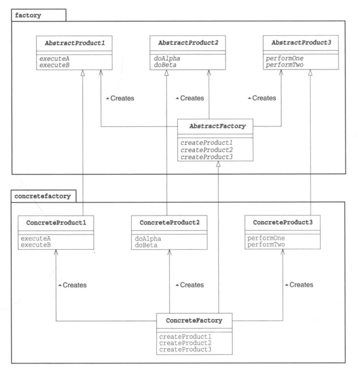

### 8.3 相关的设计模式

- Builder模式：
  - Abstract Factory 模式通过调用抽象产品的接口来组装抽象产品，
  - Builder 模式则是分阶段地制定复杂实例
- Factory Method：Abstract Factory 模式中零件和产品的生成会使用到Factory method
- Composite：Abstract Factory 在制作产品时会使用Composite
- Singleton：Abstract Factory的具体工厂会使用 Singleton模式

### 8.4 生成实例的方法

1. new
2. clone
3. newInstance `Class.forName(classname).newInstance()`

## 9 Bridge -- 将类的功能层次结构与实现层次结构分离

将类的功能层次结构与实现层次结构分离，可用于分离核心功能与衍生功能（使用核心功能），在衍生功能类中聚合核心功能类

**类的层次结构的两个作用**

1. 希望**增加新功能**，功能层次结构，**子类扩展父类**
   - 父类具有基本功能
   - 在子类中增加新的功能
   
2. 希望**增加新的实现**时，实现层次结构，**子类实现父类**
   
   如 Template method
   
   - 父类通过声明**抽象方法**来定义接口（定义流程顺序）
   - 子类通过实现具体方法来实现接口
   
3. 类的**层次接口的混杂与分离**

   将类的**功能层次结构**与实现层次结构分离, 使用Bridge进行连结

### 9.1 角色

- Abstraction：类功能层次结构的最上层，聚合Implementor，保存其实例，使用其功能
- RefinedAbstraction：在Abstraction角色上增加新的功能
- Implementor 实现者：类的实现层次结构的最上层，定义了用于实现 Abstraction 角色的接口
- ConcreteImplementor 

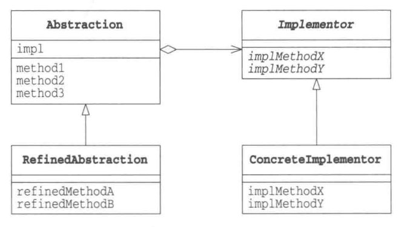

### 9.2 Core Code

```java
public class Display {
    private DisplayImpl impl;
    public Display(DisplayImpl impl) {
        this.impl = impl;
    }
    public void open() {
        impl.rawOpen();
    }
    public void print() {
        impl.rawPrint();
    }
    public void close() {
        impl.rawClose();
    }
    public final void display() {
        open();
        print();                    
        close();
    }
}

public class CountDisplay extends Display {
    public CountDisplay(DisplayImpl impl) {
        super(impl);
    }
    public void multiDisplay(int times) {       // 循环显示times次
        open();
        for (int i = 0; i < times; i++) {
            print();
        }
        close();
    }
}

public abstract class  DisplayImpl {
    public abstract void rawOpen();
    public abstract void rawPrint();
    public abstract void rawClose();
}

public class StringDisplayImpl extends DisplayImpl {
    private String string;                              // 要显示的字符串
    private int width;                                  // 以字节单位计算出的字符串的宽度
    public StringDisplayImpl(String string) {           // 构造函数接收要显示的字符串string
        this.string = string;                           // 将它保存在字段中
        this.width = string.getBytes().length;          // 把字符串的宽度也保存在字段中，以供使用。
    }
    public void rawOpen() {
        printLine();
    }
    public void rawPrint() {
        System.out.println("|" + string + "|");         // 前后加上"|"并显示
    }
    public void rawClose() {
        printLine();
    }
    private void printLine() {
        System.out.print("+");                          // 显示用来表示方框的角的"+"
        for (int i = 0; i < width; i++) {               // 显示width个"-"
            System.out.print("-");                      // 将其用作方框的边框
        }
        System.out.println("+");                        // 显示用来表示方框的角的"+"
    }
}

```

### 9.3 相关设计模式

- Template Method :在其使用Bridge, 父类调用抽象方法，而子类实现抽象方法
- Abstract Factory：ConcreteImplementor  可以使用抽象工厂
- Adapter:
  - Bridge：将类的功能层次结构与实现层次结构分离
  - Adapter：结合功能相似，但是接口不同的类

## 10 Strategy--整体地替换算法

整体替换算法，能够以不同的算法解决同一个问题

### 10.1 角色

- Strategy 策略：负责决定实现策略所必须的接口
- ConcreteStrategy 
- Context 上下文：负责使用Strategy 角色，保存了ConcreteStrategy 实例，并使用ConcreteStrategy 角色去实现角色需要

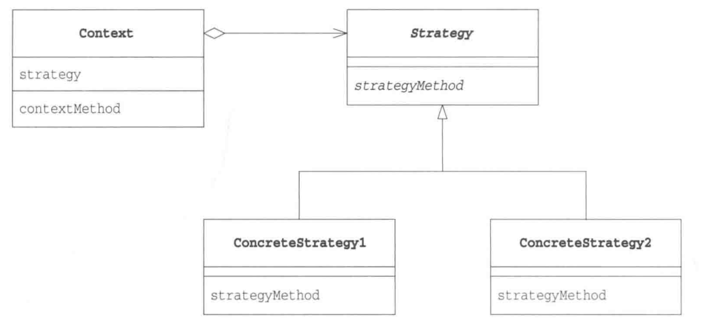


## 11 Composite

容器与内容的一致性

目录条目=文件+文件夹

树结构的数据结构都使用与Composite模式

### 11.1 角色

- Leaf 树叶：表示内容的角色，该角色中不能放入其他对象
- Composite 复合物：表示容器的角色，可以在其放入Leaf he  Composite
- Commponent：使Leaf 和Composite 角色具有一致性的角色
- Client：使用Composite 

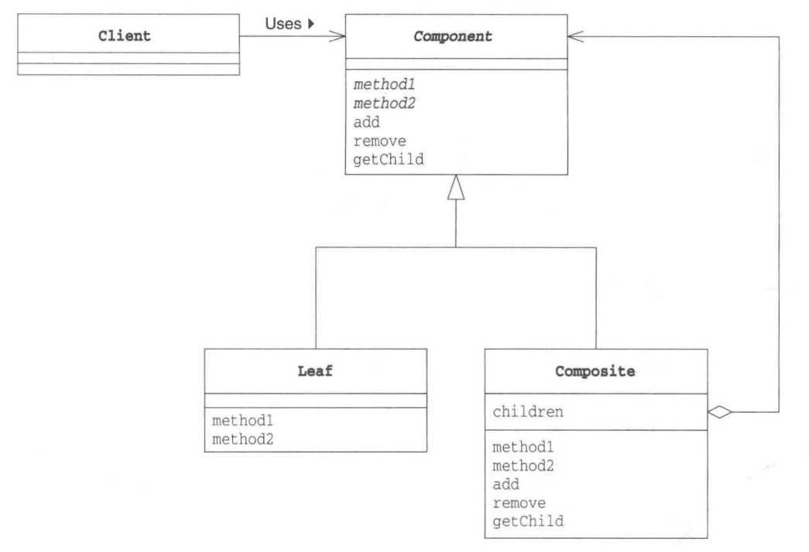

### 11.2 Core Code

### 11.3 相关设计模式

- Command：使用Command模式编写宏命令时使用了Composite
- Visitor：可以使用Visitor模式访问Composite模式中的递归结构
- Decorator： 
  - Composite使容器和内容一致
  - Decorator 使装饰框和内容具有一致性

## 12 Decorator--装饰边框与被装饰物的一致性

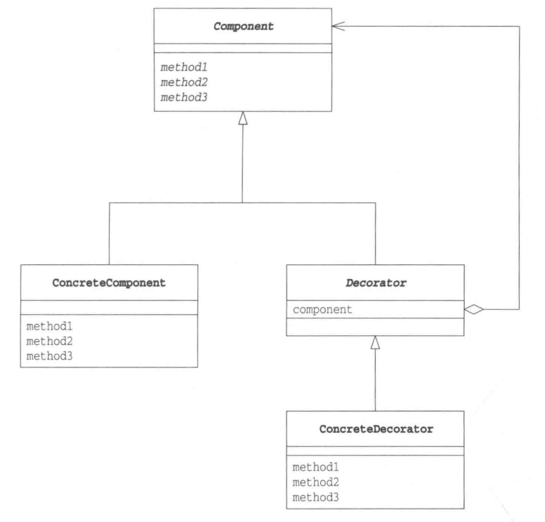

## Chain of Responsibility -- 推卸责任

当服务接收一个请求时，服务暂时无法决定由哪个对象来处理请求。可以将多个对象组成一条职责链，然后按照它们在职责链上的顺序来选择处理请求。

让每个请求处理器只专注处理自己能解决的问题

在对象中聚合相同类产生的不同对象

```java
public abstract class Support {
    private String name; // 处理器名称
    private Support next; // 保存下一个处理器，聚合相同类型的对象

    public Support setNext(Support next) {
        this.next = next;
        return next;
    }
    ...
}
```


## Facade -- 简单窗口

Facade ： 建筑物的正面。将**互相关联在一起的错综复杂的类整理出高层接口**（API）

Facade角色本身并没有任何实际的属性，只是利用其他类来完成一个业务

```java
// 一个工具类的写法，如果一个类没有属性，可以为其声明一个私有构造器
public class WindowFacade {
    private WindowFacade() {   // 防止外部new出WindowFacade的实例，所以声明为private方法
    }
    // 使用 static修饰
    public static void makeSuccessWindow(...) {
		// 调用其他类完成业务
    }
}
```

## Mediator -- 只有一个仲裁者


## Observe -- 发送状态变化通知

也称为Publish-Subscriber模式

当观察对象（Subject）发生改变时回通知观察者(Observer)，**Subject中聚合Observer**

- 利用抽象类和接口从具体类中抽出抽象方法
- 在将实例作为参数传递至类中，或者在类的字段中保存实例时，不适用具体类型

```java
package ind.milo.gof.observer;

import java.util.ArrayList;
import java.util.Iterator;

public abstract class NumberGenerator {
    // 有序链表，通知时按照观察者的通知顺序来通知观察者
    private ArrayList<Observer> observers = new ArrayList();

    public void addObserver(Observer observer) {
        observers.add(observer);
    }

    public void notifyObservers() {
        Iterator iterator = observers.iterator();
        while (iterator.hasNext()) {
            Observer observer = (Observer) iterator.next();
            // 将当前对象（类的实例对象）作为参数，通知观察者，
            observer.update(this);
            
            // 可以只通知其他信息
            // observer.update(int number);
        }
    }

    // 子类中实现该方法，并且在该方法中 调用 notifyObservers();
    public abstract void execute();
    
    // 定义子类的属性 number
	public abstract int getNumber();
}

```


### 

## Memento -- 保存对象状态


角色：

- Originator (生成者)：

  1. Originator 角色会在保存自己的最新状态时生成Memento角色。
  2. 使用Memento来恢复至生成该Memento角色时的状态

- Memento (纪念品)：保存了Originator 角色的内部信息

  > 是否向外部公开信息：
  >
  > 宽接口：暴露所有信息，使用public 修饰
  >
  > 窄接口：

- Caretaker （负责人）：当Caretaker 角色想要保存当前的Originator 角色的状态时，会通知Originator 角色。撤销时同理。负责保存 Memento 角色

  


 ```java
 /**
   * 保存Gamer的用户状态
   */
 public class Memento {
     int money;
     ArrayList fruits;
 
     Memento(int money, ArrayList fruits) {
         this.money = money;
         this.fruits = fruits;
     }
     ...
 }    
  
 /**
   * 
   */
 public class Gamer {
     private int money;
     private ArrayList fruits = new ArrayList();
 
     private Random random = new Random();
     private static String[] fruitsname = {
             "苹果", "葡萄", "香蕉", "橘子"
     };
 
     // 拍摄快照
     public Memento createMemento() {
         Memento memento = new Memento(money, fruits);
         return memento;
     }
 
     // 撤销
     public void restoreMemento(Memento memento) {
         this.money = memento.money;
         this.fruits = memento.getFruits();
     }
 	...
 }
 
 /**
 * 负责何时拍摄快照和恢复
 */
 public class Main {
     public static void main(String[] args) {
         Gamer gamer = new Gamer(100);
         Memento memento = gamer.createMemento();
 
         if(){
         	memento = gamer.createMemento();
         }
         if(){
         	gamer.restoreMemento(memento);
         }
     }
 }
 
 ```

## State -- 用类表示状态

角色：

- State(状态)：State角色表示状态，定义了根据不同状态进行不同处理的接口（API）,该API是那些处理内容依赖于状态的方法的集合
- ConcreteState(具体的状态)：表示各个具体的状态，实现了State接口
- Context：表示当前状态的ConcreteState角色。定义了供外部调用者使用State模式的接口

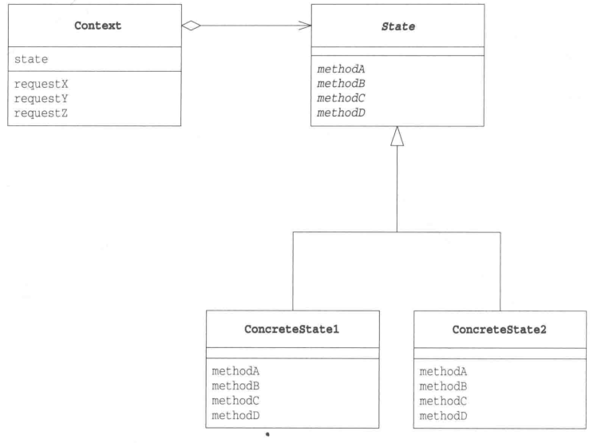

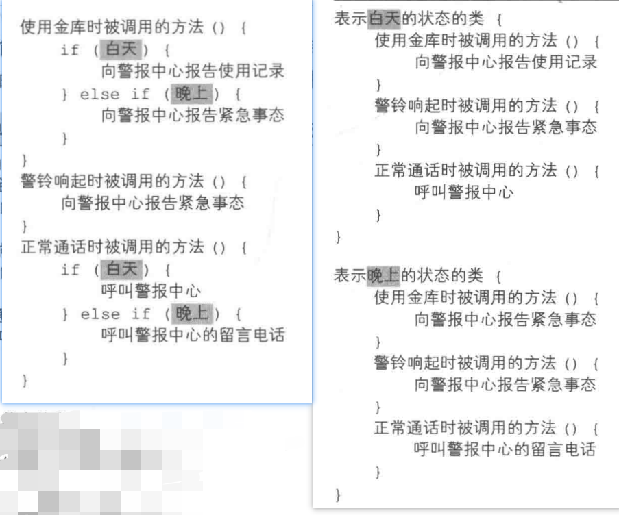


## Flyweight -- 共享对象，避免浪费

通过尽量共享实例来避免创造实例

角色：

- Flyweight (轻量级)：表示要共享的实例
- FlyweightFactory：用户生成并保存Flyweight，
- Client: Client 使用FlyweightFactory 生成 Flyweight 


注：

1. 如果修改了一个共享对象，所有使用该共享对象的地方都会受到影响
2. 不要让共享对象被垃圾回收期回收了
3. 减少了内存的占用和通过new关键字创建实例所花费的时间


```java
// Flyweight 
public class BigChar {
    private char charname;
    private String fontdate;
    ...
}

public class BigCharFactory {
    //用于保存已经生成的BigChar实例
    private HashMap<String, BigChar> pool = new HashMap();
    
    // 单例模式
    private static BigCharFactory singleton = new BigCharFactory();

    private BigCharFactory() {

    }
   
     // 生成（共享）BigChar类的实例
    public synchronized BigChar getBigChar(char charName) {
        BigChar bigChar = (BigChar) pool.get("" + charName);
        if (bigChar == null) {
            bigChar = new BigChar(charName);
            pool.put("" + charName, bigChar);
        }
        return bigChar;
    }
}


```

## Proxy -- 只在必要时生成实例

只在需要使用某个功能时才将其初始化，

在现实生活中，应当是本人将事情委托给代理人负责，而在设计模式中则是反过来的

角色：

- Client 请求中：使用Proxy模式的角色

- Subject 主题：Subject角色定义了使Proxy角色和RealSubject角色之间具有一致性的接口，所以Client角色不必在意它使用的究竟时Proxy还是RealSubject

- Proxy 代理人：proxy角色会尽量处理来自Client角色的请求。只有当自己不能处理时，才会将工作交给RealSubject角色。
- RealSubject 实际的主体：实现与Proxy相同的接口Subject, 只有在Proxy无法胜任工作时出场

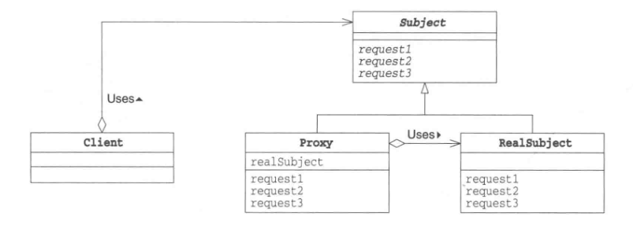

## Command -- 命令也是类


角色：

- Command 命令：负责定义命令的接口
- ConcreteCommand ：Command 接口的实现类
- Receiver 命令接收者：是Command角色执行命令时的对象

- Client 请求者：负责生成 ConcreteCommand  角色并分配 Receiver 
- Invoker 发动者：开始执行命令的角色，调用在Command 角色中定义的接口

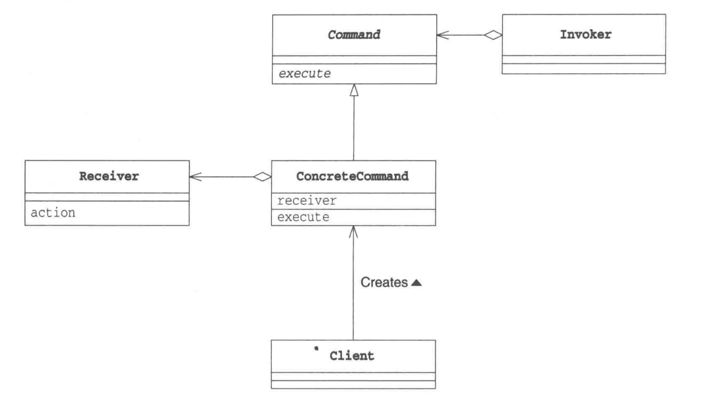

## Interpreter -- 语法规则也是类

EBNF ( Extended Backus–Naur Form 巴科斯范式)：描述语法的一种形式体系，是一种典型的元语言
