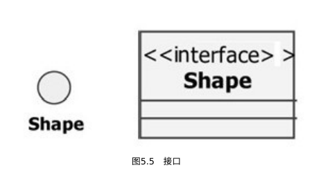

### 概述

https://www.omg.org/uml/

UML（Unified Modeling Language，统⼀建模语⾔）

箭头方向：知道对方的信息时才能指向对方，

子类继承，扩展了父类，子类指向父类

继承: 这些对象共享⼀些相似的特征，并显出⾃⼰的特性；

多态性: 针对相同的消息，不同对象可以具有特殊的表现形式，

实线：耦合度强

虚线：耦合度低

### 类图


```
[可⻅性]属性名[：类型][=初始值][{属性字符串}]
[可⻅性]操作名[（参数表）][：返回类型][{属性字符串}]
```

可⻅性:

- +: public
- -: private
- #：protected
- ~: package

### 接口



接⼝（Interface）：是描述类的部分⾏为的⼀组操作，它也是⼀个类提供给另⼀个类的⼀组操作,通常接⼝被描述为抽象操作，也就是只⽤标识（返回值、操作名称、参数表）说明它的⾏为,接⼝只负责定义操作⽽不负责具体的实现。


### 抽象类

抽象类是包含⼀种或多种抽象⽅法的类，它本⾝不需要构造实例。
定义抽象类后，其他类可以对它进⾏扩充，并且通过实现其中的抽象⽅
法使抽象类具体化。

（1）抽象类可以包含某些实现代码，但接⼝没有任何实现部分；
（2）抽象类可以包含属性，⽽接⼝没有属性；
（3）接⼝可以被结构继承，但抽象类不可以；
（4）抽象类可以有构造函数和析构函数，⽽接⼝没有；
（5）抽象类可以继承其他类和接⼝，⽽接⼝仅仅能继承接⼝；
（6）接⼝⽀持多继承，⽽抽象类仅仅⽀持单继承。


## 类关系

根据类于类之间 的耦合度从弱到强排列：

依赖关系--> （关联关系 --> 聚合关系-->组合关系）-->泛化关系-->实现关系

依赖关系：在类A的**方法中**（方法参数，局部变量）使用类B

关联关系：在类A的**成员变量**中定义类B


### 依赖关系

Dependency: 在**类A的方法中（方法参数，局部变量）使用类B**，类B的生命周期随着类A方法的执行结束而结束

```java
public class Person {
    public void eat(Mouse mouse) {
        mouse.
    }
}
```


### 关联关系

Association: 在类A中使用类B来作为一个**成员变量**。从数量上可分为一对多，多对一，多对多

关联关系 

- 一般关联关系：关联关系可以是双向的，也可以是单向的

  >  （如：一个学生可以学习多门学科，一门学科可以被很多学生学习）

- 聚合关系

- 组合关系

### 聚合关系

Aggregation：是整体和部分的关系，contains-a。

成员对象是整体对象的一部分，但是成员对象可以脱离整体对象而独立存在。成员对象通常作为构造方法、Setter方法或业务方法的参数注入整体对象中

> 如汽车和引擎
>
> 只能从语义上区分

**空心菱形**

```java
public class Car{
    private Engine e ;
    
    // 构造器注入
    public Car(Engine e){
        this.e = e;
    }
    // set注入
    public void setEngine(Engine engine){
        this.e = engine;
    }
}

public class Engine{
    
}
```

### 组合关系

Compostion：是整体和部分的关系，has-a。

整体对象可以控制成员对象的生命周期，一旦整体对象不存在，部分对象也就不存在。通常在整体类的构造方法中直接实例化成员类。

> 如，头和嘴巴的关系

**实心菱形**

```java
public class Head{
    private Mouth mouth;
    public Head(){
        mouth = new Mouth();
    }
}

public class mouth{
    
}
```

### 泛化关系

Generalization：耦合度最大的一种关系，表示一般于特殊的关系，是父类与子类之间的关系，是一种继承关系，是is-a 的关系

### 实现关系

Realization: 是接口与实现类之间的关系
