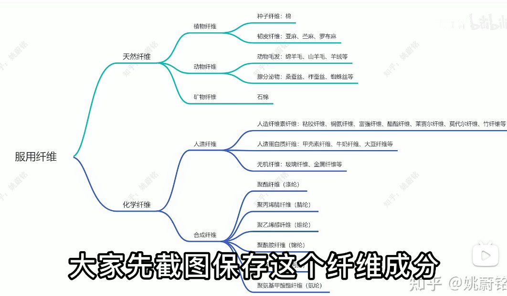

### 印染方式

- **活性**印花 -- **染料**印染, 使用活性染料
- **涂料**印花:-- **涂料**(纳米染, 颜料)印染,使用粘合剂, 会释放甲醛

涤纶(聚酯纤维)不可能使用活性染料染色

涂料印花印染完直接开始加工, 有刺鼻的味道

### 床上四件套

60~80s(单位是英支)表示纱线细度，数越大越柔软。（公支数101.6N等于英之支数60S。）
100支的4件套通常在1000往上。有可能是双股纱线（两根50支揉捻而成的双股纱线。）
纯棉：新疆长绒棉 36mm≠新疆棉、细绒棉

根数 T 布的密度 = 固定面积里的布料有几根经纬线 = 经线 * 纬线 

支树 S  线的粗细 数字越大越细

> 200 * 95 = 295 T

其他材质。莫代尔、莱赛尔(莱赛尔纤维更高级)。
制造方式：平纹（轻薄）、斜纹、缎纹（贡缎）厚实
印花方式：活性印花、涂料印花（直接pass）

选购方式: 60s+新疆长绒棉+活性印花

市面价格

60s/300T  150-300

80s/400T   200-400

### 网购

1.运费险高于3块不行，退货率与之有关。

 2.有正身照，不要被模特骗了。

 3.有无细节图 

实体店 

1.手感无法评价手感好坏。 

2.看吊牌，看有安全技术类别 GB 18401-2010  GB  31701-2015（儿童） C类不能贴身。 

3.看水洗唛 维护标志不能低于5个 注意假标识。水洗, 漂白, 晾干, 熨烫, 维护

### 速干衣

GB/T 21655.1（2），1、2都可； 成分 如果锦纶成分高用料不会太差（比涤纶好，三倍价格） 异形截面丝、单向导湿工艺、单行道排汗槽、印花疏水区，有这些品质不会差 

### 国家标准

GB 31701-2015:  婴幼儿及儿童纺织产品安全技术规范
GB 18401-2010:  国家纺织产品基本安全技术规范

### 三围

单位 cm

胸围: 88 - 90 -92

腰围: 78-80-82

臀: 93

肩宽 40

袖长 56

牛仔裤 30x32表示腰围在30英寸到32英寸之间，1英寸 = 2.54厘米，即76.2到81.3cm之间。

w30l32 W=width，L=length，30=30英寸，1英寸=2.54cm，腰围30英寸=76.2cm，裤长32英寸=81.28cm，所以W30L32代表的是腰围76，裤长81的码数

家纺三巨头 富安娜、罗莱生活、水星家纺 

鉴别棉花好坏方法: 平铺在灯光下看浮毛, 浮毛越少越光滑品质越好

本白布: 餐巾纸的颜色, 略带黄色

增白布: 使用荧光增白剂, 和A4纸一样白

全棉=纯棉=100%棉 

聚酯纤维 = 涤纶 = 的确良 = PET

