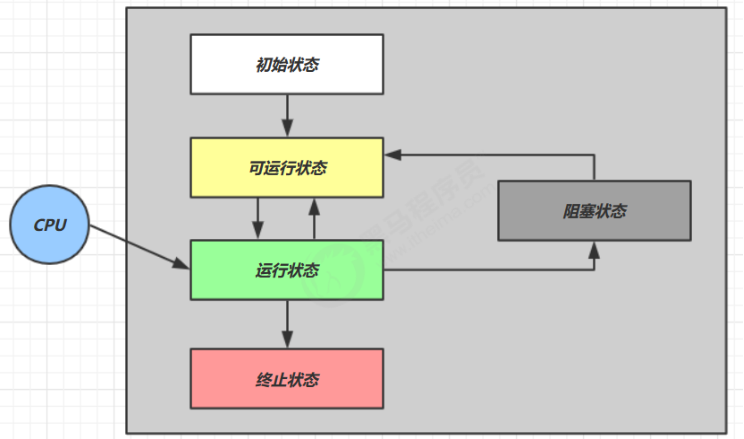

# 多线程

## 1 简介

### 1.1 程序、进程、线程

- 程序(program)是为完成特定任务、用某种语言编写的一组**指令的集合**。即指一段静态的代码，静态对象。

- 进程(process)是**程序的一次执行过程**，或是正在运行的一个程序。是一个动态的过程：有它自身的产生、存在和消亡的过程。 ——生命周期
  - 如：运行中的QQ，运行中的MP3播放器
  - 程序是静态的，进程是动态的
  - 进程作为**资源分配的单位**， 系统在运行时会为每个进程分配不同的内存区域
  - 在 windows 中进程是不活动的，只是作为线程的容器

- 进程就可以视为程序的一个实例
- 线程(thread)，**进程可进一步细化为线程**，是一个**程序内部的一条执行路径**。
    - 若一个进程同一时间并行执行多个线程，就是支持多线程的
    - **线程作为调度和执行的单位**，每个线程拥有独立的运行栈和程序计数器(pc)，线程切换的开销小
    - **一个进程中的多个线程共享相同的内存单元/内存地址空间**它们从同一堆中分配对象，可以访问相同的变量和对象。这就使得线程间通信更简便、高效。但多个线程操作共享的系统资源可能就会带来安全的隐患。  

### 1.2 线程与进程

- 进程基本上相互独立的，而线程存在于进程内，是进程的一个子集
- 进程拥有共享的资源，如内存空间等，供其内部的线程共享
- 进程间通信较为复杂
  - 同一台计算机的进程通信称为 IPC（Inter-process communication）
  - 不同计算机之间的进程通信，需要通过网络，并遵守共同的协议，例如 HTTP
- 线程通信相对简单，因为它们共享进程内的内存，一个例子是多个线程可以访问同一个共享变量
- 线程更轻量，线程上下文切换成本一般上要比进程上下文切换低

### 1.3 单核与多核

- 单核CPU，线程实际还是 串行执行 的。操作系统中有一个组件叫做任务调度器，将 cpu 的时间片（windows 下时间片最小约为 15 毫秒）分给不同的程序使用，只是由于 cpu 在线程间（时间片很短）的切换非常快，人类感觉是同时运行的 。总结为一句话就是： 微观串行，宏观并行 ，  
- 如果是多核的话，才能更好的发挥多线程的效率。（现在的服务器都是多核的）  
- **一个Java应用程序java.exe，其实至少有三个线程**： **main()主线程**， **gc()垃圾回收线程**，**异常处理线程**。当然如果发生异常，会影响主线程。  

### 1.4 并行与并发

- 并行（parallel）：多个CPU同时执行多个任务。

- 并发（concurrent）：一个CPU同时应对（dealing with）多件事情的能力，即线程轮流使用同一个CPU  

### 1.5 同步与异步

- 需要等待结果返回，才能继续运行就是同步
- 不需要等待结果返回，就能继续运行就是异步

## 2 Java多线程

### 2.1 创建

#### Thread

```java
// 创建线程对象
Thread t = new Thread() {
    public void run() {
    	// 线程体: 要执行的任务
    }
};

// 1.启动线程, 2.调用当前线程的run()
t.start();

//问题一：我们不能通过直接调用run()的方式启动线程。能，此时不是多线程，只有一个main线程
// t1.run(); // 在main线程中执行run方法

//问题二：不可以让已经start()的线程去执行。会报IllegalThreadStateException
// t1.start();

// 在main线程中执行的。
for (int i = 0; i < 10; i++) {
    if(i % 2 == 0){
        System.out.println(Thread.currentThread().getName() + ":" + i + "***********main()************");
    }
}
```

#### Runnable 

把【线程】和【任务】（要执行的代码）分开

- Thread 代表线程
- Runnable 可运行的任务（线程要执行的代码）

```java
Runnable runnable = new Runnable() {
	public void run(){
		// 要执行的任务
	}
};
// 创建线程对象
Thread t = new Thread( runnable );
// 启动线程
t.start();


// 创建任务对象
Runnable task2 = () -> log.debug("hello");
// 参数1 是任务对象; 参数2 是线程名字，推荐
Thread t2 = new Thread(task2, "t2");
t2.start();
```

#### Runnable与Thread

优先选择实现Runnable接口的方式

- 避免java单继承带来的局限性(interface Runnable,  class Thread)
- 更适合来处理多个线程有共享数据的情况
- 把线程和任务解耦
- 线程池只能放入实现Runable或callable类线程，不能直接放入继承Thread的类

联系：`public class Thread implements Runnable`

相同点：两种方式都需要重写run(),将线程要执行的逻辑声明在run()中。

#### FutureTask

FutureTask 能够接收 Callable 类型的参数，用来处理有返回结果的情况

```java
// 创建任务对象
FutureTask<Integer> task3 = new FutureTask<>(() -> {
    log.debug("hello");
    return 100;
});
// 参数1 是任务对象; 参数2 是线程名字，推荐
new Thread(task3, "t3").start();

// 主线程阻塞，同步等待 task 执行完毕的结果
Integer result = task3.get();
log.debug("结果是:{}", result);
```

### 2.2 查看

线程交替执行，谁先谁后，不由我们控制

#### windows

- 任务管理器可以查看进程和线程数，也可以用来杀死进程
- tasklist 查看进程
- taskkill 杀死进程

#### linux

- ps -fe 查看所有进程
- ps -fT -p <PID> 查看某个进程（PID）的所有线程
- kill 杀死进程
- top 按大写 H 切换是否显示线程
- top -H -p <PID> 查看某个进程（PID）的所有线程

#### Java

jps 命令查看所有 Java 进程
jstack <PID> 查看某个 Java 进程（PID）的所有线程状态
jconsole 来查看某个 Java 进程中线程的运行情况（图形界面）

### 2.3 原理

#### 线程上下文切换

（Thread Context Switch）

因为以下一些原因导致 cpu 不再执行当前的线程，转而执行另一个线程的代码

- 线程的 cpu 时间片用完
- 垃圾回收
- 有更高优先级的线程需要运行
- 线程自己调用了 sleep、yield、wait、join、park、synchronized、lock 等


当 Context Switch 发生时，需要由操作系统保存当前线程的状态，并恢复另一个线程的状态，Java 中对应的概念就是程序计数器（Program Counter Register），它的作用是记住下一条 jvm 指令的执行地址，是线程私有的 状态包括程序计数器、虚拟机栈中每个栈帧的信息，如局部变量、操作数栈、返回地址等

Context Switch 频繁发生会影响性能

### 2.4 常见方法

```

 * 1. start():启动当前线程；调用当前线程的run()
 * 2. run(): 通常需要重写Thread类中的此方法，将创建的线程要执行的操作声明在此方法中
 * 3. currentThread():静态方法，返回当前执行代码的线程
 * 4. getName():获取当前线程的名字
 * 5. setName():设置当前线程的名字
 * 6. yield():释放当前cpu的执行权
 * 7. join():在线程a中调用线程b的join(),此时线程a就进入阻塞状态，直到线程b完全执行完以后，线程a才
 *           结束阻塞状态。
 * 8. stop():已过时。当执行此方法时，强制结束当前线程。
 * 9. sleep(long millitime):让当前线程“睡眠”指定的millitime毫秒。在指定的millitime毫秒时间内，当前
 *                          线程是阻塞状态。
 * 10. isAlive():判断当前线程是否存活
 *
 *
 * 线程的优先级：
 * 1.
 * MAX_PRIORITY：10
 * MIN _PRIORITY：1
 * NORM_PRIORITY：5  -->默认优先级
 * 2.如何获取和设置当前线程的优先级：
 *   getPriority():获取线程的优先级
 *   setPriority(int p):设置线程的优先级
 *
 * 说明：高优先级的线程要抢占低优先级线程cpu的执行权。但是只是从概率上讲，高优先级的线程高概率的情况下
 * 被执行。并不意味着只有当高优先级的线程执行完以后，低优先级的线程才执行。
```

### 2.5 sleep与yield

#### **sleep**

1. 调用 sleep 会让当前线程从 Running 进入 Timed Waiting 状态（阻塞）
2. 其它线程可以使用 interrupt 方法打断正在睡眠的线程，这时 sleep 方法会抛出 InterruptedException
3. 睡眠结束后的线程未必会立刻得到执行
4. 建议用 TimeUnit 的 sleep 代替 Thread 的 sleep 来获得更好的可读性

#### **yield**

1. 调用 yield 会让当前线程从 Running 进入 Runnable 就绪状态，然后调度执行其它线程
2. 具体的实现依赖于操作系统的任务调度器

### 2.6 线程调度

调度策略：

- 时间片
- 抢占式：高优先级的线程抢占CPU

调度方法：

- 同优先级线程组成先进先出队列（先到先服务），使用时间片策略
- 对高优先级，使用优先调度的抢占式策略  

线程的优先级等级：

- MAX_PRIORITY： 10
- MIN _PRIORITY： 1
- NORM_PRIORITY： 5  

涉及方法：

- `getPriority() `： 返回线程优先值
- `setPriority(int newPriority) `： 改变线程的优先级  

说明：

- 线程创建时继承父线程的优先级
- 低优先级只是获得调度的概率低，并非一定是在高优先级线程之后才被调用 
- 如果 cpu 比较忙，那么优先级高的线程会获得更多的时间片，但 cpu 闲时，优先级几乎没作用 

### 2.7 join

#### 常规使用

```java
    static int r = 0;
    static int r1 = 0;
    static int r2 = 0;

private static void test2() throws InterruptedException {
        Thread t1 = new Thread(() -> {
            sleep(1);
            r1 = 10;
        });
        Thread t2 = new Thread(() -> {
            sleep(2);
            r2 = 20;
        });
        t1.start();
        t2.start();
        long start = System.currentTimeMillis();
        log.debug("join begin");
        t2.join();
        log.debug("t2 join end");
        t1.join();
        log.debug("t1 join end");
        long end = System.currentTimeMillis();
        log.debug("r1: {} r2: {} cost: {}", r1, r2, end - start);
    }

16:56:46.470 c.TestJoin [main] - join begin
16:56:48.470 c.TestJoin [main] - t2 join end
16:56:48.470 c.TestJoin [main] - t1 join end
16:56:48.470 c.TestJoin [main] - r1: 10 r2: 20 cost: 2002
```

#### 有时效的join

```java
static int r1 = 0;
static int r2 = 0;
public static void main(String[] args) throws InterruptedException {
	test3();
}
public static void test3() throws InterruptedException {
    Thread t1 = new Thread(() -> {
        sleep(1);
        r1 = 10;
    });
    long start = System.currentTimeMillis();
    t1.start();
    // 线程执行结束会导致 join 结束
    t1.join(1500);
    long end = System.currentTimeMillis();
    log.debug("r1: {} r2: {} cost: {}", r1, r2, end - start);
	// 20:48:01.320 [main] c.TestJoin - r1: 10 r2: 0 cost: 1010
}


```

#### 没等够时间

```java
static int r1 = 0;
static int r2 = 0;
public static void main(String[] args) throws InterruptedException {
	test3();
}
public static void test3() throws InterruptedException {
    Thread t1 = new Thread(() -> {
        sleep(2);
        r1 = 10;
    });

    long start = System.currentTimeMillis();
    t1.start();

    // 线程执行结束会导致 join 结束
    log.debug("join begin");
    t1.join(1000);
    long end = System.currentTimeMillis();
    log.debug("r1: {} r2: {} cost: {}", r1, r2, end - start);
    // 17:04:10.141 c.TestJoin [main] - join begin
    // 17:04:11.143 c.TestJoin [main] - r1: 0 r2: 0 cost: 1004
}
```

### 2.8 interrupt

#### 打断sleep, wait, join的线程

这几个方法都会让线程进入阻塞状态
打断 sleep 的线程, 会清空打断状态，以 sleep 为例

```
    private static void test1() throws InterruptedException {
        Thread t1 = new Thread(()->{
            sleep(1);
        }, "t1");
        t1.start();

        sleep(0.5);
        t1.interrupt();
        log.debug(" 打断状态: {}", t1.isInterrupted());
    }
    
    java.lang.InterruptedException: sleep interrupted
	at java.lang.Thread.sleep(Native Method)
	at java.lang.Thread.sleep(Thread.java:340)
	at java.util.concurrent.TimeUnit.sleep(TimeUnit.java:386)
	at cn.itcast.n2.util.Sleeper.sleep(Sleeper.java:8)
	at cn.itcast.n3.TestInterrupt.lambda$test1$3(TestInterrupt.java:59)
	at java.lang.Thread.run(Thread.java:748)
17:20:23.348 c.TestInterrupt [main] -  打断状态: false

Process finished with exit code 0

```

#### 打断正常运行的线程

打断正常运行的线程, 不会清空打断状态

```java
    private static void test2() throws InterruptedException {
        Thread t2 = new Thread(()->{
            while(true) {
                Thread current = Thread.currentThread();
                boolean interrupted = current.isInterrupted();
                if(interrupted) {
                    log.debug(" 打断状态: {}", interrupted);
                    break;
                }
            }
        }, "t2");
        t2.start();

        sleep(0.5);
        t2.interrupt();
        
        // 17:36:10.798 c.TestInterrupt [t2] -  打断状态: true
    }
```

#### 打断park线程

打断 park 线程, 不会清空打断状态

```java
    private static void test3() {
        Thread t1 = new Thread(() -> {
            log.debug("park...");
            LockSupport.park();
            log.debug("unpark...");
            log.debug("打断状态：{}", Thread.currentThread().isInterrupted());
        }, "t1");
        t1.start();


        sleep(0.5);
        t1.interrupt();
    }

17:38:11.559 c.TestInterrupt [t1] - park...
17:38:12.058 c.TestInterrupt [t1] - unpark...
17:38:12.058 c.TestInterrupt [t1] - 打断状态：true
```

如果打断标记已经是 true, 则 park 会失效

```java
private static void test4() {
        Thread t1 = new Thread(() -> {
            for (int i = 0; i < 5; i++) {
                log.debug("park...");
                LockSupport.park();
                log.debug("打断状态：{}", Thread.interrupted());
            }
        });
        t1.start();


        sleep(1);
        t1.interrupt();
    }

/*
21:13:48.783 [Thread-0] c.TestInterrupt - park...
21:13:49.809 [Thread-0] c.TestInterrupt - 打断状态：true
21:13:49.812 [Thread-0] c.TestInterrupt - park...
21:13:49.813 [Thread-0] c.TestInterrupt - 打断状态：true
21:13:49.813 [Thread-0] c.TestInterrupt - park...
21:13:49.813 [Thread-0] c.TestInterrupt - 打断状态：true
21:13:49.813 [Thread-0] c.TestInterrupt - park...
21:13:49.813 [Thread-0] c.TestInterrupt - 打断状态：true
21:13:49.813 [Thread-0] c.TestInterrupt - park...
21:13:49.813 [Thread-0] c.TestInterrupt - 打断状态：true
*/
```

### 2.9 不推荐的方法

这些方法已过时，容易破坏同步代码块，造成线程死锁

```
stop() 停止线程运行
suspend() 挂起（暂停）线程运行
resume() 恢复线程运行
```

### 2.10 守护线程

默认情况下，Java 进程需要等待所有线程都运行结束，才会结束。**守护线程，只要其它非守护线程运行结束了，即使守护线程的代码没有执行完，也会强制结束**

```java
    public static void main(String[] args) {
        log.debug("开始运行...");
        Thread t1 = new Thread(() -> {
            log.debug("开始运行...");
            sleep(2);
            log.debug("运行结束...");
        }, "daemon");
        // 设置该线程为守护线程
        t1.setDaemon(true);
        t1.start();

        sleep(1);
        log.debug("运行结束...");
    }
}
/*
17:42:38.042 c.TestDaemon [main] - 开始运行...
17:42:38.086 c.TestDaemon [daemon] - 开始运行...
17:42:39.088 c.TestDaemon [main] - 运行结束...
*/

```

ps

> 垃圾回收器线程就是一种守护线程
> Tomcat 中的 Acceptor 和 Poller 线程都是守护线程，所以 Tomcat 接收到 shutdown 命令后，不会等待它们处理完当前请求

### 2.11 五种状态--操作系统

这是从 操作系统 层面来描述



- 【初始状态】仅是在语言层面创建了线程对象，还**未与操作系统线程关联**
- 【可运行状态】（就绪状态）指该线程已经被创建（**与操作系统线程关联**），可以由 CPU 调度执行
- 【运行状态】**获取了 CPU 时间片**
  - 当 CPU 时间片用完，会从【运行状态】转换至【可运行状态】，会导致线程的上下文切换
- 【阻塞状态】
  - 如果调用了阻塞 API，如 BIO 读写文件，这时该线程实际不会用到 CPU，会导致线程上下文切换，进入【阻塞状态】
  - 等 BIO 操作完毕，会由操作系统唤醒阻塞的线程，转换至【可运行状态】
  - 与【可运行状态】的区别是，对【阻塞状态】的线程来说只要它们一直不唤醒，调度器就一直不会考虑调度它们
- 【终止状态】表示线程已经执行完毕，生命周期已经结束，不会再转换为其它状态

### 2.12 六种状态--Java API

根据 Thread.State 枚举，分为六种状态

- NEW 线程刚被创建，但是还没有调用 start()方法
- RUNNABLE 当调用了 start() 方法之后，注意，Java API 层面的 RUNNABLE 状态涵盖了 操作系统 层面的【可运行状态】、【运行状态】和【阻塞状态】（由于 BIO 导致的线程阻塞，在 Java 里无法区分，仍然认为是可运行）
- BLOCKED， WAITING，TIMED_WAITING 都是 Java API 层面对【阻塞状态】的细分
- TERMINATED 当线程代码运行结束

## 3 共享模式--管程

### 3.1 临界区 

一段代码块内如果存在对**共享资源**的**多线程读写操作**，称这段代码块为**临界区**

```java
static int counter = 0;

static void increment()
// 临界区
{
	counter++;
}

static void decrement()
// 临界区
{
	counter--;
}
```

### 3.2 竞态条件

多个线程在临界区内执行，由于代码的执行序列不同而导致结果无法预测，称之为发生了竞态条件

### 3.3 synchronized

为了避免临界区的竞态条件发生，有多种手段可以达到目的。

- 阻塞式的解决方案：synchronized，Lock
- 非阻塞式的解决方案：原子变量

synchronized，即俗称的【对象锁】，它采用互斥的方式让同一时刻至多只有一个线程能持有【对象锁】，其它线程再想获取这个【对象锁】时就会阻塞住。这样就能保证拥有锁的线程可以安全的执行临界区内的代码，不用担心线程上下文切换

**对象锁保证了临界区内代码的原子性**

```java
synchronized(对象) // 线程1， 线程2(blocked)
{
	临界区
}
```

#### **线程不安全**

```java
	static int counter = 0;

	public static void main(String[] args) throws InterruptedException {
		Thread t1 = new Thread(
			()->{
				for (int i = 0; i < 10000; i++) {
					counter++;
				}
			}, "t1"
		);

		Thread t2 = new Thread(()->{
			for (int i = 0; i < 10000; i++) {
				counter--;
			}
		});

		t1.start();
		t2.start();
		t1.join();
		t2.join();
		System.out.println(counter);
        // 结果不一定为0
	}
```

#### 锁对象

```java
	static int counter = 0;
	static final Object room = new Object();

	public static void main(String[] args) throws InterruptedException {
		Thread t1 = new Thread(
			()->{
				for (int i = 0; i < 10000; i++) {
					synchronized (room){
						counter++;
					}
				}
			}, "t1"
		);

		Thread t2 = new Thread(()->{
			for (int i = 0; i < 10000; i++) {
				synchronized (room){
					counter--;
				}
			}
		});

		t1.start();
		t2.start();
		t1.join();
		t2.join();
		System.out.println(counter);
	}
```

#### 面向对象改进

```java
public class Test17 {
    public static void main(String[] args) throws InterruptedException {
        Room room = new Room();
        Thread t1 = new Thread(() -> {
            for (int i = 0; i < 5000; i++) {
                room.increment();
            }
        }, "t1");

        Thread t2 = new Thread(() -> {
            for (int i = 0; i < 5000; i++) {
                room.decrement();
            }
        }, "t2");

        t1.start();
        t2.start();
        t1.join();
        t2.join();
        log.debug("{}", room.getCounter());
    }
}

class Room {
    private int counter = 0;

    public synchronized void increment() {
        counter++;
    }

    public synchronized void decrement() {
        counter--;
    }

    public synchronized int getCounter() {
        return counter;
    }
}
```

#### 锁方法

```java
class Test{
    public synchronized void test(){
        
    }
}
等价于
class Test{
    public void test(){
        synchronized(this){
            
        }
    }
}    

class Test{
public synchronized static void test() {
    
	}
}
等价于
class Test{
    public static void test() {
        synchronized(Test.class) {

        }
    }
}
```

#### 线程八锁

```java
// 一问
@Slf4j(topic = "c.Number")
class Number{
    public synchronized void a() {
    	log.debug("1");
    }
    public synchronized void b() {
    	log.debug("2");
    }
}
public static void main(String[] args) {
    Number n1 = new Number();
    new Thread(()->{ n1.a(); }).start();
    new Thread(()->{ n1.b(); }).start();
}
// 12 或 21

// 二问
/******************************************/
@Slf4j(topic = "c.Number")
class Number{
    public synchronized void a() {
        sleep(1);
        log.debug("1");
    }
    public synchronized void b() {
    	log.debug("2");
    }
}
public static void main(String[] args) {
    Number n1 = new Number();
    new Thread(()->{ n1.a(); }).start();
    new Thread(()->{ n1.b(); }).start();
}
// 1s后12，或 2 1s后 1

/******************************************/
// 三问
class Number{
    public synchronized void a() {
        sleep(1);
        log.debug("1");
    }
    public synchronized void b() {
    	log.debug("2");
    }
    public void c() {
    	log.debug("3");
    }
}
public static void main(String[] args) {
    Number n1 = new Number();
    new Thread(()->{ n1.a(); }).start();
    new Thread(()->{ n1.b(); }).start();
    new Thread(()->{ n1.c(); }).start();
}
// 3 1s后 12，32 1s后 1， 23 1s后 1

/******************************************/
// 四问
@Slf4j(topic = "c.Number")
class Number{
    public synchronized void a() {
        sleep(1);
        log.debug("1");
    }
    public synchronized void b() {
        log.debug("2");
    }
}

public static void main(String[] args) {
    Number n1 = new Number();
    Number n2 = new Number();
    new Thread(()->{ n1.a(); }).start();
    new Thread(()->{ n2.b(); }).start();
}
// 2 1s后 1

/******************************************/
// 五问
@Slf4j(topic = "c.Number")
class Number{
public static synchronized void a() {
        sleep(1);
        log.debug("1");
    }
    public synchronized void b() {
        log.debug("2");
    }
}
public static void main(String[] args) {
    Number n1 = new Number();
    new Thread(()->{ n1.a(); }).start();
    new Thread(()->{ n1.b(); }).start();
} 
// 2 1s后 1

/******************************************/
// 六问
@Slf4j(topic = "c.Number")
class Number{
    public static synchronized void a() {
        sleep(1);
        log.debug("1");
    }
    public static synchronized void b() {
        log.debug("2");
    }
}
public static void main(String[] args) {
    Number n1 = new Number();
    new Thread(()->{ n1.a(); }).start();
    new Thread(()->{ n1.b(); }).start();
}
// 1s 后12， 或 2 1s后 1

/******************************************/
// 七问
@Slf4j(topic = "c.Number")
class Number{
	public static synchronized void a() {
        sleep(1);
        log.debug("1");
    }
    public synchronized void b() {
    	log.debug("2");
    }
}
public static void main(String[] args) {
    Number n1 = new Number();
    Number n2 = new Number();
    new Thread(()->{ n1.a(); }).start();
    new Thread(()->{ n2.b(); }).start();
}
// 2 1s后 1

/******************************************/
// 八问
class Number{
	public static synchronized void a() {
        sleep(1);
        log.debug("1");
    }
    public static synchronized void b() {
    	log.debug("2");
    }
}
public static void main(String[] args) {
    Number n1 = new Number();
    Number n2 = new Number();
    new Thread(()->{ n1.a(); }).start();
    new Thread(()->{ n2.b(); }).start();
}
// 1s后12，或 2 1s后 1
```

### 3.4 线程变量

#### 成员变量与静态变量

- 如果它们没有共享，则线程安全
- 如果它们被共享了，根据它们的状态是否能够改变，又分两种情况
  - 如果只有读操作，则线程安全
  - 如果有读写操作，则这段代码是临界区，需要考虑线程安全

#### 局部变量

- 局部变量是线程安全的
- 但局部变量引用的对象则未必
  - 如果该对象没有逃离方法的作用访问，它是线程安全的
  - 如果该对象逃离方法的作用范围，需要考虑线程安全

#### 线程安全分析

```java
// 安全
public static void test1() {
    int i = 10;
    i++;
}

// Unsafe
class ThreadUnsafe {
    ArrayList<String> list = new ArrayList<>();
    public void method1(int loopNumber) {
        for (int i = 0; i < loopNumber; i++) {
            // { 临界区, 会产生竞态条件
            method2();
            method3();
            // } 临界区
        }
    }
    private void method2() {
    	list.add("1");
    }
    private void method3() {
    	list.remove(0);
    }
}

static final int THREAD_NUMBER = 2;
static final int LOOP_NUMBER = 200;
public static void main(String[] args) {
    ThreadUnsafe test = new ThreadUnsafe();
    for (int i = 0; i < THREAD_NUMBER; i++) {
        new Thread(() -> {
            test.method1(LOOP_NUMBER);
        }, "Thread" + i).start();
    }
}


class ThreadSafe {
    public final void method1(int loopNumber) {
        ArrayList<String> list = new ArrayList<>();
        for (int i = 0; i < loopNumber; i++) {
            method2(list);
            method3(list);
    	}
	}
    private void method2(ArrayList<String> list) {
    	list.add("1");
    }
    private void method3(ArrayList<String> list) {
    	list.remove(0);
    }
}
```

#### 常见线程安全类

String
Integer
StringBuffer
Random
Vector
Hashtable
java.util.concurrent 包下的类

这里说它们是线程安全的是指，多个线程调用它们同一个实例的某个方法时，是线程安全的。也可以理解为

```java
// safe
Hashtable table = new Hashtable();
new Thread(()->{
    table.put("key", "value1");
}).start();

new Thread(()->{
    table.put("key", "value2");
}).start();
```

它们的每个方法是原子的,但注意它们多个方法的组合不是原子的

```java
// unsafe
Hashtable table = new Hashtable();
// 线程1，线程2
if( table.get("key") == null) {
	table.put("key", value);
}
```

#### 不可变类线程安全性

String、Integer 等都是不可变类，因为其内部的状态不可以改变(subString(),replace()等方法都会根据value变量创建新的对象)，因此它们的方法都是线程安全的

#### 实例分析

例1：

```java
public class MyServlet extends HttpServlet {
    // 是否安全？
    Map<String,Object> map = new HashMap<>();
    // 是否安全？是
    String S1 = "...";
    // 是否安全？是
    final String S2 = "...";
    // 是否安全？
    Date D1 = new Date();
    // 是否安全？
    final Date D2 = new Date();
    public void doGet(HttpServletRequest request, HttpServletResponse response) {
        // 使用上述变量
    }
}
```

例2：

```java
public class MyServlet extends HttpServlet {
	// 是否安全？ 
    private UserService userService = new UserServiceImpl();
    
    public void doGet(HttpServletRequest request, HttpServletResponse response) {
    	userService.update(...);
    }
}
public class UserServiceImpl implements UserService {
    // 记录调用次数
    private int count = 0;
    
    public void update() {
        // ...
        count++;
    }
}

// 否
```

例三

```java
@Aspect
@Component
public class MyAspect {
    // 是否安全？
    private long start = 0L;
    @Before("execution(* *(..))")
    public void before() {
    	start = System.nanoTime();
    }
    
    @After("execution(* *(..))")
    public void after() {
        long end = System.nanoTime();
        System.out.println("cost time:" + (end-start));
    }
}
// 否
```

例4：

```java
public class MyServlet extends HttpServlet {
// 是否安全
    private UserService userService = new UserServiceImpl();
    public void doGet(HttpServletRequest request, HttpServletResponse response) {
    	userService.update(...);
    }
}
public class UserServiceImpl implements UserService {
    // 是否安全
    private UserDao userDao = new UserDaoImpl();
    public void update() {
    	userDao.update();
    }
}

public class UserDaoImpl implements UserDao {
    public void update() {
        String sql = "update user set password = ? where username = ?";
        // 是否安全 是，无成员变量
        try (Connection conn = DriverManager.getConnection("","","")){
        	// ...
        } catch (Exception e) {
        	// ...
        }
    }
}
```

例五：

```java
public class MyServlet extends HttpServlet {
    // 是否安全
    private UserService userService = new UserServiceImpl();
    public void doGet(HttpServletRequest request, HttpServletResponse response) {
    	userService.update(...);
    }
}

public class UserServiceImpl implements UserService {
    // 是否安全
    private UserDao userDao = new UserDaoImpl();
    public void update() {
    	userDao.update();
    }
}
public class UserDaoImpl implements UserDao {
    // 是否安全 // 否，conn是共享的成员变量
    private Connection conn = null;
    public void update() throws SQLException {
        String sql = "update user set password = ? where username = ?";
        conn = DriverManager.getConnection("","","");
        // ...
        conn.close();
    }
}
```

例六：

```java
public class MyServlet extends HttpServlet {
    // 是否安全
    private UserService userService = new UserServiceImpl();
    public void doGet(HttpServletRequest request, HttpServletResponse response) {
    	userService.update(...);
    }
}
public class UserServiceImpl implements UserService {
    public void update() {
        UserDao userDao = new UserDaoImpl();
        userDao.update();
    }
}

public class UserDaoImpl implements UserDao {
    // 是否安全 // 是，UserDaoImpl是方法内的局部变量，但是不推荐
    private Connection = null;
    public void update() throws SQLException {
        String sql = "update user set password = ? where username = ?";
        conn = DriverManager.getConnection("","","");
        // ...
        conn.close();
    }
}
```

例七：

```java
public abstract class Test {
    public void bar() {
        // 是否安全
        SimpleDateFormat sdf = new SimpleDateFormat("yyyy-MM-dd HH:mm:ss");
        foo(sdf);
    }
    public abstract foo(SimpleDateFormat sdf);
    public static void main(String[] args) {
   		new Test().bar();
    }
}
```

其中 foo 的行为是不确定的，可能导致不安全的发生，被称之为外星方法

```java
public void foo(SimpleDateFormat sdf) {
    String dateStr = "1999-10-11 00:00:00";
    for (int i = 0; i < 20; i++) {
        new Thread(() -> {
            try {
            	sdf.parse(dateStr);
            } catch (ParseException e) {
            	e.printStackTrace();
            }
        }).start();
    }
}
```

例八：

```java
private static Integer i = 0;
public static void main(String[] args) throws InterruptedException {
    List<Thread> list = new ArrayList<>();
    for (int j = 0; j < 2; j++) {
        Thread thread = new Thread(() -> {
            for (int k = 0; k < 5000; k++) {
                synchronized (i) {
                    i++;
                }
            }
        }, "" + j);
    	list.add(thread);
    }
    list.stream().forEach(t -> t.start());
    list.stream().forEach(t -> {
        try {
            t.join();
        } catch (InterruptedException e) {
            e.printStackTrace();
        }
    });
    log.debug("{}", i);
}
```

所以根据开闭原则，我们通常将不想向外暴露的成员变量设置成final，防止子类覆盖父类，造成线程不安全

### 3.5 习题


创建两个分线程，其中一个线程遍历100以内的偶数，另一个线程遍历100以内的奇数

```java
public class ThreadDemo {
    public static void main(String[] args) {
//        MyThread1 m1 = new MyThread1();
//        MyThread2 m2 = new MyThread2();
//
//        m1.start();
//        m2.start();

        //创建Thread类的匿名子类的方式
        new Thread(){
            @Override
            public void run() {
                for (int i = 0; i < 100; i++) {
                    if(i % 2 == 0){
                        System.out.println(Thread.currentThread().getName() + ":" + i);

                    }
                }
            }
        }.start();


        new Thread(){
            @Override
            public void run() {
                for (int i = 0; i < 100; i++) {
                    if(i % 2 != 0){
                        System.out.println(Thread.currentThread().getName() + ":" + i);

                    }
                }
            }
        }.start();

    }
}

class MyThread1 extends Thread{
    @Override
    public void run() {
        for (int i = 0; i < 100; i++) {
            if(i % 2 == 0){
                System.out.println(Thread.currentThread().getName() + ":" + i);

            }
        }

    }
}


class MyThread2 extends Thread{
    @Override
    public void run() {
        for (int i = 0; i < 100; i++) {
            if(i % 2 != 0){
                System.out.println(Thread.currentThread().getName() + ":" + i);

            }
        }

    }
}

```

## Thread 常用方法

```java
/**
 * 测试Thread中的常用方法：
 * 
 *
 */
class HelloThread extends Thread{
    @Override
    public void run() {
        for (int i = 0; i < 100; i++) {
            if(i % 2 == 0){

                try {
                    Thread.sleep(10);
                } catch (InterruptedException e) {
                    e.printStackTrace();
                }

                System.out.println(Thread.currentThread().getName() + ":" + Thread.currentThread().getPriority() + ":" + i);
            }

//            当i能被20整除时，该线程释放当前CPU的执行期
//            if(i % 20 == 0){
//                yield();
//            }

        }

    }

    // 修改线程名
    public HelloThread(String name){
        super(name);
    }
}


public class ThreadMethodTest {
    public static void main(String[] args) {

        HelloThread h1 = new HelloThread("Thread：1");

//        h1.setName("线程一");
        //设置分线程的优先级
//        h1.setPriority(Thread.MAX_PRIORITY);

        h1.start();

        //给主线程命名
        Thread.currentThread().setName("主线程");
//        Thread.currentThread().setPriority(Thread.MIN_PRIORITY);

        // 主线程
        for (int i = 0; i < 100; i++) {
            if(i % 2 == 0){
                System.out.println(Thread.currentThread().getName() + ":" + Thread.currentThread().getPriority() + ":" + i);
            }

//            if(i == 20){
//                try {
//                    h1.join();
//                } catch (InterruptedException e) {
//                    e.printStackTrace();
//                }
//            }
        }
        
//        System.out.println(h1.isAlive());
    }
}

```

- 

## 多窗口买票

```java
/**
 * 例子：创建三个窗口卖票，总票数为100张.使用继承Thread类的方式
 *
 * 存在线程的安全问题，待解决。
 *
 * @author shkstart
 * @create 2019-02-13 下午 4:20
 */
class Window extends Thread{
    private static int ticket = 100;
    @Override
    public void run() {

        while(true){
            if(ticket > 0){
                System.out.println(getName() + "：卖票，票号为：" + ticket);
                ticket--;
            }else{
                break;
            }
        }

    }
}


public class WindowTest {
    public static void main(String[] args) {
        Window t1 = new Window();
        Window t2 = new Window();
        Window t3 = new Window();

        t1.setName("窗口1");
        t2.setName("窗口2");
        t3.setName("窗口3");

        t1.start();
        t2.start();
        t3.start();
    }
}
```


## 多窗口卖票2

```java
class Window1 implements Runnable{
 	// 不需要使用static修饰
    private int ticket = 100;

    @Override
    public void run() {
        while(true){
            if(ticket > 0){
                System.out.println(Thread.currentThread().getName() + ":卖票，票号为：" + ticket);
                ticket--;
            }else{
                break;
            }
        }
    }
}


public class WindowTest1 {
    public static void main(String[] args) {
        Window1 w = new Window1();

        Thread t1 = new Thread(w);
        Thread t2 = new Thread(w);
        Thread t3 = new Thread(w);

        t1.setName("窗口1");
        t2.setName("窗口2");
        t3.setName("窗口3");

        t1.start();
        t2.start();
        t3.start();
    }
}
```


## 线程的生命周期

- JDK中用Thread.State类定义了线程的几种状态  
  - **新建**： 当一个Thread类或其子类的对象被声明并创建时，新生的线程对象处于新建状态
  - **就绪**： 处于新建状态的线程被**start()**后，**将进入线程队列等待CPU时间片**，此时它已具备了运行的条件，只是**没分配到CPU资源**
  - **运行**： 当就绪的线程被调度并获得CPU资源时,便进入运行状态， run()方法定义了线程的操作和功能
  - **阻塞**： 在某种特殊情况下，被人为挂起或执行输入输出操作时，让出 CPU 并临时中止自己的执行，进入阻塞状态
  - **死亡**： 线程完成了它的全部工作或线程被提前强制性地中止或出现异常导致结束  
  
  


## 同步代码块-Runnable

```java
synchronized(同步监视器){
      //需要被同步的代码
}
```

 *  操作共享数据的代码，即为需要被同步的代码。  -->不能包含代码多了，也不能包含代码少了。
 *       **共享数据：**多个线程共同操作的变量。比如：ticket就是共享数据。
 *       **同步监视器**，俗称：锁。任何一个类的对象，都可以充当锁。
 *  要求：**多个线程必须要共用同一把锁**。
 *       补充：在实现Runnable接口创建多线程的方式中，我们可以考虑使用this充当同步监视器。

```java
package com.atguigu.java;

/**
 * 例子：创建三个窗口卖票，总票数为100张.使用实现Runnable接口的方式
 *
 * 1.问题：卖票过程中，出现了重票、错票 -->出现了线程的安全问题
 * 2.问题出现的原因：当某个线程操作车票的过程中，尚未操作完成时，其他线程参与进来，也操作车票。
 * 3.如何解决：当一个线程a在操作ticket的时候，其他线程不能参与进来。直到线程a操作完ticket时，其他
 *            线程才可以开始操作ticket。这种情况即使线程a出现了阻塞，也不能被改变。
 *
 *
 * 4.在Java中，我们通过同步机制，来解决线程的安全问题。
 *
 *  方式一：同步代码块
 *
 *   synchronized(同步监视器){
 *      //需要被同步的代码
 *
 *   }
 *  说明：1.操作共享数据的代码，即为需要被同步的代码。  -->不能包含代码多了，也不能包含代码少了。
 *       2.共享数据：多个线程共同操作的变量。比如：ticket就是共享数据。
 *       3.同步监视器，俗称：锁。任何一个类的对象，都可以充当锁。
 *          要求：多个线程必须要共用同一把锁。
 *
 *       补充：在实现Runnable接口创建多线程的方式中，我们可以考虑使用this充当同步监视器。
 *  方式二：同步方法。
 *     如果操作共享数据的代码完整的声明在一个方法中，我们不妨将此方法声明同步的。
 *
 *
 *  5.同步的方式，解决了线程的安全问题。---好处
 *    操作同步代码时，只能有一个线程参与，其他线程等待。相当于是一个单线程的过程，效率低。 ---局限性
 *
 * @author shkstart
 * @create 2019-02-13 下午 4:47
 */
class Window1 implements Runnable{

    private int ticket = 100;
//    Object obj = new Object();
//    Dog dog = new Dog();
    @Override
    public void run() {
        // wrong：多个线程创建了多个obj对象
//        Object obj = new Object();
        while(true){
            synchronized (this){//此时的this:唯一的Window1的对象   //方式二：synchronized (dog) {

                if (ticket > 0) {

                    try {
                        Thread.sleep(100);
                    } catch (InterruptedException e) {
                        e.printStackTrace();
                    }

                    System.out.println(Thread.currentThread().getName() + ":卖票，票号为：" + ticket);


                    ticket--;
                } else {
                    break;
                }
            }
        }
    }
}


public class WindowTest1 {
    public static void main(String[] args) {
        Window1 w = new Window1();

        Thread t1 = new Thread(w);
        Thread t2 = new Thread(w);
        Thread t3 = new Thread(w);

        t1.setName("窗口1");
        t2.setName("窗口2");
        t3.setName("窗口3");

        t1.start();
        t2.start();
        t3.start();
    }

}


class Dog{

}
```

## 同步代码块-Thread

- `Class clazz = Window2.class`,`Window2.class`只会加载一次

```java
/*
* 使用同步代码块解决继承Thread类的方式的线程安全问题
 *
 * 例子：创建三个窗口卖票，总票数为100张.使用继承Thread类的方式
 *
 * 说明：在继承Thread类创建多线程的方式中，慎用this充当同步监视器，考虑使用当前类充当同步监视器。
 */
class Window2 extends Thread{


    private static int ticket = 100;

    // 一定要声明为static,保证堆中
    private static Object obj = new Object();

    @Override
    public void run() {

        while(true){
            //正确的
//            synchronized (obj){
            synchronized (Window2.class){//Class clazz = Window2.class,Window2.class只会加载一次
                //错误的方式：this代表着t1,t2,t3三个对象
//              synchronized (this){

                if(ticket > 0){

                    try {
                        Thread.sleep(100);
                    } catch (InterruptedException e) {
                        e.printStackTrace();
                    }

                    System.out.println(getName() + "：卖票，票号为：" + ticket);
                    ticket--;
                }else{
                    break;
                }
            }

        }

    }
}


public class WindowTest2 {
    public static void main(String[] args) {
        Window2 t1 = new Window2();
        Window2 t2 = new Window2();
        Window2 t3 = new Window2();


        t1.setName("窗口1");
        t2.setName("窗口2");
        t3.setName("窗口3");

        t1.start();
        t2.start();
        t3.start();

    }
}
```

## 同步方法-Runnable

```java
class Window3 implements Runnable {
    private int ticket = 100;

    @Override
    public void run() {
        while (true) {
            show();
        }
    }

    private synchronized void show(){//同步监视器：this
            if (ticket > 0) {

                try {
                    Thread.sleep(100);
                } catch (InterruptedException e) {
                    e.printStackTrace();
                }

                System.out.println(Thread.currentThread().getName() + ":卖票，票号为：" + ticket);

                ticket--;
            }
    }
}


public class WindowTest3 {
    public static void main(String[] args) {
        Window3 w = new Window3();

        Thread t1 = new Thread(w);
        Thread t2 = new Thread(w);
        Thread t3 = new Thread(w);

        t1.setName("窗口1");
        t2.setName("窗口2");
        t3.setName("窗口3");

        t1.start();
        t2.start();
        t3.start();
    }

}
```

## 同步方法-Thread

- 同步方法仍然涉及到同步监视器，只是**不需要我们显式的声明**。

*  **非静态的同步方法**，同步监视器是：**this**
*     **静态的同步方法**，同步监视器是：当前类本身,**类名.class**

```java
class Window4 extends Thread {
    private static int ticket = 100;

    @Override
    public void run() {
        while (true) {
            show();
        }
    }
    private static synchronized void show(){//同步监视器：Window4.class
        //private synchronized void show(){ //同步监视器：t1,t2,t3。此种解决方式是错误的
        if (ticket > 0) {

            try {
                Thread.sleep(100);
            } catch (InterruptedException e) {
                e.printStackTrace();
            }

            System.out.println(Thread.currentThread().getName() + "：卖票，票号为：" + ticket);
            ticket--;
        }
    }
}


public class WindowTest4 {
    public static void main(String[] args) {
        Window4 t1 = new Window4();
        Window4 t2 = new Window4();
        Window4 t3 = new Window4();


        t1.setName("窗口1");
        t2.setName("窗口2");
        t3.setName("窗口3");

        t1.start();
        t2.start();
        t3.start();

    }
}
```

## 懒汉式

```java
public class BankTest {

}

class Bank{

    private Bank(){}

    private static Bank instance = null;

    public static Bank getInstance(){
        //方式一：效率稍差， 后续的线程都会在此处等待
//        synchronized (Bank.class) {
//            if(instance == null){
//
//                instance = new Bank();
//            }
//            return instance;
//        }
        
        //方式二：效率更高，只有前几个线程能进入if语句中，后面的线程直接return
        if(instance == null){
            synchronized (Bank.class) {
                if(instance == null){

                    instance = new Bank();
                }
            }
        }
        return instance;
    }
}
```

## 死锁

- 不同的线程分别占用对方需要的同步资源不放弃，都在等待对方放弃自己需要的同步资源，就形成了线程的死锁
- **出现死锁后，不会出现异常，不会出现提示，只是所有的线程都处于阻塞状态，无法继续**

## 同步锁Lock

- `java.util.concurrent.locks.Lock`接口是控制多个线程对共享资源进行访问的工具。 锁提供了对共享资源的独占访问，每次只能有一个线程对Lock对象加锁，线程开始访问共享资源之前应先获得Lock对象。  
- `ReentrantLock` 类实现了 Lock ，它拥有与 synchronized 相同的并发性和内存语义， 在实现线程安全的控制中，比较常用的是`ReentrantLock`， 可以显式加锁、释放锁。  

```java
import java.util.concurrent.locks.ReentrantLock;

/**
 * 解决线程安全问题的方式三：Lock锁  --- JDK5.0新增
 *
 * @author shkstart
 * @create 2019-02-15 下午 3:38
 */
class Window implements Runnable{

    private int ticket = 100;
    //1.实例化ReentrantLock
    // new ReentrantLock(true); 线程 先到先服务，默认为false
    private ReentrantLock lock = new ReentrantLock();

    @Override
    public void run() {
        while(true){
            try{
                //2.调用锁定方法lock()
                lock.lock();

                if(ticket > 0){

                    try {
                        Thread.sleep(100);
                    } catch (InterruptedException e) {
                        e.printStackTrace();
                    }

                    System.out.println(Thread.currentThread().getName() + "：售票，票号为：" + ticket);
                    ticket--;
                }else{
                    break;
                }
            }finally {
                //3.调用解锁方法：unlock()
                lock.unlock();
            }

        }
    }
}

public class LockTest {
    public static void main(String[] args) {
        Window w = new Window();

        Thread t1 = new Thread(w);
        Thread t2 = new Thread(w);
        Thread t3 = new Thread(w);

        t1.setName("窗口1");
        t2.setName("窗口2");
        t3.setName("窗口3");

        t1.start();
        t2.start();
        t3.start();
    }
}
```

## Lock与synchronized

synchronized 与 Lock的异同？

 *   相同：二者都可以解决线程安全问题
 *   不同：
      *   synchronized机制在执行完相应的同步代码以后，**自动释放同步监视器**
      *   Lock需要**手动启动同步**（lock()），同时结束同步也需要手动实现（unlock()）

优先使用顺序：

 * Lock ---> 同步代码块（已经进入了方法体，分配了相应资源 ）----> 同步方法（在方法体之外）

## 线程通信

涉及到的三个方法：
 * `wait()`:一旦执行此方法，当前线程就进入阻塞状态，并释放同步监视器。
 * `notify()`:一旦执行此方法，就会唤醒被wait的一个线程。如果有多个线程被wait，就唤醒优先级高的那个。
 * `notifyAll()`:一旦执行此方法，就会唤醒所有被wait的线程。

 * 说明：
    * `wait()，notify()，notifyAll()`三个方法必须使用在**同步代码块**或**同步方法**中。
    * `wait()，notify()，notifyAll()`三个方法的**调用者**必须是同步代码块或同步方法中的**同步监视器**。否则，会出现`IllegalMonitorStateException`异常
    * `wait()，notify()，notifyAll()`三个方法是定义在`java.lang.Object`类中

```java
/**
 * 线程通信的例子：使用两个线程打印 1-100。线程1, 线程2 交替打印
 */
class Number implements Runnable{
    private int number = 1;
    private Object obj = new Object();
    @Override
    public void run() {
        while(true){
            synchronized (obj) {
                obj.notify();
                if(number <= 100){
                    try {
                        Thread.sleep(10);
                    } catch (InterruptedException e) {
                        e.printStackTrace();
                    }
                    System.out.println(Thread.currentThread().getName() + ":" + number);
                    number++;
                    try {
                        //使得调用如下wait()方法的线程进入阻塞状态
                        obj.wait();
                    } catch (InterruptedException e) {
                        e.printStackTrace();
                    }
                }else{
                    break;
                }
            }
        }
    }
}


public class CommunicationTest {
    public static void main(String[] args) {
        Number number = new Number();
        Thread t1 = new Thread(number);
        Thread t2 = new Thread(number);

        t1.setName("线程1");
        t2.setName("线程2");

        t1.start();
        t2.start();
    }
}
```

## sleep() 和 wait()

 * 相同点：一旦执行方法，都可以使得当前的**线程进入阻塞**状态。
 * 不同点：
    * 两个方法**声明的位置**不同：**Thread类中声明sleep()** , **Object类中声明wait()**
    *          **调用的要求**不同：sleep()可以在**任何场景**下调用。 wait()必须使用在**同步代码块**或**同步方法**中
    *          关于是否释放同步监视器：如果两个方法都使用在同步代码块或同步方法中，**sleep()不会释放锁**，**wait()会释放锁**。

## 生产者/消费者问题

```java
import static java.lang.Thread.sleep;

class ProductManager{
    private int product = 0;

    public  synchronized void produceProduct() {
        if(product == 5){
            notify();
        }

        if(product < 5){
            product++;
            System.out.println(Thread.currentThread().getName()+": 开始生产产品："+product);
        }else {
            try {
                wait();
            } catch (InterruptedException e) {
                e.printStackTrace();
            }
        }
    }

    public synchronized void consumeProduct() {
        if (product == 0){
            notify();
        }

        if(product > 0){
            product--;
            System.out.println(Thread.currentThread().getName()+": 开始消费产品："+product);
        }else {
            try {
                wait();
            } catch (InterruptedException e) {
                e.printStackTrace();
            }
        }
    }
}

class ProducerMy implements Runnable{
    private ProductManager productManager;

    public ProducerMy(ProductManager productManager) {
        this.productManager = productManager;
    }

    @Override
    public void run() {
        System.out.println("开始生产产品。。。");
        while (true){
            try {
                sleep(500);
            } catch (InterruptedException e) {
                e.printStackTrace();
            }
            productManager.produceProduct();
        }

    }
}

class ConsumerMy implements Runnable{
    private ProductManager productManager;

    public ConsumerMy(ProductManager productManager) {
        this.productManager = productManager;
    }

    @Override
    public void run() {
        System.out.println("开始消费产品。。。");
        while (true){
            try {
                sleep(1000);
            } catch (InterruptedException e) {
                e.printStackTrace();
            }
            productManager.consumeProduct();
        }
    }
}

public class ProductTestMy {
    public static void main(String[] args) {
        ProductManager productManager = new ProductManager();
        ProducerMy producerMy = new ProducerMy(productManager);
        ConsumerMy consumerMy = new ConsumerMy(productManager);

        Thread thread1 = new Thread(producerMy);
        Thread thread2 = new Thread(consumerMy);

        thread1.setName("生产者");
        thread2.setName("消费者1");

        thread1.start();
        thread2.start();
    }
}

```

## 创建多线程4

**Callable interface** 

- 相比run()方法，可以有返回值
- 方法可以抛出异常
- 支持泛型的返回值
- 需要借助`FutureTask`类，比如获取返回结果  

**Future interface**

- 可以对具体`Runnable、 Callable`任务的执行结果进行取消、查询是否完成、获取结果等。
- `FutrueTask`是`Futrue`接口的唯一的实现类
- `FutureTask` 同时实现了`Runnable, Future`接口。
  - 可以作为`Runnable`被线程执行
  - 又可以作为`Future`得到`Callable`的返回值  

```java
class NumThread implements Callable{
    //2.实现call方法，将此线程需要执行的操作声明在call()中
    @Override
    public Object call() throws Exception {
        int sum = 0;
        for (int i = 1; i <= 100; i++) {
            if(i % 2 == 0){
                System.out.println(i);
                sum += i;
            }
        }
        return sum;
    }
}

public class ThreadNew {
    public static void main(String[] args) {
        //3.创建Callable接口实现类的对象
        NumThread numThread = new NumThread();
        //4.将此Callable接口实现类的对象作为传递到FutureTask构造器中，创建FutureTask的对象
        FutureTask futureTask = new FutureTask(numThread);
        //5.将FutureTask的对象作为参数传递到Thread类的构造器中，创建Thread对象，并调用start()
        new Thread(futureTask).start();

        try {
            //6.获取Callable中call方法的返回值
            //get()返回值即为FutureTask构造器参数Callable实现类重写的call()的返回值。
            Object sum = futureTask.get();
            System.out.println("总和为：" + sum);
        } catch (InterruptedException e) {
            e.printStackTrace();
        } catch (ExecutionException e) {
            e.printStackTrace();
        }
    }

}
```

## 线程池

- 背景： 经常创建和销毁、使用量特别大的资源，比如并发情况下的线程，对性能影响很大。
- 思路： 提前创建好多个线程，放入线程池中，使用时直接获取，使用完放回池中。可以避免频繁创建销毁、实现重复利用。类似生活中的公共交通工具。
- 好处：
  - 提高响应速度（减少了创建新线程的时间）
  - 降低资源消耗（重复利用线程池中线程，不需要每次都创建）
  - 便于线程管理
    - corePoolSize：核心池的大小
    - maximumPoolSize：最大线程数
    -  keepAliveTime：线程没有任务时最多保持多长时间后会终止  

```java
package com.atguigu.java2;

import java.util.concurrent.ExecutorService;
import java.util.concurrent.Executors;
import java.util.concurrent.ThreadPoolExecutor;

/**
 * 创建线程的方式四：使用线程池
 *
 * 好处：
 * 1.提高响应速度（减少了创建新线程的时间）
 * 2.降低资源消耗（重复利用线程池中线程，不需要每次都创建）
 * 3.便于线程管理
 *      corePoolSize：核心池的大小
 *      maximumPoolSize：最大线程数
 *      keepAliveTime：线程没有任务时最多保持多长时间后会终止
 * 面试题：创建多线程有几种方式？四种！
 */

class NumberThread implements Runnable{

    @Override
    public void run() {
        for(int i = 0;i <= 100;i++){
            if(i % 2 == 0){
                System.out.println(Thread.currentThread().getName() + ": " + i);
            }
        }
    }
}

class NumberThread1 implements Runnable{

    @Override
    public void run() {
        for(int i = 0;i <= 100;i++){
            if(i % 2 != 0){
                System.out.println(Thread.currentThread().getName() + ": " + i);
            }
        }
    }
}

public class ThreadPool {
    public static void main(String[] args) {
        //1. 提供指定线程数量的线程池
        ExecutorService service = Executors.newFixedThreadPool(10);
        
        // 接口ExecutorService中声明的是常量，所以在它的实现类ThreadPoolExecutor中设定属性
        ThreadPoolExecutor service1 = (ThreadPoolExecutor) service;
        //设置线程池的属性
//        System.out.println(service.getClass());
//        service1.setCorePoolSize(15);
//        service1.setKeepAliveTime();


        //2.执行指定的线程的操作。需要提供实现Runnable接口或Callable接口实现类的对象
        service.execute(new NumberThread());//适合适用于Runnable
        service.execute(new NumberThread1());//适合适用于Runnable

//        service.submit(Callable callable);//适合使用于Callable
        //3.关闭连接池
        service.shutdown();
    }

}
```

### 总结

有锁: time_waiting  

无锁: blocked