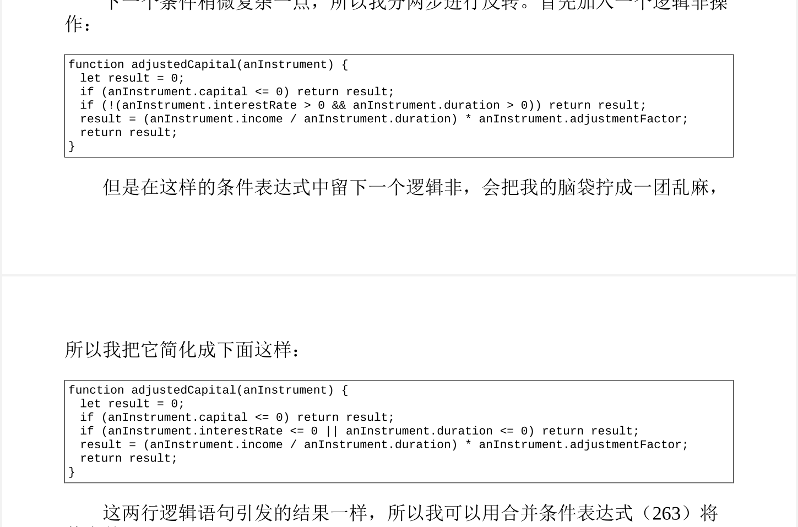

## 重构原则


何为重构:对软件内部结构的一种调整，目的是在不改变软件可观察行为的前提下，提高其可理解性，降低其修改成本

两顶帽子: 添加新功能和重构。添加新功能时，我不应该修改既有代码，只管添加新功能;重构时我就不能再添加功能，只管调整代码的结构

何时重构:Don Roberts给了我一条准则：第一次做某件事时只管去做；第二次做类似的事会产生反感，但无
论如何还是可以去做；第三次再做类似的事，你就应该重构。


## 第一组重构

### 提炼函数（Extract Method）

曾用名：提炼函数（Extract Method）

反向重构：内联函数


**将意图与实现分开**

> 如果你需要花时间浏览一段代码才能弄清它到底在干什么，那么就应该将其提炼到一个函数中.并根据它所做的事为其命名

### 内联函数（Inline Method）

曾用名：内联函数（Inline Method）
反向重构：提炼函数

### 提炼变量（Extract Variable）

曾用名：引入解释性变量（Introduce Explaining Variable）

**表达式过于复杂**，如圆的面积`pi*math.power(r,2)`


### 内联变量

曾用名：内联临时变量（Inline Temp）


### 改变函数声明

迁移式做法，将要改变的函数内部提炼成一个新的函数

```
function circum(radius) {
	return 2 * Math.PI * radius;
}
// 迁移式做法，为circum改名，将circum标注为@deprecated
@deprecated
function circum(radius) {
	return circumference(radius);
}
function circumference(radius) {
	return 2 * Math.PI * radius;
}

```

### 封装变量

用函数封装变量，如public修饰的字段

如果变量被广泛使用，考虑运用封装变量（132）将其封装起来


引入参数对象，将对象封装成类


函数组合成类：对同一类数据操作的函数

## 封装

### 封装记录

可变数据：封装成类，通过copy将原来的数据转换成类中的字段，不修改原来的数据

记录型结构

- 需声明合法的字段名字
- 随机使用任何字段名称，如map，list，json散列
  - 小范围使用没有问题
  - 大范围使用由于不知道map里的字段，难以阅读，应该封装成类

### 封装集合

封装集合时人们常常犯一个错误：只对集合变量的访问进行了封装，但依然让取值函数返回集合本身。这使得集合的成员变量可以直接被修改，而封装它的类则全然不知，无法介入。


为避免此种情况，我会在类上提供一些修改集合的方法——通常是“添加”和“移除”方法，但是别人还是可能会直接修改集合中的元素，最好的办法是不要让集合的取值函数返回原始集合

### 以对象取代基本类型

### 以查询取代临时变量

将临时变量抽取到函数里


### 提炼类

### 内联类

### 隐藏委托关系

### 移除中间人

### 替换算法

## 搬移

拆分循环，提炼函数，以管道取代循环

> 拆分循环: 一次循环只做一次事情
>
> 提炼函数：将循环封装成一个函数
>
> 以管道取代循环：使用stream流


## 重新组织数据

循环变量

收集变量

一个变量应该承担一个责任，如果承担多个责任，该变量应该被拆分为多个变量

变量是以输入参数的形式声明又在函数内部被再次赋值，此时也可以考虑拆分变量


尽量把可变数据的作用域限制在最小范围


一种是对象风格，把一系列计算得出的属性包装在数据结构中；

另一种是函数风格，将一个数据结构变换为另一个数据结构。如果源数据会被修改，而你必须负责管理派生数据结构的整个生命周期，那么对象风格显然更好。

但如果源数据不可变，或者派生数据用过即弃，那么两种风格都可行。


可以及时计算（可变数据）的变量应该用函数来代替变量


值对象：不变对象

引用对象：可变对象

## 简化条件逻辑

### 分解条件表达式

提炼条件变量，提炼分支，最后使用三元运算符

### 合并条件表达式

虽然条件变量不同，但是分支的结果相同，可以使用逻辑或进行整合，最后对条件变量提炼函数。

嵌套分支可以使用逻辑与


条件表达式两种风格

- 两个条件分支都属于正常行为

- 只有一套分支是正常行为，另外一条是异常行为

  > 如果某个条件极其罕见，就应该单独检查该条件，并在该条件为真时立刻从函数中返回。这样的单独检查称为“卫语句”

  

将条件表达式反转以卫语句取代嵌套条件表达式



