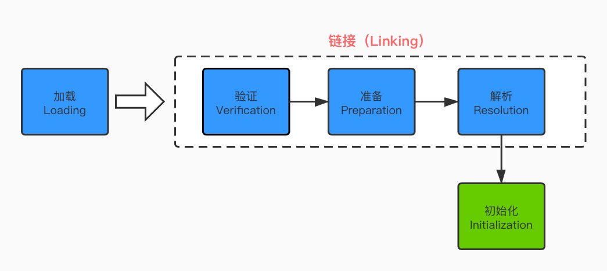
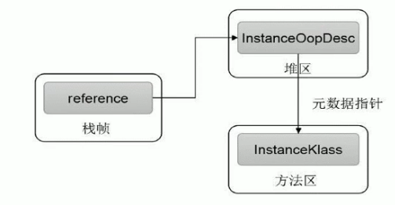
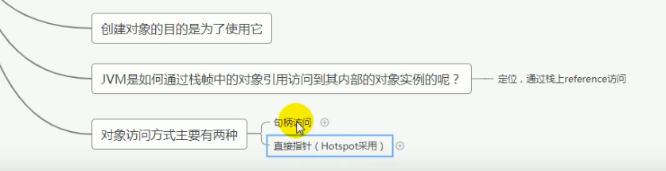

# JVM

## 1 JVM简介

### 1.1 虚拟机

- **JVM**：跨语言的平台，Java虚拟机平台上可以运行非Java语言编写的程序。只关心**“字节码”文件**
- **字节码**：平时说的java字节码，指 Java 语言编译的字节码，任何能在jvm平台上执行的字节码格式都是一样的，通称为**jvm字节码**。
- Java 虚拟机与 Java 语言并没有必然的联系，它只与特定的二进制文件格式-----**Class文件格式所关联**，Class文件中包含了 Java 虚拟机指令集（字节码，Bytecodes）和符号表，还有一些其他辅助信息
- 虚拟机
  - 系统虚拟机： Visual Box， VMware,是对**物理计算机的仿真**，提供了一个可运行完整操作系统的软件平台。
  - 程序虚拟机：Java虚拟机，**专门执行为单个计算机程序而设计**

### 1.2 JVM

- JVM : Java Virtual Machine

- HotSpot VM 是目前市面上高性能虚拟机的代表作之一

- 是一台执行Java字节码的虚拟计算机，拥有独立的运行机制，其运行的Java字节码也未必由Java语言编译而成。
- 提供跨平台性，垃圾回收器，以及可靠的即时编译器
- 作用：二进制字节码的运行环境
- 特点：
  - 一次编译，到处运行
  - 自动内存管理
  - 自动垃圾回收功能
  - 

### 1.3 JVM 位置


- JDK( JRE (JVM))

### 1.4 JVM整体架构


1. **方法区和堆区**是所有**线程共享**的内存区域；而**java栈、本地方法栈和程序员计数器**是**线程私有**的内存区域。　　

2. 方法区（永久代）在jdk8中又叫做**元空间Metaspace**

3. java代码执行流程：

   java程序--（编译javac）-->字节码文件.class-->类装载子系统化身为反射类Class--->运行时数据区--->（解释执行）-->操作系统（Win，Linux，Mac JVM）

### 1.5 JVM架构模型

- JVM -- 基于栈的指令集架构
- 基于栈的指令集架构
  - 跨平台性、指令集小、指令多；执行性比寄存器差
- 基于寄存器的指令集架构
  - 寄存器：指令少


### 1.6 JVM生命周期

1. 启动
   - 通过引导类加载器（bootstrap class loader）创建一个初始类（initial class）来完成的，这个类是由虚拟机的具体实现指定的.

2. 执行
   - 一个运行中的java虚拟机有着一个清晰的任务：执行Java程序；
   - 程序开始执行的时候他才运行，程序结束时他就停止；
   - 执行一个所谓的**Java程序**的时候，真真正正在执行的是一个叫做**Java虚拟机的进程**。
3. 退出
   - 程序正常执行结束
   - 程序异常或错误而异常终止
   - 操作系统错误导致终止
   - 某线程调用Runtime类或System类的exit方法，或Runtime类的halt方法，并且java安全管理器也允许这次exit或halt操作
   - 除此之外，JNI规范描述了用JNI Invocation API来加载或卸载Java虚拟机时，Java虚拟机的退出情况

## 2 类加载子系统

### 2.1 内存结构概述


### 2.2 类加载器与类的加载过程

#### 2.2.1 简介

1. 类加载子系统负责从文件系统或者网络中加载class文件，class文件在文件开头有特定的文件标识即16进制CA FE BA BE；

2. ClassLoader只负责class文件的加载，至于它是否可以运行，则由Execution Engine决定

3. 加载后的Class类信息存放于一块成为方法区的内存空间。除了类信息之外，方法区还会存放运行时常量池信息，可能还包括字符串字面量和数字常量（这部分常量信息是Class文件中常量池部分的内存映射）

4. **将class文件加载到方法区的内存空间中**

5. 类的加载过程

   

   

#### 2.2.2 Loading

1. 通过一个类的**全限定名**获取定义此类的**二进制字节流**；
2. 将这个字节流所代表的的静态存储结构转化为**方法区**(永久代,元空间)的运行时数据；
3. 在内存中生成一个代表这个类的**java.lang.Class对象**，作为方法区这个类的各种数据的**访问入口**

#### 2.2.3 Linking

Linking 分为三步 验证、准备、解析

- 验证
  1. 目的在于确保Class文件的字节流中包含信息符合当前虚拟机要求，**保证被加载类的正确性**，不会危害虚拟机自身安全。
  2. 主要包括四种验证，文件格式验证，源数据验证，字节码验证，符号引用验证。

- ### 准备

  1. 为**类变量分配内存**并且**设置该类变量的默认初始值，即零值**；
  2. 这里不包含用final修饰的static，因为**final在编译的时候就会分配**了，准备阶段会显式初始化；
  3. 这里**不会为实例变量分配初始化**，类变量会分配在方法区中，而实例变量是会随着对象一起分配到java堆中。

- ### 解析

  	1. 将常量池内的符号引用转换为直接引用的过程。
   	2. 事实上，解析操作往往会伴随着jvm在执行完初始化之后再执行
   	3. .符号引用就是一组符号来描述所引用的目标。符号应用的字面量形式明确定义在《java虚拟机规范》的class文件格式中。直接引用就是直接指向目标的指针、相对偏移量或一个间接定位到目标的句柄
   	4. 解析动作主要针对类或接口、字段、类方法、接口方法、方法类型等。对应常量池中的CONSTANT_Class_info/CONSTANT_Fieldref_info、CONSTANT_Methodref_info等。

```java
public class test {
    private static  int a = 1; //prepare: a=0 -----> initial: a=1

    public static void main(String[] args) {

        System.out.println(a);
    }
}

// javap -v test.class 反编译
Classfile /F:/Java/Java_Study/out/production/Java_Study/test/test.class
  Last modified 2020-5-23; size 572 bytes
  MD5 checksum 6bf99d0e2a66fc46fe64e68b5bd2d75a
  Compiled from "test.java"
public class test.test
  minor version: 0
  major version: 52
  flags: ACC_PUBLIC, ACC_SUPER
Constant pool:
   #1 = Methodref          #6.#23         // java/lang/Object."<init>":()V
   #2 = Fieldref           #24.#25        // java/lang/System.out:Ljava/io/PrintStream;
   #3 = Fieldref           #5.#26         // test/test.a:I
   #4 = Methodref          #27.#28        // java/io/PrintStream.println:(I)V
   #5 = Class              #29            // test/test
   #6 = Class              #30            // java/lang/Object
   #7 = Utf8               a
   #8 = Utf8               I
   #9 = Utf8               <init>
  #10 = Utf8               ()V
  #11 = Utf8               Code
  #12 = Utf8               LineNumberTable
  #13 = Utf8               LocalVariableTable
  #14 = Utf8               this
  #15 = Utf8               Ltest/test;
  #16 = Utf8               main
  #17 = Utf8               ([Ljava/lang/String;)V
  #18 = Utf8               args
  #19 = Utf8               [Ljava/lang/String;
  #20 = Utf8               <clinit>
  #21 = Utf8               SourceFile
  #22 = Utf8               test.java
  #23 = NameAndType        #9:#10         // "<init>":()V
  #24 = Class              #31            // java/lang/System
  #25 = NameAndType        #32:#33        // out:Ljava/io/PrintStream;
  #26 = NameAndType        #7:#8          // a:I
  #27 = Class              #34            // java/io/PrintStream
  #28 = NameAndType        #35:#36        // println:(I)V
  #29 = Utf8               test/test
  #30 = Utf8               java/lang/Object
  #31 = Utf8               java/lang/System
  #32 = Utf8               out
  #33 = Utf8               Ljava/io/PrintStream;
  #34 = Utf8               java/io/PrintStream
  #35 = Utf8               println
  #36 = Utf8               (I)V
{
  public test.test();
    descriptor: ()V
    flags: ACC_PUBLIC
    Code:
      stack=1, locals=1, args_size=1
         0: aload_0
         1: invokespecial #1                  // Method java/lang/Object."<init>":()V
         4: return
      LineNumberTable:
        line 3: 0
      LocalVariableTable:
        Start  Length  Slot  Name   Signature
            0       5     0  this   Ltest/test;

  public static void main(java.lang.String[]);
    descriptor: ([Ljava/lang/String;)V
    flags: ACC_PUBLIC, ACC_STATIC
    Code:
      stack=2, locals=1, args_size=1
         0: getstatic     #2                  // Field java/lang/System.out:Ljava/io/PrintStream;
         3: getstatic     #3                  // Field a:I
         6: invokevirtual #4                  // Method java/io/PrintStream.println:(I)V
         9: return
      LineNumberTable:
        line 8: 0
        line 9: 9
      LocalVariableTable:
        Start  Length  Slot  Name   Signature
            0      10     0  args   [Ljava/lang/String;

  static {};
    descriptor: ()V
    flags: ACC_STATIC
    Code:
      stack=1, locals=0, args_size=0
         0: iconst_1
         1: putstatic     #3                  // Field a:I
         4: return
      LineNumberTable:
        line 4: 0
}
SourceFile: "test.java"

```

#### 2.2.4 Initialization

1. 初始化阶段就是**执行类构造器方法clinit（）的过程**
2. clinit()即“class or interface initialization method”，注意他并不是指构造器init()
3. 此方法不需要定义，是javac编译器自动收集类中的所有**类变量的赋值动作和静态代码块中的语句合并而来**
4. 若该类具有父类，JVM会保证子类的\<clinit\>()执行前，父类的\<clinit\>()已经执行完毕
5. 虚拟机必须保证一个类的\<clinit\>()方法在多线程下被同步加锁（只被初始化一次）

- 有静态代码块---> 有类构造器方法clinit（）

  ```java
  public class ClassInitTest {
      private static int num = 1;
  
      static {
          num = 2;
          number = 20;
          System.out.println(num);
  //        System.out.println(number); // 报错：非法的前向引用
      }
      private static int number = 10; //linking之prepare: number = 0 --> inital: 20-->10
  
      public static void main(String[] args) {
          System.out.println(ClassInitTest.num); //2
          System.out.println(ClassInitTest.number); // 10
      }
  }
  ```

  

- 无Clinit

  ```java
  public class ClinitTest {
      private int a=1;

      public static void main(String[] args) {
          int b = 2;
      }
  }
  ```
  
  


### 2.3 类加载器分类

#### 2.3.1 介绍

1. JVM支持两种类型的加载器，分别为**引导类加载器C/C++实现（BootStrap ClassLoader）**和**自定义类加载器由Java实现（ClassLoader = {System Class Loader= App Class Loader + Extension ClassLoader + User Defined Class Loader}）**
2. 从概念上来讲，自定义类加载器一般指的是程序中由开发人员自定义的一类类加载器，但是java虚拟机规范却没有这么定义，而是**将所有派生于抽象类ClassLoader的类加载器都划分为自定义类加载器**。


​				ps: 注意上图中的加载器划分关系为包含关系，并不是继承关系


#### 2.3.2 自定义类与核心类库的加载器

1. 对于**用户自定义类**来说：将使用系统类**System ClassLoader加载器中的AppClassLoader进行加载**
2. **java核心类库**都是使用引导类加载器**BootStrapClassLoader**加载的

```java
package test;

public class ClassLoaderTest {
    public static void main(String[] args) {
        // 获取系统类加载器
        ClassLoader systemClassLoader = ClassLoader.getSystemClassLoader();
        System.out.println(systemClassLoader);  // sun.misc.Launcher$AppClassLoader@18b4aac2

        // 获取其上层：扩展类加载器
        ClassLoader extClassLoader = systemClassLoader.getParent();
        System.out.println(extClassLoader);  // sun.misc.Launcher$ExtClassLoader@4554617c

        // 获取其上层: 获取不到引导类加载器
        ClassLoader bootstrapClassLoader = extClassLoader.getParent();
        System.out.println(bootstrapClassLoader); // null

        // 对于用户自定义类: 默认使用系统加载器进行加载
        ClassLoader classLoader = ClassLoaderTest.class.getClassLoader();
        System.out.println(classLoader); // sun.misc.Launcher$AppClassLoader@18b4aac2

        // String类使用引导类加载器 ---> 系统使用的核心类库都是使用引导类加载器
        ClassLoader classLoader1 = String.class.getClassLoader();
        System.out.println(classLoader1);  // null
    }
}
```

#### 2.3.3 虚拟机自带的加载器

**启动类加载器（引导类加载器，BootStrap ClassLoader）**

1.这个类加载使用**C/C++语言实现的**，嵌套在JVM内部

2.它用来**加载java的核心库**（JAVA_HOME/jre/lib/rt.jar/resources.jar或sun.boot.class.path路径下的内容），用于提供JVM自身需要的类

3.并不继承自java.lang.ClassLoader,没有父加载器

4.**加载拓展类和应用程序类加载器，并指定为他们的父加载器**，即ClassLoader

5.出于安全考虑，BootStrap启动类加载器只加载包名为java、javax、sun等开头的类

**拓展类加载器（Extension ClassLoader）**

1.java语言编写 ，由sun.misc.Launcher$ExtClassLoader实现。

2.派生于ClassLoader类

3.从java.ext.dirs系统属性所指定的目录中加载类库，或从JDK的安装目录的jre/lib/ext子目录（扩展目录）下加载类库。**如果用户创建的JAR放在此目录下，也会由拓展类加载器自动加载**

**应用程序类加载器（系统类加载器，AppClassLoader）**

1.java语言编写， 由sun.misc.Launcher$AppClassLoader实现。

2.派生于ClassLoader类

3.它负责加载环境变量classpath或系统属性 java.class.path指定路径下的类库

**4.该类加载器是程序中默认的类加载器**，一般来说，java应用的类都是由它来完成加载

5.通过ClassLoader#getSystemClassLoader()方法可以获取到该类加载器

```java
/**
 * 虚拟机自带加载器
 */
public class ClassLoaderTest1 {
    public static void main(String[] args) {
        System.out.println("********启动类加载器*********");
        URL[] urls = sun.misc.Launcher.getBootstrapClassPath().getURLs();
        //获取BootStrapClassLoader能够加载的api路径
        for (URL e:urls){
            System.out.println(e.toExternalForm());
        }

        //从上面的路径中随意选择一个类 看看他的类加载器是什么
        //Provider位于 /jdk1.8.0_171.jdk/Contents/Home/jre/lib/jsse.jar 下，引导类加载器加载它
        ClassLoader classLoader = Provider.class.getClassLoader();
        System.out.println(classLoader);//null

        System.out.println("********拓展类加载器********");
        String extDirs = System.getProperty("java.ext.dirs");
        for (String path : extDirs.split(";")){
            System.out.println(path);
        }
        //从上面的路径中随意选择一个类 看看他的类加载器是什么:拓展类加载器
        ClassLoader classLoader1 = CurveDB.class.getClassLoader();
        System.out.println(classLoader1);//sun.misc.Launcher$ExtClassLoader@4dc63996
    }
}
```

### 2.4 ClassLoader的使用说明

ClassLoader类，它是一个抽象类，其后所有的类加载器都继承自ClassLoader（不包括启动类加载器）


```java
package test;

public class ClassLoaderTest2 {
    public static void main(String[] args) throws ClassNotFoundException {
        ClassLoader classLoader = Class.forName("java.lang.String").getClassLoader();
        System.out.println(classLoader);
        // null

        ClassLoader classLoader1 = Thread.currentThread().getContextClassLoader().getParent();
        System.out.println(classLoader1);
        // sun.misc.Launcher$AppClassLoader@18b4aac2

        ClassLoader classLoader3 = Thread.currentThread().getContextClassLoader().getParent();
        System.out.println(classLoader3);
        // sun.misc.Launcher$ExtClassLoader@4554617c

        ClassLoader classLoader2 = ClassLoader.getSystemClassLoader();
        System.out.println(classLoader2);
        // sun.misc.Launcher$AppClassLoader@18b4aac2

    }
}

```

### 2.5 双亲委派机制

​		Java虚拟机对**class文件**采用的是**按需加载**的方式，也就是说当需要使用该类时才会将她的class文件加载到内存生成的class对象。而且加载某个类的class文件时，java虚拟机采用的是双亲委派模式，即**把请求交由父类处理**，它是一种任务委派 模式

#### 2.5.1 双亲委派机制工作原理


当类加载器收到类加载请求时，将该请求一直向父类委托去执行，请求最终到达顶层的启动类加载器；如果父类无法加载任务，子加载器自己去加载。

```java
package java.lang;

public class String {
    // 静态代码块在 类的加载中的初始化过程执行
    static {
        System.out.println("我是自定义的String类的静态代码块");
    }
}

-------------------------------------------------------------------
    
package test;

public class StringTest {
    public static void main(String[] args) {
        String str = new java.lang.String();
        System.out.println("Hello, World!");
        // Hello, World!
        
        StringTest stringTest = new StringTest();
        System.out.println(stringTest.getClass().getClassLoader());
        // sun.misc.Launcher$AppClassLoader@18b4aac2
    }
}
    
```

String类的加载器为引导类加载器，引导类加载器中没有main方法。

```java
package java.lang;

public class String {
    // 静态代码块在 类的加载中的（初始化）过程  执行
    static {
        System.out.println("我是自定义的String类的静态代码块");
    }

    public static void main(String[] args) {
        System.out.println("Hello, String");
    }
}

错误: 在类 java.lang.String 中找不到 main 方法, 请将 main 方法定义为:
   public static void main(String[] args)
否则 JavaFX 应用程序类必须扩展javafx.application.Application
```

#### 2.5.2 双亲委派机制的优势

1. 避免类的重复加载
2. 保护程序安全，防止核心API被随意修改，沙箱安全机制

### 2.6 其他

#### 2.6.1 同一个类

- 在jvm中表示两个class对象是否为同一个类存在的两个必要条件

  1. 类的完整类名必须一致，包括包名
  2. 即使类的完整类名一致，同时要求加载这个类的ClassLoader（指ClassLoader实例对象）必须相同；是引导类加载器、还是定义类加载器

- 换句话说，在jvm中，即使这两个类对象（class对象）来源同一个Class文件，被同一个虚拟机所加载，但只要加载它们的ClassLoader实例对象不同，那么这两个类对象也是不相等的.

- 对类加载器的引用，JVM必须知道一个类型是由启动类加载器加载的还是由用户类加载器加载的。如果一个类型由用户类加载器加载的，那么jvm会**将这个类加载器的一个引用作为类型信息的一部分保存在方法区中**。当解析一个类型到另一个类型的引用的时候，JVM需要保证两个类型的加载器是相同的。

#### 2.6.2 类的主动使用和被动使用

**java程序对类的使用方式分为：主动使用和被动使用，即是否调用了clinit()方法**

主动使用在类加载系统中的第三阶段initialization即初始化阶段调用了clinit()方法

而被动使用不会去调用

主动使用，分为七种情况

1. 创建类的实例

2. 访问某各类或接口的静态变量，或者对静态变量赋值

3. 调用类的静态方法

4. 反射 比如Class.forName(com.dsh.jvm.xxx)

5. 初始化一个类的子类

6. java虚拟机启动时被标明为启动类的类

7. JDK 7 开始提供的动态语言支持：java.lang.invoke.MethodHandle实例的解析结果REF_getStatic、REF_putStatic、REF_invokeStatic句柄对应的类没有初始化，则初始化

除了以上七种情况，其他使用java类的方式都被看作是对**类的被动使用，都不会导致类的初始化。**

## 3 运行时数据区概述及线程

3.1 运行时数据区


Java虚拟机定了了若干种程序运行期间会使用到的运行时数据区，其中有一些会随着虚拟机启动而创建（进程），随着虚拟机退出而销毁。另外一些则是与线程一一对应的，这些与线程对应的数据区域会随着线程开始和结束而创建和销毁。
 如图，灰色的区域为单独线程私有的，红色的为多个线程共享的，即


### 3.2 Java中的线程与进程

1. 每个线程：独立包括程序计数器、栈、本地栈
2. 线程间共享：堆、堆外内存（方法区、永久代或元空间、代码缓存）


ps: 一般来说，jvm优化95%是优化堆区，5%优化的是方法区，至于栈区无非出入栈操作优化较少

### 3.3 Rutime

每个Java应用程序都有一个Runtime类的实例，该实例允许该应用程序与运行该应用程序的环境进行交互。 当前运行时可以从getRuntime方法获得。

### 3.4 线程

1. 线程是一个程序里的运行单元，JVM允许一个程序有多个线程并行的执行；
2. 在HotSpot JVM，每个线程都与操作系统的本地线程直接映射。
   - 当一个java线程准备好执行以后，此时一个操作系统的本地线程也同时创建。java线程执行终止后。本地线程也会回收。

3. 操作系统负责所有线程的安排调度到任何一个可用的CPU上。一旦本地线程初始化成功，它就会调用java线程中的run（）方法.

## 4 程序计数器（PC寄存器）

### 4.1 介绍

​		JVM中的程序计数寄存器（Program Counter Register）中，Register的命名源于CPU的寄存器，寄存器存储指令相关的现场信息。CPU只有把数据装载到寄存器才能够运行。**JVM中的PC寄存器是对物理PC寄存器的一种抽象模拟**。

​		一个线程对应一个 JVM Stack。JVM Stack 中包含一组 Stack Frame。当 JVM 调用一个 Java 方法时，它从对应类的类型信息中得到此方法的局部变量区和操作数栈的大小，并据此分配栈帧内存，然后压入 JVM 栈中。

在活动线程中，只有位于栈顶的栈帧才是有效的，称为当前栈帧，与这个栈帧相关联的方法称为当前方法。


**作用**：用来**存储指向下一条指令的地址**，也即将要执行的指令代码。由执行引擎读取下一条指令。	

-  很小的内存空间，几乎可以忽略。

- 在JVM规范中，每个线程都有它自己的程序计数器，是线程私有的，生命周期与线程的生命周期一致

- 任何时间一个线程都只有一个方法在执行，也就是所谓的**当前方法**。程序计数器会存储当前线程正在执行的java方法的JVM指令地址；或者，如果实在执行native方法，则是未指定值（undefined）,因为程序计数器不负责本地方法栈。

- 它是程序控制流的指示器，分支、循环、跳转、异常处理、线程恢复等基础功能都需要依赖这个计数器来完成

- 字节码解释器工作时就是通过改变这个计数器的值来选取吓一跳需要执行的字节码指令

- 它是唯一一个在java虚拟机规范中**没有规定任何OOM（Out Of Memery）情况**的区域,而且**没有垃圾回收（GC）**

### 4.2 举例说明

```java
package test;

public class PCRegisterTest {
    public static void main(String[] args) {
        int i = 10;;
        int j = 20;
        int k = i+j;

        String s = "abc";
        System.out.println(i);
        System.out.println(k);
    }
}
```


### 4.3 相关面试题

#### 4.3.1 问题1

- 使用PC寄存器存储字节码指令地址有什么用呢（为什么使用PC寄存器记录当前线程的执行地址呢）？
  - 多线程宏观上是并行（多个事件在同一时刻同时发生）的，但实际上是并发交替执行的
  - 因为CPU需要不停的切换各个线程，这时候切换回来以后，就得知道接着从哪开始继续执行
  - JVM的字节码解释器就需要通过改变PC寄存器的值来明确下一条应该执行什么样的字节码指令
  - 所以，众多线程在并发执行过程中，任何一个确定的时刻，一个处理器或者多核处理器中的一个内核，只会执行某个线程中的一条指令。这样必然导致经常中断或恢复，如何保证分毫无差呢？每个线程在创建后，都会产生自己的程序计数器和栈帧，程序计数器在各个线程之间互不影响。

#### 4.3.2 问题2

- PC寄存器为什么会设定为线程私有？
  - 我们都知道所谓的多线程在一个特定的时间段内只会执行其中某一个线程的方法，CPU会不停滴做任务切换，这样必然会导致经常中断或恢复，如何保证分毫无差呢？
  - 为了能够**准确地记录各个线程正在执行的当前字节码指令地址**，最好的办法自然是**为每一个线程都分配一个PC寄存器,**这样一来各个线程之间便可以进行独立计算，从而不会出现相互干扰的情况。

#### 4.3.3 并行与并发

并行 vs 串行

并发，一个核控制多个线程，线程之间相互切换，但是看起来像并行

## 5 虚拟机栈

### 5.1 虚拟机栈概述

#### 5.1.1 优点

​		由于跨平台性的设计，java的指令都是根据栈来设计的。不同平台CPU架构不同，所以不能设计为基于寄存器的。 根据栈设计的**优点是跨平台，指令集小，编译器容易实现，缺点是性能下降，实现同样的功能需要更多的指令。**

#### 5.1.2 内存中的堆与栈

- **栈是运行时的单位**，**堆是存储的单位**
  - 栈解决程序的运行问题，即程序如何执行，或者说如何处理数据。堆解决的是数据存储的问题，即数据怎么放、放在哪儿。
  - 一般来讲，对象主要都是放在堆空间的，是运行时数据区比较大的一块
  - 栈空间存放 基本数据类型的局部变量，以及引用数据类型的对象的引用

#### 5.1.3 Java虚拟机栈

- Java虚拟机栈（Java Virtual Machine Stack）,
  - 每个线程在创建时都会创建一个虚拟机栈，其内部保存一个个的栈帧（Stack Frame），对应着一次次的Java方法调用。
  - 线程私有的
  - 生命周期和线程一致。
  - 作用：主管Java程序的运行，它保存方法的局部变量（8种基本数据类型、对象的引用地址）、部分结果，并参与方法的调用和返回
    - 局部变量 vs 成员变量（属性）
    - 基本数据类型 vs 引用类型变量（类，数组，接口）
- 线程---->虚拟机栈【栈帧=方法， 栈帧=方法】


#### 5.1.4 栈的特点（优点）


- 栈是一种快速有效的分配存储方式，访问速度仅次于程序计数器（只记录下一条指令的位置）

- JVM直接对java栈的操作只有两个

  - 每个方法执行，伴随着进栈（入栈，压栈）
  - 执行结束后的出栈工作

- 对于栈来说不存在垃圾回收(GC)问题, 但是肯定存在OOM异常

#### 5.1.5 栈的常见错误

java虚拟机规范允许**Java栈的大小是动态的或者是固定不变的**

- 如果采用固定大小的Java虚拟机栈，那每一个线程的java虚拟机栈容量可以在线程创建的时候独立选定。如果线程请求分配的栈容量超过java虚拟机栈允许的最大容量，java虚拟机将会抛出一个 **StackOverFlowError**异常

  ```java
  public class StackErrorTest {
      public static void main(String[] args) {
          main(args);
      }
  }
  
  // Exception in thread "main" java.lang.StackOverflowError
  ```

- 如果java虚拟机栈可以动态拓展，并且在尝试拓展的时候无法申请到足够的内存，或者在创建新的线程时没有足够的内存去创建对应的虚拟机栈，那java虚拟机将会抛出一个 **OutOfMemoryError异常**

### 5.2 栈的存储单位

#### 5.2.1 栈中存储什么

- 每个线程都有自己的栈，栈中的数据都是以**栈帧(Stack Frame)**的格式存在
- 在这个线程上正在执行的每个方法都对应各自的一个栈帧
- 栈帧是一个内存区块，是一个数据集，维系着方法执行过程中的各种数据信息
- .JVM直接对java栈的操作只有两个，就是对栈帧的压栈和出栈，遵循先进后出/后进先出的和原则。
- 在一条活动线程中，一个时间点上，只会有一个活动的栈帧。即只有当前正在执行的方法的栈帧（栈顶栈帧）是有效的，这个栈帧被称为**当前栈帧(Current Frame)**,与当前栈帧对应的方法就是**当前方法（Current Method）**，定义这个方法的类就是当前类（Current Class）
- 执行引擎运行的所有字节码指令只针对当前栈帧进行操作
- 如果在该方法中调用了其他方法，对应的新的栈帧会被创建出来，放在栈的顶端，成为新的当前栈帧。
- 不同线程中所包含的栈帧是不允许相互引用的，即不可能在另一个栈帧中引用另外一个线程的栈帧
- 如果当前方法调用了其他方法，方法返回之际，当前栈帧会传回此方法的执行结果给前一个栈帧，接着，虚拟机会丢弃当前栈帧，使得前一个栈帧重新成为当前栈帧
- Java方法有两种返回函数的方式，**一种是正常的函数返回，使用return指令；另外一种是抛出异常。不管使用哪种方式，都会导致栈帧被弹出。**

```java
package test;

public class StackFrameTest {
    public static void main(String[] args) {
        try {
            StackFrameTest test = new StackFrameTest();
            test.method1();
        } catch (Exception e) {
            e.printStackTrace();
        }
        System.out.println("正常执行。。。");
    }
    
    public void method1(){
        System.out.println("method1()开始执行。。。");
        method2();
        System.out.println("method1()执行结束。。。");
        System.out.println(10/0);
    }

    private int method2() {
        System.out.println("method2()开始执行。。。");
        int i = 10;
        int m = (int) method3();
        System.out.println("method2()即将结束。。。");
        return i + m ; // ireturn 
    }

    private double method3() {
        System.out.println("method3()开始执行。。。");
        double j = 20.0;
        System.out.println("method3()即将结束。。。");
        return j;  // dreturn
    }
}

method1()开始执行。。。
method2()开始执行。。。
method3()开始执行。。。
method3()即将结束。。。
method2()即将结束。。。
method1()执行结束。。。
正常执行。。。
java.lang.ArithmeticException: / by zero
	at test.StackFrameTest.method1(StackFrameTest.java:18)
	at test.StackFrameTest.main(StackFrameTest.java:7)

Process finished with exit code 0

```

#### 5.2.2 栈帧内部结构

每个栈存储着：

- 局部变量表（Local Variables）

- 操作数栈（Operand Stack / 表达式栈）

- 动态链接（Dynamic Linking / 指向运行时常量池的方法应用）

- 方法返回地址（Return Address）（或方法正常退出或者异常退出的定义）

- 一些附加信息

  

### 5.3 局部变量表

- 局部变量表也被称之为局部变脸数组或本地变量表
- 定义为一个**数字数组**，主要用于**存储方法参数和定义在方法体内的局部变量**，这些数据类型包括各类**基本数据类型**，**对象引用（reference）,一级returnAddress类型**。
- 由于局部变量表是建立在线程的栈上，是线程的私有数据，因此**不存在数据安全问题**
- **局部变量表所需的容量大小是在编译期确定下来的**，并保存在方法的Code属性的maxmum local variables数据项中。在方法运行期间是不会改变局部变量表的大小的
- **方法嵌套调用的次数由栈的大小决定。栈越大，方法嵌套调用次数越多**。对一个函数而言，它的参数和局部变量越多，使得局部变量表膨胀，它的栈帧就越大。
- **局部变量表中的变量只在当前方法调用中有效**。在方法执行时，虚拟机通过使用局部变量表完成参数值到参数变量列表的传递过程。**当方法调用结束后，随着方法栈帧的销毁，局部变量表也随之销毁**

#### 5.3.1 Slot

- 参数值得存放总是在局部变量数组的index0开始，到数组长度-1的索引结束
- **局部变量表，最基本的存储单元是Slot(变量槽)**
- 局部变量表中存放编译期可知的各种基本数据类型（8种），引用类型（reference），returnAddress类型的变量。
- 在局部变量表里，**32位以内的类型只占一个slot**（包括returnAddress类型），**64位的类型占两个slot**（包括long，double） index:3--->5
  - byte, short, char, 在存储钱被转换为int，boolean 也被转换为 int， 0 表示 false， 非0 表示true
  - long， double 则 占两个slot
- JVM会为局部变量表中的每一个slot都分配一个访问索引，**通过访问索引访问**局部变量表中指定的**局部变量值**
- 当一个实例方法被调用的时候，它的方法参数和方法体内部定义的**局部变量将会按照顺序被复制到局部变量表中的每一个Slot上**
- 如果访问局部变量表中一个64bit的局部变量值时，只需要使用前一个索引即可。
- 如果当前帧是由**构造方法或者实例方法**(非static 方法)创建的，那么**该对象的引用this将会存放在index为0的slot处（所以this是指向指向当前方法的引用）**，其余参数按照参数列表顺序继续排列

```java
package test;

public class ThisTest {
    public ThisTest(){
        int count = 0;
    }

    public static void main(String[] args) {
        ThisTest thisTest = new ThisTest();
        int count = 10;
//        System.out.println(count);
        // this 变量不存在于当前方法的局部变量表中
        System.out.println(this.count);
        // Error:(12, 28) java: 无法从静态上下文中引用非静态 变量 this
    }
}

```

#### 5.3.2 Slot的重复利用

- 栈帧中的局部变量表中的**槽位是可以重复利用**的，如果一个局部变量过了其作用域，那么在其作用域之后申明的新的局部变量就有可能会复用过期局部变量的槽位，从而达到节省资源的目的。
- 

#### 5.3.3 静态变量与局部变量的对比

- 变量的分类

  - 按照数据类型分
    - 基本数据类型
    - 引用数据类型
  - 按照在类中声明的位置分
    - 成员变量：在使用前，都经过默认初始化赋值
      - 类变量/静态变量：linking的prepare阶段：给类变量默认赋值  ----->  initial阶段 ：给类变量显式赋值即静态代码块赋值
      - 实例变量：随着对象的创建，会在堆空间中分配实例变量空间，进行默认赋值
    - 局部变量：在**使用前要进行显式赋值**！否则，编译不通过。

#### 5.3.4 补充说明

- 在栈帧中，与性能调优关系最为密切的部分就是前面提到的局部变量表。在执行时，**虚拟机使用局部变量表完成方法的传递**。
- 局部变量表中的变量也是重要的垃圾回收根节点，只要被局部变量表中**直接或间接引用的对象都不会被回收**

### 5.4 操作数栈

- 每一个独立的栈帧中除了包括局部变量表以外，还包括一个先进后出的操作数栈，也可以称之为表达式栈（Expression stack）.

- 操作数栈，在方法执行过程中，根据字节码指令，往栈中写入数据或提取数据，即入栈（push）/出栈（pop）

- 操作数栈，**主要用于保存计算过程的中间结果，同时作为计算过程中变量临时的存储空间。** 
- 操作数栈就是JVM执行引擎的一个工作区，当一个方法刚开始执行的时候，一个新的栈帧也会随之被创建，**这个方法的操作数栈是空的**
- 每一个操作数栈都会有一个明确的栈深度用于存储数值，其所需的最大深度在编译期就定义好了，保存在Code属性中，为max_stack的值
- 栈中任何一个元素都是可以任意的Java数据类型。
  - 32bit的类型占用一个栈单位深度
  - 64bit的类型占用两个栈单位深度
- 操作数栈并非采用访问索引的方式来进行数据访问的，而是只能通过标准的入栈和出栈操作来完成一次数据范文
- 如果**被调用的方法带有返回值的话，其返回值将会被压茹当前栈帧的操作数栈中**，并更新PC寄存器中下一条需要执行的字节码指令。
- **JVM的解释引擎是基于栈的执行引擎**，其中的栈指的就是**操作数栈**

### 5.5 代码追踪

#### 5.5.1 Code

```java
public class OperandStackTest {
    public void testAddOperation(){
        // byte, short, char, boolean: 都以int类型来保存
        byte i = 15;
        int j = 8;
        int k = i+j;
    }
}


-----------------------------------------
 
栈深度为2，局部变量表中变量个数为4，index=0存放this    
stack=2, locals=4, args_size=1
 0 bipush 15 将15入栈   b -- byte
 2 istore_1	 出栈，写入局部变量表中index=1的slot处
 3 bipush 8  将int转换为byte
 5 istore_2
 6 iload_1   从局部变量表中取出变量，入栈
 7 iload_2
 8 iadd		执行引擎将字节码装换成机械指令，使用CPU运输
 9 istore_3
10 return
    
    
```


```java
public  int getSUm(){
        int m = 10;
        int n = 20;
        int k = m + n;
        return k;
    }

    public void testGetSUm(){
        // 获取上一个栈帧返回的结果，并保存在栈中
        int i = getSUm();
        int j = 10;
    }
_________________________________________
 0 bipush 10
 2 istore_1
 3 bipush 20
 5 istore_2
 6 iload_1
 7 iload_2
 8 iadd
 9 istore_3
10 iload_3
11 ireturn
    
    
0 aload_0
1 invokevirtual #2 <test/OperandStackTest.getSUm>
4 istore_1
5 bipush 10
7 istore_2
8 return

```

#### 5.5.2 面试题 i++与++i


### 5.6 栈顶缓存技术

- 基于栈式架构的虚拟机所使用的零地址指令更加紧凑，但完成一项操作的时候必须需要使用更多的入栈和出栈指令，这同时也就意味着需要更多的指令分派（instruction dispatch）次数和内存读/写次数。
- 由于操作数是存储在内存中的，因此频繁地执行内存读/写操作必然会影响执行速度。为了解决这个问题，HotSpot JVM的设计者们提出了栈顶缓存技术（Tos， Top-of-StackCashing）,**将栈顶元素全部缓存在物理CPU的寄存器中，以此降低对内存的读/写次数，提升执行引擎的执行效率。**

### 5.7 动态连接


- 动态连接 = 指向运行时常量池的方法引用
- 每一个栈帧内部都包含一个**指向运行时常量池中该栈帧所属方法的引用**。包含这个引用的目的就是为了支持当前方法的代码能够实现**动态连接**（Dynamic Linking）。比如：invokedynamic指令。
- 在**Java源文件**被编译到**字节码文件**时，**所有的变量和方法引用都作为符号引用（Symbolic Reference # 数字）保存在class文件的常量池中**。比如：描述一个方法调用了另外的其他方法时，就是通过常量池中指向方法的符号引用来表示的，那么**动态链接的作用**就是为了将这些**符号引用转换为调用方法的直接引用**。

```java
public class DynamicLinkingTest {

    int num = 10;

    public void methodA(){
        System.out.println("methodA()...");
    }
    public void methodB(){
        System.out.println("methodB()...");

        methodA();

        num++;
    }
}
```

```
public void methodB();
    descriptor: ()V
    flags: ACC_PUBLIC
    Code:
      stack=3, locals=1, args_size=1
         0: getstatic     #3                  // Field java/lang/System.out:Ljava/io/PrintStream;
         3: ldc           #6                  // String methodB()...
         5: invokevirtual #5                  // Method java/io/PrintStream.println:(Ljava/lang/String;
)V
         8: aload_0
         9: invokevirtual #7                  // Method methodA:()V
        12: aload_0
        13: dup
        14: getfield      #2                  // Field num:I
        17: iconst_1
        18: iadd
        19: putfield      #2                  // Field num:I
        22: return


3: ldc           #6                  // String methodB()...
Constant pool:
 #6 = String             #30            // methodB()...
 #30 = Utf8               methodB()...


9: invokevirtual #7                  // Method methodA:()V
Constant pool:
#7 = Methodref          #8.#31         // test/DynamicLinkingTest.methodA:()V

#8 = Class              #32            // test/DynamicLinkingTest
  #31 = NameAndType        #19:#13        // methodA:()V
  #32 = Utf8               test/DynamicLinkingTest
  
    #19 = Utf8               methodA
    #13 = Utf8               ()V

  

```


- 为什么需要常量池：为了提供一些符号和常量，便于指令的识别

### 5.8 方法的调用：解析与分派

#### 5.8.1 绑定

在JVM中，将符号引用转换成直接引用与方法的绑定机制相关

- 静态链接：被调用的目标方法在**编译器时**就被确认，将符号引用转换成直接引用的过程
- 动态链接：被调用的目标方法在**运行期时**就被确认，，将符号引用转换成直接引用的过程

对应方法的绑定机制：**绑定是一个字段、方法或者类在符号引用被替换为直接引用的过程，这仅仅发生一次**

- 早期绑定：**被调用的目标方法在编译器可知，且运行期保持不变**
- 晚期绑定：**被调用的方法在编译器无法确定下来，只能在程序运行期根据实际类型绑定相关的方法**

Java中任何一个方法都具备虚函数的特征，相当于C++中的关键字virtual。如果不希望某个方法拥有虚函数的特征时，使用final标识。

```java
package test;

class Animal{
    public void eat(){
        System.out.println("动物进食");
    }
}


interface Huntable{
    void hunt();
}


class Dog extends Animal implements Huntable{

    @Override
    public void eat(){
        System.out.println("狗吃骨头");
    }

    @Override
    public void hunt() {
        System.out.println("捕食耗子，多管闲事");
    }
}


class Cat extends Animal implements Huntable{
    public Cat(){
        super();
    }

    public Cat(String name){
        // 调用当前本类的构造器
        this();// 早期绑定

    }

    @Override
    public void eat() {
        super.eat();
        System.out.println("猫吃鱼");
    }

    @Override
    public void hunt() {
        System.out.println("猫抓老鼠，天经地义");
    }
}


public class AnimalTest {
    public void showAnimal(Animal animal){
        animal.eat();  // 晚期绑定
    }

    public void showHunt(Huntable h){
        h.hunt();  // 晚期绑定
    }

}

```

#### 5.8.2 虚方法与非虚方法

- 非虚方法：方法编译器在编译器确定了具体的调用版本
- 静态方法，私有方法，final方法，实例构造器，父类方法都是非虚方法，因为不能方法不能被重写
- 其他方法称为虚方法
- 子类多态性的使用前提：
  1. 类的继承关系
  2. 方法的重写

#### 5.8.3 虚拟机调用指令

- 普通调用指令：
  1. invokestatic：调用静态方法，解析阶段确定唯一方法版本
  2. invokespecial：调用<init>方法，私有及父类方法，解析阶段确定唯一方法版本
  3. invokevirtual：调用虚方法
  4. invokeinterface：调用接口方法
- 动态调用指令：
  5. invokedynamic：动态解析出来需要调用的方法，然后执行

- 前四条指令固化在虚拟机内部，方法的调用执行不可人为干预，而invokedynamic指令则支持由用户确定方法版本。**其中invokestatic指令和 invokespecial指令调用的方法称为非虚方法，其余的（final修饰的除外）称为虚方法。**

#### 5.8.4 invokedynamic指令

- Java7才加入invokedynamic指令，这是**Java为了实现【动态类型语言】支持而做的一种改进**
- Java7中并没有直接生成invokedynamic指令的方法，需要借助ASM这种底层字节码工具来产生invokedynamic指令。**直到Java8的Lambda表达式的出现，invokedynamic指令的生成，在Java中才有了直接的生成方式。**
- 动态类型语言与静态类型语言的区别在于对类型的检查是在编译器还是在运行期，满足前者就是静态类型语言，反之就是动态类型语言

```java
interface Func{
    public boolean func(String str);
}

public class Lambda {
    public void lambda(Func func){
        return;
    }

    public static void main(String[] args) {
        Lambda lambda = new Lambda();
        Func func = str -> {
            return  true;
        };

        lambda.lambda(func);

        lambda.lambda(str -> {return true;});
    }
}
```

main方法的字节码  Func func  -------    invokedynamic

```
 0 new #2 <test/Lambda>
 3 dup
 4 invokespecial #3 <test/Lambda.<init>>
 7 astore_1
 8 invokedynamic #4 <func, BootstrapMethods #0>
13 astore_2
14 aload_1
15 aload_2
16 invokevirtual #5 <test/Lambda.lambda>
19 aload_1
20 invokedynamic #6 <func, BootstrapMethods #1>
25 invokevirtual #5 <test/Lambda.lambda>
28 return

```

#### 5.8.5 虚方法表

- 方法重写的本质

1. 找到操作数栈顶的第一个元素所执行的对象的实际类型，记作C
2. 如果在类型C中找到与常量中的描述符合简单名称都相符的方法，则进行访问权限校验，如果通过则返回这个方法的直接引用，查找过程结束；如果不通过，则返回java.lang.IllegalAccessError异常。
3. 否则，按照继承关系从下往上依次对C的各个父类进行第2步的搜索和验证过程。
4. 如果始终没有找到合适的方法，则抛出java.lang.AbstractmethodError异常

- IllegalAccessError介绍

  程序试图访问或修改一个属性或调用一个方法，这个属性和方法，你没有访问权限。一般的会引起编译器异常，错误发生运行时，说明一个类发生了不兼容的改变。

- 虚方法表

  - 在面向对象的编程中，会频繁用到动态分派，为了**提高性能**，JVM采用在类的**方法区**建立一个**虚方法表（Virtual method table）(非虚方法不会出现在表中)来实现，使用索引表来代替栈**
  - 每个类都有一个虚方法表，表中存放着各个方法的实际入口。
  - 在类加载的Linking阶段被创建并开始初始化，类的变量初始化值准备完成之后，JVm把该类的方法表也初始化完毕
  - 
  - 上图左边就是虚方法表，当Cat类使用eat()方法时，直接调用，clone方法使用Object类

### 5.9 方法返回地址

- **存储调用该方法的PC寄存器（调用该方法指令的下一条指令的地址）的值**

- 方法结束的方式

  - 正常执行完成
  - 出现未处理的异常，非正常退出。返回地址用过异常表来确定

  ```
  返回指令   返回值的数据类型
  ireturn   boolean,byte,char,short,int
  lreturn   long 
  dreturn   double
  areturn   引用类型
  return     void，实例初始化方法，类和接口的初始化方法
  ```

- 本质上，**方法的退出**就是**当前栈帧出栈**的过程，此时，需要恢复上层的局部变量表，操作数栈，将返回值压入调用者栈帧的操作数栈，设置PC寄存器等

- **正常完成出口和异常完成出口的区别在于：通过异常完成出口退出的不会给他的上层调用者产生任何的返回值。**

### 5.10 一些附加信息

如对程序调试提供支持的信息

### 5.11  相关面试题

#### 5.11.1 举例栈溢出的情况？

- 通过-Xss设置栈的大小：OOM

#### 5.11.2 调整栈大小，就能保证不出现溢出吗？

- 不能保证

#### 5.11.3 分配的栈内存越大越好吗？

- 对于当前栈可以减少栈溢出的可能性
- 占用内存中的其他资源

#### 5.11.4 垃圾回收会涉及到虚拟机栈？

- 不会的
- 栈式结构不会存在GC，因为只有入栈和出栈操作，但是会存在栈溢出Error
- 方法区和堆中存在GC和Error

#### 5.11.5 方法中定义的局部变量是否线程安全？

- 具体问题具体分析

- 如果只有一个线程才操作此数据，则线程安全

- 如果有多个线程操作此数据，则此数据是共享数据。
  如果不考虑同步机制，会存在线程安全问题
  
- ```java
  public class StringBuilderTest {
  
      // s1的声明方式是线程安全的
      // 方法内部产生，内部消亡。i.e.: 在方法内部有完整的生命周期，线程安全
      public static void method1(){
          //StringBuilder: 线程不安全
          //StringBuffer: 线程安全
          StringBuilder s1 = new StringBuilder();
          s1.append("a");
          s1.append("b");
      }
  
      // 线程不安全，sBuilder是共享资源
      public static void method2(StringBuilder sBuilder){
          sBuilder.append("a");
          sBuilder.append("b");
      }
  
      // s1的操作：线程不安全,返回的s1可能被其他线程争抢
      public static StringBuilder method3(){
          StringBuilder s1 = new StringBuilder();
          sBuilder.append("a");
          sBuilder.append("b");
          return s1;
      }
  
      // s1的操作：是线程安全的
      public static String method4(){
          StringBuilder s1 = new StringBuilder();
          sBuilder.append("a");
          sBuilder.append("b");
          return s1.toString();
      }
      
      public static void main(String[] args) {
          StringBuilder s = new StringBuilder();
  
          new Thread(()->{
              s.append("a");
              s.append("b");
          }).start();
  
          method2(s);
      }
  }
  ```
  
## 6 本地方法接口

  ```java
  public class IHavaNatives{
  	public native void Native1(int x);
  }
  ```

- A native method is a Java method whose implementation is provided by non-java code。

- 如在C++中，extern "C" 告知C++编译器去调用一个C的函数

- 定义一个native method 时，并不提供实习体，因为其实现体是由非java语言在外面实现的。

- 为什么使用native method

  - 提高效率，有些任务用Java实现起来不容易
  - 与Java环境外交互：有时Java应用需要与Java外面的环境交互，这是本地方法存在的主要原因。
  - 与操作系统交互：通过使用本地方法，我们得以用Java实现了jre的与底层系统的交互，甚至JVM的一些部分就是用C写的
  - Sun's Java：Sun的解释器是用C实现的，这使得它能像一些普通的C一样与外部交互。

- 目前该方法使用的越来越少了，除非是与硬件有关的应用。

## 7 本地方法栈

hotspot


- **Java虚拟机栈**用于管理**Java方法**的调用，而**本地方法栈**用于管理**本地方法**的调用
- 本地方法栈，线程私有
- 本地方法使用C语言实现的
- 在Native Method Stack 中等级native方法，在Execution Engine执行时加载本地方法库
- 当某个线程调用一个本地方法时，它就进入了一个全新的并且不再受虚拟机限制的世界。它和虚拟机拥有同样的权限。
  - 本地方法可以通过本地方法接口来访问虚拟机内部的运行时数据区
  - 可以直接使用本地寄存器
  - 从本地内存的堆中分配任意数量的内存
- 并不是所有的JVM都支持本地方法。因为Java虚拟机规范并没有明确要求本地方法栈的使用语言、具体实现方式、数据结构等
- 在Hotspot JVM中，直接将本地方法栈和虚拟机栈合二为一

## 8 堆

一个进程对应一个JVM实例，对应一个运行时数据区

一个进程拥有多个线程，多个线程共享同一个堆空间，方法区

### 8.1 核心概述

#### 8.1.1 概述

- 一个JVM实例只存在一个堆内存，堆是Java内存管理的核心区域
- Java 堆区在JVM启动的时候即被创建，其空间大小也就确定，是JVM管理的最大一块内存空间
  - 堆内存的大小是可以调节的
- 堆可以处于物理上不连续的内存空间中，但是在逻辑上它应该被视为连续的
- 所有的线程共享Java堆，在这里还可以划分线程私有的缓冲区，（Thread Local Allocation Buffer, TLAB）
- 所有的对象实例以及数组都应当在运行时分配在堆上。
  - “几乎”所有的对象实例都在这里分配内存----从实际使用角度看的
- 数组和对象可能永远不会存储在栈上，因为栈中保存引用，这个引用指向对象或者数组在堆中的位置
- 在方法结束后，堆中的对象不回马上被移除，仅仅在垃圾收集的时候才会被移除
- 堆，是GC执行垃圾回收的重点区域


### 8.1.2 内存细分


```java
package test2;

// -Xms10m -Xmx10m
public class HeapDemo {
    public static void main(String[] args) throws InterruptedException {
        System.out.println("start...");

        try{
            Thread.sleep(1000000);
        }catch (InterruptedException e){
            e.printStackTrace();
        }

        System.out.println("end...");
    }
}

```

run ---> edit configurations


D:\Java\jdk1.8.0_151\bin jvisualvm.exe

工具---> 插件 ---> 安装visual GC


-XX:+PrintGCDetails


### 8.2 设置堆内存大小与OOM

#### 8.2.1 堆空间大小设置

- "-Xms" 用于表示堆区的最大的起始内存，等价于 “-XX:InitialHeapSize”
  - -X  JVM的运行参数
  - ms  = memory start
  
- "-Xmx" 则用于表示堆区的最大内存，等价于“-XX:MaxHeapSize”

- 一旦堆区中的内存大小超过“-Xmx”所指定的最大内存时，将会抛出OutofMemoryError异常

- 默认情况下，
  - 初始内存大小：物理电脑内存大小 / 64
  - 最大内存大小：物理电脑内存大小 / 4
  
- 查看设置的参数：

  - jps   /   jstat -gc 进程id

  - -XX:+PrintGCDetails

  - ```
     PSYoungGen      total 2560K(2048K+512K 年轻代只使用一个survival区), used 1702K [0x00000000ffd00000, 0x0000000100000000, 0x0000000100000000)
      eden space 2048K, 83% used [0x00000000ffd00000,0x00000000ffea9898,0x00000000fff00000)
      from space 512K, 0% used   [0x00000000fff80000,0x00000000fff80000,0x0000000100000000)
      to   space 512K, 0% used [0x00000000fff00000,0x00000000fff00000,0x00000000fff80000)
     ParOldGen       total 7168K, used 0K [0x00000000ff600000, 0x00000000ffd00000, 0x00000000ffd00000)
      object space 7168K, 0% used [0x00000000ff600000,0x00000000ff600000,0x00000000ffd00000)
     Metaspace       used 3179K, capacity 4496K, committed 4864K, reserved 1056768K
      class space    used 348K, capacity 388K, committed 512K, reserved 1048576K
    ```

### 8.3 年轻代与老年代

- 存储在JVM中的Java对象可以划分为两类：

  - 一类是生命周期较短的瞬时对象，这类对象的创造和消亡都非常迅速
  - 另外一类对象的生命周期却非常长，在某些极端的情况下还能够与JVM的生命周期保持一致

- Java堆区进一步细分

  - 年轻代（YoungGen）
    - Eden空间
    - Survivor0空间（from 区）
    - Survivor1空间（to 区）
  - 老年代（OldGen）

  


```java
package test2;

// -Xms600m -Xmx600m
// -XX:NewRation: 设置新新生代与老年的比列，默认值是2，新生代占1，老年代占2
// -XX:SurvivorRatio:设置新生代中Eden区与Survivor区的比列，默认值是8
// -XX:-UseAdaptiveSizePolicy: 关闭自适应的内存分配策略
public class EdenSurvivorTest {
    public static void main(String[] args) throws InterruptedException {
        System.out.println("打酱油。。。");
        Thread.sleep(1000000);
    }
}
```

- 几乎所有的Java对象都是在Eden区被new出来的
- 绝大部分的Java对象的销毁都在新生代进行了
  - 80%的对象都是“朝生夕死”的
- 可以使用“-Xmn”：设置新生代空间的大小（一般不设置）

### 8.4 图解对象分配过程

#### 8.4.1 对象分配一般过程


- 红色表示垃圾，使用MinorGC进行回收。当Eden区满了时，触发YGC，同时对Eden和s0区进行GC。
- 绿色还要被使用，放到幸存者区s0，并为每个对象分配一个年龄计数器
- Eden区被清空，数据存储在幸存者区s0


- 继续在Eden区中存放数据，由于s0也满了，绿色块数据被放入到s1中
- 判断s0中的对象，由于还在使用，将其放入到s1中，年龄计数器+1
- 此时，Eden和s0空（to 区，s0和s1为空的区为to区，不空的区为from区），


- 当年龄计数器增加到15时，将对象晋升（Promotion）为老年代（Tenured/old）

**总结：**

- 针对幸存者s0，s1区的总结：复制之后有交换，谁空谁是to。
- 关于垃圾回收：频繁在新生区收集，很少在养老区收集，几乎不在永久区/元空间收集。

#### 8.4.2 特殊过程


#### 8.4.3 代码演示

```java
package test2;

import java.util.ArrayList;
import java.util.Random;

//-Xms600m -Xmx600m
public class HeapInstanceTest {
    byte[] buffer = new byte[new Random().nextInt(1024*200)];

    public static void main(String[] args) {
        ArrayList<HeapInstanceTest> list = new ArrayList<>();
        while(true){
            list.add(new HeapInstanceTest());
            try{
                Thread.sleep(10);
            } catch (InterruptedException e) {
                e.printStackTrace();
            }
        }
    }
}

```


### 8.5 Minor GC、 Major GC、 Full GC

#### 8.5.1 介绍

​		JVM在进行GC时，并非每次都对上面三个内存（新生代，老年代；方法区）区域一起回收的，大部分时候回收的都是指新生代。

​		针对HotSpot VM的实现，它里面的GC按照回收区域又分为两大中类型：一种是部分收集（Patial GC），一种是整堆收集（Full GC）

- 部分收集：不是完整收集整个Java堆的垃圾收集
  - 新生代收集（Minor GC / Young GC）：只是新生代（Eden\ S0，S1）的垃圾收集
  - 老年代收集（Major GC / Old GC）:只是老年代的垃圾收集。
  - ps：很多时候Major GC会和Full GC混淆使用，需要具体分辨是老年代回收还是整堆回收
  - 混合收集（Mixed GC）：收集整个新生代以及部分老年代的垃圾收集
- 整堆收集（Full GC）：收集整个java堆和方法区的垃圾收集

#### 8.5.2 年轻代GC（Minor GC）触发机制

- 当年轻代空间（Eden区满）不足时，就会触发。Survivor满不会触发
- 因为Java对象大多“朝生夕死”，所以Minor GC非常频繁，回收速度也比较快
- Minor GC 会引起STW，暂停其他用户的线程，等垃圾回收结束，用户线程才恢复运行

#### 8.5.3 老年代GC(Major GC / Full GC)触发机制

- 出现了Major GC，经常会伴随至少一次的Minor GC（非绝对）
  - 老年代空间不足时，会先尝试MinorGC。如果之后空间还不足，则触发Major GC
- Major GC速度一般比Minor GC慢10倍以上，STW时间更长
- 如果Major GC后，内存还不足，就报OOM

#### 8.5.4 Full GC触发机制

- 调用System.gc()时，系统建议执行Full GC
- 老年代空间不足
- 方法区空间不足
- 通过Minor GC后进入老年代的平均大小大于老年代的可用内存
- 由Eden区，Survivor space0（From Space）区向Survivor space1（To Space）区复制时，对象大小大于To Space可用内存，则把该对象转存到老年代，且老年代的可用内存小于该对象大小

#### 8.5.5 列子


### 8.6 堆空间分代思想

- 为了优化GC性能

### 8.7 内存分配策略

#### 8.7.1 对象提升规则

​		如果对象出生并经历过第一次MinorGC后仍然存活，并且能被Survivor容纳的话，将被Survivor空间中，并将对象年龄设为1。对象在Survivor区中每熬过一次MinorGC，年龄增加1岁，当它的年龄增加到一定程度（默认为15岁，）时，就会被晋升到老年代中

​		年龄阈值，可以通过“-XX:MaxTenuringThreshold”设置

#### 8.7.2 对象分配原则

- 优先分配到Eden
- 大对象直接分配到老年代
  - 尽量避免程序中出现过多的大对象
- 长期存活的对象分配到老年代
- 动态对象年龄判断
  - 如果Survivor区中相同年龄的所有对象大小的总和大于Survivor空间的一半，年龄大于或等于该年龄的对象可以直接进入老年代，无须等到MaxTenuringThreshold中要求的年龄
- 空间分配担保
  - -XX:HandlePromotionFailure

```java
package test2;

// -Xms60m -Xmx60m -XX:NewRatio=2 -XX:SurvivorRatio=8 -XX:+PrintGCDetails
public class YoungOldAreaTest {
    public static void main(String[] args) {
        byte[] buffer = new byte[1024*1024*20];//20m  直接放入老年区
    }
}

```


```java
Heap
 PSYoungGen      total 18432K, used 2630K [0x00000000fec00000, 0x0000000100000000, 0x0000000100000000)
  eden space 16384K, 16% used [0x00000000fec00000,0x00000000fee91a38,0x00000000ffc00000)
  from space 2048K, 0% used [0x00000000ffe00000,0x00000000ffe00000,0x0000000100000000)
  to   space 2048K, 0% used [0x00000000ffc00000,0x00000000ffc00000,0x00000000ffe00000)
 ParOldGen       total 40960K, used 20480K [0x00000000fc400000, 0x00000000fec00000, 0x00000000fec00000)
  object space 40960K, 50% used [0x00000000fc400000,0x00000000fd800010,0x00000000fec00000)
 Metaspace       used 3459K, capacity 4496K, committed 4864K, reserved 1056768K
  class space    used 379K, capacity 388K, committed 512K, reserved 1048576K
```


### 8.8  为对象分配内存：TLAB

#### 8.8.1 为什么有TLAB（Thread Loacal Allocation Buffer）

- 堆区是线程共享区域，任何线程都可以访问到堆区的共享数据
- 由于对象实例的创建在JVM中非常频繁，因此在并发环境下从堆区中划分内存空间时线程不安全的
- 为避免多个线程操作同一个地址，需要使用加锁机制，进而影响分配速度

#### 8.8.2 什么是TLAB

- 对Eden区继续划分，JVM为每个线程分配了一个私有缓存区域
- 
- 避免了一系列非线程安全问题，同时还能够提升内存分配的吞吐量，所以TLAB也称为快速分配策略
- 所有 OpenJDK衍生出来的JVM都提供了TLAB的设计
- TLAB仅占整个Eden空间的1%
- JVM将TLAB作为内存分配的首选，一旦对象在TLAB空间分配内存失败时，JVM就会尝试着通过使用加锁机制确保数据操作的原子性


### 8.9 小结堆空间的参数设置

-XX:+PrintFlagsInitial:查看所有的参数的默认初始值
-XX:+PrintFlagsFinal：查看所有的参数的最总值
    具体查看某个参数的指令：jps：查看当前运行中的进程
                          jinfo -flag SurvivorRation 进程id
-Xms：初始堆空间内存（默认为物理内存的1/64）
-Xmx：最大堆空间内存（默认为物理内存的1/4）
-Xmn：设置新生代的大小（初始值及最大值）
-XX:NewRatio:配置新生代与老年代在堆空间的占比（默认是2，老年代2，新生代1）
-XX:SurvivorRatio:设置新生代Eden和S0/S1空间的比列
-XX:MaxTenuringThreshold:设置新生代垃圾的最大年龄
-XX:PrintGCDetails:输出详细的GC处理日志
打印gc简要信息：1. -XX:PrintGC  2. -verbose:gc
-XX：HandlePromotionFailure:是否设置空间分配担保。（默认为true）

    - 是要老年代的连续空间大于新生代对象总大小或历次晋升的平均大小则进行Minor GC，否则进行Full GC

### 8.10 堆是分配对象的唯一选择吗？

#### 8.10.1 简介

​		随着JIT编译器的发展与逃逸分析技术逐渐成熟、**栈上分配、标量替换优化技术**将会导致一些微妙的变化

​		如果**对象经过逃逸分析后发现，一个对象并没有逃逸出方法的话，那么就可能被优化成栈上分配**。

- 逃逸分析的基本行为就是分析对象动态作用域

  - 当一个对象在方法中被定义后，对象只在方法内部使用，则认为没有发生逃逸

  - 当一个对象在方法中被定义后，它被外部方法所引用，则认为发生逃逸。如作为参数传递到其他地方中

  - ```java
    public void my method(){
    	V v = new V();
    	//
    	v = null;
    }
    
    // 没有发生逃逸，分配到栈上
    ```

  - ```java
    public static StringBuffer createStringBuffer(String s1, String s2){
    	StringBuffer sb = new StringBuffer();
    	sb.append(s1);
    	sb.append(s2);
    	return sb;
    }
    
    // 上述的sb发生了逃逸，课修改成下列代码
    public static String  createStringBuffer(String s1, String s2){
    	StringBuffer sb = new StringBuffer();
    	sb.append(s1);
    	sb.append(s2);
    	return sb.toString();
    }
    ```

#### 8.10.2 代码分析

```java
package test2;
/*
逃逸分析

是否发生逃逸？看new的对象是否有可能在方法外被调用。
 */
public class EscapeAnalysis {
    public EscapeAnalysis obj;

    // 方法返回EscapeAnalysis对象，发生逃逸
    public EscapeAnalysis getInstance() {
        return obj == null ? new EscapeAnalysis() : obj;
    }

    // 为成员属性赋值；发生逃逸
    public void setObj(){
        this.obj = new EscapeAnalysis();
    }
    //思考：如果当前的obj引用声明为static？仍然会发生逃逸

    //对象的作用域仅在当前方法中有效，没有发生逃逸
    public void useEscapeAnalysis(){
        EscapeAnalysis e = new EscapeAnalysis();
    }

    //引用返回EscapeAnalysis对象，发生逃逸
    public void useEscapeAnalysis1(){
        EscapeAnalysis e = getInstance();
    }
}

```

**结论：开发中能使用局部变量的，就不要使用在方法外定义。**

#### 8.10.3 代码优化--栈上分配

- 栈上分配。对象不发生逃逸，将堆分配转化为栈分配。无须GC。

 

```java
package test2;
/*
栈上分配测试 关闭逃逸分析
-Xmx1G -Xms1G -XX:-DoEscapeAnalysis -XX:+PrintGCDetails
 */
public class StackAllocation {
    public static void main(String[] args) {
        long start = System.currentTimeMillis();

        for(int i=0; i<10000000; i++){
            alloc();
        }

        long end = System.currentTimeMillis();
        System.out.println("花费的时间： "+(end-start) + "ms");
        // -XX:-DoEscapeAnalysis 178ms
        // -XX:+DoEscapeAnalysis 4ms

        try {
            Thread.sleep(1000000);
        }catch (InterruptedException e1){
            e1.printStackTrace();
        }
    }

    private static void alloc() {
        User user = new User();//未发生逃逸
    }

    static class User{

    }
}
```


- 栈上分配，User分配的实例数少于10000000

#### 8.10.4 代码优化--同步优化

- 同步优化：如果一个对象被发现只能从一个线程被访问到，那么对于这个对象的操作可以不考虑同步。
- 线程同步的代价高，同步的后果降低并发性和性能。
- 在动态编译同步快的时候，**JIT编译器可以借助逃逸分析来判断同步块所使用的锁对象是否只能够被一个线程访问而没有被发布到其他线程**。如果没有，JIT编译器会取消该部分代码的同步。取消同步的过程就叫同步省略，也叫**锁消除**

```java
public void f(){
    Object hollis = new Object();
    synchronized(hollis){
        System.out.println(hollis);
    }
}
// 对hollis对象家锁，但是hollis对象的生命周期只在f（）方法中，并不会被其他线程所访问到，所以在JIT编译阶段会被优化掉。优化成
public void f(){
    Object hollis = new Object();
	System.out.println(hollis);
}
```

- 在运行时才去掉synchronized，字节码文件中还存在


#### 8.10.4 代码优化--分离对象或标量替换

- 分离对象：有的对象可能不需要作为一个连续的内存结构存在也可以被访问到，那么对象的部分或全部可以不存储在内存，而是存储在CPU寄存器中
- 标量：一个无法再分解成更小的数据，如基本数据类型
- 聚合量：可分解，如对象，因为可以分解成其他聚合量和标量

```java
public static void main(String[] args){
    alloc();
}

private static void alloc(){
    Point point = new Point(1,2);
    System.out.println(point.x, point.y);
}

class Point{
    private int x;
    private int y;
}
 
// 经过标量替换后，可变成
private static void alloc(){
    int x = 1;
    int y = 2;
    System.out.println(x,y)
}

// -XX:+EliminateAllocations 开启标量替换（默认打开），允许将对象打散在栈上


```

#### 8.10.5 小结

- 逃逸分析并不成熟，根本原因是无法保证逃逸分析的性能消耗一定高于他的消耗。虽然经过逃逸分析可以做标量替换，栈上分配，和锁消除。但是逃逸分析自身也是需要进行一系列复杂的分析的，这其实也是夜歌相对耗时的过程。
- 所以在Hotspot JVM中并未这么做，所以可以明确所有的对象实例都是创建在堆上（上诉代码优化主要基于标量替换）
- 总结：对象实例都是分配在堆上。

## 9 方法区

### 9.1 栈、堆、方法区的交互关系

线程共享与否来看运行时数据区


### 9.2 方法区的理解

#### 9.2.1 介绍

- 尽管所有的方法区在逻辑上是术语堆的一部分，但一些简单的实现可能不会去选择进行垃圾收集或进行压缩。但对于HotSpotJVM而言，方法区还有一个别名叫做Non-Heap，目的就是要和堆分开
- **方法区看做是一块独立于Java堆的内存空间**
- 方法区与Java堆一样，是个线程共享的内存区域
- 方法区在JVM启动的时候被创建，并且它的实际物理内存空间和堆区一样都可以是不连续的。
- 方法区的大小决定了系统可以保存多少个类，如果系统定义了太多的类，导致内存溢出
- 关闭JVM就会释放这个区域的内存

### 9.2.2 Hotspot中方法区的演进

​		**jdk7及以前，习惯上把方法区，称为永久代。jdk8开始，使用元空间取代了永久代。永久代导致Java程序更容易OOM（永久代使用Java虚拟机内存，元空间使用本地内存**）


### 9.3 设置方法区大小与OOM

```java
package test3;

// jdk7及以后：
// -XX:PermSize=100m -XX:MaxPermSize=100m 

// jdk8及以后：
// -XX:MetaspaceSize=100m -XX:MaxMetaspaceSize=100m 
public class MethodAreaDemo {
    public static void main(String[] args) throws InterruptedException {
        System.out.println("start...");
        Thread.sleep(1000000);
    }
}

```

```
C:\Users\yt>jps
3360 Jps
12356
12520 MethodAreaDemo
11196
13132 KotlinCompileDaemon
7244 Launcher

C:\Users\yt>jinfo -flag MetaspaceSize 12520
-XX:MetaspaceSize=104857600
```

- 默认值依赖于平台。windows下，-XX:MetaspaceSize是21m，-XX:MaxMetaspaceSize=的值是-1，即没有限制。

### 9.4 方法区的内部结构

#### 9.4.1 概述


- 方法区存储已被虚拟机加载的**类型信息，常量，静态变量，即时编译后的代码缓存等。**

  - 类型信息

  - 域信息

  - 方法信息

  - non-final的类变量

    - 静态变量和类关联在一起，随着类的加载而加载，它们成为类数据在逻辑上的一部分
    - 类变量被类的所有实例共享，即使没有类实例时你也可以访问它

    ```java
    Order order = null
    order.hell();
    
    class Order{
        public static int count = 1;
        public static final int number = 2;
        
        public static void hello(){
            System.out.println("hello!");
        }
    }
    ```

  - 全局常量：static final

    - 被声明为final的类变量的处理方法则不同，每个全局常量在编译的时候就会被分配。


#### 9.4.2 字节码文件中的常量池


- 方法区，内部包含了运行时常量池
- 字节码文件，内部包含了常量池
- 字节码文件包含类的版本信息，字段，方法，以及接口等描述信息外，还包含一项信息那就是是常量池表，包括各种字面量和对类型、**域和方法的符号引用**

小结：常量池，可以看做是一张表，虚拟机指令根据 这张常量表找到要执行的类名，方法名，参数类型，字面量等类型。

#### 9.4.3 运行时常量池

- 运行时常量池是方法区的一部分。
- 常量池表是Class文件的一部分，用于存放编译器生成的各种字面量与符号引用，这部分内容将再类加载后存放到方法区的运行时常量池中。
- 将Class文件中常量池中的符号地址换为真实地址。
- 具有动态性：根据需要添加内容

### 9.5 方法区使用举例

```java
package test3;

public class MethodAreaDemo2 {
    public static void main(String[] args) {
        int x = 500;
        int y = 100;
        int a = x/y;
        int b = 50;
        System.out.println(a + b);
    }
}
```

字节码文件

```
bipush     Push byte into the operand stack

istore_<n> Pop from the operand stack,Store int into local variable
iload_<n>  Load int from local variable.The value of the local variable at <n> is pushed onto the operand stack.


```


```
Classfile /F:/Java/Java_Study/out/production/Java_Study/test3/MethodAreaDemo2.class
  Last modified 2020-6-1; size 619 bytes
  MD5 checksum 7fa7ec849be651087621ed9cb8b39210
  Compiled from "MethodAreaDemo2.java"
public class test3.MethodAreaDemo2
  minor version: 0
  major version: 52
  flags: ACC_PUBLIC, ACC_SUPER
Constant pool:
   #1 = Methodref          #5.#24         // java/lang/Object."<init>":()V
   #2 = Fieldref           #25.#26        // java/lang/System.out:Ljava/io/PrintStream;
   #3 = Methodref          #27.#28        // java/io/PrintStream.println:(I)V
   #4 = Class              #29            // test3/MethodAreaDemo2
   #5 = Class              #30            // java/lang/Object
   #6 = Utf8               <init>
   #7 = Utf8               ()V
   #8 = Utf8               Code
   #9 = Utf8               LineNumberTable
  #10 = Utf8               LocalVariableTable
  #11 = Utf8               this
  #12 = Utf8               Ltest3/MethodAreaDemo2;
  #13 = Utf8               main
  #14 = Utf8               ([Ljava/lang/String;)V
  #15 = Utf8               args
  #16 = Utf8               [Ljava/lang/String;
  #17 = Utf8               x
  #18 = Utf8               I
  #19 = Utf8               y
  #20 = Utf8               a
  #21 = Utf8               b
  #22 = Utf8               SourceFile
  #23 = Utf8               MethodAreaDemo2.java
  #24 = NameAndType        #6:#7          // "<init>":()V
  #25 = Class              #31            // java/lang/System
  #26 = NameAndType        #32:#33        // out:Ljava/io/PrintStream;
  #27 = Class              #34            // java/io/PrintStream
  #28 = NameAndType        #35:#36        // println:(I)V
  #29 = Utf8               test3/MethodAreaDemo2
  #30 = Utf8               java/lang/Object
  #31 = Utf8               java/lang/System
  #32 = Utf8               out
  #33 = Utf8               Ljava/io/PrintStream;
  #34 = Utf8               java/io/PrintStream
  #35 = Utf8               println
  #36 = Utf8               (I)V
{
  public test3.MethodAreaDemo2();
    descriptor: ()V
    flags: ACC_PUBLIC
    Code:
      stack=1, locals=1, args_size=1
         0: aload_0
         1: invokespecial #1                  // Method java/lang/Object."<init>":()V
         4: return
      LineNumberTable:
        line 3: 0
      LocalVariableTable:
        Start  Length  Slot  Name   Signature
            0       5     0  this   Ltest3/MethodAreaDemo2;

  public static void main(java.lang.String[]);
    descriptor: ([Ljava/lang/String;)V
    flags: ACC_PUBLIC, ACC_STATIC
    Code:
      stack=3, locals=5, args_size=1
         0: sipush        500
         3: istore_1
         4: bipush        100
         6: istore_2
         7: iload_1
         8: iload_2
         9: idiv
        10: istore_3
        11: bipush        50
        13: istore        4
        15: getstatic     #2                  // Field java/lang/System.out:Ljava/io/PrintStream;
        18: iload_3
        19: iload         4
        21: iadd
        22: invokevirtual #3                  // Method java/io/PrintStream.println:(I)V
        25: return
      LineNumberTable:
        line 5: 0
        line 6: 4
        line 7: 7
        line 8: 11
        line 9: 15
        line 10: 25
      LocalVariableTable: // 局部变量表
        Start  Length  Slot  Name   Signature
            0      26     0  args   [Ljava/lang/String;
            4      22     1     x   I
            7      19     2     y   I
           11      15     3     a   I
           15      11     4     b   I
}
SourceFile: "MethodAreaDemo2.java"

```


### 9.6 方法区的演进细节

#### 9.6.1 演进过程


#### 9.6.2 永久代为什么要被元空间替换

1. 为永久代设置空间大小很难确定
2. 对永久代调优比较困难

### 9.6.3 jdk7为什么将常量池和静态变量保存在堆中

​		因为永久代的回收效率很低，在full gc的时候才会触发。而full gc是老年代的空间不足，永久代不足才会触发。开发中会有大量的字符串被创建，回收率低，导致永久代不足，所以放到堆中，能即时回收内存。

#### 9.6.4 静态变量放哪

​		静态引用对应的对象实体始终都存在堆空间

### 9.7 方法区的垃圾回收

​		方法区的回收效果比较难令人满意，尤其是类型的卸载，条件相当苛刻。但是这部分区域的回收有时又确实是必要的。

​		方法区的垃圾收集主要回收两部分内容：常量池中废弃的常量和不再使用的类型

### 9.8 总结


## 10 对象的实例化内存布局与访问定位

### 10.1 对象的实例化


```java
package test3;

/*
测试对象实例化的过程
    1. 加载类元信息 2. 为对象分配内存  3. 处理并发问题
    4. 属性的默认初始化（零值初始化）  5. 设置对象头的信息
    6. 属性的显示初始化，代码块中初始化，构造器中初始化

给对象的属性赋值的操作
    1. 属性的默认初始化 2. 属性的显示初始化
    3. 代码块中初始化 4. 构造器中初始化
 */
public class Customer {
    int id = 1001;
    String name;
    Account acct;

    {
        name = "匿名用户";

    }

    public  Customer(){
        acct = new Account();
    }
}

class Account{

}

```

````
 0 aload_0
 1 invokespecial #1 <java/lang/Object.<init>>
 4 aload_0
 5 sipush 1001
 8 putfield #2 <test3/Customer.id>
11 aload_0
12 ldc #3 <匿名用户>
14 putfield #4 <test3/Customer.name>
17 aload_0
18 new #5 <test3/Account>
21 dup
22 invokespecial #6 <test3/Account.<init>>
25 putfield #7 <test3/Customer.acct>
28 return
````

### 10.2 对象的内存布局


```java
package test3;

public class CustomerTest {
    public static void main(String[] args) {
        Customer cust = new Customer();
    }
}

```


### 10.3 对象的访问定位

JVM如何通过栈帧中的对象引用访问到其内部的对象实例呢？





句柄访问：reference中存储稳定句柄地址，对象被移动时（GC时移动对象很普遍）只会改变句柄中实例数据指针即可，reference本身不需要被修改


直接指针


## 11 直接内存（Direct Memory）

- 直接内存时在Java堆外的，直接向系统申请的内存空间
- 来源于（NIO）,通常存在堆中的DirectByteBuffer操作Native内存
- 通常，访问直接内存的速度会优于Java堆
  - 读写频繁的场合可能会考虑使用直接内存
  - Java的NIO库允许Java程序使用直接内存，用于数据缓冲区
  - 

## 12 执行引擎

### 12.1 执行引擎概述


执行引擎的任务：将**字节码指令解释/编译**为对应平台上的**本地机器指令**


输入二进制流，处理过程是字节码解析执行的等效过程，输出的是执行结果。

### 12.2 Java代码编译和 执行过程


中间（绿色）：解释过程

蓝色：编译过程

解释器：当Java虚拟机启动时会根据预定义的规范对字节码采用逐行解释的方式执行，将每条字节码文件中的内容“翻译”为对应平台的本地机器指令。

JIT(Just In Time Compiler)编译器：虚拟机将源代码直接编译成和本地机器平台相关的机器语言

- 为什么说Java是半编译半解释型语言
  - 当JVM执行Java代码时，通常将编译执行和解释执行二者结合起来进行。

### 12.3 机器码、指令、汇编语言


- 机器码：二进制编码方式表示的指令，010101

- 指令：将机器码中特定的0和1序列，简化成对应的指令（如mov，inc等）

- 指令集：不同的硬件平台，各自支持的指令。

  - x86指令集
  - ARM指令集

- 汇编语言：用助记符代替机器指令的操作码，用地址符号（Symbol）或标号（Label）代替指令或操作数的地址。

  - 不同平台，汇编语言对应着不同的机器语言指令集
  - 由于计算机只认识指令码，所以用汇编语言编写的程序还必须翻译成机器指令码

- 高级语言


- 字节码：一种中间状态（中间吗）的二进制代码（文件），比机器码更抽象，需要直译器转译后才能机器码
  - 字节码主要为了实现特定软件运行和软件环境，与硬件环境无关。

### 12.4 解释器

- 将字节码文件中的内容翻译为对应平台的冰帝机器指令执行
- 分类
  - 古老的字节码执行器，通过纯软件代码，效率低下
  - 普遍使用的模板解释器，将每一条字节码和一个模板函数相关联，模板函数直接产生这条字节码执行时的机器码
- 基于解释器执行已经沦为低效的代名词
- JVM支持一种叫做即时编译的技术，目的是避免函数被解释执行，而是将整个函数编译称为机器码，每次函数执行时，只执行编译后的机器码即可，该方式使得效率大幅度提高

### 12.5 JIT编译器

#### 12.5.1 简绍

- 代码执行分类
  - 第一种是将源代码编译成字节码文件，然后在运行时通过解释器将字节码文件转为机器码执行
  - 第二种是编译执行（直接编译成机器码）。使用JIT将方法编译成机器码后再执行
- HotSpot VM采用解释器与即时编译器并存的架构。JVM运行时，两者相互协作，各自取长补短。
- 解释器逐条翻译执行，响应速度快
- HotSpot JVM的执行方式
  - JVM启动时，解释器先发挥作用，不必等待即时编译器全部编译完成再执行，可以省去不必要的编译时间，随着程序运行时间推移，JIT发挥作用，根据热点探测功能，将有价值的字节码编译成为本地指令，换取更高的程序执行效率。
- 前端编译器：将.java文件编译成.class 文件。Sun的Javac，Eclipse JDT中的增量编译器（ECJ）
- 后端编译器：JIT，将字节码转换成机器码。HotSpot VM的C1、C2编译器
- 静态提前编译器：（AOT编译器，Ahead Of TimeCompiler）直接把.java文件编译成本地机器代码的过程。GNU Compiler for the Java(GCJ)

#### 12.5.2 如何选择编译器

- 热点代码与探测方式
  - 是否启动JIT编译器根据代码被调用的**执行频率**决定。那些需要被编译为本地代码的字节码，称之为**“热点代码”**。
- HotSpot VM采用热点探测方式是基于计数器的热点探测
  - HotSpot 为每一个方法都建立两个不同类型的计数器
    - 方法调用计数器：统计方法的调用次数
    - 回边计数器：循环体执行的循环次数
  - Client 默认阈值1500次
  - Server模式下10000次


- HotSpot VM中内嵌有两个JIT编译器，分别为Client Compiler和Server Compiler(i.e. C1编译器和C2编译器)，可通过如下命令变更，64位电脑固定使用C2
  - -client,JVM运行在Client模式下，使用C1
    - C1对字节码进行简单和可靠的优化，耗时段
  - -server，JVM运行在Server模式下，使用C2
    - C2进行耗时较长的优化，一级激进优化


## 13 StringTable

### 13.1 String的基本特性

- String：字符串，使用一对引号表示
  - String s1 = “Hello”; //字面量的定义方式
  - String s2 = new String("hello");
- String声明为final的，不可被继承
- String实现了Serializable接口：表示支持序列化。实现了Comparable接口：表示String可比较大小
- String在jdk1.8中使用final char[] value（每个字符使用两个字节），在1.9改成byte[]。常用的字符使用一个byte，造成了浪费。改成byte[] 加上编码标记，节约了一些空间
- String：代表不可变得字符序列
-  **字符串只要修改（重新赋其他值，字符拼接），则重新创建了一个字符串**

```java
package test3;

public class test4 {
    public void test1(){
        String s1 = "abc"; // 字面量定义的方式，abc存储在字符串常量池。
        String s2 = "abc";

        System.out.println(s1 == s2); // true
        s1 = "hello";
        System.out.println(s1 == s2); // false,s1的地址发生了变化
        System.out.println("s1: " + s1);
        System.out.println("s2: " + s2);
    }

    public void test2(){
        String s1 = "abc"; // 字符串只要修改（重新赋其他值，字符拼接），则重新创建了一个字符串
        String s2 = "abc";

        s2 += "def";

        System.out.println(s1 == s2); // false,s1的地址发生了变化
        System.out.println("s1: " + s1);
        System.out.println("s2: " + s2);
    }

    public void test3(){
        String s1 = "abc"; // 字符串只要修改（重新赋其他值，字符拼接），则重新创建了一个字符串
        String s2 = s1.replace('a', 'm');

        System.out.println("s1: " + s1); //abc
        System.out.println("s2: " + s2); //mbc
    }

    public static void main(String[] args) {
        test4 test = new test4();
        test.test1();
        System.out.println("+++++++++++++++++");
        test.test2();
        System.out.println("+++++++++++++++++");
        test.test3();
    }
}

```

```java
package test3;

public class StringExer {
    String str = new String("good");
    char[] ch = {'t', 'e', 's', 't'};

    public void change(String str, char ch[]){
        str = "test ok";
        ch[0] = 'b';
    }

    public static void main(String[] args) {
        StringExer ex = new StringExer();
        ex.change(ex.str, ex.ch);
        System.out.println(ex.str); // good
        System.out.println(ex.ch); // best
    }
}

```

- 字符串产量池中不会存储相同内容的字符串。
  - String Pool 是一个固定大小的Hashtable，jdk6中1009，jdk7是600133；jdk8开始，1009是可设置的最小值
  - -XX:StringTableSize

string。intern(), 如果字符串常量池中没有对应data的字符串的话，则在常量池中生成

### 13.2 String的内存分配

- Java为8种数据类型和String提供了常量池，jdk7,保存在永久代中，permSize默认比较小，容易报OOM，GC频率低；jidk8,常量池保存在堆中。
- 8种数据类型的二常量池由系统协调，String的常量池比较特殊，主要使用两种
  - 直接使用双引号声明出来的String对象会直接存储在常量池中。
    - 如：String info = "hello";
  - 如果不是用双引号声明的String对象，可以使用intern()方法。

### 13.3 String的基本操作


```java
package string_study;

public class Memory {
    public static void main(String[] args) {
        int i = 1;
        Object obj = new Object();
        Memory mem = new Memory();
        mem.foo(obj);
    }

    private void foo(Object param){
        String str = param.toString(); // toString(),将字符串放入常量池中
        System.out.println(str);
        //java.lang.Object@4554617c
    }
}

```


### 13.4 字符串拼接操作

#### 13.4.1 面试题

- 常量与常量的拼接结果在常量池，原理是编译期优化
- 常量池中不会存在相同内容的常量
- 只要其中有一个是变量，结构就在堆中（堆中有常量池，堆和常量池的地址不同）。变量拼接的原理是stringBuilder。
- 如果拼接的结果调用 intern() 方法，则主动将常量池中还没有的字符串对象放入池中，并返回此对象地址

```java
package string_study;

public class StringTest {
    public void test1(){
        String s1 = "a" + "b" + "c";
        String s2 = "abc";
        /*
        .java 编译成 .class，再执行 .class
        .class 文件中
        String s1 = "abc"
        String s2 = "abc"
        都存储在常量池中
         */
        System.out.println(s1 == s2); // true
        System.out.println(s1.equals(s2)); // true
    }

    public void test2(){
        String s1 = "javaEE";
        String s2 = "hadoop";

        String s3 = "javaEEhadoop";
        String s4 = "javaEE" + "hadoop";
        // 拼接符号的前后出现了变量，则相当于在堆空间中new String(),值为拼接后的结果。
        String s5 = s1 + "hadoop";
        String s6 = "javaEE" + s2;
        String s7 = s1 + s2;

        System.out.println(s3 == s4); // true
        System.out.println(s3 == s5); // false
        System.out.println(s3 == s6); // false
        System.out.println(s3 == s7); // false
        System.out.println(s5 == s6); // false
        System.out.println(s5 == s7); // false
        System.out.println(s6 == s7); // false

        // intern(): 判断字符串常量池中是否存在avaEEhadoop值，
        // 如果存在，则返回常量池中javaEEhadoop的地址
        // 如果不存在，则在常量池中加载javaEEhadoop，返回此对象的地址
        String s8 = s6.intern();
        System.out.println(s3 == s8); // true


    }

    public static void main(String[] args) {
        StringTest stringTest = new StringTest();
        stringTest.test1();
    }
}

```

#### 13.4.2 拼接操作底层原理

```java
public void test3(){
    String s1 = "a";
    String s2 = "b";
    String s3 = "ab";
    String s4 = s1 + s2;
    /*
        s1 + s2 的执行细节：
        1. StringBuilder s = new StringBuilder();
        2. s.append(a);
        3. s.append(b);
        4. s.toString() ---> 约等于 new String("ab");

        补充：在jdk5.0之后使用的是StringBuilder，
              5.0之前使用的是StringBuffer
         */
    System.out.println(s3 == s4); // false
}

// 1. 字符串拼接操作不一定使用的是StringBuilder
//    如果拼接符号左右两边都是字符串常量或常量引用，则仍然使用编译期优化
// 2. 针对final修饰类、方法、基本数据类型、引用数据类型的量的结构时，尽量使用final
public void test4(){
    final String s1 = "a";
    final String s2 = "b";
    String s3 = "ab";
    String s4 = s1 + s2;
    System.out.println(s3 == s4); // true

}
```

```
 0 ldc #14 <a>
 2 astore_1
 3 ldc #15 <b>
 5 astore_2
 6 ldc #16 <ab>
 8 astore_3
 9 new #9 <java/lang/StringBuilder>
12 dup
13 invokespecial #10 <java/lang/StringBuilder.<init>>
16 aload_1
17 invokevirtual #11 <java/lang/StringBuilder.append>
20 aload_2
21 invokevirtual #11 <java/lang/StringBuilder.append>
24 invokevirtual #12 <java/lang/StringBuilder.toString>
27 astore 4
29 getstatic #3 <java/lang/System.out>
32 aload_3
33 aload 4
35 if_acmpne 42 (+7)
38 iconst_1
39 goto 43 (+4)
42 iconst_0
43 invokevirtual #4 <java/io/PrintStream.println>
46 return
```

#### 14.4.3  效率对比

```
package string_study;

public class StringTest1 {
    // 通过使用StringBuilder的append()方式添加字符串的效率远高于使用“+”
    // 1. StringBuildder的append()方式：自始至终只创建过一个StringBuilder对象
    //    使用String的字符串拼接方式：创建过多个StringBuilder和String的对象
    // 2. 使用String的字符串拼接方式：内存中由于创建了较多的StringBuilder和String对象
    //    内存占用大，如果进行GC，需要花费额外的空间
    // 
    // 改进空间：实际开发中，如果确定要添加的字符串长度不高于highlevel的情况下，建议
    //          使用构造器StringBuilder s = new StringBuilder(highlevel); // new char[highlevel]
    public static void main(String[] args) {
        StringTest1 stringTest1 = new StringTest1();
        long start = System.currentTimeMillis();
//        stringTest1.method1(100000); //spend time: 9883
        stringTest1. method2(100000); // spend time: 6
        long end = System.currentTimeMillis();
        System.out.println("spend time: " +  (end-start));
    }

    private void method2(int highLevel) {
        // 只需要创建一个StringBuilder
        StringBuilder src = new StringBuilder();
        for(int i=0; i<highLevel; i++){
            src.append("a");
        }
    }

    private void method1(int highLevel) {
        String src = "";
        for(int i=0; i<highLevel; i++){
            src += "a"; // 每次循环都会创建一个StringBuilder对象,String对象
        }
    }
}

```

### 13.5 intern()的使用

#### 13.5.1 使用说明

Interned String方法就是确保字符串在内存里只有一份拷贝，这样可以节约内存空间，加快字符串操作人物的执行速度。ps：该值必存放在字符串内部池（String Intern Pool）

 ```java
// 如果不是用双引号声明的String对象，可以使用intern方法。在String pool中查找当前字符串是否存在，若不存在就会在当前字符串放入常量池中  
String myInfo = new String("hello").intern();

// 在任意字符串上调用String.intern方法，返回结果所指向的那个类实例，必须和直接以常量形式出现的字符串实例完全相同
("a"+"b"+"c").intern() == "abc" // true
 ```

#### 13.5.2 new String("ab")

`new String("ab")会创造几个对象`

- 两个对象
- new 关键字在堆空间创建的
- 字符串常量池中的对象

```java
package string_study;

public class StringNewTest {
    public static void main(String[] args) {
        String str = new String("ab");
    }
}
```

```
ldc: Push item from run-time constant pool
```

```
 0 new #2 <java/lang/String>
 3 dup
 4 ldc #3 <ab>
 6 invokespecial #4 <java/lang/String.<init>>
 9 astore_1
10 return

```

#### 13.5.3 new String("a")+new String("b")

`new String("a")+new String("b")`会创造几个对象

- 对象1：new StringBuilder()
- 对象2：new String("a")
- 对象3：常量池中的“a”
- 对象4：new String("b")
- 对象5：常量池中的“b”

- ps：StringBuilder()的toString():
  - 对象6：new String("ab")
  - toString()的调用，在字符串常量池中，没有生成“ab”

```java
package string_study;

public class StringNewTest {
    public static void main(String[] args) {
        String str = new String("a") + new String("b");
        System.out.println(str == "abc"); // false
    }
}

```

```
 0 new #2 <java/lang/StringBuilder>
 3 dup
 4 invokespecial #3 <java/lang/StringBuilder.<init>>
 7 new #4 <java/lang/String>
10 dup
11 ldc #5 <a>
13 invokespecial #6 <java/lang/String.<init>>
16 invokevirtual #7 <java/lang/StringBuilder.append>
19 new #4 <java/lang/String>
22 dup
23 ldc #8 <b>
25 invokespecial #6 <java/lang/String.<init>>
28 invokevirtual #7 <java/lang/StringBuilder.append>
31 invokevirtual #9 <java/lang/StringBuilder.toString>
34 astore_1
35 return

```


```java
package string_study;

/*
如何保证变量s指向的是字符串常量池中的数据
1. String s = "hello"; //字面量定义的方式
2. 调用intern()方法
    String s = new String("hello").intern();
    String s = new StringBuilder("hello").toString().intern();
 */
public class StringIntern {
    public static void main(String[] args) {
        // 先从常量池中加载1，然后再执行init初始化在堆中创建对象，返回堆中的引用
        String s =  new String("1");
        s.intern(); // 调用此方法之前，常量池中已经存在1
        String s2 = "1"; // 保存在常量池中，s2保存常量池中的引用
        System.out.println(s == s2); // jdk6: false jdk7/8: false

        // s3 变量记录的地址为：new String("11")
        String s3 = new String("1") + new String("1");
        // 执行完上一行代码后，常量池中不存在11
        s3.intern(); // 在字符串常量池中生成11 jdk6: 常量池在永久代，在永久代中创建了新的对象，
                                           // jdk 7:  常量池在堆中，常量池中直接保存堆中的该值的引用地址，并没有创建新的变量
        String s4 = "11"; 
        System.out.println(s3 == s4); // jdk6: false  jdk7/8: true
    }
}

```


```
package string_study;

public class StringIntern1 {
    public static void main(String[] args) {
        // s3指向堆中的‘11’，常量池中没有‘11’
        String s3 = new String("1") + new String("1");
        String s4 = "11"; // 在常量池中生成 11
        s3.intern();
        System.out.println(s3 == s4); // false
    }
}
```

intern()总结：

- jdk1.6，将该字符对象尝试放入常量池中。

  - 如果常量池中有，则不会放入常量池，返回已有的常量池中的对象的地址
  - 如果没有，**将该对象复制一份**，放入常量池中，返回常量池中的对象地址

- jdk1.7， 将该字符对象尝试放入常量池中。

  - 如果常量池中有，则不会放入常量池，返回已有的常量池中的对象的地址

  - 如果没有，把对象的应用地址复制一份，放入常量池中，返回常量池中的引用地址


```java
public class StringExer {
    public static void main(String[] args) {

        // s1 堆中的地址
        String s1 = new String("a") + new String("b");
        s1.intern(); // 常量池中不存在"ab",将"ab" 的引用放入常量池中
        String s2 = "ab"; // s2 保存常量池中的"ab"的引用地址，即s1
        System.out.println(s1 == s2); // true;
    }
}
```

```java
package string_study;

public class StringExer {
    public static void main(String[] args) {
        // 先在常量池中创建"ab",然后再执行init初始化在堆中创建对象"ab"，返回堆中的引用
        String s1 = new String("ab");
        s1.intern(); // 常量池中已经存在"ab"
        String s2 = "ab"; // s2 直接指向常量池中的“ab”
        System.out.println(s1 == s2); // false;
    }
}

```

#### 13.5.4 intern()空间效率

```java
package string_study;

/*
使用intern()测试执行效率：空间上使用上
结论：对于程序中大小存在的字符串，尤其其中存在很多重复字符串时，
使用intern()可以节省内存空间
 */
public class StringIntern2 {
    static final int MAX_COUNT = 1000*10000;
    static final String[] arr = new String[MAX_COUNT];

    public static void main(String[] args) throws InterruptedException {
        Integer[] data = new Integer[]{1,2,3,4,5,6,7,8,9,10};

        long start = System.currentTimeMillis();
        for(int i=0; i<MAX_COUNT; i++){
            arr[i] = new String(String.valueOf(data[i%data.length])); // spend time: 4980

//            arr[i] = new String(String.valueOf(data[i%data.length])).intern(); // 1178
        }
        long end = System.currentTimeMillis();
        System.out.println("spend time: " + (end - start));

        Thread.sleep(1000000);
        System.gc();
    }
}

```

### 13.6 StringTable的垃圾回收

### 13.7 G1中的String去重操作


## 14 垃圾回收概述

### 14.1 什么是垃圾

- 垃圾是指运行程序中没有任何指针指向的对象（聚合量），8种基本数据类型是标量

### 14.2 为什么需要GC

- 如果不进行垃圾回收，内存迟早都要被消耗完
- 释放没用的对象，以便JVM将整理出的内存分配给新的对象
- 随着应用程序所应付的业务越来越大，复杂，用户越来越多没有GC，无法保证应用程序的正常进行

### 14.3 早期垃圾回收

- 早期C/C++，垃圾回收基本上是手工进行的，开发人员使用new进行内存申请，使用delete进行内存释放。
  - 该方式可以灵活控制内存释放的时间，但是给开发人员带来**频繁申请和释放内存的管理负担**。如果有一处内存区间犹豫程序员编码的问题忘记被回收，那么就会产生**内存泄漏**，垃圾对象永远无法被清楚，随着系统运行时间的不断增加，垃圾对象所消耗内存可能持续上升，直到出现内存溢出并造成**应用程序崩溃**
- 自动的内存分配和垃圾回收的方式已经成为现代开发语言必备的标准

### 14.4 Java垃圾回收机制

- 自动内存管理，无需开发人员手动参与内存的分配与回收，这样**降低内存泄漏和内存溢出的风险**
- 弱化Java开发人员在程序出现内存溢出是定位问题和解决问题的能力


- 堆是垃圾收集器的工作重点
  - 频繁收集Young区
  - 较少收集Old区
  - 基本不动Perm区

## 15 垃圾回收相关算法

### 15.1 标记阶段：引用计数算法

- 引用计数算法（Reference Counting）比较简单，对每个对象保存一个整型的引用计数器属性。用于记录对象被引用的情况
  - 对于一个对象，只要有任何一个对象引用了A，则A的引用计数器加1；当引用失效时，引用计数器就减1.当对象A的引用计数器的值为0，表示A不可能再被使用，可进行回收
- 优点：实现简单，垃圾对象便于辨识；判断效率高，回收没有延迟性。
- 缺点：
  - 单独的字段存储计数器，增加了存储空间的开销
  - 赋值需要更新计数器，增加了时间开销
  - 无法处理循环引用，所有在Java的垃圾回收器中没有使用该算法
- Python，同时支持引用计数和垃圾收集机制
  - Python如何解决循环引用
    - 手动解除
    - 使用弱引用weakref

### 15.2 标记阶段：可达性分析算法


- 可达性分析算法不仅同样具备实现简单和执行高效等特点，解决了在引用计数算法中循环引用的问题，防止内存发生泄漏

- 可达性分析算法被Java、C#选择，通常也叫做追踪性垃圾收集（Tracing Garbage Collection）,根搜索算法

- 所谓“GC Roots”根集合是一组必须活跃的引用


  

- 临时性加入的对象：如分代收集和局部回收
- small tip
  - 由于Root采用栈方式存放变量和指针，所以如果一个指针，它保存了堆内存里面的对象，但是自己又不存放在堆内存里面，那它就是一个Root。
- PS：
  - 分析工作必须在一个保障一致性快照中进行。不然无法保证分析结果的准确性。
  - 所以GC进行时必须“Stop The World”

### 15.3 对象的finalization机制

- Java提供了对象终止（finalization）机制来允许开发人员提供对象被销毁之前的自定义处理逻辑
- 当垃圾回收器发现没有引用指向一个对象，即：垃圾回收此对象之前，总会先调用这个对象的finalize()方法
- finalize()方法允许在子类中被重写，用于在对象被回收时进行资源释放


### 15.4 MAT与JProfiler的GC Roots溯源

#### 15.4.1 使用MAT查看GC Roots

MAT：Memory Analyzer


```java
package GCTest;

import java.util.ArrayList;
import java.util.Date;
import java.util.List;
import java.util.Scanner;

public class GCRootsTest {
    public static void main(String[] args) throws InterruptedException {
        List<Object> numList = new ArrayList<>();
        Date birth = new Date();

        for (int i = 0; i < 100; i++) {
            numList.add(String.valueOf(i));
            Thread.sleep(10);
            System.out.println("数据添加完毕");

            new Scanner(System.in).next();
            numList = null;
            birth = null;

            System.out.println("numList, birth 已经置空");
            new Scanner(System.in).next(); // 从控制台读入数据，阻塞

            System.out.println("结束");
        }
    }
}

```


### 15.5 清除阶段：标记-清除算法(Mark-Sweep)

执行过程：

- 当堆中的有效内存（available memory）被耗尽时，就会停止整个程序（stop the world）,然后进行两项工作，标记，清除
  - 标记：Collector 从引用根节点开始遍历，标记所有被引用的对象。一般是在对象的Header中记录为可达对象（标记非垃圾对象，即可达对象）
  - 清除：Collector 对堆内存从头到尾进行线性遍历，如果发现某个对象在其Header中没有标记为可达对象，则将其回收。


缺点：

- 需要遍历 效率不算高
- 在进行GC时，需要STW，导致用户体验差
- 清理出来的空间内存时不连续的，产生内存碎片，需要维护一个空闲列表

注意：何为清除

- 将需要清除的对象地址保存在空闲的地址列表里。下次有新对象需要加载时，判断垃圾的位置是否够，如果够，就存放。

### 15.6 清除阶段：复制算法（Copying）

​		将活着的内存空间分为两块，每次只使用其中一块，在垃圾回收时将正在使用的内存中的存活对象复制到未被使用的内存块中，之后清除正在使用的内存块中的所有对象，交换两个内存的角色，最后完成垃圾回收


优点：

- 没有标记和清除过程，实现简单，运行高效
- 复制过去以后保证空间的连续性，不会出现“碎片问题”

缺点：

- 需要两倍的内存空间
- 对于G1这种分拆成为大量region的GC，复制而不是移动，意味着GC需要维护region之间对象引用关系，不管是内存占用或者时间开销也不小

特别的：

- 如果垃圾很多，则要复制的对象就少，Copy算法效率高

应用场景：

- 在新生代，对常规应用的垃圾回收，一次通常可以回收70-99%的内存空间，所以现在的商用虚拟机都是使用Copy算法回收新生代。

### 15.7  清除阶段：标记-压缩算法（Mark-Compact）

- 在老年代，标记-压缩算法是对标记-清除算法的改进


### 15.8 小结


### 15.9 分代收集算法

​		不同生命周期的对象可以采取不同的收集方式，以便提高回收效率。目前几乎所有的GC都采用分代收集（Generational Collecting）算法执行垃圾回收

年轻代（Young Gen）：

- 特点：区域相对老年代较小，对象周期短，存活率低，回收频繁
- 该情况存在大量**存活率低**的对象，适合复制算法，由于内存利用率不高，通过hotspot中的两个survivor的设计得到缓存

老年代（Tenured Gen）:

- 特点：区域大，对象生命周期长，存活率高，回收不及年轻代频繁
- 该情况存在大量**存活率高**的对象，复制算法明显变得不合适，一般由标记-清除或者是标记-清除与标记-整理的混合实现
  - Mark阶段的开销与存活对象的数量成正比
  - Sweep阶段的开销与所管理区域的大小成正比
  - compact阶段的开销与存活对象的数据成正比


### 15.10 增量收集算法、分区算法


## 16 垃圾回收相关概念

### 16.1 System.gc()的理解

- System.gc()或Runtime.getRuntime().gc()的调用，会显示触发Full GC，同时对老年代和新生代进行回收，尝试释放被丢弃对象占用的内存
- System.gc()调用附带一个免责声明，无法保证对垃圾收集器的调用
- JVM实现者可以通过System。gc()调用来决定JVM的GC行为。一般情况下自动进行。

```java
package GCTest;

public class SystemGCTest {
    public static void main(String[] args) {
        new SystemGCTest();
        System.gc(); // 提醒jvm的垃圾回收器执行gc，但是不确定是否马上执行gc
        // 等同于Runtime.getRuntime().gc();

//        System.runFinalization();
    }

    protected void  finalize() throws Throwable{
        super.finalize();;
        System.out.println("SystemGCTest 重写了finalize()");
    }
}

```


### 16.2 内存溢出与内存泄漏


### 16.3 Stop the World

### 16.4 垃圾回收的并并行与并发

### 16.5  安全点与安全区域

### 16.6 强引用

### 16.7 软引用

### 16.8 弱引用

### 16.9 虚引用

### 16.10 终结器引用


## 17 垃圾回收器