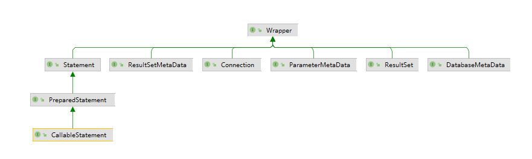

# JDBC概述

​		JDBC的全称是Java Database Connectivity，即Java数据库连接，它是一种可以执行SQL语句的Java API。可以**跨平台**运行，而且可以**跨数据库**（如果全部使用标准的SQL）。也就是说，如果使用 JDBC开发一个数据库应用，则该应用既可以在 Windows 平台上运行 ，也可以在 UNIX 等其他平台上运行；既可以使用 MySQL 数据库 ，也可以使用 Oracle 等数据库 ，而**程序无须进行任何修改** 。

使用Java程序访问数据库时，Java代码并不是直接通过TCP连接去访问数据库，而是通过JDBC接口来访问，而JDBC接口则通过JDBC驱动来实现真正对数据库的访问


Java APP ----->JDBC Interface (jdk) -----> JDBC Driver(厂商提供) ------->Database

- 各数据库厂商使用相同的接口，Java代码不需要针对不同数据库分别开发；
- Java程序编译期仅依赖java.sql包，不依赖具体数据库的jar包；
- 可随时替换底层数据库，访问数据库的Java代码基本不变。




JDBC API主要位于JDK中的java.sql包中（之后扩展的内容位于javax.sql包中），主要包括（斜体代表接口，需驱动程序提供者来具体实现）：

- DriverManager：负责加载各种不同驱动程序（Driver），并根据不同的请求，向调用者返回相应的数据库连接（Connection）。
- *Driver*：驱动程序，会将自身加载到DriverManager中去，并处理相应的请求并返回相应的数据库连接（Connection）。
- *Connection*：数据库连接，负责进行与数据库间的通讯，SQL执行以及事务处理都是在某个特定Connection环境中进行的。可以产生用以执行SQL的Statement。
- *Statement*：用以执行SQL查询和更新（针对静态SQL语句和单次执行）。
- *PreparedStatement*：用以执行包含动态参数的SQL查询和更新（在服务器端编译，允许重复执行以提高效率）。
- *CallableStatement*：用以调用数据库中的存储过程。
- *ResultSet* ：结果集
- *ResultSetMetaData*：resultSet.getMetaData()，ResultSetMetaData can get information about the types and properties of the columns in a ResultSet object
- *SQLException*：代表在数据库连接的创建和关闭和SQL语句的执行过程中发生了例外情况（即错误）。


database -----> connection ------>(statement-->preparedstatement)----->( resultset---->ResultSetMetaData)

-----create------>

<-----has------- 

# 数据类型的映射

| SQL类型       | Java类型             |
| ------------- | -------------------- |
| CHAR          | java.lang.String     |
| VARCHAR       | java.lang.String     |
| LONGVARCHAR   | java.lang.String     |
| NUMERIC       | java.math.BigDecimal |
| DECIMAL       | java.math.BigDecimal |
| BIT           | boolean              |
| TINYINT       | byte                 |
| SMALLINT      | short                |
| INTEGER       | int                  |
| BIGINT        | long                 |
| REAL          | float                |
| FLOAT         | double               |
| DOUBLE        | double               |
| BINARY        | byte[]               |
| VARBINARY     | byte[]               |
| LONGVARBINARY | byte[]               |
| DATE          | java.sql.Date        |
| TIME          | java.sql.Time        |
| TIMESTAMP     | java.sql.Timestamp   |
| BLOB          | java.sql.Blob        |
| CLOB          | java.sql.Clob        |
| Array         | java.sql.Array       |
| REF           | java.sql.Ref         |
| Struct        | java.sql.Struct      |
ps：注：这种类型匹配不是强制性标准，特定的JDBC厂商可能会改变这种类型匹配。例如Oracle中的DATE类型是包含时分秒，而java.sql.Date仅仅支持年月日

# 代码

```java
package com.study;
import java.sql.*;

public class TestJDBC {
    public static void main(String[] args)  {
        String jdbcUrl = "jdbc:mysql://localhost:3306/learnjdbc?useSSL=false";
        String jdbcUsername = "root";
        String jdbcPassword = "root";

        Student std = new Student();


        Connection conn = null;
//        Statement stmt = null;
        ResultSet rs = null;
//        String sql = "SELECT * FROM students";
        PreparedStatement stmt = null;
        String sql = "select * from students where name = ?";
        try {
            conn = DriverManager.getConnection(jdbcUrl, jdbcUsername, jdbcPassword);
//            stmt = conn.createStatement();

            stmt = conn.prepareStatement(sql);
            // 字段的下標從1開始
            stmt.setString(1, "小明");
            rs = stmt.executeQuery();
            while ( rs.next() ) {
                int numColumns = rs.getMetaData().getColumnCount();
                for ( int i = 1 ; i <= numColumns ; i++ ) {
                    // 與大部分Java API中下標的使用方法不同，字段的下標從1開始
                    // 當然，還有其他很多的方式（ResultSet.getXXX()）獲取數據
                    std.setId(rs.getLong("id"));
                    std.setName(rs.getString("name"));
                    std.setGender(rs.getBoolean("gender"));
                    std.setGrade(rs.getInt("grade"));
                    std.setScore(rs.getInt("score"));
                }
                System.out.println(std);
            }
        } catch (SQLException e) {
            e.printStackTrace();
        }finally {
            try {
//                rs.close();
                stmt.close();
                conn.close();
            } catch (SQLException e) {
                e.printStackTrace();
            }
        }
    }
}

class Student{
    private long  id;
    private String name;
    private boolean gender;
    private int grade;
    private int score;

    public Student() {
    }

    public String getName() {
        return name;
    }

    public void setName(String name) {
        this.name = name;
    }

    public boolean getGender() {
        return gender;
    }

    public void setGender(boolean gender) {
        this.gender = gender;
    }

    public int getGrade() {
        return grade;
    }

    public void setGrade(int grade) {
        this.grade = grade;
    }

    public int getScore() {
        return score;
    }

    public void setScore(int score) {
        this.score = score;
    }

    public long  getId() {
        return id;
    }

    public void setId(long id) {
        this.id = id;
    }

    @Override
    public String toString() {
        return "Student{" +
                "name='" + name + '\'' +
                ", gender=" + gender +
                ", grade=" + grade +
                ", score=" + score +
                '}';
    }
}
```

# Statement

```java
Statement
ResultSet executeQuery(String sql) throws SQLException;
boolean execute(String sql) throws SQLException;
ResultSet getResultSet() throws SQLException;

PreparedStatement
ResultSet executeQuery()
boolean execute() throws SQLException;
void setString(int parameterIndex, String x)
```

# 注意

1. 数据库字段索引从1开始

2. Statement执行时需要带参数sql，而PreparedStatement不需要，但其需要setXXX来替换sql中的问号
   

# Reference

https://zh.wikipedia.org/wiki/Java%E6%95%B0%E6%8D%AE%E5%BA%93%E8%BF%9E%E6%8E%A5