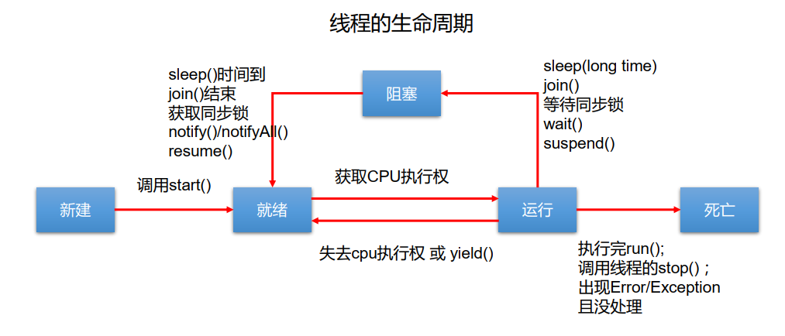

# 多线程

## 程序、进程、线程

- 程序(program)是为完成特定任务、用某种语言编写的一组**指令的集合**。即指一段静态的代码，静态对象。
- 进程(process)是**程序的一次执行过程**，或是正在运行的一个程序。是一个动态的过程：有它自身的产生、存在和消亡的过程。 ——生命周期
  - 如：运行中的QQ，运行中的MP3播放器
  - 程序是静态的，进程是动态的
  - 进程作为资源分配的单位， 系统在运行时会为每个进程分配不同的内存区域
- 线程(thread)，**进程可进一步细化为线程**，是一个**程序内部的一条执行路径**。
    - 若一个进程同一时间并行执行多个线程，就是支持多线程的
    - 线程作为调度和执行的单位，每个线程拥有独立的运行栈和程序计数器(pc)，线程切换的开销小
    - **一个进程中的多个线程共享相同的内存单元/内存地址空间**它们从同一堆中分配对象，可以访问相同的变量和对象。这就使得线程间通信更简便、高效。但多个线程操作共享的系统资源可能就会带来安全的隐患。  
- 单核CPU和多核CPU的理解  
    - 单核CPU，其实是一种假的多线程，因为在一个时间单元内，也只能执行一个线程的任务。例如：虽然有多车道，但是收费站只有一个工作人员在收费，只有收了费才能通过，那么CPU就好比收费人员。如果有某个人不想交钱， 那么收费人员可以把他“挂起”（晾着他，等他想通了，准备好了钱，再去收费） 。 但是因为CPU时间单元特别短，因此感觉不出来。  
    - 如果是多核的话，才能更好的发挥多线程的效率。（现在的服务器都是多核的）  
    - **一个Java应用程序java.exe，其实至少有三个线程**： **main()主线程**， **gc()垃圾回收线程**，**异常处理线程**。当然如果发生异常，会影响主线程。  
- 并行与并发  
    - 并行： 多个CPU同时执行多个任务。比如：多个人同时做不同的事。  
    - 并发：一个CPU(采用时间片)同时执行多个任务。比如：秒杀、多个人做同一件事  

## 创建多线程1

- Java语言的JVM允许程序运行多个线程，它通过`java.lang.Thread`类来体现。
- Thread类的特性
  - 每个线程都是通过某个特定Thread对象的run()方法来完成操作的，经常把**run()方法的主体**称为**线程体**
  - 通过该Thread对象的**start()**方法来**启动这个线程**，而非直接调用run()  

```java
/** 
* 多线程的创建，方式一：继承于Thread类
 * 1. 创建一个继承于Thread类的子类
 * 2. 重写Thread类的run() --> 将此线程执行的操作声明在run()中
 * 3. 创建Thread类的子类的对象
 * 4. 通过此对象调用start()
 */
package atguigu.java;

/**
 * 多线程的创建，方式一：继承于Thread类
 * 1. 创建一个继承于Thread类的子类
 * 2. 重写Thread类的run() --> 将此线程执行的操作声明在run()中
 * 3. 创建Thread类的子类的对象
 * 4. 通过此对象调用start()
 * <p>
 * 例子：遍历100以内的所有的偶数
 *
 * @author shkstart
 * @create 2019-02-13 上午 11:46
 */

//1. 创建一个继承于Thread类的子类
class MyThread extends Thread {
    //2. 重写Thread类的run()
    @Override
    public void run() {
        for (int i = 0; i < 100; i++) {
            if(i % 2 == 0){
                System.out.println(Thread.currentThread().getName() + ":" + i);
            }
        }
    }
}


public class ThreadTest {
    public static void main(String[] args) {
        //3. 创建Thread类的子类的对象
        MyThread t1 = new MyThread();

        //4.通过此对象调用start():①启动当前线程 ② 调用当前线程的run()
        t1.start();

        //问题一：我们不能通过直接调用run()的方式启动线程。能，此时不是多线程，只有一个main线程
//        t1.run();

        //问题二：再启动一个线程，遍历100以内的偶数。不可以让已经start()的线程去执行。会报IllegalThreadStateException
//        t1.start();

        //我们需要重新创建一个线程的对象
        MyThread t2 = new MyThread();
        t2.start();

//        //如下操作仍然是在main线程中执行的。
//        for (int i = 0; i < 100; i++) {
//            if(i % 2 == 0){
//                System.out.println(Thread.currentThread().getName() + ":" + i + "***********main()************");
//            }
//        }
    }

}

```

## 练习题

创建两个分线程，其中一个线程遍历100以内的偶数，另一个线程遍历100以内的奇数

```java
public class ThreadDemo {
    public static void main(String[] args) {
//        MyThread1 m1 = new MyThread1();
//        MyThread2 m2 = new MyThread2();
//
//        m1.start();
//        m2.start();

        //创建Thread类的匿名子类的方式
        new Thread(){
            @Override
            public void run() {
                for (int i = 0; i < 100; i++) {
                    if(i % 2 == 0){
                        System.out.println(Thread.currentThread().getName() + ":" + i);

                    }
                }
            }
        }.start();


        new Thread(){
            @Override
            public void run() {
                for (int i = 0; i < 100; i++) {
                    if(i % 2 != 0){
                        System.out.println(Thread.currentThread().getName() + ":" + i);

                    }
                }
            }
        }.start();

    }
}

class MyThread1 extends Thread{
    @Override
    public void run() {
        for (int i = 0; i < 100; i++) {
            if(i % 2 == 0){
                System.out.println(Thread.currentThread().getName() + ":" + i);

            }
        }

    }
}


class MyThread2 extends Thread{
    @Override
    public void run() {
        for (int i = 0; i < 100; i++) {
            if(i % 2 != 0){
                System.out.println(Thread.currentThread().getName() + ":" + i);

            }
        }

    }
}

```

## Thread 常用方法

```java
/**
 * 测试Thread中的常用方法：
 * 1. start():启动当前线程；调用当前线程的run()
 * 2. run(): 通常需要重写Thread类中的此方法，将创建的线程要执行的操作声明在此方法中
 * 3. currentThread():静态方法，返回当前执行代码的线程
 * 4. getName():获取当前线程的名字
 * 5. setName():设置当前线程的名字
 * 6. yield():释放当前cpu的执行权
 * 7. join():在线程a中调用线程b的join(),此时线程a就进入阻塞状态，直到线程b完全执行完以后，线程a才
 *           结束阻塞状态。
 * 8. stop():已过时。当执行此方法时，强制结束当前线程。
 * 9. sleep(long millitime):让当前线程“睡眠”指定的millitime毫秒。在指定的millitime毫秒时间内，当前
 *                          线程是阻塞状态。
 * 10. isAlive():判断当前线程是否存活
 *
 *
 * 线程的优先级：
 * 1.
 * MAX_PRIORITY：10
 * MIN _PRIORITY：1
 * NORM_PRIORITY：5  -->默认优先级
 * 2.如何获取和设置当前线程的优先级：
 *   getPriority():获取线程的优先级
 *   setPriority(int p):设置线程的优先级
 *
 * 说明：高优先级的线程要抢占低优先级线程cpu的执行权。但是只是从概率上讲，高优先级的线程高概率的情况下
 * 被执行。并不意味着只有当高优先级的线程执行完以后，低优先级的线程才执行。
 *
 */
class HelloThread extends Thread{
    @Override
    public void run() {
        for (int i = 0; i < 100; i++) {
            if(i % 2 == 0){

                try {
                    Thread.sleep(10);
                } catch (InterruptedException e) {
                    e.printStackTrace();
                }

                System.out.println(Thread.currentThread().getName() + ":" + Thread.currentThread().getPriority() + ":" + i);
            }

//            当i能被20整除时，该线程释放当前CPU的执行期
//            if(i % 20 == 0){
//                yield();
//            }

        }

    }

    // 修改线程名
    public HelloThread(String name){
        super(name);
    }
}


public class ThreadMethodTest {
    public static void main(String[] args) {

        HelloThread h1 = new HelloThread("Thread：1");

//        h1.setName("线程一");
        //设置分线程的优先级
//        h1.setPriority(Thread.MAX_PRIORITY);

        h1.start();

        //给主线程命名
        Thread.currentThread().setName("主线程");
//        Thread.currentThread().setPriority(Thread.MIN_PRIORITY);

        // 主线程
        for (int i = 0; i < 100; i++) {
            if(i % 2 == 0){
                System.out.println(Thread.currentThread().getName() + ":" + Thread.currentThread().getPriority() + ":" + i);
            }

//            if(i == 20){
//                try {
//                    h1.join();
//                } catch (InterruptedException e) {
//                    e.printStackTrace();
//                }
//            }
        }
        
//        System.out.println(h1.isAlive());
    }
}

```

## 线程的调度

调度策略：

- 时间片
- 抢占式：高优先级的线程抢占CPU

调度方法：

- 同优先级线程组成先进先出队列（先到先服务），使用时间片策略
- 对高优先级，使用优先调度的抢占式策略  

线程的优先级等级：

- MAX_PRIORITY： 10
- MIN _PRIORITY： 1
- NORM_PRIORITY： 5  

涉及方法：

- `getPriority() `： 返回线程优先值
- `setPriority(int newPriority) `： 改变线程的优先级  

说明：

- 线程创建时继承父线程的优先级
- 低优先级只是获得调度的概率低，并非一定是在高优先级线程之后才被调用  

## 多窗口买票

```java
/**
 * 例子：创建三个窗口卖票，总票数为100张.使用继承Thread类的方式
 *
 * 存在线程的安全问题，待解决。
 *
 * @author shkstart
 * @create 2019-02-13 下午 4:20
 */
class Window extends Thread{
    private static int ticket = 100;
    @Override
    public void run() {

        while(true){
            if(ticket > 0){
                System.out.println(getName() + "：卖票，票号为：" + ticket);
                ticket--;
            }else{
                break;
            }
        }

    }
}


public class WindowTest {
    public static void main(String[] args) {
        Window t1 = new Window();
        Window t2 = new Window();
        Window t3 = new Window();

        t1.setName("窗口1");
        t2.setName("窗口2");
        t3.setName("窗口3");

        t1.start();
        t2.start();
        t3.start();
    }
}
```

## 创建多线程2

```java
/**
 * 创建多线程的方式二：实现Runnable接口
 * 1. 创建一个实现了Runnable接口的类
 * 2. 实现类去实现Runnable中的抽象方法：run()
 * 3. 创建实现类的对象
 * 4. 将此对象作为参数传递到Thread类的构造器中，创建Thread类的对象
 * 5. 通过Thread类的对象调用start()
 *
 *
 * 比较创建线程的两种方式。
 * 开发中：优先选择：实现Runnable接口的方式
 * 原因：1. 实现的方式没有类的单继承性的局限性
 *      2. 实现的方式更适合来处理多个线程有共享数据的情况。
 *
 * 联系：public class Thread implements Runnable
 * 相同点：两种方式都需要重写run(),将线程要执行的逻辑声明在run()中。
 */
//1. 创建一个实现了Runnable接口的类
class MThread implements Runnable{

    //2. 实现类去实现Runnable中的抽象方法：run()
    @Override
    public void run() {
        for (int i = 0; i < 100; i++) {
            if(i % 2 == 0){
                System.out.println(Thread.currentThread().getName() + ":" + i);
            }

        }
    }
}


public class ThreadTest1 {
    public static void main(String[] args) {
        //3. 创建实现类的对象
        MThread mThread = new MThread();
        //4. 将此对象作为参数传递到Thread类的构造器中，创建Thread类的对象
        Thread t1 = new Thread(mThread);
        t1.setName("线程1");
        //5. 通过Thread类的对象调用start():① 启动线程 ②调用当前线程的run()-->调用了Runnable类型的target的run()
        t1.start();

        //再启动一个线程，遍历100以内的偶数
        Thread t2 = new Thread(mThread);
        t2.setName("线程2");
        t2.start();
    }

}
```

## 多窗口卖票2

```java
class Window1 implements Runnable{
 	// 不需要使用static修饰
    private int ticket = 100;

    @Override
    public void run() {
        while(true){
            if(ticket > 0){
                System.out.println(Thread.currentThread().getName() + ":卖票，票号为：" + ticket);
                ticket--;
            }else{
                break;
            }
        }
    }
}


public class WindowTest1 {
    public static void main(String[] args) {
        Window1 w = new Window1();

        Thread t1 = new Thread(w);
        Thread t2 = new Thread(w);
        Thread t3 = new Thread(w);

        t1.setName("窗口1");
        t2.setName("窗口2");
        t3.setName("窗口3");

        t1.start();
        t2.start();
        t3.start();
    }
}
```


## 两种方式的比较

优先选择实现Runnable接口的方式

- 避免java单继承带来的局限性(Runnable接口,  class Thread)
- 更适合来处理多个线程有共享数据的情况
- 线程池只能放入实现Runable或callable类线程，不能直接放入继承Thread的类

联系：`public class Thread implements Runnable`

相同点：两种方式都需要重写run(),将线程要执行的逻辑声明在run()中。

## 线程的生命周期

- JDK中用Thread.State类定义了线程的几种状态  
  - **新建**： 当一个Thread类或其子类的对象被声明并创建时，新生的线程对象处于新建状态
  - **就绪**： 处于新建状态的线程被**start()**后，**将进入线程队列等待CPU时间片**，此时它已具备了运行的条件，只是**没分配到CPU资源**
  - **运行**： 当就绪的线程被调度并获得CPU资源时,便进入运行状态， run()方法定义了线程的操作和功能
  - **阻塞**： 在某种特殊情况下，被人为挂起或执行输入输出操作时，让出 CPU 并临时中止自己的执行，进入阻塞状态
  - **死亡**： 线程完成了它的全部工作或线程被提前强制性地中止或出现异常导致结束  
  
  



## 同步代码块-Runnable

```java
synchronized(同步监视器){
      //需要被同步的代码
}
```

 *  操作共享数据的代码，即为需要被同步的代码。  -->不能包含代码多了，也不能包含代码少了。
 *       **共享数据：**多个线程共同操作的变量。比如：ticket就是共享数据。
 *       **同步监视器**，俗称：锁。任何一个类的对象，都可以充当锁。
 *  要求：**多个线程必须要共用同一把锁**。
 *       补充：在实现Runnable接口创建多线程的方式中，我们可以考虑使用this充当同步监视器。

```java
package com.atguigu.java;

/**
 * 例子：创建三个窗口卖票，总票数为100张.使用实现Runnable接口的方式
 *
 * 1.问题：卖票过程中，出现了重票、错票 -->出现了线程的安全问题
 * 2.问题出现的原因：当某个线程操作车票的过程中，尚未操作完成时，其他线程参与进来，也操作车票。
 * 3.如何解决：当一个线程a在操作ticket的时候，其他线程不能参与进来。直到线程a操作完ticket时，其他
 *            线程才可以开始操作ticket。这种情况即使线程a出现了阻塞，也不能被改变。
 *
 *
 * 4.在Java中，我们通过同步机制，来解决线程的安全问题。
 *
 *  方式一：同步代码块
 *
 *   synchronized(同步监视器){
 *      //需要被同步的代码
 *
 *   }
 *  说明：1.操作共享数据的代码，即为需要被同步的代码。  -->不能包含代码多了，也不能包含代码少了。
 *       2.共享数据：多个线程共同操作的变量。比如：ticket就是共享数据。
 *       3.同步监视器，俗称：锁。任何一个类的对象，都可以充当锁。
 *          要求：多个线程必须要共用同一把锁。
 *
 *       补充：在实现Runnable接口创建多线程的方式中，我们可以考虑使用this充当同步监视器。
 *  方式二：同步方法。
 *     如果操作共享数据的代码完整的声明在一个方法中，我们不妨将此方法声明同步的。
 *
 *
 *  5.同步的方式，解决了线程的安全问题。---好处
 *    操作同步代码时，只能有一个线程参与，其他线程等待。相当于是一个单线程的过程，效率低。 ---局限性
 *
 * @author shkstart
 * @create 2019-02-13 下午 4:47
 */
class Window1 implements Runnable{

    private int ticket = 100;
//    Object obj = new Object();
//    Dog dog = new Dog();
    @Override
    public void run() {
        // wrong：多个线程创建了多个obj对象
//        Object obj = new Object();
        while(true){
            synchronized (this){//此时的this:唯一的Window1的对象   //方式二：synchronized (dog) {

                if (ticket > 0) {

                    try {
                        Thread.sleep(100);
                    } catch (InterruptedException e) {
                        e.printStackTrace();
                    }

                    System.out.println(Thread.currentThread().getName() + ":卖票，票号为：" + ticket);


                    ticket--;
                } else {
                    break;
                }
            }
        }
    }
}


public class WindowTest1 {
    public static void main(String[] args) {
        Window1 w = new Window1();

        Thread t1 = new Thread(w);
        Thread t2 = new Thread(w);
        Thread t3 = new Thread(w);

        t1.setName("窗口1");
        t2.setName("窗口2");
        t3.setName("窗口3");

        t1.start();
        t2.start();
        t3.start();
    }

}


class Dog{

}
```

## 同步代码块-Thread

- `Class clazz = Window2.class`,`Window2.class`只会加载一次

```java
/*
* 使用同步代码块解决继承Thread类的方式的线程安全问题
 *
 * 例子：创建三个窗口卖票，总票数为100张.使用继承Thread类的方式
 *
 * 说明：在继承Thread类创建多线程的方式中，慎用this充当同步监视器，考虑使用当前类充当同步监视器。
 */
class Window2 extends Thread{


    private static int ticket = 100;

    // 一定要声明为static,保证堆中
    private static Object obj = new Object();

    @Override
    public void run() {

        while(true){
            //正确的
//            synchronized (obj){
            synchronized (Window2.class){//Class clazz = Window2.class,Window2.class只会加载一次
                //错误的方式：this代表着t1,t2,t3三个对象
//              synchronized (this){

                if(ticket > 0){

                    try {
                        Thread.sleep(100);
                    } catch (InterruptedException e) {
                        e.printStackTrace();
                    }

                    System.out.println(getName() + "：卖票，票号为：" + ticket);
                    ticket--;
                }else{
                    break;
                }
            }

        }

    }
}


public class WindowTest2 {
    public static void main(String[] args) {
        Window2 t1 = new Window2();
        Window2 t2 = new Window2();
        Window2 t3 = new Window2();


        t1.setName("窗口1");
        t2.setName("窗口2");
        t3.setName("窗口3");

        t1.start();
        t2.start();
        t3.start();

    }
}
```

## 同步方法-Runnable

```java
class Window3 implements Runnable {
    private int ticket = 100;

    @Override
    public void run() {
        while (true) {
            show();
        }
    }

    private synchronized void show(){//同步监视器：this
            if (ticket > 0) {

                try {
                    Thread.sleep(100);
                } catch (InterruptedException e) {
                    e.printStackTrace();
                }

                System.out.println(Thread.currentThread().getName() + ":卖票，票号为：" + ticket);

                ticket--;
            }
    }
}


public class WindowTest3 {
    public static void main(String[] args) {
        Window3 w = new Window3();

        Thread t1 = new Thread(w);
        Thread t2 = new Thread(w);
        Thread t3 = new Thread(w);

        t1.setName("窗口1");
        t2.setName("窗口2");
        t3.setName("窗口3");

        t1.start();
        t2.start();
        t3.start();
    }

}
```

## 同步方法-Thread

- 同步方法仍然涉及到同步监视器，只是**不需要我们显式的声明**。

*  **非静态的同步方法**，同步监视器是：**this**
*     **静态的同步方法**，同步监视器是：当前类本身,**类名.class**

```java
class Window4 extends Thread {
    private static int ticket = 100;

    @Override
    public void run() {
        while (true) {
            show();
        }
    }
    private static synchronized void show(){//同步监视器：Window4.class
        //private synchronized void show(){ //同步监视器：t1,t2,t3。此种解决方式是错误的
        if (ticket > 0) {

            try {
                Thread.sleep(100);
            } catch (InterruptedException e) {
                e.printStackTrace();
            }

            System.out.println(Thread.currentThread().getName() + "：卖票，票号为：" + ticket);
            ticket--;
        }
    }
}


public class WindowTest4 {
    public static void main(String[] args) {
        Window4 t1 = new Window4();
        Window4 t2 = new Window4();
        Window4 t3 = new Window4();


        t1.setName("窗口1");
        t2.setName("窗口2");
        t3.setName("窗口3");

        t1.start();
        t2.start();
        t3.start();

    }
}
```

## 懒汉式

```java
public class BankTest {

}

class Bank{

    private Bank(){}

    private static Bank instance = null;

    public static Bank getInstance(){
        //方式一：效率稍差， 后续的线程都会在此处等待
//        synchronized (Bank.class) {
//            if(instance == null){
//
//                instance = new Bank();
//            }
//            return instance;
//        }
        
        //方式二：效率更高，只有前几个线程能进入if语句中，后面的线程直接return
        if(instance == null){
            synchronized (Bank.class) {
                if(instance == null){

                    instance = new Bank();
                }
            }
        }
        return instance;
    }
}
```

## 死锁

- 不同的线程分别占用对方需要的同步资源不放弃，都在等待对方放弃自己需要的同步资源，就形成了线程的死锁
- **出现死锁后，不会出现异常，不会出现提示，只是所有的线程都处于阻塞状态，无法继续**

## 同步锁Lock

- `java.util.concurrent.locks.Lock`接口是控制多个线程对共享资源进行访问的工具。 锁提供了对共享资源的独占访问，每次只能有一个线程对Lock对象加锁，线程开始访问共享资源之前应先获得Lock对象。  
- `ReentrantLock` 类实现了 Lock ，它拥有与 synchronized 相同的并发性和内存语义， 在实现线程安全的控制中，比较常用的是`ReentrantLock`， 可以显式加锁、释放锁。  

```java
import java.util.concurrent.locks.ReentrantLock;

/**
 * 解决线程安全问题的方式三：Lock锁  --- JDK5.0新增
 *
 * @author shkstart
 * @create 2019-02-15 下午 3:38
 */
class Window implements Runnable{

    private int ticket = 100;
    //1.实例化ReentrantLock
    // new ReentrantLock(true); 线程 先到先服务，默认为false
    private ReentrantLock lock = new ReentrantLock();

    @Override
    public void run() {
        while(true){
            try{
                //2.调用锁定方法lock()
                lock.lock();

                if(ticket > 0){

                    try {
                        Thread.sleep(100);
                    } catch (InterruptedException e) {
                        e.printStackTrace();
                    }

                    System.out.println(Thread.currentThread().getName() + "：售票，票号为：" + ticket);
                    ticket--;
                }else{
                    break;
                }
            }finally {
                //3.调用解锁方法：unlock()
                lock.unlock();
            }

        }
    }
}

public class LockTest {
    public static void main(String[] args) {
        Window w = new Window();

        Thread t1 = new Thread(w);
        Thread t2 = new Thread(w);
        Thread t3 = new Thread(w);

        t1.setName("窗口1");
        t2.setName("窗口2");
        t3.setName("窗口3");

        t1.start();
        t2.start();
        t3.start();
    }
}
```

## Lock与synchronized

synchronized 与 Lock的异同？

 *   相同：二者都可以解决线程安全问题
 *   不同：
      *   synchronized机制在执行完相应的同步代码以后，**自动释放同步监视器**
      *   Lock需要**手动启动同步**（lock()），同时结束同步也需要手动实现（unlock()）

优先使用顺序：

 * Lock ---> 同步代码块（已经进入了方法体，分配了相应资源 ）----> 同步方法（在方法体之外）

## 线程通信

涉及到的三个方法：
 * `wait()`:一旦执行此方法，当前线程就进入阻塞状态，并释放同步监视器。
 * `notify()`:一旦执行此方法，就会唤醒被wait的一个线程。如果有多个线程被wait，就唤醒优先级高的那个。
 * `notifyAll()`:一旦执行此方法，就会唤醒所有被wait的线程。

 * 说明：
    * `wait()，notify()，notifyAll()`三个方法必须使用在**同步代码块**或**同步方法**中。
    * `wait()，notify()，notifyAll()`三个方法的**调用者**必须是同步代码块或同步方法中的**同步监视器**。否则，会出现`IllegalMonitorStateException`异常
    * `wait()，notify()，notifyAll()`三个方法是定义在`java.lang.Object`类中

```java
/**
 * 线程通信的例子：使用两个线程打印 1-100。线程1, 线程2 交替打印
 */
class Number implements Runnable{
    private int number = 1;
    private Object obj = new Object();
    @Override
    public void run() {
        while(true){
            synchronized (obj) {
                obj.notify();
                if(number <= 100){
                    try {
                        Thread.sleep(10);
                    } catch (InterruptedException e) {
                        e.printStackTrace();
                    }
                    System.out.println(Thread.currentThread().getName() + ":" + number);
                    number++;
                    try {
                        //使得调用如下wait()方法的线程进入阻塞状态
                        obj.wait();
                    } catch (InterruptedException e) {
                        e.printStackTrace();
                    }
                }else{
                    break;
                }
            }
        }
    }
}


public class CommunicationTest {
    public static void main(String[] args) {
        Number number = new Number();
        Thread t1 = new Thread(number);
        Thread t2 = new Thread(number);

        t1.setName("线程1");
        t2.setName("线程2");

        t1.start();
        t2.start();
    }
}
```

## sleep() 和 wait()

 * 相同点：一旦执行方法，都可以使得当前的**线程进入阻塞**状态。
 * 不同点：
    * 两个方法**声明的位置**不同：**Thread类中声明sleep()** , **Object类中声明wait()**
    *          **调用的要求**不同：sleep()可以在**任何场景**下调用。 wait()必须使用在**同步代码块**或**同步方法**中
    *          关于是否释放同步监视器：如果两个方法都使用在同步代码块或同步方法中，**sleep()不会释放锁**，**wait()会释放锁**。

## 生产者/消费者问题

```java
import static java.lang.Thread.sleep;

class ProductManager{
    private int product = 0;

    public  synchronized void produceProduct() {
        if(product == 5){
            notify();
        }

        if(product < 5){
            product++;
            System.out.println(Thread.currentThread().getName()+": 开始生产产品："+product);
        }else {
            try {
                wait();
            } catch (InterruptedException e) {
                e.printStackTrace();
            }
        }
    }

    public synchronized void consumeProduct() {
        if (product == 0){
            notify();
        }

        if(product > 0){
            product--;
            System.out.println(Thread.currentThread().getName()+": 开始消费产品："+product);
        }else {
            try {
                wait();
            } catch (InterruptedException e) {
                e.printStackTrace();
            }
        }
    }
}

class ProducerMy implements Runnable{
    private ProductManager productManager;

    public ProducerMy(ProductManager productManager) {
        this.productManager = productManager;
    }

    @Override
    public void run() {
        System.out.println("开始生产产品。。。");
        while (true){
            try {
                sleep(500);
            } catch (InterruptedException e) {
                e.printStackTrace();
            }
            productManager.produceProduct();
        }

    }
}

class ConsumerMy implements Runnable{
    private ProductManager productManager;

    public ConsumerMy(ProductManager productManager) {
        this.productManager = productManager;
    }

    @Override
    public void run() {
        System.out.println("开始消费产品。。。");
        while (true){
            try {
                sleep(1000);
            } catch (InterruptedException e) {
                e.printStackTrace();
            }
            productManager.consumeProduct();
        }
    }
}

public class ProductTestMy {
    public static void main(String[] args) {
        ProductManager productManager = new ProductManager();
        ProducerMy producerMy = new ProducerMy(productManager);
        ConsumerMy consumerMy = new ConsumerMy(productManager);

        Thread thread1 = new Thread(producerMy);
        Thread thread2 = new Thread(consumerMy);

        thread1.setName("生产者");
        thread2.setName("消费者1");

        thread1.start();
        thread2.start();
    }
}

```

## 创建多线程4

**Callable interface** 

- 相比run()方法，可以有返回值
- 方法可以抛出异常
- 支持泛型的返回值
- 需要借助`FutureTask`类，比如获取返回结果  

**Future interface**

- 可以对具体`Runnable、 Callable`任务的执行结果进行取消、查询是否完成、获取结果等。
- `FutrueTask`是`Futrue`接口的唯一的实现类
- `FutureTask` 同时实现了`Runnable, Future`接口。
  - 可以作为`Runnable`被线程执行
  - 又可以作为`Future`得到`Callable`的返回值  

```java
class NumThread implements Callable{
    //2.实现call方法，将此线程需要执行的操作声明在call()中
    @Override
    public Object call() throws Exception {
        int sum = 0;
        for (int i = 1; i <= 100; i++) {
            if(i % 2 == 0){
                System.out.println(i);
                sum += i;
            }
        }
        return sum;
    }
}

public class ThreadNew {
    public static void main(String[] args) {
        //3.创建Callable接口实现类的对象
        NumThread numThread = new NumThread();
        //4.将此Callable接口实现类的对象作为传递到FutureTask构造器中，创建FutureTask的对象
        FutureTask futureTask = new FutureTask(numThread);
        //5.将FutureTask的对象作为参数传递到Thread类的构造器中，创建Thread对象，并调用start()
        new Thread(futureTask).start();

        try {
            //6.获取Callable中call方法的返回值
            //get()返回值即为FutureTask构造器参数Callable实现类重写的call()的返回值。
            Object sum = futureTask.get();
            System.out.println("总和为：" + sum);
        } catch (InterruptedException e) {
            e.printStackTrace();
        } catch (ExecutionException e) {
            e.printStackTrace();
        }
    }

}
```

## 线程池

- 背景： 经常创建和销毁、使用量特别大的资源，比如并发情况下的线程，对性能影响很大。
- 思路： 提前创建好多个线程，放入线程池中，使用时直接获取，使用完放回池中。可以避免频繁创建销毁、实现重复利用。类似生活中的公共交通工具。
- 好处：
  - 提高响应速度（减少了创建新线程的时间）
  - 降低资源消耗（重复利用线程池中线程，不需要每次都创建）
  - 便于线程管理
    - corePoolSize：核心池的大小
    - maximumPoolSize：最大线程数
    -  keepAliveTime：线程没有任务时最多保持多长时间后会终止  

```java
package com.atguigu.java2;

import java.util.concurrent.ExecutorService;
import java.util.concurrent.Executors;
import java.util.concurrent.ThreadPoolExecutor;

/**
 * 创建线程的方式四：使用线程池
 *
 * 好处：
 * 1.提高响应速度（减少了创建新线程的时间）
 * 2.降低资源消耗（重复利用线程池中线程，不需要每次都创建）
 * 3.便于线程管理
 *      corePoolSize：核心池的大小
 *      maximumPoolSize：最大线程数
 *      keepAliveTime：线程没有任务时最多保持多长时间后会终止
 * 面试题：创建多线程有几种方式？四种！
 */

class NumberThread implements Runnable{

    @Override
    public void run() {
        for(int i = 0;i <= 100;i++){
            if(i % 2 == 0){
                System.out.println(Thread.currentThread().getName() + ": " + i);
            }
        }
    }
}

class NumberThread1 implements Runnable{

    @Override
    public void run() {
        for(int i = 0;i <= 100;i++){
            if(i % 2 != 0){
                System.out.println(Thread.currentThread().getName() + ": " + i);
            }
        }
    }
}

public class ThreadPool {
    public static void main(String[] args) {
        //1. 提供指定线程数量的线程池
        ExecutorService service = Executors.newFixedThreadPool(10);
        
        // 接口ExecutorService中声明的是常量，所以在它的实现类ThreadPoolExecutor中设定属性
        ThreadPoolExecutor service1 = (ThreadPoolExecutor) service;
        //设置线程池的属性
//        System.out.println(service.getClass());
//        service1.setCorePoolSize(15);
//        service1.setKeepAliveTime();


        //2.执行指定的线程的操作。需要提供实现Runnable接口或Callable接口实现类的对象
        service.execute(new NumberThread());//适合适用于Runnable
        service.execute(new NumberThread1());//适合适用于Runnable

//        service.submit(Callable callable);//适合使用于Callable
        //3.关闭连接池
        service.shutdown();
    }

}
```

