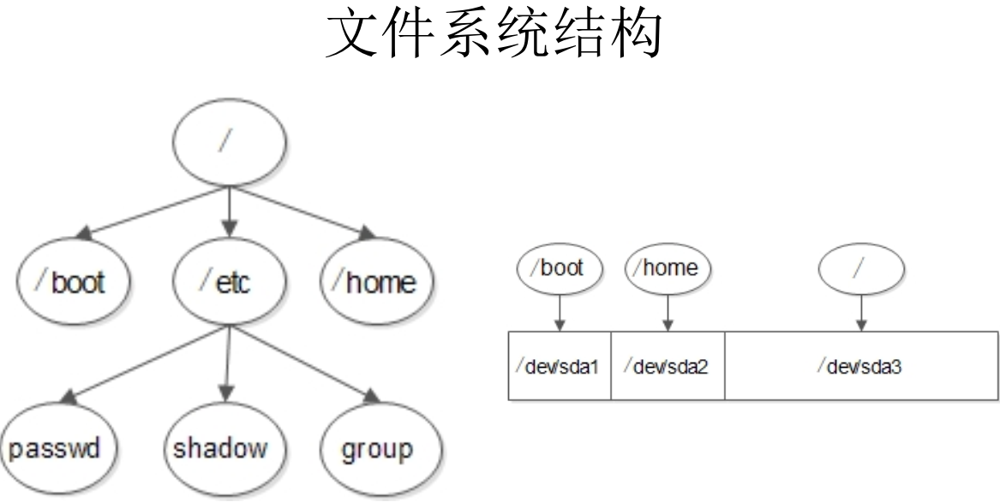
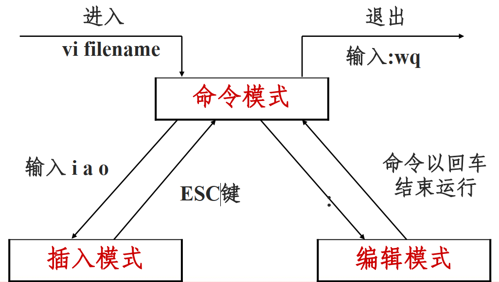

# Linux

## 1 Linux简介

### 1.1 Unix

**Unix的原型是文件系统**

- 所有的**程序**或**系统装置**都是**文件**
- 不管建构编辑器还是附属文件，所写的程序只有一个目的，且要有效的完成目标

- Unix由C语言编写，收费

### 1.2 Linux

- Linux是开源软件，源代码开放的UNIX 
- Linux严格**区分大小写** 

- Linux中所有**内容以文件形式保存，包括硬件**
  - 硬盘文件是/dev/sd[a-p]
  - 光盘文件是/dev/sr0等  
- Linux不靠扩展名区分文件类型 

- 应用：企业服务器，嵌入式应用 
- Linux所有的存储设备都必须**挂载**（配置盘符，命名）之后用户才能使用，包括硬盘、 U盘和光盘 

### 1.3 文件系统结构

- / 根目录
- /boot 启动目录（200MB）
- swap分区（虚拟内存，内存两倍，不超过2GB） 1G
- /home 普通用户的家目录 2G




### 1.4 网络配置

桥接：使用本机的真实网卡，同网段的其他主机可以访问

NAT：VMnet8，当主机通网时，该机也可通网

Host-only：VMnet1，虚拟机只与主机通信

```
ifconfig eth0 192.168.2.2（不能设为192.168.2.1）

centos 7
ip add

本地地址：192.168.2.223
需要在同一个网段2下

临时连接网络，永久配置需要在配置文件中修改

ifconfig(interface 网卡)
eth0(ethernet 以太网， 第一块网卡)
```

### 1.5 目录结构

```
/home 用户主目录的基点，比如用户user的主bai目录就是/home/user，可以用~user表示
/root 系统管理员的主目录
Linux下其他其他目录的用途如下：
/bin 二进制可执行命令
/dev 设备特殊文件
/etc 系统管理和配置文件
/etc/rc.d 启动的配置文件和脚本
/lib 标准程序设计库，又叫动态链接共享库，作用类似windows里的.dll文件
/sbin 超级管理命令，这里存放的是系统管理员使用的管理程序
/tmp 公共的临时文件存储点
/mnt 系统提供这个目录是让用户临时挂载其他的文件系统
/lost+found这个目录平时是空的，系统非正常关机而留下“无家可归”的文件（windows下叫什么.chk）就在这里
/proc 虚拟的目录，是系统内存的映射。可直接访问这个目录来获取系统信息。
/var 某些大文件的溢出区，比方说各种服务的日志文件
/usr 最庞大的目录，要用到的应用程序和文件几乎都在这个目录 
```

[linux](http://sizhxy.com/ClassCenter/ClassDetail-31.html)的usr目录的全称

很长一段时间,我都认为是user的意义,最近才知道,原来不是 ,这里留下摆渡知道的解释,方便后来人:

 usr是user的缩写，是曾经的HOME目录，然而现在已经被/home取代了，现在usr被称为是Unix System Resource，即Unix系统资源的缩写。

 /usr 是系统核心所在，包含了所有的共享文件。它是 unix 系统中最重要的目录之一，涵盖了二进制文件，各种文档，各种头文件，还有各种库文件；还有诸多程序，例如 ftp，telnet 等等。

 曾经的 /usr 还是用户的家目录，存放着各种用户文件 —— 现在已经被 /home 取代了（例如 /usr/someone 已经改为

/home/someone）。现代的 /usr 只专门存放各种程序和数据，用户目录已经转移。虽然 /usr

名称未改，不过其含义已经从“用户目录”变成了“unix 系统资源”目录。值得注意的是，在一些 unix 系统上，仍然把 /usr/someone


### 1.6 其他

清屏 clear or Ctrl+L

-r directory

-v verbose

-r force

-i ignore

文件-----目录（文件夹）

## 2 文件处理命令

目录 == 文件夹

### 2.1 命令格式

命令格式 ：**命令 [-选项] [参数]**
		例 ： ls -la /etc
说明

1. 个别命令使用不遵循此格式
2.  当有多个选项时， 可以写在一起 ls -a -l  等价于 ls -la 
3.  简化选项与完整选项
   -a 等于 --all 

### 2.2 目录处理命令： ls

```
命令名称： ls
命令英文原意： list
命令所在路径： /bin/ls
执行权限：所有用户
功能描述：显示目录文件
语法： ls 选项[-ald] [文件或目录]
	-a （all）显示所有文件，包括隐藏文件（以 . 开头）
	-l （long）详细信息显示
	-d （directory）查看目录本身属性 
    -h （human） 人性化显示
    -i （iNode） 文件的id节点号

ls -l /etc 查看/etc下的文件信息
ls -ld /etc 查看/etc文件本身信息
```


```
[root@localhost ~]# ls -l
总用量 44
-rw-------. 1 root root  1272 2月   6 22:12 anaconda-ks.cfg
-rw-r--r--. 1 root root 26150 2月   6 22:12 install.log
-rw-r--r--. 1 root root  7572 2月   6 22:11 install.log.syslog

文件与用户的所属关系（user-所有者 group-所属者 other）

1 引用计数
root（第一个） user-所有者
root（第二个） roup-所属者
1272 文件大小，字节数
2月   6 22:12 最后一次修改的时间

-rw-r--r--
 - 文件类型（- 文件 d 目录 l（link） 软链接文件）
 rw- r-- r--
 u   g   o
 u所有者 g所属组 o其他人
 r读 w写 x执行
```

### 2.3 目录处理命令 ：mkdir

```
命令名称： mkdir
命令英文原意： make directories
命令所在路径： /bin/mkdir
执行权限：所有用户
语法： mkdir -p [目录名]
功能描述：创建新目录
	-p 递归创建
范例： 
$ mkdir -p /tmp/Japan/boduo

$ mkdir /tmp/Japan/longze /tmp/Japan/cangjing
```

### 2.4 目录处理命令： cd

```
命令名称： cd
命令英文原意： change directory
命令所在路径： shell内置命令
执行权限：所有用户
语法： cd [目录]
功能描述：切换目录
范例： 
$ cd /tmp/Japan/boduo 切换到指定目录

$ cd .. 回到上一级目录

$ cd 不加参数，直接跳到用户的家目录
```

### 2.5 目录处理命令： pwd

```
命令名称： pwd
命令英文原意： print working directory
命令所在路径： /bin/pwd
执行权限：所有用户
语法： pwd
功能描述：显示当前目录
范例： $ pwd

/tmp/Japan
```

### 2.6 目录处理命令： rmdir

```
命令名称： rmdir
命令英文原意： remove empty directories
命令所在路径： /bin/rmdir
执行权限：所有用户
语法： rmdir [目录名]
功能描述： 删除空目录
范例： $ rmdir /tmp/Japan/boduo
```

### 2.7 目录处理命令： cp

```
命令名称： cp
命令英文原意： copy
命令所在路径： /bin/cp
执行权限：所有用户
语法： cp -rp [原文件或目录] [目标目录]
    -r 复制目录
    -p 保留文件属性（文件最后一次的修改时间）
功能描述：复制文件或目录
范例：
$ cp -r /tmp/Japan/cangjing /root
将目录/tmp/Japan/cangjing复制到目录/root下

$ cp /root/install.log /root/install.log.syslog /tmp 
将目录/root/install.log /root/install.log.syslog复制到目录 /tmp下

$ cp -rp /tmp/Japan/boduo /tmp/Japan/longze /root
将/tmp/Japan目录下的boduo和longze目录复制到/root下，保持目录属性

$ cp -r /tmp/Japan/cangjing /root/adult.18+
将/tmp/Japan/cangjing目录复制到/root下并重新命名为adult.18+
```

### 2.8 目录处理命令： mv 

```
命令名称： mv
命令英文原意： move
命令所在路径： /bin/mv
执行权限：所有用户
语法： mv [原文件或目录] [目标目录]
功能描述：剪切文件、改名
范例：
$ mv /tmp/Japan/cangjing /root
$ pwd
/tmp/Japan
$ mv cangjing /root

$ mv cangjing nvshen
将cangjing改名为nvshen
```

### 2.9 文件处理命令： rm

```
命令名称： rm
命令英文原意： remove
命令所在路径： /bin/rm
执行权限：所有用户
语法： rm -rf [文件或目录]
-r 删除目录
-f（force） 强制执行
功能描述：删除文件
范例：
$ rm /tmp/yum.log
删除文件/tmp/yum.log

$ rm -rf /tmp/Japan/longze
删除目录/tmp/Japan/longze
```

### 2.10 文件处理命令： touch 

```
命令名称： touch
命令所在路径： /bin/touch
执行权限：所有用户
语法： touch [文件名]
功能描述：创建空文件
范例： 
$ touch Japanlovestory.list
$ touch program file
创建program和file两个文件
$ touch "program file"
创建program file一个文件
尽量不用空格作为文件名
```

### 2.11 文件处理命令： cat 

```
命令名称： cat
命令所在路径： /bin/cat
命令英文原意： concatenate
执行权限：所有用户
语法： cat [文件名] 
功能描述：显示文件内容
-n 显示行号
范例： 
$ cat /etc/issue
$ cat -n /etc/services
```

### 2.12 文件处理命令： tac

```
命令名称： tac
命令所在路径： /usr/bin/tac
执行权限：所有用户
语法： tac [文件名]
功能描述：显示文件内容（反向列示）
范例： 
$ tac /etc/issue
```

### 2.13 文件处理命令： more 

```
命令名称： more
命令所在路径： /bin/more
执行权限：所有用户
语法： more [文件名]
    (空格) 或f 翻页
    (Enter) 换行
    q或Q 退出
功能描述：分页显示文件内容
范例： 
$ more /etc/services
```

### 2.14 文件处理命令： less 

```
命令名称： less
命令所在路径： /usr/bin/less
执行权限：所有用户
语法： less [文件名]
	(空格) 或f 翻页
    (Enter) 换行
    q或Q 退出
    pageup 向上翻页
    /关键词  n（next）泛白显示关键词
    
功能描述：分页显示文件内容（可向上翻页）
范例： 
$ less /etc/services
```

### 2.15 文件处理命令： head

```
命令名称： head
命令所在路径： /usr/bin/head
执行权限：所有用户
语法： head [文件名]
功能描述：显示文件前面几行
	-n 指定行数
范例： 
$ head -n 20 /etc/services
默认10行
```

### 2.16 文件处理命令： tail

```
命令名称： tail
命令所在路径： /usr/bin/tail
执行权限：所有用户
语法： tail [文件名]
功能描述：显示文件后面几行
        -n 指定行数
        -f 动态显示文件末尾内容
范例： 
$ tail -n 18 /etc/services
```

### 2.17 文件处理命令： ln 

```
命令名称： ln
命令英文原意： link
命令所在路径： /bin/ln
执行权限：所有用户
语法： ln -s [原文件] [目标文件]
-s 创建软链接
功能描述：生成链接文件

范例：
$ ln -s /etc/issue /tmp/issue.soft
创建文件/etc/issue的软链接/tmp/issue.soft

$ ln /etc/issue /tmp/issue.hard
创建文件/etc/issue的硬链接/tmp/issue.hard

软链接特征：类似Windows快捷方式
1、 lrwxrwxrwx l 软链接
软链接文件权限都为rwxrwxrwx
2、文件大小-只是符号链接
3、 /tmp/issue.soft -> /etc/issue
箭头指向原文件


硬链接特征：
1、拷贝cp -p + 同步更新
echo "this is a test" >> /etc/motd
2、可通过i节点识别
3、不能跨分区
4、不能针对目录使用
```

## 3 权限管理命令 

只有文件所有者和管理员更改文件权限

### 3.1 权限管理命令： chmod

```
命令名称： chmod
命令英文原意： change the permissions mode of a file
命令所在路径： /bin/chmod
执行权限：所有用户
语法： chmod [{ugoa}{+-=}{rwx}] [文件或目录]
			[mode=421 ] [文件或目录]
-R 递归修改
功能描述：改变文件或目录权限
权限的数字表示
r ---- 4
w ---- 2
x ---- 1

0 ---- 什么都不执行
rwxrw-r--
7 6 4

范例：
$ chmod g+w testfile
赋予文件testfile所属组写权限
$ chmod -R 777 testdir
修改目录testfile及其目录下文件为所有用户具有全部权限

file r: cat/more/tail/head/less
	 w: vim
	 x: script command
directory r: ls
		  w: touch/mkdir/rmdir/rm
		  x: cd
		  
对文件的删除，只有该文件所在的目录有w权限才可行	  
```


| 代表字符 | 权限 | 对文件的含义     | 对目录的含义           |
| -------- | ---- | ---------------- | ---------------------- |
| r        | 读   | 可以查看文件内容 | 列出目录中的内容       |
| w        | 写   | 可以修改文件内容 | 在目录中创建，删除文件 |
| x        | 执行 | 可以执行文件     | 进入目录               |

### 3.2 权限管理命令： chown

- 只有root才能改变文件所有者

```
命令名称： chown
命令英文原意： change file ownership
命令所在路径： /bin/chown
执行权限：所有用户
语法： chown [用户] [文件或目录]
功能描述：改变文件或目录的所有者
范例： 
$ useradd john
$ passwd john

$ chown john fengjie
改变文件fengjie的所有者为john
```

### 3.3 权限管理命令： chgrp 

```
命令名称： chgrp
命令英文原意： change file group ownership
命令所在路径： /bin/chgrp
执行权限：所有用户
语法： chgrp [用户组] [文件或目录]
功能描述：改变文件或目录的所属组
范例： 

$ groupadd brothers
$ chgrp brothers fengjie
改变文件fengjie的所属组为lampbrother
```

### 3.4 权限管理命令： umask


```
命令名称： umask
命令英文原意： the user file-creation mask
命令所在路径： Shell内置命令
执行权限：所有用户
语法： umask [-S]
	-S 以rwx形式显示新建文件缺省权限
功能描述：显示、设置文件的缺省权限
范例： 
$ umask -S
u=rwx,g=rx,o=rx  ---755

[root@localhost tmp]# umask
0022 

0 特殊权限
022 --- -w- -w-

777 rwx rwx rwx 
022 --- -w- -w-  逻辑异或
---------------------------
755 rwx r-x r-x


```

- 默认新建文件不具有x权限

```
[root@localhost tmp]# touch file
[root@localhost tmp]# ls -l file
-rw-r--r--. 1 root root 0 2月   7 12:44 file
[root@localhost tmp]# mkdir dir
[root@localhost tmp]# ls -ld dir
drwxr-xr-x. 2 root root 4096 2月   7 12:44 dir

目录： drwxr-xr-x
文件： -rw-r--r--
少一个x
```

## 4 文件搜索命令

### 4.1 文件搜索命令： find

```
命令名称： find
命令所在路径： /bin/find
执行权限：所有用户
语法： find [搜索范围] [匹配条件]
      -name 在文件名中搜索
      -iname 不区分大小写
      -size 根据文件大小
      -cmin 文件修改时间
      -amin 访问时间
      -
功能描述：文件搜索
$ find /etc -name init
在目录/etc中查找文件init

-iname 不区分大小写

$ find / -size +204800
在根目录下查找大于100MB的文件
1数据块 512字节 0.5kb
100MB = 102400kb = 204800字节

+n 大于 -n 小于 n 等于

$ find /home -user shenchao
在根目录下查找所有者为shenchao的文件
-group 根据所属组查找

$ find /etc -cmin -5
在/etc下查找5分钟内被修改过属性的文件和目录
-amin 访问时间 access
-cmin 文件属性 change
-mmin 文件内容 modify

$ find /etc -size +163840 -a -size -204800
在/etc下查找大于80MB小于100MB的文件
-a（and） 两个条件同时满足
-o (or)两个条件满足任意一个即可

$ find /etc -name inittab -exec ls -l {} \;
在/etc下查找inittab文件并显示其详细信息
-exec/-ok 命令 {} \; 对搜索结果执行操作

{} find的结果可能不止一个
\ 转义符
；语句终止
exec execute 执行
-ok 用来询问确认

-type 根据文件类型查找
f 文件 d 目录 l 软链接文件
-inum 根据i节点查找
```

### 4.2 匹配符

| **字符**              | **含义**                                    | **实例**                                                     |
| --------------------- | ------------------------------------------- | ------------------------------------------------------------ |
| *                     | 匹配 0 或多个字符                           | a*b  a与b之间可以有任意长度的任意字符, 也可以一个也没有, 如aabcb, axyzb, a012b, ab。 |
| ?                     | 匹配任意一个字符                            | a?b  a与b之间必须也只能有一个字符, 可以是任意字符, 如aab, abb, acb, a0b。 |
| [list]                | 匹配 list 中的任意单一字符                  | a[xyz]b   a与b之间必须也只能有一个字符, 但只能是 x 或 y 或 z, 如: axb, ayb, azb。 |
| [!list]               | 匹配 除list 中的任意单一字符                | a[!0-9]b  a与b之间必须也只能有一个字符, 但不能是阿拉伯数字, 如axb, aab, a-b。 |
| [c1-c2]               | 匹配 c1-c2 中的任意单一字符 如：[0-9] [a-z] | a[0-9]b  0与9之间必须也只能有一个字符 如a0b, a1b... a9b。    |
| {string1,string2,...} | 匹配 sring1 或 string2 (或更多)其一字符串   | a{abc,xyz,123}b    a与b之间只能是abc或xyz或123这三个字符串之一。 |

### 4.3 文件搜索命令： locate 

```
命令名称： locate
命令所在路径： /usr/bin/locate
执行权限：所有用户
语法： locate 文件名
功能描述：在文件资料库中查找文件
范例： $ locate inittab

需要更新文件资料库
$ updatedb

/tmp下的文件不在文件资料库下

$ locate -i Yangmi
不区分大小写
```

### 4.3 文件搜索命令： which

```
命令名称： which
命令所在路径： /usr/bin/which
执行权限：所有用户
语法： which 命令
功能描述：搜索命令所在目录及别名信息
范例： $ which ls
[root@localhost ~]# which rm
alias rm='rm -i'
	/bin/rm

'rm -i' 别名
```

### 4.4 文件搜索命令： whereis 

```
命令名称： whereis
命令所在路径： /usr/bin/whereis
执行权限：所有用户
语法： whereis [命令名称]
功能描述：搜索命令所在目录及帮助文档路径
范例： $ whereis ls
$ whereis rm
rm: /bin/rm /usr/share/man/man1p/rm.1p.gz /usr/share/man/man1/rm.1.gz

man：manual 使用手册; 说明书; 指南;
```

### 4.5 文件搜索命令： grep

```
命令名称： grep
命令所在路径： /bin/grep
执行权限：所有用户
语法： grep -iv [指定字串] [文件]
功能描述：在文件中搜寻字串匹配的行并输出
    -i 不区分大小写
    -v 排除指定字串
范例： 
$ grep mysql /root/install.log
$ grep -v ^# /etc/inittab
不看inittab中以#为开头的行， #为注释行
```

## 5 帮助命令

### 5.1 帮助命令： man

```
命令名称： man
命令英文原意： manual
命令所在路径： /usr/bin/man
执行权限：所有用户
语法： man [命令或配置文件]
	空格 翻页
	回车 一行一行浏览
	q   退出
功能描述：获得帮助信息
范例： 
$ man ls
查看ls命令的帮助信息
$ /-l 检索ls中的-l

$ man services
查看配置文件services的帮助信息
不能加绝对路径

$ whereis passwd
passwd: /usr/bin/passwd /etc/passwd /usr/share/man/man5/passwd.5.gz /usr/share/man/man1/passwd.1.gz

man5 ---- 配置文件
man1 ---- 命令文件
% man 5 passwd
```

### 5.2 帮助命令：whatis

```
查看命令简短信息

[root@localhost ~]# whatis ls
ls                   (1)  - list directory contents
ls                   (1p)  - list directory contents
```

### 5.3 帮助命令：apropos

```
查看配置文件简短信息

[root@localhost ~]# apropos services

```

### 5.4 帮助命令： help

```
命令名称： help
命令所在路径： Shell内置命令
执行权限：所有用户
语法： help 命令
功能描述：获得Shell内置命令的帮助信息
范例： 
$ help umask
查看umask命令的帮助信息

$ touch --help

内置命令：which，whereis的所在路径
```

## 6 用户管理命令

### 6.1 用户管理命令： useradd

```
命令名称： useradd
命令所在路径： /usr/sbin/useradd
执行权限： root
语法： useradd 用户名
功能描述：添加新用户
范例： $ useradd yangmi
```

### 6.2 用户管理命令： passwd

```
命令名称： passwd
命令所在路径： /usr/bin/passwd
执行权限：所有用户
语法： passwd 用户名
功能描述：设置用户密码
范例： $ passwd yangmi

普通用户只可以修改自己的密码
root可以修改所有用户密码
```

### 6.3 用户管理命令： who

```
命令名称： who
命令所在路径： /usr/bin/who
执行权限：所有用户
语法： who
功能描述：查看登录用户信息
范例： 
$ who
root     tty1         2020-02-07 04:35
root     pts/0        2020-02-07 11:42 (192.168.2.223)
root     pts/1        2020-02-07 14:51 (192.168.2.223)
john     pts/2        2020-02-07 12:13 (192.168.2.223)
john     pts/3        2020-02-09 11:36 (192.168.2.223)

tty 本地登录
pts 远程登录
```

### 6.4 用户管理命令： w 

```
命令名称： w
命令所在路径： /usr/bin/w
执行权限：所有用户
语法： w
功能描述：查看登录用户详细信息
范例： $ w

12:35:16 up 12:31,  3 users,  load average: 0.00, 0.00, 0.00
USER     TTY      FROM              LOGIN@   IDLE   JCPU   PCPU WHAT
root     tty1     -                Fri04    2days  0.06s  0.06s -bash
root     pts/1    192.168.2.223    Fri14    0.00s  0.30s  0.18s w
john     pts/3    192.168.2.223    11:36   53:51   0.11s  0.37s sshd: john [priv]

up 12:31：运行12个小时31分
```

## 7 压缩解压命令 

### 7.1 压缩解压命令： gzip

- 只能压缩文件
- 压缩后不保留原文件

```
命令名称： gzip
命令英文原意： GNU zip
命令所在路径： /bin/gzip
执行权限：所有用户
语法： gzip [文件]
功能描述：压缩文件
压缩后文件格式： .gz
```

### 7.2 压缩解压命令： gunzip

```
命令名称： gunzip
命令英文原意： GNU unzip
命令所在路径： /bin/gunzip
执行权限：所有用户
语法： gunzip [压缩文件]
功能描述：解压缩.gz的压缩文件
范例： $ gunzip boduo.gz
```

### 7.3 压缩解压命令： tar 

```
命令名称： tar
命令所在路径： /bin/tar
执行权限：所有用户
语法： tar 选项[-zcf] [压缩后文件名] [目录]
-c 打包
-v 显示详细信息
-f 指定文件名
-z 打包同时压缩
功能描述：打包目录
压缩后文件格式： .tar.gz

先对文件夹（目录）打包，再进行压缩
[root@localhost tmp]# ls
boduo  Japan
[root@localhost tmp]# tar -cvf Japan.tar Japan
Japan/
Japan/boduo/
Japan/longze/
[root@localhost tmp]# ls
boduo  Japan  Japan.tar
[root@localhost tmp]# gzip Japan

同时对文件夹进行打包与压缩
[root@localhost tmp]# tar -zcf Japan.tar.gz Japan

tar命令解压缩语法：
    -x 解包
    -v 显示详细信息
    -f 指定解压文件
    -z 解压缩
    -C 解压到指定目录
范例： $ tar -zxvf Japan.tar.gz -C /opt
```

### 7.4 压缩解压命令： zip

- 压缩时保留原文件
- windows和Linux下都支持的格式
- 压缩比比gzip少

```
命令名称： zip
命令所在路径： /usr/bin/zip
执行权限：所有用户
语法：
zip 选项[-r] [压缩后文件名] [文件或目录]
-r 压缩目录
功能描述：压缩文件或目录
压缩后文件格式： .zip
范例：
$ zip buduo.zip boduo
压缩文件
$ zip -r Japan.zip Japan
压缩目录
```

### 7.5 压缩解压命令： unzip 

```
命令名称： unzip
命令所在路径： /usr/bin/unzip
执行权限：所有用户
语法： unzip [压缩文件]
功能描述：解压.zip的压缩文件
范例： 
$ unzip test.zip
```

### 7.6 压缩解压命令： bzip2

```
命令名称： bzip2
命令所在路径： /usr/bin/bzip2
执行权限：所有用户
语法： bzip2 选项 [-k] [文件]
	-k 产生压缩文件后保留原文件
功能描述：压缩文件
压缩后文件格式： .bz2
范例： 
$ bzip2 -k boduo
$ tar -cjf Japan.tar.bz2 Japan
```

### 7.7压缩解压命令： bunzip2

```
命令名称： bunzip2
命令所在路径： /usr/bin/bunzip2
执行权限：所有用户
语法： bunzip2 选项 [-k] [压缩文件]
-k 解压缩后保留原文件
功能描述：解压缩
范例： 
$ bunzip2 -k boduo.bz2
$ tar -xjf Japan.tar.bz2
```

## 8 网络命令

### 8.1 网络命令： write

- 通信的双方必须同时在线且在同一服务器上
- who，w 查看在线用户

```
指令名称： write
指令所在路径： /usr/bin/write
执行权限：所有用户
语法： write <用户名>
功能描述：给用户发信息，以Ctrl+D保存结束
范例： # write linzhiling
```

### 8.2 网络命令： wall 

```
指令名称： wall
命令英文原意： write all
指令所在路径： /usr/bin/wall
执行权限：所有用户
语法： wall [message]
功能描述：发广播信息
范例： # wall ShenChao is a honest man!
```

### 8.3 网络命令： ping 

```
命令名称： ping
命令所在路径： /bin/ping
执行权限：所有用户
语法： ping 选项 IP地址
	-c 指定发送次数
功能描述：测试网络连通性
范例： # ping -c 3 192.168.1.156
```

### 8.4 网络命令： ifconfig

```
命令名称： ifconfig
命令英文原意： interface configure
命令所在路径： /sbin/ifconfig
执行权限： root
语法： ifconfig 网卡名称 IP地址
功能描述：查看和设置网卡信息
范例： # ifconfig eth0 192.168.8.250

lo  回环网卡
```

### 8.5 网络命令： mail

```
命令名称： mail
命令所在路径： /bin/mail
执行权限：所有用户
语法： mail [用户名]
功能描述：查看发送电子邮件
范例： # mail root

[root@localhost ~]# mail root 
Subject: test
hello
EOT
[root@localhost ~]# mail
Heirloom Mail version 12.4 7/29/08.  Type ? for help.
"/var/spool/mail/root": 1 message 1 new
>N  1 root                  Sun Feb  9 14:25  19/602   "test
# N 未读
& 1
Message  1:
From root@localhost.localdomain  Sun Feb  9 14:25:38 2020
Return-Path: <root@localhost.localdomain>
X-Original-To: root
Delivered-To: root@localhost.localdomain
Date: Sun, 09 Feb 2020 14:25:38 +0800
To: root@localhost.localdomain
Subject: test
User-Agent: Heirloom mailx 12.4 7/29/08
Content-Type: text/plain; charset=us-ascii
From: root@localhost.localdomain (root)
Status: R

hello


& 
```

### 8.6 网络命令： last 

```
命令名称： last
命令所在路径： /usr/bin/last
执行权限：所有用户
语法： last
功能描述：列出目前与过去登入系统的用户信息
范例： # last
```

### 8.7 网络命令： lastlog

```
命令名称： lastlog
命令所在路径： /usr/bin/lastlog
执行权限：所有用户
语法： lastlog
功能描述：检查某特定用户上次登录的时间
范例： # lastlog
# lastlog -u 502
# lastlog -u jhon

-u uid
```

### 8.8 网络命令： traceroute 

```
命令名称： traceroute
命令所在路径： /bin/traceroute
执行权限：所有用户
语法： traceroute
功能描述：显示数据包到主机间的路径
范例： # traceroute www.lampbrother.net
```

### 8.9 网络命令： netstat 

```
命令名称： netstat
命令所在路径： /bin/netstat
执行权限：所有用户
语法： netstat [选项]
功能描述：显示网络相关信息
选项：
    -t ： TCP协议
    -u ： UDP协议
    -l ： 监听
    -r ： 路由
    -n ： 显示IP地址和端口号
范例：
# netstat -tlun 查看本机监听的端口
# netstat -an 查看本机所有的网络连接
# netstat -rn 查看本机路由表    
    
tcp        0     64 192.168.2.2:22              192.168.2.223:60936         ESTABLISHED 
tcp        0      0 192.168.2.2:22              192.168.2.223:60567         ESTABLISHED 

请求方的端口随机，但服务器的端口固定
```

### 8.10 网络命令： setup

- redhat 才有

```
命令名称： setup
命令所在路径： /usr/bin/setup
执行权限： root
语法： setup
功能描述：配置网络
范例： # setup 
```

### 8.11挂载命令：mount

- 挂载：分配盘符

```
命令名称： mount
命令位置： /bin/mount
执行权限：所有用户
命令语法： mount [-t 文件系统] 设备文件名 挂载点
范例： 
# mount -t iso9660 /dev/sr0 /mnt/cdrom
# mount /dev/sr0 /mnt/cdrom
```

## 9 关机重启命令 

### 9.1 shutdown

```
[root@localhost ~]# shutdown [选项] 时间
选项：
    -c： 取消前一个关机命令
    -h： 关机
    -r： 重启
$ shutdown -h now
$ shutdown -h 8:00

```

### 9.2 其他关机命令

```
[root@localhost ~]# halt
[root@localhost ~]# poweroff
[root@localhost ~]# init 0
```

### 9.3 其他重启命令

```
[root@localhost ~]# reboot
[root@localhost ~]# init 6
```

### 9.4 系统运行级别 

- 0  关机
- 1  单用户：启动最少的服务，常用来修复，相当于windows的安全模式
- 2  不完全多用户，不含NFS服务 
- 3   完全多用户 
- 4   未分配 
- 5    图形界面 
- 6    重启

```
[root@localhost ~]# cat /etc/inittab
#修改系统默认运行级别
id:3:initdefault:
[root@localhost ~]# runlevel
#查询系统运行级别
N 3

N -- 上一次运行级别
3 -- 本次运行级别

```

### 9.5 退出登录命令

```
[root@localhost ~]# logout
```

## 10 文本编辑器Vim 

### 10.1 Vim工作模式



输入“：” 进入编辑模式

### 10.2 插入命令

| 命令 | 作用                 |
| ---- | -------------------- |
| a    | 在光标所在字符后插入 |
| A    | 在光标所在行尾插入   |
| i    | 在光标所在字符前插入 |
| I    | 在光标所在行行首插入 |
| o    | 在光标下插入新行     |
| O    | 在光标上插入新行     |

### 10.3 定位命令

```
命令 				作用
: set nu 		 设置行号
: set nonu 		 取消行号
gg				 到第一行
G				 到最后一行
nG 				 到第n行
: n 			 到第n行
$ 				 移至行尾
数字0      		移至行首
j				 下一行
k				 上一行
Ctrl + f 键 （f 的英文全拼为：forward）下一页
Ctrl + b 键 （b 的英文全拼为：backward) 上一页
```

### 10.4 删除命令 

```
命令 				作用
x 				 删除光标所在处字符
:n1,n2d 		 删除指定范围的行
D 				 删除光标所在处到行尾内容
dG 				 删除光标所在行到文件末尾内容
dd 				 删除光标所在行， ndd删除n行
nx 			 	 删除光标所在处后n个字符
```

### 10.5 复制和剪切命令 

```
命令 				作用
yy 				 复制当前行
nyy 			 复制当前行以下n行
dd 				 剪切当前行
ndd 			 剪切当前行以下n行
p、 P 			粘贴在当前光标所在行下或行上
```

### 10.6 替换和取消命令 

```
命令 				作用
r 				 取代光标所在处字符
R 				 从光标所在处开始替换字符，按Esc结束
u 				 取消上一步操作
```

### 10.7 搜索和搜索替换命令 

```
命令				 作用
:/string 		  向下搜索指定字符串,搜索时忽略大小写 :set ic
:?string          向上搜索指定字符串
n 				  搜索指定字符串的下一个出现位置
:%s/old/new/g     全文替换指定字符串
:n1,n2s/old/new/g 在一定范围内替换指定字符串
n – 寻找下一个匹配结果
N – 寻找上一个匹配结果
```

### 10.8 保存和退出命令 

```
命令 				作用
:w 				 保存修改
:w new_filename  另存为指定文件
:wq 			 保存修改并退出
ZZ 				 快捷键，保存修改并退出
:wq!			 保存修改并退出（文件所有者及root可使用）
:q! 			 不保存修改退出

```

### 10.9 :r

```
:r 文件名

```

## 11 Linux软件安装

### 11.1 软件包管理简介

#### 11.1.1 软件包分类

- 源码包 
  - 脚本安装包 (大部分为C语言)
- 二进制包 （RPM包、系统默认包） 

#### 11.1.2 源码包

源码包的优点是： 

- 开源，如果有足够的能力，可以修改源代码
- 可以自由选择所需的功能
- 软件是编译安装，所以更加适合自己的系统，更加稳定也效率更高
- 卸载方便 ：直接删除安装目录包即可

源码包的缺点 :

- 安装过程步骤较多，尤其安装较大的软件集合时（如LAMP环境搭建），容易出现拼写错误
- 编译过程时间较长，安装比二进制安装时间长
- 因为是编译安装，安装过程中一旦报错新手很难解决 

#### 11.1.3 RPM包

二进制包的优点 

- 包管理系统简单，只通过几个命令就可以实现包的安装、升级、查询和卸载
- 安装速度比源码包安装快的多 

二进制包缺点： 

- 经过编译，不再可以看到源代码，安装更快
- 功能选择不如源码包灵活 
- 依赖性 

### 11.2 RPM包管理-rpm命令管理

#### 11.2.1 RPM包命名原则

```
httpd-2.2.15-15.el6.centos.1.i686.rpm   包全名

httpd 		软件包名
2.2.15 		软件版本
15 			软件发布的次数
el6.centos  适合的Linux平台
i686 		适合的硬件平台
rpm 		rpm包扩展名
```

#### 11.2.2 RPM包依赖性

- 树形依赖： a-->b-->c  安装顺序：c, b, a 卸载顺序a, b, c
- 环形依赖： a-->b-->c-->a
- 模块依赖： 模块依赖查询网站：www.rpmfind.net 
  - 模块：以so.2结尾，模块是包的一部分

#### 11.2.3 包全名与包名

- 包全名：操作的包是没有安装的软件包时，使用包全名。而且要注意路径
- 包名：操作已经安装的软件包时，使用包名。是搜索/var/lib/rpm/中的数据库 

#### 11.2.4 RPM安装

```
rpm –ivh 包全名
选项：
    -i（install） 安装
    -v（verbose） 显示详细信息
    -h（hash） 	显示进度
    --nodeps 	 不检测依赖性
```

#### 11.2.5 RPM包升级

````
rpm -Uvh 包全名
选项：
-U（upgrade） 升级
````

#### 11.2.6 卸载

```
rpm -e 包名
选项：
    -e（erase） 卸载
    --nodeps 不检查依赖性 
$ rpm -e httpd
```

#### 11.2.7 查询是否安装

```
[root@localhost ~]# rpm -q 包名
#查询包是否安装
选项：
	-q 查询（query）

[root@localhost ~]# rpm –qa
#查询所有已经安装的RPM包
选项：
	-a 所有（all）
```

#### 11.2.8 查询软件包详细信息

```
[root@localhost ~]# rpm –qi 包名
选项：
    -i 查询软件信息（information）
    -p 查询未安装包信息（package）
    
rpm –qi  	包名
rpm –qip 	包全名
```

#### 11.2.9 查询包中文件安装位置

```
[root@localhost ~]# rpm –ql 包名
选项：
    -l 列表（list）
    -p 查询未安装包信息（package）
```

#### 11.2.10 查询系统文件属于哪个RPM包

```
[root@localhost ~]# rpm –qf 系统文件名
选项：
	-f 查询系统文件属于哪个软件包（file）
```

#### 11.2.11 查询软件包的依赖性 

```
[root@localhost ~]# rpm –qR 包名
选项：
    -R 查询软件包的依赖性（requires）
    -p 查询未安装包信息（package）
```

### 11.3 RPM包管理-yum在线管理

#### 1 IP地址配置

- 访问内网需要配置：IP地址，子网掩码。
  - ifconfig 只能配IP地址和掩码，不能上网
- 访问公网需要配置：IP地址，子网掩码，DNS，网关

```
永久生效，不论重启或开关网络服务

[root@localhost ~]# setup
#使用setup工具

[root@localhost ~]# vi /etc/sysconfig/network-scripts/ifcfg-eth0
把ONBOOT=“no” 改为
ONBOOT=“yes“
#启动网卡

[root@localhost ~]# service network restart
#重启网络服务
```

#### 2 网络yum源

```
[root@localhost yum.repos.d]# vi /etc/yum.repos.d/CentOS-Base.repo
 [base] 容器名称，一定要放在[]中
 name 容器说明，可以自己随便写
 mirrorlist 镜像站点，这个可以注释掉
 baseurl 我们的yum源服务器的地址。默认是CentOS官方的yum源服务器，是可以使用的，如果你觉得慢可以改	成你喜欢的yum源地址
 enabled 此容器是否生效，如果不写或写成enable=1都是生效，写成enable=0就是不生效
 gpgcheck 如果是1是指RPM的数字证书生效，如果是0则不生效
 gpgkey 数字证书的公钥文件保存位置。不用修改
```

#### 3 查询

```
[root@localhost yum.repos.d]# yum list
#查询所有可用软件包列表

[root@localhost yum.repos.d]# yum list installed
# 列出所有已安装的软件包 

[root@localhost yum.repos.d]# yum search 关键字(包名)
#搜索服务器上所有和关键字相关的包
```

#### 4 安装

```
[root@localhost yum.repos.d]# yum –y install 包名
选项：
    install 安装
    -y 自动回答yes
```

#### 5 升级

```
[root@localhost yum.repos.d]# yum -y update 包名
选项：
    update 升级
    -y 自动回答yes
 
$ yum -y update 升级所有软件包，包括内核，慎重！
```

#### 6 卸载

```
[root@localhost yum.repos.d]# yum -y remove 包名
选项：
    remove 卸载
    -y 自动回答yes
```

#### 7 YUM软件组管理命令 

```
[root@localhost ~]# yum grouplist
#列出所有可用的软件组列表

[root@localhost ~]# yum groupinstall 软件组名
#安装指定软件组，组名可以由grouplist查询出来

[root@localhost ~]# yum groupremove 软件组名
#卸载指定软件组
```

#### 8 光盘yum源搭建步骤

- 配置文件不要轻易修改格式（如：加空格，空行，缩减，行后加注释）

```
1）挂载光盘
[root@localhost ~]# mount /dev/cdrom /mnt/cdrom/


2）让网络yum源文件失效
[root@localhost ~]# cd /etc/yum.repos.d/
[root@localhost yum.repos.d]# mv CentOS-Base.repo \CentOS-Base.repo.bak

[root@localhost yum.repos.d]# mv CentOS-Debuginfo.repo \CentOS-Debuginfo.repo.bak
[root@localhost yum.repos.d]# mv CentOS-Vault.repo \CentOS-Vault.repo.bak
# 修改文件名让yum源文件失效

3）修改光盘yum源文件
[root@localhost yum.repos.d]# vim CentOS-Media.repo
[c6-media]
name=CentOS-$releasever - Media
baseurl=file:///mnt/cdrom
#地址为你自己的光盘挂载地址
# file:///media/cdrom/
# file:///media/cdrecorder/
#注释这两个不存在的地址
gpgcheck=1
enabled=1
#把enabled=0改为enabled=1，让这个yum源配置文件生效
gpgkey=file:///etc/pki/rpm-gpg/RPM-GPG-KEY-CentOS-6
```

### 11.4 源码包和RPM包的区别

#### 1 安装位置

-  RPM包安装位置
  是安装在默认位置中 

  ```
  /etc/ 			配置文件安装目录
  /usr/bin/ 		可执行的命令安装目录
  /usr/lib/ 		程序所使用的函数库保存位置
  /usr/share/doc/ 基本的软件使用手册保存位置
  /usr/share/man/ 帮助文件保存位置
  ```

- 源码包安装位置 

  ```
  安装在指定位置当中，一般是/usr/local/软件名/
  ```

#### 2 安装位置不同带来的影响

- RPM包安装的服务可以使用系统服务管理命令（service）来管理，例如RPM包安装的apache的启动方法是：
  - /etc/rc.d/init.d/httpd start
  -  service httpd start  

- 而源码包安装的服务则不能被服务管理命令管理，因为没有安装到默认路径中。所以只能用绝对路径进行服务的管理，如：
  - /usr/local/apache2/bin/apachectl start  

#### 3 源码包安装过程

1. 安装准备
   - 安装C语言编译器 
   - 下载源码包 
     - http://mirror.bit.edu.cn/apache/httpd/ 

2. 安装注意事项
   - 源代码保存位置： /usr/local/src/ 
   - 软件安装位置： /usr/local/ 
   - 如何确定安装过程报错： 
     - 安装过程停止 
     - 并出现error、 warning或no的提示 


## 12 常用命令

```
sudo 以系统管理者的身份执行指令
sudo ls
```

### 1 systemctl

#### 1.1 systemctl命令兼容了service

```
systemctl redis start
 
systemctl redis stop
 
# 开机自启动
systemctl enable redis

sudo service docker restart

systemctl daemon-reload
# 重新加载某个服务的配置文件，如果新安装了一个服务，归属于 systemctl 管理，要是新服务的服务程序配置文件生效，需重新加载。
```

#### 1.2 


# Shell

## 1 Shell概述

### 1.1 Shell是什么

- Shell是一个命令行解释器，它为用户提供了一个向Linux内核发送请求以便运行程序的界面系统级程序，用户可以用Shell来启动、挂起、停止甚至是编写一些程序。 
- 硬件 --> 内核 --> Shell**命令解释器** --> 外层应用程序
- Shell还是一个功能相当强大的编程语言，易编写，易调试，灵活性较强。 Shell是**解释执行**的脚本语言，在Shell中可以直接调用Linux系统命令。 

### 1.2 Shell的分类

- Bourne Shell： 从1979起Unix就开始使用Bourne Shell，Bourne Shell的主文件名为sh 
- C Shell： C Shell主要在BSD版的Unix系统中使用， 其语法和C语言相类似而得名 
- Shell的两种主要语法类型有Bourne和C，这两种语法彼此不兼容。 Bourne家族主要包括sh、 ksh、 Bash、 psh、 zsh； C家族主要包括： csh、 tcsh 
- Bash： Bash与sh兼容， 现在使用的Linux就是使用Bash作为用户的基本Shell。 

### 1.3Linux支持的Shell 

- /etc/shells 

## 2 Shell脚本的执行方式 

### 2.1 echo输出命令 

```
[root@localhost ~]# echo [选项] [输出内容]
选项：
	-e： 支持反斜线(转义字符)控制的字符转换
	
    \\ 输出\本身
    \a 输出警告音
    \b 退格键， 也就是向左删除键
    \c 取消输出行末的换行符。 和“-n” 选项一致
    \e ESCAPE键
    \f 换页符
    \n 换行符
    \r 回车键
    \t 制表符， 也就是Tab键
    \v 垂直制表符
    \0nnn 按照八进制ASCII码表输出字符。 其中0为数字零， nnn是三位八进制数
    \xhh 按照十六进制ASCII码表输出字符。 其中hh是两位十六进制数
    
[root@localhost ~]# echo -e "ab\bc"
ac
[root@localhost ~]# echo -e "abc\b"
abc
[root@localhost ~]# echo -e "a\tb\tc\nd\te\tf"
a	b	c
d	e	f
[root@localhost ~]# echo -e "\x61\t\x62\t\x63\n\x64\t\x65\t\x66"
a	b	c
d	e	f
[root@localhost ~]# echo -e "\e[1;31m abcd \e[0m"
#输出颜色
#30m=黑色， 31m=红色， 32m=绿色， 33m=黄色
#34m=蓝色， 35m=洋红， 36m=青色， 37m=白色
# \e[1;  开启颜色输出
# \e[0m 关闭颜色输出
```

### 2.2 第一个脚本

```
[root@localhost sh]# vi hello.sh
echo "today is a nice day"
```

### 2.3 执行脚本

```
# 赋予执行权限，直接运行
chmod 755 hello.sh
 ./hello.sh
 
# 通过Bash调用执行脚本
 bash hello.sh
```

### 2.4 dos2unix

```
windows下换行符为 ^M$
Linux下问        $
所以windows下编写的Linux脚本不能在Linux下运行
需执行
$ dos2unix [文件名]
```

## 3 Bash的基本功能 

### 3.1 历史命令

```
[root@localhost ~]# history [选项] [历史命令保存文件]
选项：
    -c： 清空历史命令
    -w： 把缓存中的历史命令写入历史命令保存文件
		 ~/.bash_history
```

- 历史命令默认会保存1000条,可以在环境变量配置文件/etc/profile中进行修改

### 3.2 历史命令的调用

- 使用上、下箭头调用以前的历史命令 
- 使用“!字串”重复执行最后一条以该字串开头的命令 
- 使用“!n”重复执行第n条历史命令 
- 使用“!!”重复执行上一条命令 

### 3.3 命令与文件补全

在Bash中，命令与文件补全是非常方便与常用的功能，我们只要在输入命令或文件时，按“Tab”键就会自动进行补全 

### 3.4 命令别名

- 临时生效，一旦系统重启，撤销修改

```
[root@localhost ~]# alias 别名='原命令'
#设定命令别名

[root@localhost ~]# alias
#查询命令别名
```

### 3.5 命令执行时顺序 

1. 第一顺位执行用绝对路径或相对路径执行的命令。 
2. 第二顺位执行别名。 
3. 第三顺位执行Bash的内部命令。 
4. 第四顺位执行按照$PATH环境变量定义的目录查找顺序找到的第一个命令。 

### 3.5 让别名永久生效

```
[root@localhost ~]# vi /root/.bashrc
```

### 3.6 删除别名

```
[root@localhost ~]# unalias 别名
```

### 3.7 Bash常用快捷键

```
ctrl+A 把光标移动到命令行开头。 如果我们输入的命令过长， 想要把光标移动到命令行开头时使用。
ctrl+E 把光标移动到命令行结尾。
ctrl+C 强制终止当前的命令。
ctrl+L 清屏， 相当于clear命令。
ctrl+U 删除或剪切光标之前的命令。 我输入了一行很长的命令， 不用使用退格键一个一个字符的删除， 使用这		   个快捷键会更加方便
ctrl+K 删除或剪切光标之后的内容。
ctrl+Y 粘贴ctrl+U或ctrl+K剪切的内容。
ctrl+R 在历史命令中搜索， 按下ctrl+R之后， 就会出现搜索界面， 只要输入搜索内容， 就会从历史命令中搜		 索。
ctrl+D 退出当前终端。
ctrl+Z 暂停， 并放入后台。 这个快捷键牵扯工作管理的内容， 我们在系统管理章节详细介绍。
ctrl+S 暂停屏幕输出。
ctrl+Q 恢复屏幕输出。
```

### 3.8 输入输出重定向 

```
设备 		设备文件名  	  文件描述符  	  类型
键盘  	/dev/stdin 	     0 			 标准输入
显示器    /dev/sdtout 		1 			标准输出
显示器    /dev/sdterr 		2 			标准错误输出
```

### 3.9 输出重定向 

- 标准输出重定向:  

  - 命令 > 文件

    - 以**覆盖**的方式， 把命令的正确输出输出到指定的文件或设备当中。

  - 命令 >> 文件
    - 以**追加**的方式， 把命令的正确输出输出到指定的文件或设备当中。
- 标准错误输出重定向
     - 错误命令 2>文件
       - 以覆盖的方式， 把命令的错误输出输出到指定的文件或设备当中。
     - 错误命令 2>>文件
       - 以追加的方式， 把命令的错误输出输出到指定的文件或设备当中。
- 正确输出和错误输出同时保存 
     - 命令 &>>文件 
       - 以追加的方式， 把正确输出和错误输出都保存到同一个文件当中。 
     - 命令>>文件1 2>>文件2 
       - 把正确的输出追加到文件1中， 把错误的输出追加到文件2中。 

### 3.10 多命令顺序执行 

| 多命令执行 符 | 格式             | 作 用                                                        |
| ------------- | ---------------- | ------------------------------------------------------------ |
| ；            | 命令1 ；命令2    | 多个命令顺序执行 系 ， 命令之间没有任何逻辑联                |
| &&            | 命令1 && 命令2   | 逻辑与 当命令1正确执行， 则命令2才会执行 当命令1执行不正确， 则命令2不会执行 |
| \|\|          | 命令1 \|\| 命令2 | 逻辑或 当命令1 执行不正确， 则命令2才会执行 当命令1正确执行， 则命令2不会执行 |

```
[root@localhost ~]# dd if=输入文件 of=输出文件 bs=字节数 count=个数
选项：
    if=输入文件 指定源文件或源设备
    of=输出文件 指定目标文件或目标设备
    bs=字节数 指定一次输入/输出多少字节，即把这些字节看做一个数据块
    count=个数 指定输入/输出多少个数据块
[root@localhost ~]# date ; dd if=/dev/zero of=/root/testfile bs=1k count=100000 ;date    
```

### 3.11 管道符 

```
命令格式：
[root@localhost ~]# 命令1 | 命令2
#命令1的正确输出作为命令2的操作对象

[root@localhost ~]# ll -a /etc/ | more

[root@localhost ~]# netstat -an | grep "ESTABLISHED"

[root@localhost ~]# grep [选项] "搜索内容"
文件名
选项：
    -i： 忽略大小写
    -n： 输出行号
    -v： 反向查找
    --color=auto 搜索出的关键字用颜色显示
```

### 3.12 通配符

| 通配符 | 作 用                                                        |
| ------ | ------------------------------------------------------------ |
| ?      | 匹配一个任意字符                                             |
| *      | 匹配0个或任意多个任意字符， 也就是可以匹配任何内容           |
| []     | 匹配中括号中任意一个字符。 例如： [abc]代表一定匹配 一个字符， 或者是a， 或者是b， 或者是c。 |
| [-]    | 匹配中括号中任意一个字符， -代表一个范围。 例如： [a-z] 代表匹配一个小写字母。 |
| [^]    | 逻辑非， 表示匹配不是中括号内的一个字符。 例如： [^0- 9]代表匹配一个不是数字的字符。 |

```
# 删除当前目录下所有文件
rm -rf *

# 删除根目录下所有文件
rm -rf /*

```


### 3.13 其他特殊符号

| 符 号 | 作 用                                                        |
| ----- | ------------------------------------------------------------ |
| ''    | 单引号。 在单引号中所有的特殊符号， 如“$” 和“`” (反引号)都 没有特殊含义。如python中的r"\abc” |
| ""    | 双引号。 在双引号中特殊符号都没有特殊含义， 但是“ $” 、 “ `” 和“\” 是例外， 拥有“调用变量的值” 、 “引用命令” 和“转义 符” 的特殊含义。 |
| ``    | 反引号。 反引号括起来的内容是系统命令， 在Bash中会先执行它。 和$()作用一样， 不过推荐使用$()， 因为反引号非常容易看错。 |
| $()   | 和反引号作用一样， 用来引用系统命令。                        |
| #     | 在Shell脚本中， #开头的行代表注释。                          |
| $     | 用于调用变量的值 的方式得到变量的值， 。如需要调用变量name的值时， 需要用$name |
| \     | 转义符， 跟在\之后的特殊符号将失去特殊含义， 变为普通字符。 如\$将输出“$” 符号， 而不当做是变量引用。 |

```
[root@localhost ~]# name=sc
[root@localhost ~]# echo '$name'
[root@localhost ~]# echo "$name"
[root@localhost ~]# echo ‘$(date)'
[root@localhost ~]# echo “$(date)
```

## 4 Bash的变量

### 4.1 用户自定义变量

#### 1、变量

​		变量是计算机内存的单元，其中存放的值可以改变。 当Shell脚本需要保存一些信息时，如一个文件名或是一个数字，就把它存放在一个变量中。每个变量有一个名字，所以很容易引用它。 使用变量可以保存有用信息，使系统获知用户相关设置，变量也可以用于保存暂时信息。 

#### 2、变量设置规则

- 变量名称可以由**字母**、**数字**和**下划线**组成，但是不能以数字开头。 

- 在Bash中，变量的默认类型都是字符串型，如果要进行数值运算，则必修指定变量类型为数值型。 

- 变量用等号连接值，等号左右两侧不能有空格。

- 变量的值如果有空格，需要使用单引号或双引号包括。

- 在变量的值中，可以使用“\”转义符。

- 如果需要增加变量的值，那么可以进行变量值的叠加。不过变量需要用双引号包含“$变量名”或用${变量名}包含。 

- 如果是把命令的结果作为变量值赋予变量，则需要使用反引号或$()包含命令。 

- 环境变量名建议大写，便于区分。

#### 3、变量分类

- 用户自定义变量
- 环境变量： 这种变量中主要保存的是和系统操作环境相关的数据。
- 位置参数变量：这种变量主要是用来向脚本当中传递参数或数据的，变量名不能自定义，变量作用是固定的。
- 预定义变量：是Bash中已经定义好的变量，变量名不能自定义，变量作用也是固定的。


#### 4、本地变量

```
# 变量定义
[root@localhost ~]# name="yang mi"

# 变量叠加
[root@localhost ~]# aa=123
[root@localhost ~]# aa="$aa"456
[root@localhost ~]# aa=${aa}789

# 变量调用
[root@localhost ~]# echo $name

变量删除
[root@localhost ~]# unset name
```

### 4.2 环境变量

#### 1、环境变量是什么 

用户自定义变量只在当前的Shell中生效，而环境变量会在当前Shell和这个Shell的所有子Shell当中生效。如果把环境变量写入相应的配置文件，那么这个环境变量就会在所有的Shell中生效 

#### 2、设置环境变量 

```
#申明变量
export 变量名=变量值

#查询变量
env

#删除变量
unset 变量名
```

#### 3、系统常见环境变量 

```
PATH：系统查找命令的路径
[root@localhost ~]# echo $PATH
/usr/lib/qt-3.3/bin:/usr/local/sbin:/usr/local/bin:/sbin:/bin:/usr/sbin:/usr/bin:/root/bin

#PATH变量叠加
PATH="$PATH":/root/sh

PS1：定义系统提示符的变量
\d：显示日期，格式为“星期 月 日”
\h：显示简写主机名。如默认主机名“localhost”
\t：显示24小时制时间，格式为“HH:MM:SS”
\T：显示12小时制时间，格式为“HH:MM:SS”
\A：显示24小时制时间，格式为“HH:MM”
\u：显示当前用户名
\w：显示当前所在目录的完整名称
\W：显示当前所在目录的最后一个目录
\#：执行的第几个命令
\$：提示符。如果是root用户会显示提示符为“#”，如果是普通用户会显示提示符为“$”

[root@localhost ~]# echo $PS1
[\u@\h \W]\$

[root@localhost ~]# PS1='[\u@\t \w]\$ '
[root@04:50:08 /usr/local/src]#PS1='[\u@\@ \h \# \W]\$‘
[root@04:53 上午 localhost 31 src]#PS1='[\u@\h \W]\$ '
```

### 4.3 位置参数变量 

#### 1 位置参数变量 

| 位置参数变量 | 作 用                                                        |
| ------------ | ------------------------------------------------------------ |
| $n           | n为数字， $0代表命令本身， $1-$9代表第一 到第九个参数， 十以上的参数需要用大括号 包含， 如${10}. |
| $*           | 这个变量代表命令行中所有的参数， $*把所 有的参数看成一个整体 |
| $@           | 这个变量也代表命令行中所有的参数， 不过 $@把每个参数区分对待 |
| $#           | 这个变量代表命令行中所有参数的个数                           |

```
[root@localhost sh]# cat canshu1.sh
echo $0
echo $1
echo $2
echo $3
[root@localhost sh]# chmod 755 canshu1.sh

[root@localhost sh]# ./canshu1.sh 11 22 33
./canshu1.sh
11
22
33

[root@localhost sh]# vi sum.sh
[root@localhost sh]# bash sum.sh 1 2
3
[root@localhost sh]# cat sum.sh
#!/bin/bash
sum=$(($1+$2))
echo $sum

#!/bin/bash
echo "A total of $# parameters"
#使用$#代表所有参数的个数
echo "The parameters is: $*"
#使用$*代表所有的参数
echo "The parameters is: $@"
#使用$@也代表所有参数

#!/bin/bash
for i in "$*"
#$*中的所有参数看成是一个整体，所以这个for循环只会循环一次
    do
    echo "The parameters is: $i"
    done
x=1
for y in "$@"
#$@中的每个参数都看成是独立的，所以“$@”中有几个参数，就会循环几次
do
    echo "The parameter$x is: $y"
    x=$(( $x +1 ))
done
```

### 4.4 预定义变量

#### 1、预定义变量

| 预定义变量 | 作 用                                                        |
| ---------- | ------------------------------------------------------------ |
| $？        | 最后一次执行的命令的返回状态。 如果这个变 量的值为0， 证明上一个命令正确执行；如果 这个变量的值为非0（ 具体是哪个数， 由命令 自己来决定） ， 则证明上一个命令执行不正确 了。 |
| $$         | 当前进程的进程号（PID）                                      |
| $!         | 后台运行的最后一个进程的进程号（PID）                        |


```
[root@localhost sh]# bash prepara.sh
The current process is 2196
The last one demo process is 2197


[root@localhost sh]# cat prepara.sh 
#!/bin/bash

echo "The current process is $$"
# 输出当前进程的PID

find /root -name hello.sh&
# & 把命令放入后台执行

echo "The last one demo process is $!"
# $! 后台运行的最后一个进程的进程号（PID）
```

#### 2、接收键盘输入 

```
[root@localhost ~]# read [选项] [变量名]
选项：
    -p “提示信息”：在等待read输入时，输出提示信息
    -t 秒数： read命令会一直等待用户输入，使用
    此选项可以指定等待时间
    -n 字符数： read命令只接受指定的字符数，就会
    执行
    -s： 隐藏输入的数据，适用于机密信息的
    输入
    
[root@localhost sh]# bash read_test.sh
Please input your name: Milo
Name is Milo
Please enter your age: 

Age is 24
Please select you gender[M/F]: M

Sex is M
[root@localhost sh]# cat read_test.sh 
read -t 30 -p"Please input your name: " name
echo "Name is $name"

read -s -t 30 -p "Please enter your age: " age

echo -e "\n"
echo "Age is $age"

read -n 1 -t 30 -p "Please select you gender[M/F]: " gender

echo -e "\n"
echo "Sex is $gender"

```

### 4.5 Bash的运算符 

#### 1、declare声明变量类型 

```
[root@localhost ~]# declare [+/-][选项] 变量名
选项：
    -： 给变量设定类型属性
    +： 取消变量的类型属性
    -i： 将变量声明为整数型（integer）
    -x： 将变量声明为环境变量
    -p： 显示指定变量的被声明的类型
```

#### 2、数值运算—方法1 

```
[root@localhost ~]# aa=11
[root@localhost ~]# bb=22
#给变量aa和bb赋值
[root@localhost ~]# declare -i cc=$aa+$bb
```

#### 3、方法2： expr或let数值运算工具

```
[root@localhost ~]# aa=11
[root@localhost ~]# bb=22
#给变量aa和变量bb赋值
[root@localhost ~]# dd=$(expr $aa + $bb)
#dd的值是aa和bb的和。注意“+”号左右两
侧必须有空格 
```

#### 4、方法3： “$((运算式))”或“$[运算式]”

```
[root@localhost ~]# aa=11
[root@localhost ~]# bb=22
[root@localhost ~]# ff=$(( $aa+$bb ))
[root@localhost ~]# gg=$[ $aa+$bb ]
```

#### 5、运算符 

| 优先级 | 运算符                                  | 说明                                  |
| ------ | --------------------------------------- | ------------------------------------- |
| 13     | -, +                                    | 单目负、 单目正                       |
| 12     | !, ~                                    | 逻辑非、 按位取反或补码               |
| 11     | * , / , %                               | 乘、 除、 取模                        |
| 10     | +, -                                    | 加、 减                               |
| 9      | << , >>                                 | 按位左移、 按位右移                   |
| 8      | < =, > =, < , >                         | 小于或等于、 大于或等于、 小于、 大于 |
| 7      | == , !=                                 | 等于、 不等于                         |
| 6      | &                                       | 按位与                                |
| 5      | ^                                       | 按位异或                              |
| 4      | \|                                      | 按位或                                |
| 3      | &&                                      | 逻辑与                                |
| 2      | \|\|                                    | 逻辑或                                |
| 1      | =,+=,- =,*=,/=,%=,&=, ^=, \|=, <<=, >>= | 赋值、 运算且赋值                     |

#### 6、变量测试

| 变量置换方式 | 变量y没有设置                        | 变量y为空值             | 变量y设置值  |
| ------------ | ------------------------------------ | ----------------------- | ------------ |
| x=${y-新值}  | x=新值                               | x为空                   | x=$y         |
| x=${y:-新值} | x=新值                               | x=新值                  | x=$y         |
| x=${y+新值}  | x为空                                | x=新值                  | x=新值       |
| x=${y:+新值} | x为空                                | x为空                   | x=新值       |
| x=${y=新值}  | x=新值 y=新值                        | x为空 y值不变           | x=$y y值不变 |
| x=${y:=新值} | x=新值 y=新值                        | x=新值 y=新值           | x=$y y值不变 |
| x=${y?新值}  | 新值输出到标准 错误输出（就是 屏幕） | x为空                   | x=$y         |
| x=${y:?新值} | 新值输出到标准 错误输出              | 新值输出到标准 错误输出 | x=$y         |

测试x=${y-新值} 

```
[root@localhost ~]# unset y
#删除变量y
[root@localhost ~]# x=${y-new}
#进行测试
[root@localhost ~]# echo $x
new
#因为变量y不存在，所以x=new


[root@localhost ~]# y=""
#给变量y赋值为空
[root@localhost ~]# x=${y-new}
#进行测试
[root@localhost ~]# echo $x


[root@localhost ~]# y=old
#给变量y赋值
[root@localhost ~]# x=${y-new}
#进行测试
[root@localhost ~]# echo $x
old
```

### 5 环境变量配置文件 

#### 1、source命令

```
[root@localhost ~]# source 配置文件
或
[root@localhost ~]# . 配置文件
```

#### 2、环境变量配置文件简介 

- 环境变量配置文件中主要是定义对系统的操作环境生效的系统默认环境变量，比如PATH、 HISTSIZE、 PS1、 HOSTNAME等默认环境变量。 

- ```
  /etc/profile
  /etc/profile.d/*.sh
  ~/.bash_profile
  ~/.bashrc
  /etc/bashrc
  ```

  

