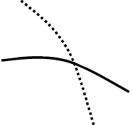

MA指标（移动平均线）：一段时间内股票收盘价的平均价格连成曲线，用以显示股价趋势的一种技术指标。

短期：5周线，10，20

中期：30月线，60季线

长期：120，250

特点：

1. 追踪趋势，涨还是跌
2. 支撑作用
3. 滞后性
4. 不适用于横盘整理阶段

实际用处

1. 
3. 均线的支撑：支撑位是指在股价下跌时可能遇到支撑，从而止跌回稳的价位；
4. 均线的阻力：阻力位则是指在股价上升时可能遇到压力，从而反转下跌的价位
5. 支撑与阻力
   - 通常为**密集成交区**和**心理价位（如整数关口，）**
   - **股价处于均线上方**时，**均线**对股价会产生**支撑作用**
   - **股价处于均线下方**时，**均线**对股价会产生**阻力作用**
   - **周期越长的均线**，**其支撑或者阻力作用就越强烈**
6. 助涨助跌，当股价突破了MA时，无论是向上突破还是向下突破，股价都有继续向突破方面再走一程的愿望
7. 阻力与支撑是可以互换的。如果重大的阻力位被有效突破，那么该阻力位则反过来变成未来重要的支撑位；

# 买入技术形态

### 黄金交叉

短期均线自下而上穿越长期均线，发出买入信号

### 银山谷

1. 短期均线与中期均线形成金叉
2. 中期均线与长期均线形成金叉

### 金山谷

第二次出现银山谷

### 多头并列

### 逐浪上升

多头并列的变化形式，

### 首次黏合向上发散

出现在下跌末期，下跌速度减缓。移动均线向下排列的状态逐步收紧，最终黏合在一起。股价站稳后上涨，均线向上发散。

### 二次黏合向上发散

股价上涨后，出现一次向上发散形态，股价没有大福上涨，便重新黏合在一起。第二次向上发散

### 首次交叉向上发散

下跌趋势中，空方能量减弱，在底部交叉。转势后，均线向上发散

### 二次交叉向上发散

均线系统曾经出现一次交叉向上发散的形态，股价在经历，一定的涨幅后，进入盘整或回调行情。第二次出现交叉向上发散

### 蛟龙出海

一根大阳线从下向上将短期均线、中期均线、长期均线一通穿越

### 加速下跌

下跌过程中，短期均线快速下跌，短期均线且与中长期均线的距离越来越远。股价暴跌，即将到达市场底部的前兆。

## 卖出技术形态

### 死亡交叉

死叉：短期均线自上而下穿越长期均线，发出卖出信号

### 死亡谷

### 空头排列

### 逐浪下降

### 首次黏合向下发散

到达顶点，开始转势下跌

### 二次黏合向下发散

加速下跌

### 断头铡刀

### 加速上涨

市场过热，一旦出现下跌迹象，可以立即出场

### 乌云密布

