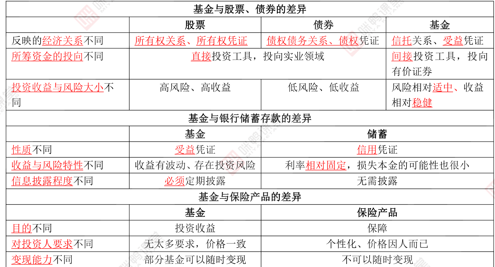
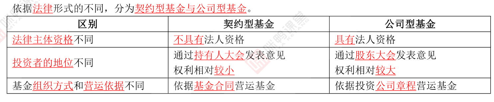
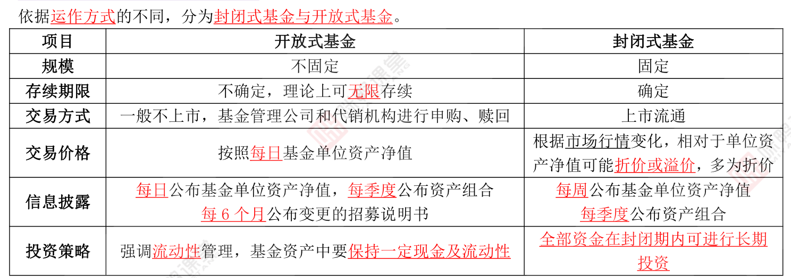

## 第一章：金融市场、资产管理与投资基金

### 金融市场

#### 金融市场的分类

1. 交易工具的不同期限
   - 货币市场（1年以内）
   - 资本市场（1年以上）
2. 不同的交易标的物
   - 票据市场
   - 证券市场
   - 衍生工具市场
   - 外汇市场
   - 黄金市场
3. 交割期限
   - 现货市场
   - 期货市场
4. 交易性质：
   - 发行市场（一级市场）
   - 流通市场（二级市场）
5. 地理范围
   - 国内金融市场
   - 国际金融市场

#### 金融市场构成要素

1. 市场参与者：政府，中央银行，金融机构，个人，企业
2. 金融工具：法律契约，交易的载体，证明债权债务关系的合法凭证
3. 金融交易的组织方式：
   - 场内交易方式：上交所，。。。
   - 场外交易方式：银行间债券市场，代办股份转让系统
   - 电信网络交易

#### 金融资产概念

1. 代表未来收益或资产合法要求权的凭证，标识了明确的价值，表明交易双方的**所有权关系**和**债券关系**

2. 分类

   - 股权类金融资产（各类股票）

   - 分为债券类金融资产（票价，债券）

### 资产管理

#### 资产管理特征

1. 从参与方来看：委托方和受托方，委托方为投资者，受托方为资产管理人
2. 从受托资产来看：主要为货币等金融资产，一般不包括固定资产等实物资产。
3. 从管理方式来看：主要通过投资于银行存款，证券，期货，基金，保险，实体企业股权以及其他可被证券化的资产实现增值

#### 资产管理行业的功能

1. 有效配置资源
2. 合理定价

### 行业现状

#### 基金管理公司资产管理业务

1. 可以从事公募和私募
2. 设立子公司从事特定客户资产管理业务、私募股权基金管理业务以及证监会许可的其他业务

#### 私募机构资产管理业务

不设行政审批

#### 证券公司资产管理业务

1. 为**单一客户**办理**定向**资产管理业务
2. 为**多个客户**办理**集合**资产管理业务
3. 为客户办理特定目的的专项资产管理业务

集合资产管理业务：面向合格投资者推广，累计不超过200人

合格投资者：指具备相应风险识别能力和承担所投资集合资产管理计划风险能力且符合下列条件之一的单位和个人：

1. 个人或家庭金融资产合计不低于100w
2. 公司，企业等机构净资产不低于1000w
3. 个人收入在最近3年内每年收入超过20w或夫妻双方合计收入在最近3年内每年收入超过30w，且能提供相关收入证明的自然人。
4. 

#### 期货公司资产管理业务

1. 单一客户的起始委托资产不得低于100w

#### 信托公司资产管理业务

1. 委托人为合格投资者
2. 参与信托计划的委托人为唯一受益人
3. 单个信托计划的自然人数不得超过50人，但单笔委托金额在300w以上的自然人投资者和合格的机构投资者数量不受限制
4. 期限不少于一年
5. 有明确的投资方向和投资策略，且符合国家政策
6. 信托受益权划分为等额份额的信托单位

### 投资基金

所投资的资产可以时金融资产如股票，债券，外汇，股权，期货，期权等，也可以时房地产，大宗能源，版权，艺术品等其他资产

一种间接投资工具

主要当事人：基金投资者，基金管理人和托管人

## 第二章 证券投资基金概述

### 证券投资基金与其他金融工具的比较

### 基金参与主体

#### 基金当事人

证券投资基金依据基金合同设立，基金份额持有人，基金管理人与基金托管人是基金合同的当事人

1. 基金份额持有人：基金的出资人，基金资产的所有者和基金投资回报的受益人
2. 基金管理人：只能由依法设立的基金管理公司担任
3. 基金托管人：只能由依法设立并取得基金托管资格的商业银行或其他金融机构担任

#### 基金市场服务机构

1. 基金管理人、基金托管人即是基金的当事人，又是基金的主要服务机构

2. 其他基金服务机构

   - 销售机构
   - 销售支付机构
   - 份额注册登记机构
   - 估值核算机构
   - 投资顾问机构
   - 基金评价机构
   - 信息技术系统服务
   - 律师事务所
   - 会计事务所

3. 基金监管机构

   - 基金监督管理机构--证监会
   - 2012年6月6日成立的中国基金业协会--自律组织
   - 证券交易所是自律管理机构之一

### 证券投资基金的法律形式和运作方式

#### 信托概述

以信任为基础，委托人将自有财产委托给受托人，受托人要为受益人的最大利益管理信托事务（按照委托人是否是受益人分为他益信托和自益信托）。具有独立性，不受委托人的影响而终止

#### 信托主体

委托人，受托人，受益人

#### 信托财产

当委托人不是唯一受益人的信托存续，信托财产不作为其异常或清算财产

分别记账，不属于其固有财产

受托人因管理、运用、处分该财产而取得的信托利益，也属于信托财产

#### 契约型基金与公司型基金

#### 封闭式基金与开发式基金

## 第三章 证券投资基金的类型

### 基金类型

按投资对象分类

- 股票型基金：80%投股票
- 债券型基金
- 货币型基金
- 混合型基金
- 基金中基金（FOF）：以基金为主要投资标的，80%以上的基金资产投资于其他基金份额；ETF联接基金是一种特殊的基金中基金。
- 另类基金：商品基金（黄金ETF和商品期货ETF）,非上市股权基金、房地产基金

按投资目标分：

- 增长型
- 收入型
- 平衡型

按投资理念分：

- 主动型基金：一类力图取得超越基准组合表现的基金
- 被动型基金：指数型基金
- ETF:在交易所上市交易的，基金份额可变的一种开放式基金

按资金来源和用途：

- 在岸基金：在本国募集资金并投资于本国证券市场的证券投资基金
- 离岸基金：一国（地区）的证券投资基金组织在他国（地区）发售证券投资，并将募集的资金投资于本国或第三国证券市场的证券投资基金，如内地香港互认基金
- 国际基金：资本来源于国内，投资于国外，如QDII

特殊类型基金

- 避险策略基金：保本基金
- 上市开放式基金（LOF)：既可以在场外市场进行基金份额申购，赎回，又可以在交易所进行基金份额交易
- 分级基金：将基础份额分为预期风险收益不同的子份额

## 基金的募集，交易与登记

### 基金募集申请规定

## 名词

资产净值：

认购：在基金**募集期内购买基金份额的**行为。

净认购金额 = 认购金额/(1+认购费率)

认购费用 = 认购金额-净认购金额

认购份额 =（净认购金额+认购利息）/基金份额面值

前端收费：在**认购基金份额时**支付认购费用

后端收费：在**赎回基金份额时**支付认购费用，认购费率按持有期限设置，持有期限越长，费用越低。

净申购金额 = 申购金额/(1+申购费率)

申购费用 = 申购金额-净申购金额

申购份额 = 净申购金额/申购当日基金份额净值

赎回金额 = 赎回总额 - 赎回费用

赎回总额 = 赎回数量 * 赎回当日基金份额净值

赎回费用 = 赎回总额 * 赎回费率

销售服务费：A类不收，C类收

巨额赎回：单个开放日基金**净赎回**超过基金总份额的10%

净赎回 = （赎回申请+转换转出申请）-（申购申请+转换转入申请）

转换：投资者将其持有的基金份额转换为**同一基金管理人**管理的另一基金份额的一种业务模式

非交易过户：将基金份额从某一投资者账户转移到另一投资者账户下的行为。

基金管理人

基金托管人
