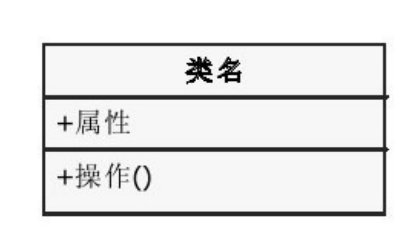
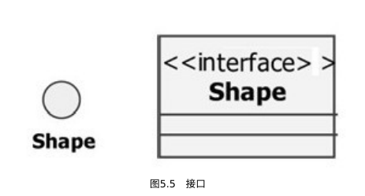

UML（Unified Modeling Language，统⼀建模语⾔）

继承: 这些对象共享⼀些相似的特征，并显出⾃⼰的特性；

多态性: 针对相同的消息，不同对象可以具有特殊的表现形式，

### 类图



```
[可⻅性]属性名[：类型][=初始值][{属性字符串}]
[可⻅性]操作名[（参数表）][：返回类型][{属性字符串}]
```

可⻅性:

- +: public
- -: private
- #：protected
- ~: package

### 接口



接⼝（Interface）：是描述类的部分⾏为的⼀组操作，它也是⼀个类提供给另⼀个类的⼀组操作,通常接⼝被描述为抽象操作，也就是只⽤标识（返回值、操作名称、参数表）说明它的⾏为,接⼝只负责定义操作⽽不负责具体的实现。


### 抽象类

抽象类是包含⼀种或多种抽象⽅法的类，它本⾝不需要构造实例。
定义抽象类后，其他类可以对它进⾏扩充，并且通过实现其中的抽象⽅
法使抽象类具体化。

（1）抽象类可以包含某些实现代码，但接⼝没有任何实现部分；
（2）抽象类可以包含属性，⽽接⼝没有属性；
（3）接⼝可以被结构继承，但抽象类不可以；
（4）抽象类可以有构造函数和析构函数，⽽接⼝没有；
（5）抽象类可以继承其他类和接⼝，⽽接⼝仅仅能继承接⼝；
（6）接⼝⽀持多继承，⽽抽象类仅仅⽀持单继承。


## 依赖关系

